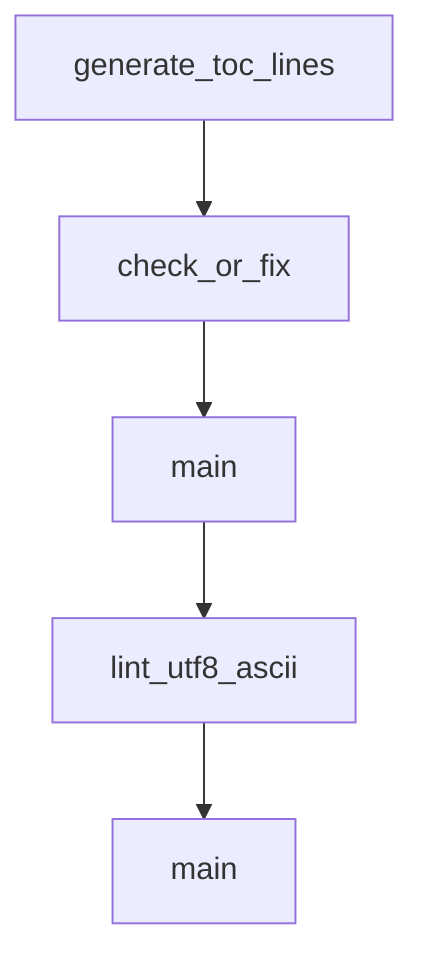

# Chapter 3: Authentication and Model Configuration

Welcome to **Chapter 3: Authentication and Model Configuration**. In this part of **Codex CLI Tutorial: Local Terminal Agent Workflows with OpenAI Codex**, you will build an intuitive mental model first, then move into concrete implementation details and practical production tradeoffs.


This chapter covers secure access patterns and model configuration controls.

## Learning Goals

- choose between ChatGPT sign-in and API key flows
- configure model defaults for task classes
- avoid auth/config drift across environments
- align access mode with team governance

## Configuration Priorities

- centralize config in `~/.codex/config.toml`
- document auth mode per environment
- pin stable defaults for reproducible sessions

## Source References

- [Codex Auth Docs](https://developers.openai.com/codex/auth#sign-in-with-an-api-key)
- [Codex Config Basic](https://developers.openai.com/codex/config-basic)
- [Codex Config Advanced](https://developers.openai.com/codex/config-advanced)

## Summary

You now have reliable authentication and configuration patterns for Codex CLI.

Next: [Chapter 4: Sandbox, Approvals, and MCP Integration](04-sandbox-approvals-and-mcp-integration.md)

## Depth Expansion Playbook

## Source Code Walkthrough

### `scripts/readme_toc.py`

The `generate_toc_lines` function in [`scripts/readme_toc.py`](https://github.com/openai/codex/blob/HEAD/scripts/readme_toc.py) handles a key part of this chapter's functionality:

```py


def generate_toc_lines(content: str) -> List[str]:
    """
    Generate markdown list lines for headings (## to ######) in content.
    """
    lines = content.splitlines()
    headings = []
    in_code = False
    for line in lines:
        if line.strip().startswith("```"):
            in_code = not in_code
            continue
        if in_code:
            continue
        m = re.match(r"^(#{2,6})\s+(.*)$", line)
        if not m:
            continue
        level = len(m.group(1))
        text = m.group(2).strip()
        headings.append((level, text))

    toc = []
    for level, text in headings:
        indent = "  " * (level - 2)
        slug = text.lower()
        # normalize spaces and dashes
        slug = slug.replace("\u00a0", " ")
        slug = slug.replace("\u2011", "-").replace("\u2013", "-").replace("\u2014", "-")
        # drop other punctuation
        slug = re.sub(r"[^0-9a-z\s-]", "", slug)
        slug = slug.strip().replace(" ", "-")
```

This function is important because it defines how Codex CLI Tutorial: Local Terminal Agent Workflows with OpenAI Codex implements the patterns covered in this chapter.

### `scripts/readme_toc.py`

The `check_or_fix` function in [`scripts/readme_toc.py`](https://github.com/openai/codex/blob/HEAD/scripts/readme_toc.py) handles a key part of this chapter's functionality:

```py
    args = parser.parse_args()
    path = Path(args.file)
    return check_or_fix(path, args.fix)


def generate_toc_lines(content: str) -> List[str]:
    """
    Generate markdown list lines for headings (## to ######) in content.
    """
    lines = content.splitlines()
    headings = []
    in_code = False
    for line in lines:
        if line.strip().startswith("```"):
            in_code = not in_code
            continue
        if in_code:
            continue
        m = re.match(r"^(#{2,6})\s+(.*)$", line)
        if not m:
            continue
        level = len(m.group(1))
        text = m.group(2).strip()
        headings.append((level, text))

    toc = []
    for level, text in headings:
        indent = "  " * (level - 2)
        slug = text.lower()
        # normalize spaces and dashes
        slug = slug.replace("\u00a0", " ")
        slug = slug.replace("\u2011", "-").replace("\u2013", "-").replace("\u2014", "-")
```

This function is important because it defines how Codex CLI Tutorial: Local Terminal Agent Workflows with OpenAI Codex implements the patterns covered in this chapter.

### `scripts/asciicheck.py`

The `main` function in [`scripts/asciicheck.py`](https://github.com/openai/codex/blob/HEAD/scripts/asciicheck.py) handles a key part of this chapter's functionality:

```py


def main() -> int:
    parser = argparse.ArgumentParser(
        description="Check for non-ASCII characters in files."
    )
    parser.add_argument(
        "--fix",
        action="store_true",
        help="Rewrite files, replacing non-ASCII characters with ASCII equivalents, where possible.",
    )
    parser.add_argument(
        "files",
        nargs="+",
        help="Files to check for non-ASCII characters.",
    )
    args = parser.parse_args()

    has_errors = False
    for filename in args.files:
        path = Path(filename)
        has_errors |= lint_utf8_ascii(path, fix=args.fix)
    return 1 if has_errors else 0


def lint_utf8_ascii(filename: Path, fix: bool) -> bool:
    """Returns True if an error was printed."""
    try:
        with open(filename, "rb") as f:
            raw = f.read()
        text = raw.decode("utf-8")
    except UnicodeDecodeError as e:
```

This function is important because it defines how Codex CLI Tutorial: Local Terminal Agent Workflows with OpenAI Codex implements the patterns covered in this chapter.

### `scripts/asciicheck.py`

The `lint_utf8_ascii` function in [`scripts/asciicheck.py`](https://github.com/openai/codex/blob/HEAD/scripts/asciicheck.py) handles a key part of this chapter's functionality:

```py
    for filename in args.files:
        path = Path(filename)
        has_errors |= lint_utf8_ascii(path, fix=args.fix)
    return 1 if has_errors else 0


def lint_utf8_ascii(filename: Path, fix: bool) -> bool:
    """Returns True if an error was printed."""
    try:
        with open(filename, "rb") as f:
            raw = f.read()
        text = raw.decode("utf-8")
    except UnicodeDecodeError as e:
        print("UTF-8 decoding error:")
        print(f"  byte offset: {e.start}")
        print(f"  reason: {e.reason}")
        # Attempt to find line/column
        partial = raw[: e.start]
        line = partial.count(b"\n") + 1
        col = e.start - (partial.rfind(b"\n") if b"\n" in partial else -1)
        print(f"  location: line {line}, column {col}")
        return True

    errors = []
    for lineno, line in enumerate(text.splitlines(keepends=True), 1):
        for colno, char in enumerate(line, 1):
            codepoint = ord(char)
            if char == "\n":
                continue
            if (
                not (0x20 <= codepoint <= 0x7E)
                and codepoint not in allowed_unicode_codepoints
```

This function is important because it defines how Codex CLI Tutorial: Local Terminal Agent Workflows with OpenAI Codex implements the patterns covered in this chapter.


## How These Components Connect


