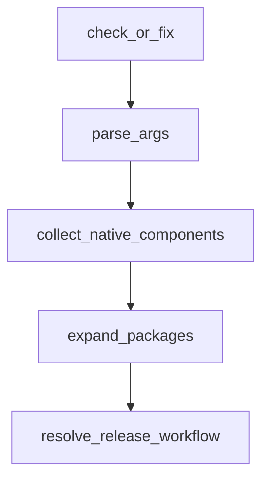

# Chapter 3: Authentication and Model Configuration

Welcome to **Chapter 3: Authentication and Model Configuration**. In this part of **Codex CLI Tutorial: Local Terminal Agent Workflows with OpenAI Codex**, you will build an intuitive mental model first, then move into concrete implementation details and practical production tradeoffs.


This chapter covers secure access patterns and model configuration controls.

## Learning Goals

- choose between ChatGPT sign-in and API key flows
- configure model defaults for task classes
- avoid auth/config drift across environments
- align access mode with team governance

## Configuration Priorities

- centralize config in `~/.codex/config.toml`
- document auth mode per environment
- pin stable defaults for reproducible sessions

## Source References

- [Codex Auth Docs](https://developers.openai.com/codex/auth#sign-in-with-an-api-key)
- [Codex Config Basic](https://developers.openai.com/codex/config-basic)
- [Codex Config Advanced](https://developers.openai.com/codex/config-advanced)

## Summary

You now have reliable authentication and configuration patterns for Codex CLI.

Next: [Chapter 4: Sandbox, Approvals, and MCP Integration](04-sandbox-approvals-and-mcp-integration.md)

## Source Code Walkthrough

### `scripts/readme_toc.py`

The `check_or_fix` function in [`scripts/readme_toc.py`](https://github.com/openai/codex/blob/HEAD/scripts/readme_toc.py) handles a key part of this chapter's functionality:

```py
    args = parser.parse_args()
    path = Path(args.file)
    return check_or_fix(path, args.fix)


def generate_toc_lines(content: str) -> List[str]:
    """
    Generate markdown list lines for headings (## to ######) in content.
    """
    lines = content.splitlines()
    headings = []
    in_code = False
    for line in lines:
        if line.strip().startswith("```"):
            in_code = not in_code
            continue
        if in_code:
            continue
        m = re.match(r"^(#{2,6})\s+(.*)$", line)
        if not m:
            continue
        level = len(m.group(1))
        text = m.group(2).strip()
        headings.append((level, text))

    toc = []
    for level, text in headings:
        indent = "  " * (level - 2)
        slug = text.lower()
        # normalize spaces and dashes
        slug = slug.replace("\u00a0", " ")
        slug = slug.replace("\u2011", "-").replace("\u2013", "-").replace("\u2014", "-")
```

This function is important because it defines how Codex CLI Tutorial: Local Terminal Agent Workflows with OpenAI Codex implements the patterns covered in this chapter.

### `scripts/stage_npm_packages.py`

The `parse_args` function in [`scripts/stage_npm_packages.py`](https://github.com/openai/codex/blob/HEAD/scripts/stage_npm_packages.py) handles a key part of this chapter's functionality:

```py


def parse_args() -> argparse.Namespace:
    parser = argparse.ArgumentParser(description=__doc__)
    parser.add_argument(
        "--release-version",
        required=True,
        help="Version to stage (e.g. 0.1.0 or 0.1.0-alpha.1).",
    )
    parser.add_argument(
        "--package",
        dest="packages",
        action="append",
        required=True,
        help="Package name to stage. May be provided multiple times.",
    )
    parser.add_argument(
        "--workflow-url",
        help="Optional workflow URL to reuse for native artifacts.",
    )
    parser.add_argument(
        "--output-dir",
        type=Path,
        default=None,
        help="Directory where npm tarballs should be written (default: dist/npm).",
    )
    parser.add_argument(
        "--keep-staging-dirs",
        action="store_true",
        help="Retain temporary staging directories instead of deleting them.",
    )
    return parser.parse_args()
```

This function is important because it defines how Codex CLI Tutorial: Local Terminal Agent Workflows with OpenAI Codex implements the patterns covered in this chapter.

### `scripts/stage_npm_packages.py`

The `collect_native_components` function in [`scripts/stage_npm_packages.py`](https://github.com/openai/codex/blob/HEAD/scripts/stage_npm_packages.py) handles a key part of this chapter's functionality:

```py


def collect_native_components(packages: list[str]) -> set[str]:
    components: set[str] = set()
    for package in packages:
        components.update(PACKAGE_NATIVE_COMPONENTS.get(package, []))
    return components


def expand_packages(packages: list[str]) -> list[str]:
    expanded: list[str] = []
    for package in packages:
        for expanded_package in PACKAGE_EXPANSIONS.get(package, [package]):
            if expanded_package in expanded:
                continue
            expanded.append(expanded_package)
    return expanded


def resolve_release_workflow(version: str) -> dict:
    stdout = subprocess.check_output(
        [
            "gh",
            "run",
            "list",
            "--branch",
            f"rust-v{version}",
            "--json",
            "workflowName,url,headSha",
            "--workflow",
            WORKFLOW_NAME,
            "--jq",
```

This function is important because it defines how Codex CLI Tutorial: Local Terminal Agent Workflows with OpenAI Codex implements the patterns covered in this chapter.

### `scripts/stage_npm_packages.py`

The `expand_packages` function in [`scripts/stage_npm_packages.py`](https://github.com/openai/codex/blob/HEAD/scripts/stage_npm_packages.py) handles a key part of this chapter's functionality:

```py


def expand_packages(packages: list[str]) -> list[str]:
    expanded: list[str] = []
    for package in packages:
        for expanded_package in PACKAGE_EXPANSIONS.get(package, [package]):
            if expanded_package in expanded:
                continue
            expanded.append(expanded_package)
    return expanded


def resolve_release_workflow(version: str) -> dict:
    stdout = subprocess.check_output(
        [
            "gh",
            "run",
            "list",
            "--branch",
            f"rust-v{version}",
            "--json",
            "workflowName,url,headSha",
            "--workflow",
            WORKFLOW_NAME,
            "--jq",
            "first(.[])",
        ],
        cwd=REPO_ROOT,
        text=True,
    )
    workflow = json.loads(stdout or "null")
    if not workflow:
```

This function is important because it defines how Codex CLI Tutorial: Local Terminal Agent Workflows with OpenAI Codex implements the patterns covered in this chapter.


## How These Components Connect


