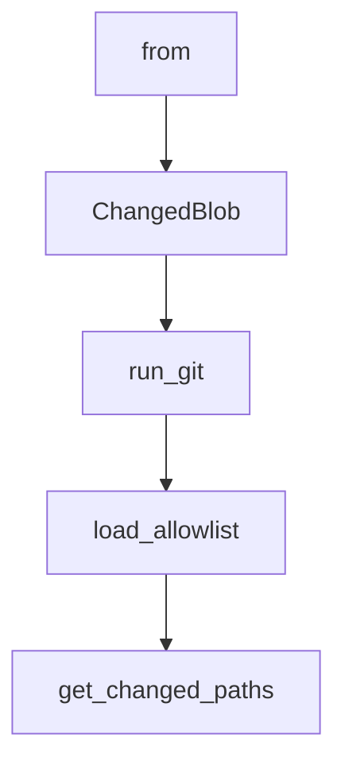

# Chapter 4: Sandbox, Approvals, and MCP Integration

Welcome to **Chapter 4: Sandbox, Approvals, and MCP Integration**. In this part of **Codex CLI Tutorial: Local Terminal Agent Workflows with OpenAI Codex**, you will build an intuitive mental model first, then move into concrete implementation details and practical production tradeoffs.


This chapter shows how to expand Codex capability without losing safety controls.

## Learning Goals

- apply sandbox and approval boundaries deliberately
- connect MCP servers through config
- isolate risky actions by policy
- troubleshoot integration failures quickly

## Safety Strategy

- default to constrained execution where feasible
- require approvals for high-impact actions
- expose only necessary MCP servers and scopes

## Source References

- [Codex Security Docs](https://developers.openai.com/codex/security)
- [Codex Sandbox Notes](https://github.com/openai/codex/blob/main/docs/sandbox.md)
- [Codex Config Reference](https://developers.openai.com/codex/config-reference)

## Summary

You now have a safer model for running Codex with external integrations.

Next: [Chapter 5: Prompts, Skills, and Workflow Orchestration](05-prompts-skills-and-workflow-orchestration.md)

## Depth Expansion Playbook

## Source Code Walkthrough

### `scripts/check_blob_size.py`

The `from` class in [`scripts/check_blob_size.py`](https://github.com/openai/codex/blob/HEAD/scripts/check_blob_size.py) handles a key part of this chapter's functionality:

```py
#!/usr/bin/env python3

from __future__ import annotations

import argparse
import os
import subprocess
import sys
from dataclasses import dataclass
from pathlib import Path


DEFAULT_MAX_BYTES = 500 * 1024


@dataclass(frozen=True)
class ChangedBlob:
    path: str
    size_bytes: int
    is_allowlisted: bool
    is_binary: bool


def run_git(*args: str) -> str:
    result = subprocess.run(
        ["git", *args],
        check=True,
        capture_output=True,
        text=True,
    )
    return result.stdout

```

This class is important because it defines how Codex CLI Tutorial: Local Terminal Agent Workflows with OpenAI Codex implements the patterns covered in this chapter.

### `scripts/check_blob_size.py`

The `ChangedBlob` class in [`scripts/check_blob_size.py`](https://github.com/openai/codex/blob/HEAD/scripts/check_blob_size.py) handles a key part of this chapter's functionality:

```py

@dataclass(frozen=True)
class ChangedBlob:
    path: str
    size_bytes: int
    is_allowlisted: bool
    is_binary: bool


def run_git(*args: str) -> str:
    result = subprocess.run(
        ["git", *args],
        check=True,
        capture_output=True,
        text=True,
    )
    return result.stdout


def load_allowlist(path: Path) -> set[str]:
    allowlist: set[str] = set()
    for raw_line in path.read_text(encoding="utf-8").splitlines():
        line = raw_line.split("#", 1)[0].strip()
        if line:
            allowlist.add(line)
    return allowlist


def get_changed_paths(base: str, head: str) -> list[str]:
    output = run_git(
        "diff",
        "--name-only",
```

This class is important because it defines how Codex CLI Tutorial: Local Terminal Agent Workflows with OpenAI Codex implements the patterns covered in this chapter.

### `scripts/check_blob_size.py`

The `run_git` function in [`scripts/check_blob_size.py`](https://github.com/openai/codex/blob/HEAD/scripts/check_blob_size.py) handles a key part of this chapter's functionality:

```py


def run_git(*args: str) -> str:
    result = subprocess.run(
        ["git", *args],
        check=True,
        capture_output=True,
        text=True,
    )
    return result.stdout


def load_allowlist(path: Path) -> set[str]:
    allowlist: set[str] = set()
    for raw_line in path.read_text(encoding="utf-8").splitlines():
        line = raw_line.split("#", 1)[0].strip()
        if line:
            allowlist.add(line)
    return allowlist


def get_changed_paths(base: str, head: str) -> list[str]:
    output = run_git(
        "diff",
        "--name-only",
        "--diff-filter=AM",
        "--no-renames",
        "-z",
        base,
        head,
    )
    return [path for path in output.split("\0") if path]
```

This function is important because it defines how Codex CLI Tutorial: Local Terminal Agent Workflows with OpenAI Codex implements the patterns covered in this chapter.

### `scripts/check_blob_size.py`

The `load_allowlist` function in [`scripts/check_blob_size.py`](https://github.com/openai/codex/blob/HEAD/scripts/check_blob_size.py) handles a key part of this chapter's functionality:

```py


def load_allowlist(path: Path) -> set[str]:
    allowlist: set[str] = set()
    for raw_line in path.read_text(encoding="utf-8").splitlines():
        line = raw_line.split("#", 1)[0].strip()
        if line:
            allowlist.add(line)
    return allowlist


def get_changed_paths(base: str, head: str) -> list[str]:
    output = run_git(
        "diff",
        "--name-only",
        "--diff-filter=AM",
        "--no-renames",
        "-z",
        base,
        head,
    )
    return [path for path in output.split("\0") if path]


def is_binary_change(base: str, head: str, path: str) -> bool:
    output = run_git(
        "diff",
        "--numstat",
        "--diff-filter=AM",
        "--no-renames",
        base,
        head,
```

This function is important because it defines how Codex CLI Tutorial: Local Terminal Agent Workflows with OpenAI Codex implements the patterns covered in this chapter.


## How These Components Connect


