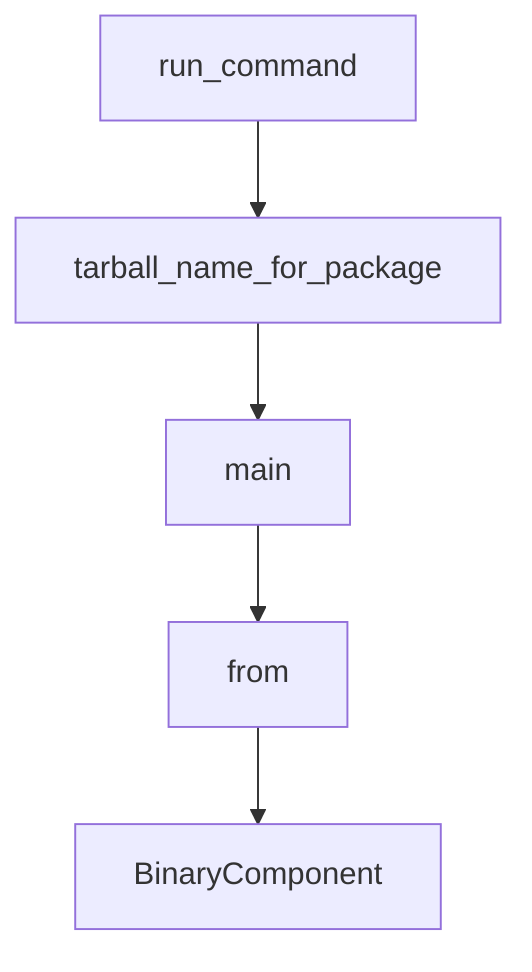

# Chapter 4: Sandbox, Approvals, and MCP Integration

Welcome to **Chapter 4: Sandbox, Approvals, and MCP Integration**. In this part of **Codex CLI Tutorial: Local Terminal Agent Workflows with OpenAI Codex**, you will build an intuitive mental model first, then move into concrete implementation details and practical production tradeoffs.


This chapter shows how to expand Codex capability without losing safety controls.

## Learning Goals

- apply sandbox and approval boundaries deliberately
- connect MCP servers through config
- isolate risky actions by policy
- troubleshoot integration failures quickly

## Safety Strategy

- default to constrained execution where feasible
- require approvals for high-impact actions
- expose only necessary MCP servers and scopes

## Source References

- [Codex Security Docs](https://developers.openai.com/codex/security)
- [Codex Sandbox Notes](https://github.com/openai/codex/blob/main/docs/sandbox.md)
- [Codex Config Reference](https://developers.openai.com/codex/config-reference)

## Summary

You now have a safer model for running Codex with external integrations.

Next: [Chapter 5: Prompts, Skills, and Workflow Orchestration](05-prompts-skills-and-workflow-orchestration.md)

## Source Code Walkthrough

### `scripts/stage_npm_packages.py`

The `run_command` function in [`scripts/stage_npm_packages.py`](https://github.com/openai/codex/blob/HEAD/scripts/stage_npm_packages.py) handles a key part of this chapter's functionality:

```py
        cmd.extend(["--component", component])
    cmd.append(str(vendor_root))
    run_command(cmd)


def run_command(cmd: list[str]) -> None:
    print("+", " ".join(cmd))
    subprocess.run(cmd, cwd=REPO_ROOT, check=True)


def tarball_name_for_package(package: str, version: str) -> str:
    if package in CODEX_PLATFORM_PACKAGES:
        platform = package.removeprefix("codex-")
        return f"codex-npm-{platform}-{version}.tgz"
    return f"{package}-npm-{version}.tgz"


def main() -> int:
    args = parse_args()

    output_dir = args.output_dir or (REPO_ROOT / "dist" / "npm")
    output_dir.mkdir(parents=True, exist_ok=True)

    runner_temp = Path(os.environ.get("RUNNER_TEMP", tempfile.gettempdir()))

    packages = expand_packages(list(args.packages))
    native_components = collect_native_components(packages)

    vendor_temp_root: Path | None = None
    vendor_src: Path | None = None
    resolved_head_sha: str | None = None

```

This function is important because it defines how Codex CLI Tutorial: Local Terminal Agent Workflows with OpenAI Codex implements the patterns covered in this chapter.

### `scripts/stage_npm_packages.py`

The `tarball_name_for_package` function in [`scripts/stage_npm_packages.py`](https://github.com/openai/codex/blob/HEAD/scripts/stage_npm_packages.py) handles a key part of this chapter's functionality:

```py


def tarball_name_for_package(package: str, version: str) -> str:
    if package in CODEX_PLATFORM_PACKAGES:
        platform = package.removeprefix("codex-")
        return f"codex-npm-{platform}-{version}.tgz"
    return f"{package}-npm-{version}.tgz"


def main() -> int:
    args = parse_args()

    output_dir = args.output_dir or (REPO_ROOT / "dist" / "npm")
    output_dir.mkdir(parents=True, exist_ok=True)

    runner_temp = Path(os.environ.get("RUNNER_TEMP", tempfile.gettempdir()))

    packages = expand_packages(list(args.packages))
    native_components = collect_native_components(packages)

    vendor_temp_root: Path | None = None
    vendor_src: Path | None = None
    resolved_head_sha: str | None = None

    final_messages = []

    try:
        if native_components:
            workflow_url, resolved_head_sha = resolve_workflow_url(
                args.release_version, args.workflow_url
            )
            vendor_temp_root = Path(tempfile.mkdtemp(prefix="npm-native-", dir=runner_temp))
```

This function is important because it defines how Codex CLI Tutorial: Local Terminal Agent Workflows with OpenAI Codex implements the patterns covered in this chapter.

### `scripts/stage_npm_packages.py`

The `main` function in [`scripts/stage_npm_packages.py`](https://github.com/openai/codex/blob/HEAD/scripts/stage_npm_packages.py) handles a key part of this chapter's functionality:

```py


def main() -> int:
    args = parse_args()

    output_dir = args.output_dir or (REPO_ROOT / "dist" / "npm")
    output_dir.mkdir(parents=True, exist_ok=True)

    runner_temp = Path(os.environ.get("RUNNER_TEMP", tempfile.gettempdir()))

    packages = expand_packages(list(args.packages))
    native_components = collect_native_components(packages)

    vendor_temp_root: Path | None = None
    vendor_src: Path | None = None
    resolved_head_sha: str | None = None

    final_messages = []

    try:
        if native_components:
            workflow_url, resolved_head_sha = resolve_workflow_url(
                args.release_version, args.workflow_url
            )
            vendor_temp_root = Path(tempfile.mkdtemp(prefix="npm-native-", dir=runner_temp))
            install_native_components(workflow_url, native_components, vendor_temp_root)
            vendor_src = vendor_temp_root / "vendor"

        if resolved_head_sha:
            print(f"should `git checkout {resolved_head_sha}`")

        for package in packages:
```

This function is important because it defines how Codex CLI Tutorial: Local Terminal Agent Workflows with OpenAI Codex implements the patterns covered in this chapter.

### `codex-cli/scripts/install_native_deps.py`

The `from` class in [`codex-cli/scripts/install_native_deps.py`](https://github.com/openai/codex/blob/HEAD/codex-cli/scripts/install_native_deps.py) handles a key part of this chapter's functionality:

```py

import argparse
from contextlib import contextmanager
import json
import os
import shutil
import subprocess
import tarfile
import tempfile
import zipfile
from dataclasses import dataclass
from concurrent.futures import ThreadPoolExecutor, as_completed
from pathlib import Path
import sys
from typing import Iterable, Sequence
from urllib.parse import urlparse
from urllib.request import urlopen

SCRIPT_DIR = Path(__file__).resolve().parent
CODEX_CLI_ROOT = SCRIPT_DIR.parent
DEFAULT_WORKFLOW_URL = "https://github.com/openai/codex/actions/runs/17952349351"  # rust-v0.40.0
VENDOR_DIR_NAME = "vendor"
RG_MANIFEST = CODEX_CLI_ROOT / "bin" / "rg"
BINARY_TARGETS = (
    "x86_64-unknown-linux-musl",
    "aarch64-unknown-linux-musl",
    "x86_64-apple-darwin",
    "aarch64-apple-darwin",
    "x86_64-pc-windows-msvc",
    "aarch64-pc-windows-msvc",
)

```

This class is important because it defines how Codex CLI Tutorial: Local Terminal Agent Workflows with OpenAI Codex implements the patterns covered in this chapter.


## How These Components Connect


