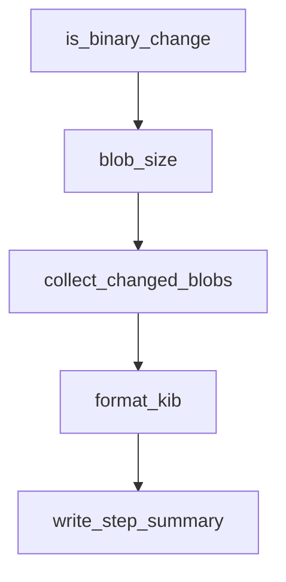

# Chapter 5: Prompts, Skills, and Workflow Orchestration

Welcome to **Chapter 5: Prompts, Skills, and Workflow Orchestration**. In this part of **Codex CLI Tutorial: Local Terminal Agent Workflows with OpenAI Codex**, you will build an intuitive mental model first, then move into concrete implementation details and practical production tradeoffs.


This chapter focuses on higher-signal agent behavior through structured prompt and skill design.

## Learning Goals

- create reusable prompt conventions
- leverage skill definitions for repeatable workflows
- reduce ambiguity in multi-step tasks
- align prompts with policy and quality checks

## Workflow Design Tips

- keep prompts concrete and outcome-oriented
- encode team defaults in shared skills
- include verification criteria in task prompts

## Source References

- [Codex Prompts Docs](https://github.com/openai/codex/blob/main/docs/prompts.md)
- [Codex Skills Docs](https://github.com/openai/codex/blob/main/docs/skills.md)
- [Codex Agents.md Guide](https://github.com/openai/codex/blob/main/docs/agents_md.md)

## Summary

You now have a framework for consistent Codex workflow orchestration.

Next: [Chapter 6: Commands, Connectors, and Daily Operations](06-commands-connectors-and-daily-operations.md)

## Depth Expansion Playbook

## Source Code Walkthrough

### `scripts/check_blob_size.py`

The `is_binary_change` function in [`scripts/check_blob_size.py`](https://github.com/openai/codex/blob/HEAD/scripts/check_blob_size.py) handles a key part of this chapter's functionality:

```py


def is_binary_change(base: str, head: str, path: str) -> bool:
    output = run_git(
        "diff",
        "--numstat",
        "--diff-filter=AM",
        "--no-renames",
        base,
        head,
        "--",
        path,
    ).strip()
    if not output:
        return False

    added, deleted, _ = output.split("\t", 2)
    return added == "-" and deleted == "-"


def blob_size(commit: str, path: str) -> int:
    return int(run_git("cat-file", "-s", f"{commit}:{path}").strip())


def collect_changed_blobs(base: str, head: str, allowlist: set[str]) -> list[ChangedBlob]:
    blobs: list[ChangedBlob] = []
    for path in get_changed_paths(base, head):
        blobs.append(
            ChangedBlob(
                path=path,
                size_bytes=blob_size(head, path),
                is_allowlisted=path in allowlist,
```

This function is important because it defines how Codex CLI Tutorial: Local Terminal Agent Workflows with OpenAI Codex implements the patterns covered in this chapter.

### `scripts/check_blob_size.py`

The `blob_size` function in [`scripts/check_blob_size.py`](https://github.com/openai/codex/blob/HEAD/scripts/check_blob_size.py) handles a key part of this chapter's functionality:

```py


def blob_size(commit: str, path: str) -> int:
    return int(run_git("cat-file", "-s", f"{commit}:{path}").strip())


def collect_changed_blobs(base: str, head: str, allowlist: set[str]) -> list[ChangedBlob]:
    blobs: list[ChangedBlob] = []
    for path in get_changed_paths(base, head):
        blobs.append(
            ChangedBlob(
                path=path,
                size_bytes=blob_size(head, path),
                is_allowlisted=path in allowlist,
                is_binary=is_binary_change(base, head, path),
            )
        )
    return blobs


def format_kib(size_bytes: int) -> str:
    return f"{size_bytes / 1024:.1f} KiB"


def write_step_summary(
    max_bytes: int,
    blobs: list[ChangedBlob],
    violations: list[ChangedBlob],
) -> None:
    summary_path = os.environ.get("GITHUB_STEP_SUMMARY")
    if not summary_path:
        return
```

This function is important because it defines how Codex CLI Tutorial: Local Terminal Agent Workflows with OpenAI Codex implements the patterns covered in this chapter.

### `scripts/check_blob_size.py`

The `collect_changed_blobs` function in [`scripts/check_blob_size.py`](https://github.com/openai/codex/blob/HEAD/scripts/check_blob_size.py) handles a key part of this chapter's functionality:

```py


def collect_changed_blobs(base: str, head: str, allowlist: set[str]) -> list[ChangedBlob]:
    blobs: list[ChangedBlob] = []
    for path in get_changed_paths(base, head):
        blobs.append(
            ChangedBlob(
                path=path,
                size_bytes=blob_size(head, path),
                is_allowlisted=path in allowlist,
                is_binary=is_binary_change(base, head, path),
            )
        )
    return blobs


def format_kib(size_bytes: int) -> str:
    return f"{size_bytes / 1024:.1f} KiB"


def write_step_summary(
    max_bytes: int,
    blobs: list[ChangedBlob],
    violations: list[ChangedBlob],
) -> None:
    summary_path = os.environ.get("GITHUB_STEP_SUMMARY")
    if not summary_path:
        return

    lines = [
        "## Blob Size Policy",
        "",
```

This function is important because it defines how Codex CLI Tutorial: Local Terminal Agent Workflows with OpenAI Codex implements the patterns covered in this chapter.

### `scripts/check_blob_size.py`

The `format_kib` function in [`scripts/check_blob_size.py`](https://github.com/openai/codex/blob/HEAD/scripts/check_blob_size.py) handles a key part of this chapter's functionality:

```py


def format_kib(size_bytes: int) -> str:
    return f"{size_bytes / 1024:.1f} KiB"


def write_step_summary(
    max_bytes: int,
    blobs: list[ChangedBlob],
    violations: list[ChangedBlob],
) -> None:
    summary_path = os.environ.get("GITHUB_STEP_SUMMARY")
    if not summary_path:
        return

    lines = [
        "## Blob Size Policy",
        "",
        f"Default max: `{max_bytes}` bytes ({format_kib(max_bytes)})",
        f"Changed files checked: `{len(blobs)}`",
        f"Violations: `{len(violations)}`",
        "",
    ]

    if blobs:
        lines.extend(
            [
                "| Path | Kind | Size | Status |",
                "| --- | --- | ---: | --- |",
            ]
        )
        for blob in blobs:
```

This function is important because it defines how Codex CLI Tutorial: Local Terminal Agent Workflows with OpenAI Codex implements the patterns covered in this chapter.


## How These Components Connect


