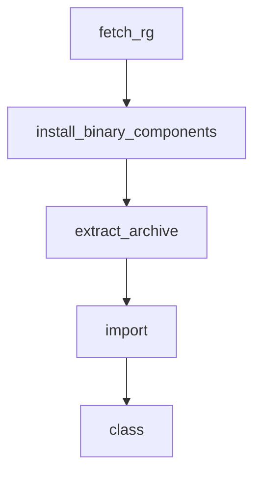

# Chapter 5: Prompts, Skills, and Workflow Orchestration

Welcome to **Chapter 5: Prompts, Skills, and Workflow Orchestration**. In this part of **Codex CLI Tutorial: Local Terminal Agent Workflows with OpenAI Codex**, you will build an intuitive mental model first, then move into concrete implementation details and practical production tradeoffs.


This chapter focuses on higher-signal agent behavior through structured prompt and skill design.

## Learning Goals

- create reusable prompt conventions
- leverage skill definitions for repeatable workflows
- reduce ambiguity in multi-step tasks
- align prompts with policy and quality checks

## Workflow Design Tips

- keep prompts concrete and outcome-oriented
- encode team defaults in shared skills
- include verification criteria in task prompts

## Source References

- [Codex Prompts Docs](https://github.com/openai/codex/blob/main/docs/prompts.md)
- [Codex Skills Docs](https://github.com/openai/codex/blob/main/docs/skills.md)
- [Codex Agents.md Guide](https://github.com/openai/codex/blob/main/docs/agents_md.md)

## Summary

You now have a framework for consistent Codex workflow orchestration.

Next: [Chapter 6: Commands, Connectors, and Daily Operations](06-commands-connectors-and-daily-operations.md)

## Source Code Walkthrough

### `codex-cli/scripts/install_native_deps.py`

The `fetch_rg` function in [`codex-cli/scripts/install_native_deps.py`](https://github.com/openai/codex/blob/HEAD/codex-cli/scripts/install_native_deps.py) handles a key part of this chapter's functionality:

```py
        with _gha_group("Fetch ripgrep binaries"):
            print("Fetching ripgrep binaries...")
            fetch_rg(vendor_dir, DEFAULT_RG_TARGETS, manifest_path=RG_MANIFEST)

    print(f"Installed native dependencies into {vendor_dir}")
    return 0


def fetch_rg(
    vendor_dir: Path,
    targets: Sequence[str] | None = None,
    *,
    manifest_path: Path,
) -> list[Path]:
    """Download ripgrep binaries described by the DotSlash manifest."""

    if targets is None:
        targets = DEFAULT_RG_TARGETS

    if not manifest_path.exists():
        raise FileNotFoundError(f"DotSlash manifest not found: {manifest_path}")

    manifest = _load_manifest(manifest_path)
    platforms = manifest.get("platforms", {})

    vendor_dir.mkdir(parents=True, exist_ok=True)

    targets = list(targets)
    if not targets:
        return []

    task_configs: list[tuple[str, str, dict]] = []
```

This function is important because it defines how Codex CLI Tutorial: Local Terminal Agent Workflows with OpenAI Codex implements the patterns covered in this chapter.

### `codex-cli/scripts/install_native_deps.py`

The `install_binary_components` function in [`codex-cli/scripts/install_native_deps.py`](https://github.com/openai/codex/blob/HEAD/codex-cli/scripts/install_native_deps.py) handles a key part of this chapter's functionality:

```py
            artifacts_dir = Path(artifacts_dir_str)
            _download_artifacts(workflow_id, artifacts_dir)
            install_binary_components(
                artifacts_dir,
                vendor_dir,
                [BINARY_COMPONENTS[name] for name in components if name in BINARY_COMPONENTS],
            )

    if "rg" in components:
        with _gha_group("Fetch ripgrep binaries"):
            print("Fetching ripgrep binaries...")
            fetch_rg(vendor_dir, DEFAULT_RG_TARGETS, manifest_path=RG_MANIFEST)

    print(f"Installed native dependencies into {vendor_dir}")
    return 0


def fetch_rg(
    vendor_dir: Path,
    targets: Sequence[str] | None = None,
    *,
    manifest_path: Path,
) -> list[Path]:
    """Download ripgrep binaries described by the DotSlash manifest."""

    if targets is None:
        targets = DEFAULT_RG_TARGETS

    if not manifest_path.exists():
        raise FileNotFoundError(f"DotSlash manifest not found: {manifest_path}")

    manifest = _load_manifest(manifest_path)
```

This function is important because it defines how Codex CLI Tutorial: Local Terminal Agent Workflows with OpenAI Codex implements the patterns covered in this chapter.

### `codex-cli/scripts/install_native_deps.py`

The `extract_archive` function in [`codex-cli/scripts/install_native_deps.py`](https://github.com/openai/codex/blob/HEAD/codex-cli/scripts/install_native_deps.py) handles a key part of this chapter's functionality:

```py
    dest = dest_dir / binary_name
    dest.unlink(missing_ok=True)
    extract_archive(archive_path, "zst", None, dest)
    if "windows" not in target:
        dest.chmod(0o755)
    return dest


def _archive_name_for_target(artifact_prefix: str, target: str) -> str:
    if "windows" in target:
        return f"{artifact_prefix}-{target}.exe.zst"
    return f"{artifact_prefix}-{target}.zst"


def _fetch_single_rg(
    vendor_dir: Path,
    target: str,
    platform_key: str,
    platform_info: dict,
    manifest_path: Path,
) -> Path:
    providers = platform_info.get("providers", [])
    if not providers:
        raise RuntimeError(f"No providers listed for platform '{platform_key}' in {manifest_path}.")

    url = providers[0]["url"]
    archive_format = platform_info.get("format", "zst")
    archive_member = platform_info.get("path")
    digest = platform_info.get("digest")
    expected_size = platform_info.get("size")

    dest_dir = vendor_dir / target / "path"
```

This function is important because it defines how Codex CLI Tutorial: Local Terminal Agent Workflows with OpenAI Codex implements the patterns covered in this chapter.

### `tools/argument-comment-lint/wrapper_common.py`

The `import` class in [`tools/argument-comment-lint/wrapper_common.py`](https://github.com/openai/codex/blob/HEAD/tools/argument-comment-lint/wrapper_common.py) handles a key part of this chapter's functionality:

```py
#!/usr/bin/env python3

from __future__ import annotations

from dataclasses import dataclass
import os
from pathlib import Path
import re
import shlex
import shutil
import subprocess
import sys
import tempfile
from typing import MutableMapping, Sequence

STRICT_LINTS = [
    "argument-comment-mismatch",
    "uncommented-anonymous-literal-argument",
]
NOISE_LINT = "unknown_lints"
TOOLCHAIN_CHANNEL = "nightly-2025-09-18"

_TARGET_SELECTION_ARGS = {
    "--all-targets",
    "--lib",
    "--bins",
    "--tests",
    "--examples",
    "--benches",
    "--doc",
}
_TARGET_SELECTION_PREFIXES = ("--bin=", "--test=", "--example=", "--bench=")
```

This class is important because it defines how Codex CLI Tutorial: Local Terminal Agent Workflows with OpenAI Codex implements the patterns covered in this chapter.


## How These Components Connect


