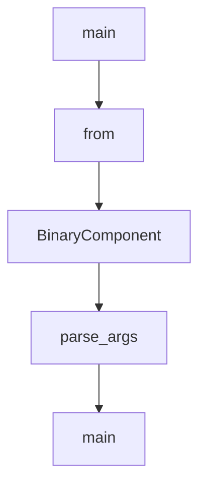

# Chapter 6: Commands, Connectors, and Daily Operations

Welcome to **Chapter 6: Commands, Connectors, and Daily Operations**. In this part of **Codex CLI Tutorial: Local Terminal Agent Workflows with OpenAI Codex**, you will build an intuitive mental model first, then move into concrete implementation details and practical production tradeoffs.


This chapter covers daily operator ergonomics in Codex CLI.

## Learning Goals

- use command surfaces for faster interaction
- integrate connectors where they improve context flow
- keep session workflows predictable
- reduce operational friction in repetitive tasks

## Operational Patterns

- use slash commands for explicit action routing
- use connectors for controlled external context
- standardize command patterns across team runbooks

## Source References

- [Codex Slash Commands Docs](https://github.com/openai/codex/blob/main/docs/slash_commands.md)
- [Codex Config Docs (Apps/Connectors)](https://github.com/openai/codex/blob/main/docs/config.md)
- [Codex IDE Docs](https://developers.openai.com/codex/ide)

## Summary

You now have efficient operator patterns for day-to-day Codex usage.

Next: [Chapter 7: Advanced Configuration and Policy Controls](07-advanced-configuration-and-policy-controls.md)

## Depth Expansion Playbook

## Source Code Walkthrough

### `scripts/check_blob_size.py`

The `main` function in [`scripts/check_blob_size.py`](https://github.com/openai/codex/blob/HEAD/scripts/check_blob_size.py) handles a key part of this chapter's functionality:

```py


def main() -> int:
    parser = argparse.ArgumentParser(
        description="Fail if changed blobs exceed the configured size budget."
    )
    parser.add_argument("--base", required=True, help="Base git revision to diff against.")
    parser.add_argument("--head", required=True, help="Head git revision to inspect.")
    parser.add_argument(
        "--max-bytes",
        type=int,
        default=DEFAULT_MAX_BYTES,
        help=f"Maximum allowed blob size in bytes. Default: {DEFAULT_MAX_BYTES}.",
    )
    parser.add_argument(
        "--allowlist",
        type=Path,
        required=True,
        help="Path to the newline-delimited allowlist file.",
    )
    args = parser.parse_args()

    allowlist = load_allowlist(args.allowlist)
    blobs = collect_changed_blobs(args.base, args.head, allowlist)
    violations = [
        blob for blob in blobs if blob.size_bytes > args.max_bytes and not blob.is_allowlisted
    ]

    write_step_summary(args.max_bytes, blobs, violations)

    if not blobs:
        print("No changed files were detected.")
```

This function is important because it defines how Codex CLI Tutorial: Local Terminal Agent Workflows with OpenAI Codex implements the patterns covered in this chapter.

### `codex-cli/scripts/install_native_deps.py`

The `from` class in [`codex-cli/scripts/install_native_deps.py`](https://github.com/openai/codex/blob/HEAD/codex-cli/scripts/install_native_deps.py) handles a key part of this chapter's functionality:

```py

import argparse
from contextlib import contextmanager
import json
import os
import shutil
import subprocess
import tarfile
import tempfile
import zipfile
from dataclasses import dataclass
from concurrent.futures import ThreadPoolExecutor, as_completed
from pathlib import Path
import sys
from typing import Iterable, Sequence
from urllib.parse import urlparse
from urllib.request import urlopen

SCRIPT_DIR = Path(__file__).resolve().parent
CODEX_CLI_ROOT = SCRIPT_DIR.parent
DEFAULT_WORKFLOW_URL = "https://github.com/openai/codex/actions/runs/17952349351"  # rust-v0.40.0
VENDOR_DIR_NAME = "vendor"
RG_MANIFEST = CODEX_CLI_ROOT / "bin" / "rg"
BINARY_TARGETS = (
    "x86_64-unknown-linux-musl",
    "aarch64-unknown-linux-musl",
    "x86_64-apple-darwin",
    "aarch64-apple-darwin",
    "x86_64-pc-windows-msvc",
    "aarch64-pc-windows-msvc",
)

```

This class is important because it defines how Codex CLI Tutorial: Local Terminal Agent Workflows with OpenAI Codex implements the patterns covered in this chapter.

### `codex-cli/scripts/install_native_deps.py`

The `BinaryComponent` class in [`codex-cli/scripts/install_native_deps.py`](https://github.com/openai/codex/blob/HEAD/codex-cli/scripts/install_native_deps.py) handles a key part of this chapter's functionality:

```py

@dataclass(frozen=True)
class BinaryComponent:
    artifact_prefix: str  # matches the artifact filename prefix (e.g. codex-<target>.zst)
    dest_dir: str  # directory under vendor/<target>/ where the binary is installed
    binary_basename: str  # executable name inside dest_dir (before optional .exe)
    targets: tuple[str, ...] | None = None  # limit installation to specific targets


WINDOWS_TARGETS = tuple(target for target in BINARY_TARGETS if "windows" in target)

BINARY_COMPONENTS = {
    "codex": BinaryComponent(
        artifact_prefix="codex",
        dest_dir="codex",
        binary_basename="codex",
    ),
    "codex-responses-api-proxy": BinaryComponent(
        artifact_prefix="codex-responses-api-proxy",
        dest_dir="codex-responses-api-proxy",
        binary_basename="codex-responses-api-proxy",
    ),
    "codex-windows-sandbox-setup": BinaryComponent(
        artifact_prefix="codex-windows-sandbox-setup",
        dest_dir="codex",
        binary_basename="codex-windows-sandbox-setup",
        targets=WINDOWS_TARGETS,
    ),
    "codex-command-runner": BinaryComponent(
        artifact_prefix="codex-command-runner",
        dest_dir="codex",
        binary_basename="codex-command-runner",
```

This class is important because it defines how Codex CLI Tutorial: Local Terminal Agent Workflows with OpenAI Codex implements the patterns covered in this chapter.

### `codex-cli/scripts/install_native_deps.py`

The `parse_args` function in [`codex-cli/scripts/install_native_deps.py`](https://github.com/openai/codex/blob/HEAD/codex-cli/scripts/install_native_deps.py) handles a key part of this chapter's functionality:

```py


def parse_args() -> argparse.Namespace:
    parser = argparse.ArgumentParser(description="Install native Codex binaries.")
    parser.add_argument(
        "--workflow-url",
        help=(
            "GitHub Actions workflow URL that produced the artifacts. Defaults to a "
            "known good run when omitted."
        ),
    )
    parser.add_argument(
        "--component",
        dest="components",
        action="append",
        choices=tuple(list(BINARY_COMPONENTS) + ["rg"]),
        help=(
            "Limit installation to the specified components."
            " May be repeated. Defaults to codex, codex-windows-sandbox-setup,"
            " codex-command-runner, and rg."
        ),
    )
    parser.add_argument(
        "root",
        nargs="?",
        type=Path,
        help=(
            "Directory containing package.json for the staged package. If omitted, the "
            "repository checkout is used."
        ),
    )
    return parser.parse_args()
```

This function is important because it defines how Codex CLI Tutorial: Local Terminal Agent Workflows with OpenAI Codex implements the patterns covered in this chapter.


## How These Components Connect


