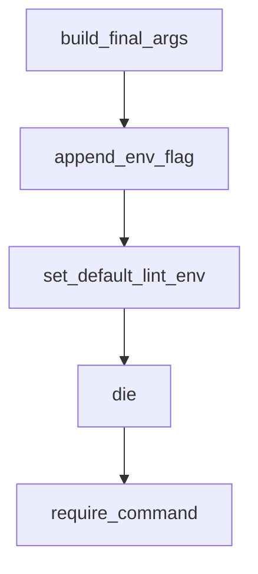

# Chapter 6: Commands, Connectors, and Daily Operations

Welcome to **Chapter 6: Commands, Connectors, and Daily Operations**. In this part of **Codex CLI Tutorial: Local Terminal Agent Workflows with OpenAI Codex**, you will build an intuitive mental model first, then move into concrete implementation details and practical production tradeoffs.


This chapter covers daily operator ergonomics in Codex CLI.

## Learning Goals

- use command surfaces for faster interaction
- integrate connectors where they improve context flow
- keep session workflows predictable
- reduce operational friction in repetitive tasks

## Operational Patterns

- use slash commands for explicit action routing
- use connectors for controlled external context
- standardize command patterns across team runbooks

## Source References

- [Codex Slash Commands Docs](https://github.com/openai/codex/blob/main/docs/slash_commands.md)
- [Codex Config Docs (Apps/Connectors)](https://github.com/openai/codex/blob/main/docs/config.md)
- [Codex IDE Docs](https://developers.openai.com/codex/ide)

## Summary

You now have efficient operator patterns for day-to-day Codex usage.

Next: [Chapter 7: Advanced Configuration and Policy Controls](07-advanced-configuration-and-policy-controls.md)

## Source Code Walkthrough

### `tools/argument-comment-lint/wrapper_common.py`

The `build_final_args` function in [`tools/argument-comment-lint/wrapper_common.py`](https://github.com/openai/codex/blob/HEAD/tools/argument-comment-lint/wrapper_common.py) handles a key part of this chapter's functionality:

```py


def build_final_args(parsed: ParsedWrapperArgs, manifest_path: Path) -> list[str]:
    final_args: list[str] = []
    cargo_args = list(parsed.cargo_args)

    if not parsed.has_manifest_path:
        final_args.extend(["--manifest-path", str(manifest_path)])
    if not parsed.has_package_selection and not parsed.has_manifest_path:
        final_args.append("--workspace")
    if not parsed.has_no_deps:
        final_args.append("--no-deps")
    if not parsed.has_fix and not parsed.has_cargo_target_selection:
        cargo_args.append("--all-targets")
    final_args.extend(parsed.lint_args)
    if cargo_args:
        final_args.extend(["--", *cargo_args])
    return final_args


def append_env_flag(env: MutableMapping[str, str], key: str, flag: str) -> None:
    value = env.get(key)
    if value is None or value == "":
        env[key] = flag
        return
    if flag not in value:
        env[key] = f"{value} {flag}"


def set_default_lint_env(env: MutableMapping[str, str]) -> None:
    for strict_lint in STRICT_LINTS:
        append_env_flag(env, "DYLINT_RUSTFLAGS", f"-D {strict_lint}")
```

This function is important because it defines how Codex CLI Tutorial: Local Terminal Agent Workflows with OpenAI Codex implements the patterns covered in this chapter.

### `tools/argument-comment-lint/wrapper_common.py`

The `append_env_flag` function in [`tools/argument-comment-lint/wrapper_common.py`](https://github.com/openai/codex/blob/HEAD/tools/argument-comment-lint/wrapper_common.py) handles a key part of this chapter's functionality:

```py


def append_env_flag(env: MutableMapping[str, str], key: str, flag: str) -> None:
    value = env.get(key)
    if value is None or value == "":
        env[key] = flag
        return
    if flag not in value:
        env[key] = f"{value} {flag}"


def set_default_lint_env(env: MutableMapping[str, str]) -> None:
    for strict_lint in STRICT_LINTS:
        append_env_flag(env, "DYLINT_RUSTFLAGS", f"-D {strict_lint}")
    append_env_flag(env, "DYLINT_RUSTFLAGS", f"-A {NOISE_LINT}")
    if not env.get("CARGO_INCREMENTAL"):
        env["CARGO_INCREMENTAL"] = "0"


def die(message: str) -> "Never":
    print(message, file=sys.stderr)
    raise SystemExit(1)


def require_command(name: str, install_message: str | None = None) -> str:
    executable = shutil.which(name)
    if executable is None:
        if install_message is None:
            die(f"{name} is required but was not found on PATH.")
        die(install_message)
    return executable

```

This function is important because it defines how Codex CLI Tutorial: Local Terminal Agent Workflows with OpenAI Codex implements the patterns covered in this chapter.

### `tools/argument-comment-lint/wrapper_common.py`

The `set_default_lint_env` function in [`tools/argument-comment-lint/wrapper_common.py`](https://github.com/openai/codex/blob/HEAD/tools/argument-comment-lint/wrapper_common.py) handles a key part of this chapter's functionality:

```py


def set_default_lint_env(env: MutableMapping[str, str]) -> None:
    for strict_lint in STRICT_LINTS:
        append_env_flag(env, "DYLINT_RUSTFLAGS", f"-D {strict_lint}")
    append_env_flag(env, "DYLINT_RUSTFLAGS", f"-A {NOISE_LINT}")
    if not env.get("CARGO_INCREMENTAL"):
        env["CARGO_INCREMENTAL"] = "0"


def die(message: str) -> "Never":
    print(message, file=sys.stderr)
    raise SystemExit(1)


def require_command(name: str, install_message: str | None = None) -> str:
    executable = shutil.which(name)
    if executable is None:
        if install_message is None:
            die(f"{name} is required but was not found on PATH.")
        die(install_message)
    return executable


def run_capture(args: Sequence[str], env: MutableMapping[str, str] | None = None) -> str:
    try:
        completed = subprocess.run(
            list(args),
            capture_output=True,
            check=True,
            env=None if env is None else dict(env),
            text=True,
```

This function is important because it defines how Codex CLI Tutorial: Local Terminal Agent Workflows with OpenAI Codex implements the patterns covered in this chapter.

### `tools/argument-comment-lint/wrapper_common.py`

The `die` function in [`tools/argument-comment-lint/wrapper_common.py`](https://github.com/openai/codex/blob/HEAD/tools/argument-comment-lint/wrapper_common.py) handles a key part of this chapter's functionality:

```py


def die(message: str) -> "Never":
    print(message, file=sys.stderr)
    raise SystemExit(1)


def require_command(name: str, install_message: str | None = None) -> str:
    executable = shutil.which(name)
    if executable is None:
        if install_message is None:
            die(f"{name} is required but was not found on PATH.")
        die(install_message)
    return executable


def run_capture(args: Sequence[str], env: MutableMapping[str, str] | None = None) -> str:
    try:
        completed = subprocess.run(
            list(args),
            capture_output=True,
            check=True,
            env=None if env is None else dict(env),
            text=True,
        )
    except subprocess.CalledProcessError as error:
        command = shlex.join(str(part) for part in error.cmd)
        stderr = error.stderr.strip()
        stdout = error.stdout.strip()
        output = stderr or stdout
        if output:
            die(f"{command} failed:\n{output}")
```

This function is important because it defines how Codex CLI Tutorial: Local Terminal Agent Workflows with OpenAI Codex implements the patterns covered in this chapter.


## How These Components Connect


