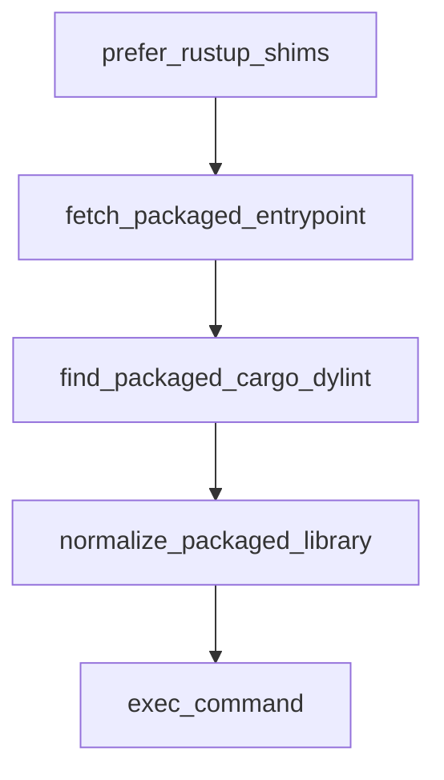

# Chapter 7: Advanced Configuration and Policy Controls

Welcome to **Chapter 7: Advanced Configuration and Policy Controls**. In this part of **Codex CLI Tutorial: Local Terminal Agent Workflows with OpenAI Codex**, you will build an intuitive mental model first, then move into concrete implementation details and practical production tradeoffs.


This chapter addresses policy standardization for team-scale Codex adoption.

## Learning Goals

- enforce shared configuration baselines
- separate local experimentation from production defaults
- define policy around approvals and tool access
- keep config changes reviewable and auditable

## Governance Checklist

- maintain versioned config templates
- define per-environment auth and sandbox posture
- validate policy conformance in onboarding docs

## Source References

- [Codex Config Reference](https://developers.openai.com/codex/config-reference)
- [Codex Security Guide](https://developers.openai.com/codex/security)
- [Codex Example Config](https://github.com/openai/codex/blob/main/docs/example-config.md)

## Summary

You now have a team-ready approach to Codex configuration governance.

Next: [Chapter 8: Contribution Workflow and Ecosystem Strategy](08-contribution-workflow-and-ecosystem-strategy.md)

## Source Code Walkthrough

### `tools/argument-comment-lint/wrapper_common.py`

The `prefer_rustup_shims` function in [`tools/argument-comment-lint/wrapper_common.py`](https://github.com/openai/codex/blob/HEAD/tools/argument-comment-lint/wrapper_common.py) handles a key part of this chapter's functionality:

```py


def prefer_rustup_shims(env: MutableMapping[str, str]) -> None:
    if env.get("CODEX_ARGUMENT_COMMENT_LINT_SKIP_RUSTUP_SHIMS") == "1":
        return

    rustup = shutil.which("rustup", path=env.get("PATH"))
    if rustup is None:
        return

    rustup_bin_dir = str(Path(rustup).resolve().parent)
    path_entries = [
        entry
        for entry in env.get("PATH", "").split(os.pathsep)
        if entry and entry != rustup_bin_dir
    ]
    env["PATH"] = os.pathsep.join([rustup_bin_dir, *path_entries])

    if not env.get("RUSTUP_HOME"):
        rustup_home = run_capture(["rustup", "show", "home"], env=env)
        if rustup_home:
            env["RUSTUP_HOME"] = rustup_home


def fetch_packaged_entrypoint(dotslash_manifest: Path, env: MutableMapping[str, str]) -> Path:
    require_command(
        "dotslash",
        "argument-comment-lint prebuilt wrapper requires dotslash.\n"
        "Install dotslash, or use:\n"
        "  ./tools/argument-comment-lint/run.py ...",
    )
    entrypoint = run_capture(["dotslash", "--", "fetch", str(dotslash_manifest)], env=env)
```

This function is important because it defines how Codex CLI Tutorial: Local Terminal Agent Workflows with OpenAI Codex implements the patterns covered in this chapter.

### `tools/argument-comment-lint/wrapper_common.py`

The `fetch_packaged_entrypoint` function in [`tools/argument-comment-lint/wrapper_common.py`](https://github.com/openai/codex/blob/HEAD/tools/argument-comment-lint/wrapper_common.py) handles a key part of this chapter's functionality:

```py


def fetch_packaged_entrypoint(dotslash_manifest: Path, env: MutableMapping[str, str]) -> Path:
    require_command(
        "dotslash",
        "argument-comment-lint prebuilt wrapper requires dotslash.\n"
        "Install dotslash, or use:\n"
        "  ./tools/argument-comment-lint/run.py ...",
    )
    entrypoint = run_capture(["dotslash", "--", "fetch", str(dotslash_manifest)], env=env)
    return Path(entrypoint).resolve()


def find_packaged_cargo_dylint(package_entrypoint: Path) -> Path:
    bin_dir = package_entrypoint.parent
    cargo_dylint = bin_dir / "cargo-dylint"
    if not cargo_dylint.is_file():
        cargo_dylint = bin_dir / "cargo-dylint.exe"
    if not cargo_dylint.is_file():
        die(f"bundled cargo-dylint executable not found under {bin_dir}")
    return cargo_dylint


def normalize_packaged_library(package_entrypoint: Path) -> Path:
    library_dir = package_entrypoint.parent.parent / "lib"
    libraries = sorted(path for path in library_dir.glob("*@*") if path.is_file())
    if not libraries:
        die(f"no packaged Dylint library found in {library_dir}")
    if len(libraries) != 1:
        die(f"expected exactly one packaged Dylint library in {library_dir}")

    library_path = libraries[0]
```

This function is important because it defines how Codex CLI Tutorial: Local Terminal Agent Workflows with OpenAI Codex implements the patterns covered in this chapter.

### `tools/argument-comment-lint/wrapper_common.py`

The `find_packaged_cargo_dylint` function in [`tools/argument-comment-lint/wrapper_common.py`](https://github.com/openai/codex/blob/HEAD/tools/argument-comment-lint/wrapper_common.py) handles a key part of this chapter's functionality:

```py


def find_packaged_cargo_dylint(package_entrypoint: Path) -> Path:
    bin_dir = package_entrypoint.parent
    cargo_dylint = bin_dir / "cargo-dylint"
    if not cargo_dylint.is_file():
        cargo_dylint = bin_dir / "cargo-dylint.exe"
    if not cargo_dylint.is_file():
        die(f"bundled cargo-dylint executable not found under {bin_dir}")
    return cargo_dylint


def normalize_packaged_library(package_entrypoint: Path) -> Path:
    library_dir = package_entrypoint.parent.parent / "lib"
    libraries = sorted(path for path in library_dir.glob("*@*") if path.is_file())
    if not libraries:
        die(f"no packaged Dylint library found in {library_dir}")
    if len(libraries) != 1:
        die(f"expected exactly one packaged Dylint library in {library_dir}")

    library_path = libraries[0]
    match = _NIGHTLY_LIBRARY_PATTERN.match(library_path.stem)
    if match is None:
        return library_path

    temp_dir = Path(tempfile.mkdtemp(prefix="argument-comment-lint."))
    normalized_library_path = temp_dir / f"{match.group(1)}{library_path.suffix}"
    shutil.copy2(library_path, normalized_library_path)
    return normalized_library_path


def exec_command(command: Sequence[str], env: MutableMapping[str, str]) -> "Never":
```

This function is important because it defines how Codex CLI Tutorial: Local Terminal Agent Workflows with OpenAI Codex implements the patterns covered in this chapter.

### `tools/argument-comment-lint/wrapper_common.py`

The `normalize_packaged_library` function in [`tools/argument-comment-lint/wrapper_common.py`](https://github.com/openai/codex/blob/HEAD/tools/argument-comment-lint/wrapper_common.py) handles a key part of this chapter's functionality:

```py


def normalize_packaged_library(package_entrypoint: Path) -> Path:
    library_dir = package_entrypoint.parent.parent / "lib"
    libraries = sorted(path for path in library_dir.glob("*@*") if path.is_file())
    if not libraries:
        die(f"no packaged Dylint library found in {library_dir}")
    if len(libraries) != 1:
        die(f"expected exactly one packaged Dylint library in {library_dir}")

    library_path = libraries[0]
    match = _NIGHTLY_LIBRARY_PATTERN.match(library_path.stem)
    if match is None:
        return library_path

    temp_dir = Path(tempfile.mkdtemp(prefix="argument-comment-lint."))
    normalized_library_path = temp_dir / f"{match.group(1)}{library_path.suffix}"
    shutil.copy2(library_path, normalized_library_path)
    return normalized_library_path


def exec_command(command: Sequence[str], env: MutableMapping[str, str]) -> "Never":
    try:
        completed = subprocess.run(list(command), env=dict(env), check=False)
    except FileNotFoundError:
        die(f"{command[0]} is required but was not found on PATH.")
    raise SystemExit(completed.returncode)

```

This function is important because it defines how Codex CLI Tutorial: Local Terminal Agent Workflows with OpenAI Codex implements the patterns covered in this chapter.


## How These Components Connect


