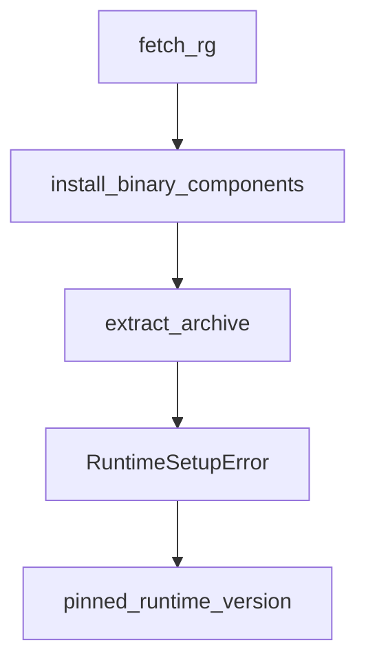

# Chapter 7: Advanced Configuration and Policy Controls

Welcome to **Chapter 7: Advanced Configuration and Policy Controls**. In this part of **Codex CLI Tutorial: Local Terminal Agent Workflows with OpenAI Codex**, you will build an intuitive mental model first, then move into concrete implementation details and practical production tradeoffs.


This chapter addresses policy standardization for team-scale Codex adoption.

## Learning Goals

- enforce shared configuration baselines
- separate local experimentation from production defaults
- define policy around approvals and tool access
- keep config changes reviewable and auditable

## Governance Checklist

- maintain versioned config templates
- define per-environment auth and sandbox posture
- validate policy conformance in onboarding docs

## Source References

- [Codex Config Reference](https://developers.openai.com/codex/config-reference)
- [Codex Security Guide](https://developers.openai.com/codex/security)
- [Codex Example Config](https://github.com/openai/codex/blob/main/docs/example-config.md)

## Summary

You now have a team-ready approach to Codex configuration governance.

Next: [Chapter 8: Contribution Workflow and Ecosystem Strategy](08-contribution-workflow-and-ecosystem-strategy.md)

## Depth Expansion Playbook

## Source Code Walkthrough

### `codex-cli/scripts/install_native_deps.py`

The `fetch_rg` function in [`codex-cli/scripts/install_native_deps.py`](https://github.com/openai/codex/blob/HEAD/codex-cli/scripts/install_native_deps.py) handles a key part of this chapter's functionality:

```py
        with _gha_group("Fetch ripgrep binaries"):
            print("Fetching ripgrep binaries...")
            fetch_rg(vendor_dir, DEFAULT_RG_TARGETS, manifest_path=RG_MANIFEST)

    print(f"Installed native dependencies into {vendor_dir}")
    return 0


def fetch_rg(
    vendor_dir: Path,
    targets: Sequence[str] | None = None,
    *,
    manifest_path: Path,
) -> list[Path]:
    """Download ripgrep binaries described by the DotSlash manifest."""

    if targets is None:
        targets = DEFAULT_RG_TARGETS

    if not manifest_path.exists():
        raise FileNotFoundError(f"DotSlash manifest not found: {manifest_path}")

    manifest = _load_manifest(manifest_path)
    platforms = manifest.get("platforms", {})

    vendor_dir.mkdir(parents=True, exist_ok=True)

    targets = list(targets)
    if not targets:
        return []

    task_configs: list[tuple[str, str, dict]] = []
```

This function is important because it defines how Codex CLI Tutorial: Local Terminal Agent Workflows with OpenAI Codex implements the patterns covered in this chapter.

### `codex-cli/scripts/install_native_deps.py`

The `install_binary_components` function in [`codex-cli/scripts/install_native_deps.py`](https://github.com/openai/codex/blob/HEAD/codex-cli/scripts/install_native_deps.py) handles a key part of this chapter's functionality:

```py
            artifacts_dir = Path(artifacts_dir_str)
            _download_artifacts(workflow_id, artifacts_dir)
            install_binary_components(
                artifacts_dir,
                vendor_dir,
                [BINARY_COMPONENTS[name] for name in components if name in BINARY_COMPONENTS],
            )

    if "rg" in components:
        with _gha_group("Fetch ripgrep binaries"):
            print("Fetching ripgrep binaries...")
            fetch_rg(vendor_dir, DEFAULT_RG_TARGETS, manifest_path=RG_MANIFEST)

    print(f"Installed native dependencies into {vendor_dir}")
    return 0


def fetch_rg(
    vendor_dir: Path,
    targets: Sequence[str] | None = None,
    *,
    manifest_path: Path,
) -> list[Path]:
    """Download ripgrep binaries described by the DotSlash manifest."""

    if targets is None:
        targets = DEFAULT_RG_TARGETS

    if not manifest_path.exists():
        raise FileNotFoundError(f"DotSlash manifest not found: {manifest_path}")

    manifest = _load_manifest(manifest_path)
```

This function is important because it defines how Codex CLI Tutorial: Local Terminal Agent Workflows with OpenAI Codex implements the patterns covered in this chapter.

### `codex-cli/scripts/install_native_deps.py`

The `extract_archive` function in [`codex-cli/scripts/install_native_deps.py`](https://github.com/openai/codex/blob/HEAD/codex-cli/scripts/install_native_deps.py) handles a key part of this chapter's functionality:

```py
    dest = dest_dir / binary_name
    dest.unlink(missing_ok=True)
    extract_archive(archive_path, "zst", None, dest)
    if "windows" not in target:
        dest.chmod(0o755)
    return dest


def _archive_name_for_target(artifact_prefix: str, target: str) -> str:
    if "windows" in target:
        return f"{artifact_prefix}-{target}.exe.zst"
    return f"{artifact_prefix}-{target}.zst"


def _fetch_single_rg(
    vendor_dir: Path,
    target: str,
    platform_key: str,
    platform_info: dict,
    manifest_path: Path,
) -> Path:
    providers = platform_info.get("providers", [])
    if not providers:
        raise RuntimeError(f"No providers listed for platform '{platform_key}' in {manifest_path}.")

    url = providers[0]["url"]
    archive_format = platform_info.get("format", "zst")
    archive_member = platform_info.get("path")
    digest = platform_info.get("digest")
    expected_size = platform_info.get("size")

    dest_dir = vendor_dir / target / "path"
```

This function is important because it defines how Codex CLI Tutorial: Local Terminal Agent Workflows with OpenAI Codex implements the patterns covered in this chapter.

### `sdk/python/_runtime_setup.py`

The `RuntimeSetupError` class in [`sdk/python/_runtime_setup.py`](https://github.com/openai/codex/blob/HEAD/sdk/python/_runtime_setup.py) handles a key part of this chapter's functionality:

```py


class RuntimeSetupError(RuntimeError):
    pass


def pinned_runtime_version() -> str:
    return PINNED_RUNTIME_VERSION


def ensure_runtime_package_installed(
    python_executable: str | Path,
    sdk_python_dir: Path,
    install_target: Path | None = None,
) -> str:
    requested_version = pinned_runtime_version()
    installed_version = None
    if install_target is None:
        installed_version = _installed_runtime_version(python_executable)
    normalized_requested = _normalized_package_version(requested_version)

    if installed_version is not None and _normalized_package_version(installed_version) == normalized_requested:
        return requested_version

    with tempfile.TemporaryDirectory(prefix="codex-python-runtime-") as temp_root_str:
        temp_root = Path(temp_root_str)
        archive_path = _download_release_archive(requested_version, temp_root)
        runtime_binary = _extract_runtime_binary(archive_path, temp_root)
        staged_runtime_dir = _stage_runtime_package(
            sdk_python_dir,
            requested_version,
            runtime_binary,
```

This class is important because it defines how Codex CLI Tutorial: Local Terminal Agent Workflows with OpenAI Codex implements the patterns covered in this chapter.


## How These Components Connect


