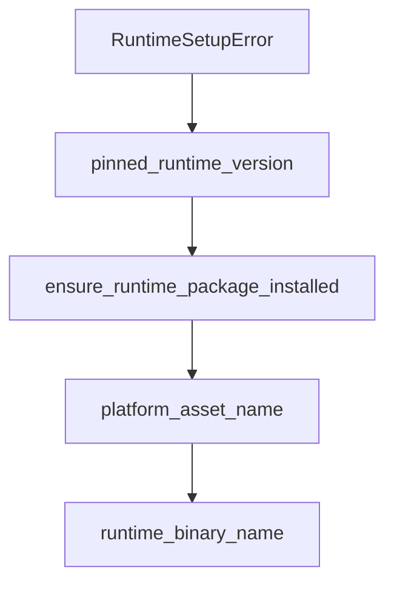

# Chapter 8: Contribution Workflow and Ecosystem Strategy

Welcome to **Chapter 8: Contribution Workflow and Ecosystem Strategy**. In this part of **Codex CLI Tutorial: Local Terminal Agent Workflows with OpenAI Codex**, you will build an intuitive mental model first, then move into concrete implementation details and practical production tradeoffs.


This chapter covers contributing to Codex and integrating ecosystem resources.

## Learning Goals

- follow Codex contribution standards
- align docs updates with feature changes
- contribute safely across Rust/CLI surfaces
- build an ecosystem strategy around MCP + terminal workflows

## Contribution Priorities

- keep changes narrowly scoped
- run required format/lint/test flows before PRs
- update docs whenever APIs or behavior change

## Source References

- [Codex Contributing Guide](https://github.com/openai/codex/blob/main/docs/contributing.md)
- [Codex Open Source Fund](https://github.com/openai/codex/blob/main/docs/open-source-fund.md)
- [Codex Repository](https://github.com/openai/codex)

## Summary

You now have a full Codex CLI learning path from first run to contributor workflows.

Next tutorial: [Chrome DevTools MCP Tutorial](../chrome-devtools-mcp-tutorial/)

## Source Code Walkthrough

### `sdk/python/_runtime_setup.py`

The `RuntimeSetupError` class in [`sdk/python/_runtime_setup.py`](https://github.com/openai/codex/blob/HEAD/sdk/python/_runtime_setup.py) handles a key part of this chapter's functionality:

```py


class RuntimeSetupError(RuntimeError):
    pass


def pinned_runtime_version() -> str:
    return PINNED_RUNTIME_VERSION


def ensure_runtime_package_installed(
    python_executable: str | Path,
    sdk_python_dir: Path,
    install_target: Path | None = None,
) -> str:
    requested_version = pinned_runtime_version()
    installed_version = None
    if install_target is None:
        installed_version = _installed_runtime_version(python_executable)
    normalized_requested = _normalized_package_version(requested_version)

    if installed_version is not None and _normalized_package_version(installed_version) == normalized_requested:
        return requested_version

    with tempfile.TemporaryDirectory(prefix="codex-python-runtime-") as temp_root_str:
        temp_root = Path(temp_root_str)
        archive_path = _download_release_archive(requested_version, temp_root)
        runtime_binary = _extract_runtime_binary(archive_path, temp_root)
        staged_runtime_dir = _stage_runtime_package(
            sdk_python_dir,
            requested_version,
            runtime_binary,
```

This class is important because it defines how Codex CLI Tutorial: Local Terminal Agent Workflows with OpenAI Codex implements the patterns covered in this chapter.

### `sdk/python/_runtime_setup.py`

The `pinned_runtime_version` function in [`sdk/python/_runtime_setup.py`](https://github.com/openai/codex/blob/HEAD/sdk/python/_runtime_setup.py) handles a key part of this chapter's functionality:

```py


def pinned_runtime_version() -> str:
    return PINNED_RUNTIME_VERSION


def ensure_runtime_package_installed(
    python_executable: str | Path,
    sdk_python_dir: Path,
    install_target: Path | None = None,
) -> str:
    requested_version = pinned_runtime_version()
    installed_version = None
    if install_target is None:
        installed_version = _installed_runtime_version(python_executable)
    normalized_requested = _normalized_package_version(requested_version)

    if installed_version is not None and _normalized_package_version(installed_version) == normalized_requested:
        return requested_version

    with tempfile.TemporaryDirectory(prefix="codex-python-runtime-") as temp_root_str:
        temp_root = Path(temp_root_str)
        archive_path = _download_release_archive(requested_version, temp_root)
        runtime_binary = _extract_runtime_binary(archive_path, temp_root)
        staged_runtime_dir = _stage_runtime_package(
            sdk_python_dir,
            requested_version,
            runtime_binary,
            temp_root / "runtime-stage",
        )
        _install_runtime_package(python_executable, staged_runtime_dir, install_target)

```

This function is important because it defines how Codex CLI Tutorial: Local Terminal Agent Workflows with OpenAI Codex implements the patterns covered in this chapter.

### `sdk/python/_runtime_setup.py`

The `ensure_runtime_package_installed` function in [`sdk/python/_runtime_setup.py`](https://github.com/openai/codex/blob/HEAD/sdk/python/_runtime_setup.py) handles a key part of this chapter's functionality:

```py


def ensure_runtime_package_installed(
    python_executable: str | Path,
    sdk_python_dir: Path,
    install_target: Path | None = None,
) -> str:
    requested_version = pinned_runtime_version()
    installed_version = None
    if install_target is None:
        installed_version = _installed_runtime_version(python_executable)
    normalized_requested = _normalized_package_version(requested_version)

    if installed_version is not None and _normalized_package_version(installed_version) == normalized_requested:
        return requested_version

    with tempfile.TemporaryDirectory(prefix="codex-python-runtime-") as temp_root_str:
        temp_root = Path(temp_root_str)
        archive_path = _download_release_archive(requested_version, temp_root)
        runtime_binary = _extract_runtime_binary(archive_path, temp_root)
        staged_runtime_dir = _stage_runtime_package(
            sdk_python_dir,
            requested_version,
            runtime_binary,
            temp_root / "runtime-stage",
        )
        _install_runtime_package(python_executable, staged_runtime_dir, install_target)

    if install_target is not None:
        return requested_version

    if Path(python_executable).resolve() == Path(sys.executable).resolve():
```

This function is important because it defines how Codex CLI Tutorial: Local Terminal Agent Workflows with OpenAI Codex implements the patterns covered in this chapter.

### `sdk/python/_runtime_setup.py`

The `platform_asset_name` function in [`sdk/python/_runtime_setup.py`](https://github.com/openai/codex/blob/HEAD/sdk/python/_runtime_setup.py) handles a key part of this chapter's functionality:

```py


def platform_asset_name() -> str:
    system = platform.system().lower()
    machine = platform.machine().lower()

    if system == "darwin":
        if machine in {"arm64", "aarch64"}:
            return "codex-aarch64-apple-darwin.tar.gz"
        if machine in {"x86_64", "amd64"}:
            return "codex-x86_64-apple-darwin.tar.gz"
    elif system == "linux":
        if machine in {"aarch64", "arm64"}:
            return "codex-aarch64-unknown-linux-musl.tar.gz"
        if machine in {"x86_64", "amd64"}:
            return "codex-x86_64-unknown-linux-musl.tar.gz"
    elif system == "windows":
        if machine in {"aarch64", "arm64"}:
            return "codex-aarch64-pc-windows-msvc.exe.zip"
        if machine in {"x86_64", "amd64"}:
            return "codex-x86_64-pc-windows-msvc.exe.zip"

    raise RuntimeSetupError(
        f"Unsupported runtime artifact platform: system={platform.system()!r}, "
        f"machine={platform.machine()!r}"
    )


def runtime_binary_name() -> str:
    return "codex.exe" if platform.system().lower() == "windows" else "codex"


```

This function is important because it defines how Codex CLI Tutorial: Local Terminal Agent Workflows with OpenAI Codex implements the patterns covered in this chapter.


## How These Components Connect


