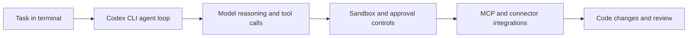

# Codex CLI Tutorial: Local Terminal Agent Workflows with OpenAI Codex

> Learn how to use `openai/codex` to run a lightweight coding agent locally, with strong controls for auth, configuration, MCP integration, and sandboxed execution.

## Why This Track Matters

Codex CLI provides a high-velocity local coding-agent loop in terminal-first workflows while keeping strong configuration and policy controls.

This track focuses on:

- installing and running Codex CLI quickly
- understanding local execution and agent control surfaces
- configuring auth, MCP, and sandbox settings safely
- operating Codex in team and production-adjacent workflows

## Current Snapshot (auto-updated)

- repository: [`openai/codex`](https://github.com/openai/codex)
- stars: about **60.0k**
- latest release: [`rust-v0.99.0`](https://github.com/openai/codex/releases/tag/rust-v0.99.0)
- recent activity: updates on **February 12, 2026**
- project positioning: lightweight terminal coding agent with local-first execution model

## Mental Model

## Chapter Guide

| Chapter | Key Question | Outcome |
|:--------|:-------------|:--------|
| [01 - Getting Started](01-getting-started.md) | How do I install and run Codex CLI quickly? | Working baseline |
| [02 - Architecture and Local Execution Model](02-architecture-and-local-execution-model.md) | How does Codex run locally and structure agent behavior? | Strong mental model |
| [03 - Authentication and Model Configuration](03-authentication-and-model-configuration.md) | How do I configure access and model settings safely? | Stable auth/config baseline |
| [04 - Sandbox, Approvals, and MCP Integration](04-sandbox-approvals-and-mcp-integration.md) | How do I control risk while extending capability? | Safer operation patterns |
| [05 - Prompts, Skills, and Workflow Orchestration](05-prompts-skills-and-workflow-orchestration.md) | How do I shape agent behavior for repeatable outcomes? | Better prompt/skill discipline |
| [06 - Commands, Connectors, and Daily Operations](06-commands-connectors-and-daily-operations.md) | How do I run Codex efficiently day-to-day? | Higher operator productivity |
| [07 - Advanced Configuration and Policy Controls](07-advanced-configuration-and-policy-controls.md) | How do teams standardize Codex behavior? | Team policy baseline |
| [08 - Contribution Workflow and Ecosystem Strategy](08-contribution-workflow-and-ecosystem-strategy.md) | How do contributors extend Codex responsibly? | Contributor readiness |

## What You Will Learn

- how to run Codex CLI in reliable local workflows
- how to configure auth, sandboxing, and MCP safely
- how to codify prompt/skill patterns for consistency
- how to contribute and operate Codex in team contexts

## Source References

- [Codex Repository](https://github.com/openai/codex)
- [Codex README](https://github.com/openai/codex/blob/main/README.md)
- [Codex Documentation](https://developers.openai.com/codex)
- [Codex Config Docs](https://developers.openai.com/codex/config-reference)
- [Codex Security Docs](https://developers.openai.com/codex/security)
- [Codex Contributing Docs](https://github.com/openai/codex/blob/main/docs/contributing.md)

## Related Tutorials

- [Claude Code Tutorial](../claude-code-tutorial/)
- [OpenCode Tutorial](../opencode-tutorial/)
- [Goose Tutorial](../goose-tutorial/)
- [MCP Servers Tutorial](../mcp-servers-tutorial/)

---

Start with [Chapter 1: Getting Started](01-getting-started.md).

## Navigation & Backlinks

- [Start Here: Chapter 1: Getting Started](01-getting-started.md)
- [Back to Main Catalog](../../README.md#-tutorial-catalog)
- [Browse A-Z Tutorial Directory](../../discoverability/tutorial-directory.md)
- [Search by Intent](../../discoverability/query-hub.md)
- [Explore Category Hubs](../../README.md#category-hubs)

## Full Chapter Map

1. [Chapter 1: Getting Started](01-getting-started.md)
2. [Chapter 2: Architecture and Local Execution Model](02-architecture-and-local-execution-model.md)
3. [Chapter 3: Authentication and Model Configuration](03-authentication-and-model-configuration.md)
4. [Chapter 4: Sandbox, Approvals, and MCP Integration](04-sandbox-approvals-and-mcp-integration.md)
5. [Chapter 5: Prompts, Skills, and Workflow Orchestration](05-prompts-skills-and-workflow-orchestration.md)
6. [Chapter 6: Commands, Connectors, and Daily Operations](06-commands-connectors-and-daily-operations.md)
7. [Chapter 7: Advanced Configuration and Policy Controls](07-advanced-configuration-and-policy-controls.md)
8. [Chapter 8: Contribution Workflow and Ecosystem Strategy](08-contribution-workflow-and-ecosystem-strategy.md)

*Generated by [AI Codebase Knowledge Builder](https://github.com/The-Pocket/Tutorial-Codebase-Knowledge)*
