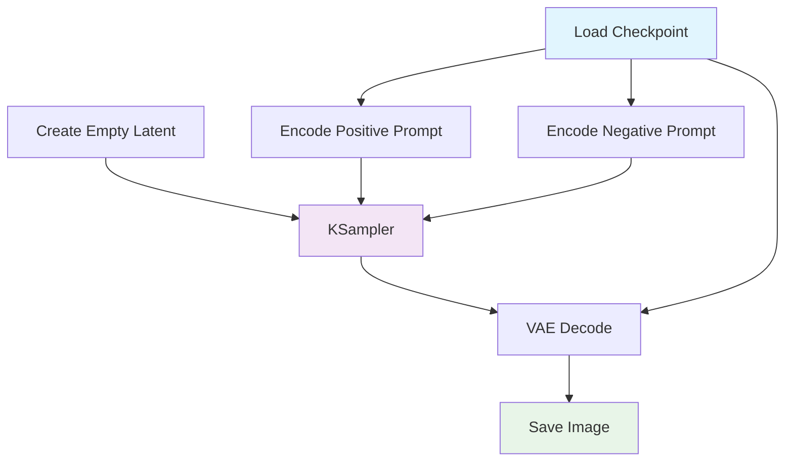

# Chapter 2: Understanding Nodes & Workflows

Welcome to **Chapter 2: Understanding Nodes & Workflows**. In this part of **ComfyUI Tutorial: Mastering AI Image Generation Workflows**, you will build an intuitive mental model first, then move into concrete implementation details and practical production tradeoffs.


Welcome back! Now that you have ComfyUI installed, let's dive into the core concepts that make it so powerful - nodes and workflows. Understanding these fundamentals will transform you from a ComfyUI user to a ComfyUI artist.

## The Node-Based Architecture

### What Are Nodes?

Nodes are the building blocks of ComfyUI workflows. Each node represents a specific function or operation:

```javascript
// Conceptual node structure
const TextInputNode = {
  id: "text_input_1",
  type: "CLIPTextEncode",
  properties: {
    text: "A beautiful landscape",
    clip: "CLIP model reference"
  },
  inputs: [],  // No inputs for text input
  outputs: ["CONDITIONING"]  // Outputs encoded text
};

const ImageGeneratorNode = {
  id: "image_generator_1",
  type: "KSampler",
  properties: {
    seed: 12345,
    steps: 20,
    cfg: 7.0,
    sampler_name: "euler",
    scheduler: "normal"
  },
  inputs: ["model", "positive", "negative", "latent_image"],
  outputs: ["LATENT"]  // Generated latent image
};
```

### Node Categories

#### Input Nodes
```javascript
// Load Checkpoint - Loads a Stable Diffusion model
const LoadCheckpointNode = {
  type: "CheckpointLoaderSimple",
  properties: { ckpt_name: "Realistic_Vision_V5.1.safetensors" },
  outputs: ["MODEL", "CLIP", "VAE"]
};

// CLIP Text Encode - Converts text to conditioning
const CLIPTextEncodeNode = {
  type: "CLIPTextEncode",
  properties: { text: "masterpiece, best quality, highly detailed" },
  inputs: ["clip"],
  outputs: ["CONDITIONING"]
};

// Empty Latent Image - Creates a blank canvas
const EmptyLatentImageNode = {
  type: "EmptyLatentImage",
  properties: { width: 1024, height: 1024, batch_size: 1 },
  outputs: ["LATENT"]
};
```

#### Processing Nodes
```javascript
// KSampler - The main image generation engine
const KSamplerNode = {
  type: "KSampler",
  properties: {
    seed: 12345,
    steps: 20,
    cfg: 8.0,
    sampler_name: "euler",
    scheduler: "normal",
    denoise: 1.0
  },
  inputs: ["model", "positive", "negative", "latent_image"],
  outputs: ["LATENT"]
};

// VAE Decode - Converts latent to pixel image
const VAEDecodeNode = {
  type: "VAEDecode",
  properties: {},
  inputs: ["samples", "vae"],
  outputs: ["IMAGE"]
};
```

#### Output Nodes
```javascript
// Save Image - Saves the final result
const SaveImageNode = {
  type: "SaveImage",
  properties: {
    filename_prefix: "ComfyUI",
    output_path: "./output"
  },
  inputs: ["images"]
};
```

## Building Your First Workflow

### Basic Text-to-Image Pipeline

Let's create a complete workflow from scratch:

```javascript
// Complete workflow configuration
const basicWorkflow = {
  nodes: [
    {
      id: "1",
      type: "CheckpointLoaderSimple",
      properties: { ckpt_name: "Realistic_Vision_V5.1.safetensors" }
    },
    {
      id: "2",
      type: "CLIPTextEncode",
      properties: { text: "a beautiful sunset over mountains" }
    },
    {
      id: "3",
      type: "CLIPTextEncode",
      properties: { text: "blurry, low quality, distorted" }
    },
    {
      id: "4",
      type: "EmptyLatentImage",
      properties: { width: 1024, height: 1024, batch_size: 1 }
    },
    {
      id: "5",
      type: "KSampler",
      properties: {
        seed: 12345,
        steps: 20,
        cfg: 7.0,
        sampler_name: "euler",
        scheduler: "normal"
      }
    },
    {
      id: "6",
      type: "VAEDecode",
      properties: {}
    },
    {
      id: "7",
      type: "SaveImage",
      properties: { filename_prefix: "ComfyUI_Basic" }
    }
  ],
  links: [
    ["1.MODEL", "5.model"],
    ["1.CLIP", "2.clip"],
    ["1.CLIP", "3.clip"],
    ["2.CONDITIONING", "5.positive"],
    ["3.CONDITIONING", "5.negative"],
    ["4.LATENT", "5.latent_image"],
    ["1.VAE", "6.vae"],
    ["5.LATENT", "6.samples"],
    ["6.IMAGE", "7.images"]
  ]
};
```

### Workflow Execution Flow



## Advanced Node Concepts

### Dynamic Connections

```javascript
// Nodes with multiple inputs/outputs
const ControlNetNode = {
  type: "ControlNetApply",
  properties: {
    strength: 0.8,
    start_percent: 0.0,
    end_percent: 1.0
  },
  inputs: ["conditioning", "control_net", "image"],
  outputs: ["conditioning"]
};

// Reroute nodes for cleaner layouts
const RerouteNode = {
  type: "Reroute",
  properties: {},
  inputs: ["input"],
  outputs: ["output"]
};
```

### Conditional Execution

```javascript
// Conditional workflows based on input
const ConditionalNode = {
  type: "ConditioningSetMask",
  properties: {
    mask_weight: 0.8,
    set_cond_area: "default"
  },
  inputs: ["conditioning", "mask"],
  outputs: ["conditioning"]
};
```

## Workflow Management

### Saving and Loading Workflows

```json
{
  "workflow": {
    "last_node_id": 7,
    "last_link_id": 8,
    "nodes": [...],
    "links": [...],
    "groups": [],
    "config": {},
    "extra": {},
    "version": 0.4
  }
}
```

### Workflow Templates

```javascript
// Reusable workflow templates
const PortraitWorkflow = {
  name: "Professional Portrait",
  description: "High-quality portrait generation workflow",
  nodes: [
    // Model loading nodes
    // Face enhancement nodes
    // Lighting adjustment nodes
    // Post-processing nodes
  ],
  tags: ["portrait", "professional", "face"]
};

const LandscapeWorkflow = {
  name: "Epic Landscape",
  description: "Wide-angle landscape generation",
  nodes: [
    // Wide aspect ratio setup
    // Depth of field effects
    // Atmospheric perspective
  ],
  tags: ["landscape", "wide", "nature"]
};
```

## Node Organization and Best Practices

### Color Coding System

```javascript
// Color-coded node categories
const nodeCategories = {
  input: { color: "#e1f5fe", nodes: ["LoadImage", "CheckpointLoaderSimple"] },
  processing: { color: "#f3e5f5", nodes: ["KSampler", "CLIPTextEncode"] },
  output: { color: "#e8f5e8", nodes: ["SaveImage", "PreviewImage"] },
  utility: { color: "#fff3e0", nodes: ["Reroute", "Note"] }
};
```

### Naming Conventions

```javascript
// Consistent node naming
const namingConvention = {
  checkpoint: "CKPT_{model_name}",
  clip_encode: "CLIP_Pos_{description}",
 ksampler: "KS_{sampler}_{steps}steps",
  vae_decode: "VAE_Decode_{model_name}",
  save: "SAVE_{filename_prefix}"
};
```

## Troubleshooting Common Issues

### Connection Errors

```javascript
// Common connection problems and solutions
const connectionIssues = {
  "Type mismatch": {
    problem: "Connecting incompatible node types",
    solution: "Check node documentation for correct input/output types",
    example: "VAE Decode requires LATENT input, not IMAGE"
  },

  "Missing dependencies": {
    problem: "Node requires another node that isn't connected",
    solution: "Ensure all required inputs are connected",
    example: "KSampler needs model, positive, negative, and latent_image"
  }
};
```

### Performance Issues

```javascript
// Optimizing workflow performance
const performanceTips = {
  "Batch processing": "Use higher batch_size for EmptyLatentImage",
  "Resolution optimization": "Start with lower resolution, upscale later",
  "Step reduction": "Use 15-25 steps for most workflows",
  "CFG optimization": "7.0-8.5 CFG works for most cases"
};
```

## Advanced Workflow Patterns

### Iterative Refinement

```javascript
// Multi-stage refinement workflow
const refinementWorkflow = {
  stages: [
    {
      name: "Base Generation",
      nodes: ["basic_generation_nodes"],
      quality: "draft"
    },
    {
      name: "Detail Enhancement",
      nodes: ["detail_enhancement_nodes"],
      quality: "standard"
    },
    {
      name: "Final Polish",
      nodes: ["polish_nodes"],
      quality: "final"
    }
  ]
};
```

### Conditional Branching

```javascript
// Workflows with conditional logic
const conditionalWorkflow = {
  decision_points: [
    {
      condition: "input_type === 'text'",
      true_path: ["text_to_image_nodes"],
      false_path: ["image_to_image_nodes"]
    }
  ]
};
```

## Custom Node Development

### Creating Custom Nodes

```python
# Basic custom node structure
class CustomNode:
    CATEGORY = "custom"
    FUNCTION = "process"

    @classmethod
    def INPUT_TYPES(cls):
        return {
            "required": {
                "image": ("IMAGE",),
                "strength": ("FLOAT", {"default": 1.0, "min": 0.0, "max": 1.0})
            }
        }

    RETURN_TYPES = ("IMAGE",)
    RETURN_NAMES = ("processed_image",)

    def process(self, image, strength):
        # Custom processing logic
        processed = self.apply_custom_effect(image, strength)
        return (processed,)
```

## What We've Accomplished

Fantastic! 🎨 You've mastered the fundamentals of ComfyUI:

1. **Node Architecture** - Understanding node types and connections
2. **Workflow Building** - Creating complete generation pipelines
3. **Advanced Concepts** - Dynamic connections and conditional execution
4. **Organization** - Color coding, naming conventions, and templates
5. **Troubleshooting** - Common issues and performance optimization
6. **Advanced Patterns** - Iterative refinement and custom development

## Next Steps

With a solid understanding of nodes and workflows, let's explore how to create stunning images with text-to-image generation techniques. In [Chapter 3: Text-to-Image Generation](03-text-to-image.md), we'll dive into prompt engineering, model selection, and advanced generation parameters.

---

**Practice what you've learned:**
1. Build a basic text-to-image workflow from scratch
2. Experiment with different node connections and arrangements
3. Create a template workflow for your favorite generation style
4. Troubleshoot a broken connection in an existing workflow

*What kind of workflow are you most excited to build?* 🎯

---

*Generated by [AI Codebase Knowledge Builder](https://github.com/The-Pocket/Tutorial-Codebase-Knowledge)*

## What Problem Does This Solve?

Most teams struggle here because the hard part is not writing more code, but deciding clear boundaries for `properties`, `nodes`, `inputs` so behavior stays predictable as complexity grows.

In practical terms, this chapter helps you avoid three common failures:

- coupling core logic too tightly to one implementation path
- missing the handoff boundaries between setup, execution, and validation
- shipping changes without clear rollback or observability strategy

After working through this chapter, you should be able to reason about `Chapter 2: Understanding Nodes & Workflows` as an operating subsystem inside **ComfyUI Tutorial: Mastering AI Image Generation Workflows**, with explicit contracts for inputs, state transitions, and outputs.

Use the implementation notes around `outputs`, `text`, `node` as your checklist when adapting these patterns to your own repository.

## How it Works Under the Hood

Under the hood, `Chapter 2: Understanding Nodes & Workflows` usually follows a repeatable control path:

1. **Context bootstrap**: initialize runtime config and prerequisites for `properties`.
2. **Input normalization**: shape incoming data so `nodes` receives stable contracts.
3. **Core execution**: run the main logic branch and propagate intermediate state through `inputs`.
4. **Policy and safety checks**: enforce limits, auth scopes, and failure boundaries.
5. **Output composition**: return canonical result payloads for downstream consumers.
6. **Operational telemetry**: emit logs/metrics needed for debugging and performance tuning.

When debugging, walk this sequence in order and confirm each stage has explicit success/failure conditions.

## Source Walkthrough

Use the following upstream sources to verify implementation details while reading this chapter:

- [View Repo](https://github.com/comfyanonymous/ComfyUI)
  Why it matters: authoritative reference on `View Repo` (github.com).

Suggested trace strategy:
- search upstream code for `properties` and `nodes` to map concrete implementation paths
- compare docs claims against actual runtime/config code before reusing patterns in production

## Chapter Connections

- [Tutorial Index](index.md)
- [Previous Chapter: Chapter 1: Getting Started with ComfyUI](01-getting-started.md)
- [Next Chapter: Chapter 3: Text-to-Image Generation](03-text-to-image.md)
- [Main Catalog](../../README.md#-tutorial-catalog)
- [A-Z Tutorial Directory](../../discoverability/tutorial-directory.md)
