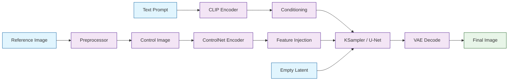
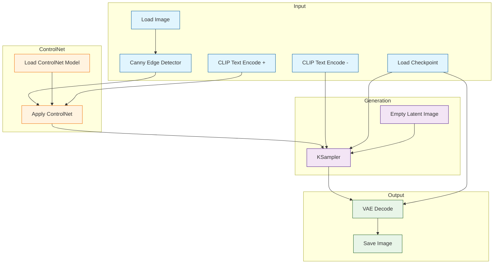
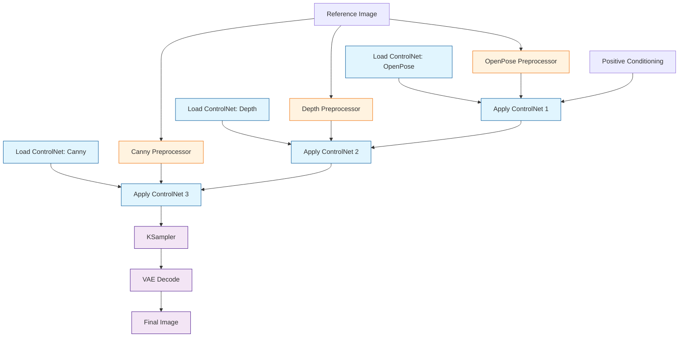

# Chapter 5: ControlNet & Pose Control

ControlNet is one of the most transformative additions to Stable Diffusion, and ComfyUI provides the ideal environment for harnessing its full potential. While standard text-to-image generation gives you control over *what* appears in an image, ControlNet gives you control over *how* it appears -- the composition, structure, pose, and spatial arrangement of every element. In this chapter, you will learn to integrate ControlNet models into your ComfyUI workflows, chain multiple control signals together, and fine-tune parameters for production-quality results.

## How ControlNet Works

ControlNet injects structural guidance into the diffusion process by conditioning the model on an additional input signal -- a control image derived from techniques such as edge detection, depth estimation, or pose extraction. The control image is processed through a parallel copy of the model's encoder, and the resulting features are added to the main U-Net at each resolution level.



### Key Concepts

| Concept | Description |
|---------|-------------|
| **Control Image** | A preprocessed image (edge map, depth map, pose skeleton) that guides generation |
| **Preprocessor** | An algorithm that extracts structural information from a reference image |
| **Strength** | How strongly the control signal influences the final output (0.0 to 1.0) |
| **Start/End Percent** | The portion of the diffusion process during which the control signal is active |
| **Multi-ControlNet** | Stacking multiple ControlNet models for layered structural guidance |

## Setting Up ControlNet in ComfyUI

### Step 1: Install Required Models

ControlNet models must be placed in the `models/controlnet/` directory. Each preprocessor type has a corresponding ControlNet model.

```bash
# Create the controlnet directory
mkdir -p ComfyUI/models/controlnet

# Download ControlNet models (example for SD 1.5)
# Place .safetensors or .pth files in models/controlnet/
# Common models:
#   control_v11p_sd15_openpose.safetensors
#   control_v11f1p_sd15_depth.safetensors
#   control_v11p_sd15_canny.safetensors
#   control_v11p_sd15_lineart.safetensors
#   control_v11p_sd15_scribble.safetensors

# For SDXL ControlNet models:
#   diffusers_xl_canny_full.safetensors
#   diffusers_xl_depth_full.safetensors
```

### Step 2: Install Preprocessor Nodes

The `comfyui_controlnet_aux` package provides all standard preprocessors.

```bash
# Install the ControlNet auxiliary preprocessors
cd ComfyUI/custom_nodes
git clone https://github.com/Fannovel16/comfyui_controlnet_aux.git
cd comfyui_controlnet_aux
pip install -r requirements.txt

# Restart ComfyUI to register the new nodes
```

### Step 3: Build the Basic ControlNet Workflow



## ControlNet Preprocessors

Each preprocessor extracts different structural information from a reference image. Choosing the right preprocessor is critical for achieving the desired control.

### Preprocessor Comparison

| Preprocessor | Use Case | Control Type | Best For |
|-------------|----------|--------------|----------|
| **Canny** | Edge detection | Hard edges | Architecture, mechanical objects |
| **Depth (MiDaS/Zoe)** | Depth estimation | Spatial depth | Landscapes, room layouts |
| **OpenPose** | Body pose | Human skeleton | Character poses, figure drawing |
| **Lineart** | Line extraction | Clean outlines | Illustrations, comics |
| **Scribble** | Rough sketches | Freeform outlines | Quick concept art |
| **SoftEdge (HED/PIDI)** | Soft edge detection | Gentle outlines | Organic shapes, portraits |
| **Normal Map** | Surface normals | 3D surface direction | Product renders, 3D integration |
| **Segmentation** | Semantic regions | Scene layout | Multi-object composition |
| **Shuffle** | Color/texture mixing | Style transfer | Maintaining color palettes |
| **IP-Adapter** | Image prompt | Visual similarity | Style and subject reference |

### Preprocessor Node Configuration

```python
# Canny Edge Detection
canny_config = {
    "node": "CannyEdgePreprocessor",
    "low_threshold": 100,    # Lower = more edges detected
    "high_threshold": 200,   # Higher = fewer, stronger edges
    "resolution": 512        # Processing resolution
}

# OpenPose Detection
openpose_config = {
    "node": "OpenposePreprocessor",
    "detect_hand": True,     # Include hand keypoints
    "detect_body": True,     # Include body keypoints
    "detect_face": True,     # Include face keypoints
    "resolution": 512
}

# Depth Estimation (MiDaS)
depth_config = {
    "node": "MiDaS-DepthMapPreprocessor",
    "a": 6.283,              # pi * 2, depth sensitivity
    "bg_threshold": 0.1,     # Background cutoff
    "resolution": 512
}

# Lineart Detection
lineart_config = {
    "node": "LineartPreprocessor",
    "coarse": False,         # False = fine lines, True = thick lines
    "resolution": 512
}
```

## Pose Control with OpenPose

OpenPose is the most popular ControlNet preprocessor for character work. It detects human body keypoints and generates a skeleton overlay that guides the diffusion model to reproduce exact poses.

### OpenPose Workflow

```python
# Complete OpenPose ControlNet workflow configuration
openpose_workflow = {
    "1": {
        "class_type": "LoadImage",
        "inputs": {
            "image": "reference_pose_photo.png"
        }
    },
    "2": {
        "class_type": "OpenposePreprocessor",
        "inputs": {
            "image": ["1", 0],
            "detect_hand": "enable",
            "detect_body": "enable",
            "detect_face": "enable",
            "resolution": 512
        }
    },
    "3": {
        "class_type": "ControlNetLoader",
        "inputs": {
            "control_net_name": "control_v11p_sd15_openpose.safetensors"
        }
    },
    "4": {
        "class_type": "CheckpointLoaderSimple",
        "inputs": {
            "ckpt_name": "dreamshaper_8.safetensors"
        }
    },
    "5": {
        "class_type": "CLIPTextEncode",
        "inputs": {
            "text": "a warrior in full armor, standing heroically, fantasy art, highly detailed",
            "clip": ["4", 1]
        }
    },
    "6": {
        "class_type": "CLIPTextEncode",
        "inputs": {
            "text": "blurry, low quality, deformed, extra limbs",
            "clip": ["4", 1]
        }
    },
    "7": {
        "class_type": "ControlNetApply",
        "inputs": {
            "conditioning": ["5", 0],
            "control_net": ["3", 0],
            "image": ["2", 0],
            "strength": 0.85
        }
    },
    "8": {
        "class_type": "EmptyLatentImage",
        "inputs": {
            "width": 512,
            "height": 768,
            "batch_size": 1
        }
    },
    "9": {
        "class_type": "KSampler",
        "inputs": {
            "model": ["4", 0],
            "positive": ["7", 0],
            "negative": ["6", 0],
            "latent_image": ["8", 0],
            "seed": 42,
            "steps": 30,
            "cfg": 7.5,
            "sampler_name": "euler_ancestral",
            "scheduler": "karras",
            "denoise": 1.0
        }
    },
    "10": {
        "class_type": "VAEDecode",
        "inputs": {
            "samples": ["9", 0],
            "vae": ["4", 2]
        }
    },
    "11": {
        "class_type": "SaveImage",
        "inputs": {
            "images": ["10", 0],
            "filename_prefix": "openpose_output"
        }
    }
}
```

### Pose Keypoint Reference

| Keypoint Group | Points | Description |
|---------------|--------|-------------|
| **Body** | 18 points | Nose, neck, shoulders, elbows, wrists, hips, knees, ankles |
| **Hands** | 21 per hand | Fingertips, knuckles, palm center |
| **Face** | 70 points | Eyes, nose, mouth, jawline, eyebrows |
| **Foot** | 3 per foot | Heel, toe, ankle |

## Advanced Control Techniques

### Multi-ControlNet Stacking

You can combine multiple ControlNet models to achieve layered control -- for example, using OpenPose for body pose and Depth for scene composition simultaneously.



```python
# Multi-ControlNet configuration
# Each ControlNet is applied sequentially, chaining the conditioning output

# First ControlNet: OpenPose for body structure
controlnet_1 = {
    "class_type": "ControlNetApply",
    "inputs": {
        "conditioning": ["positive_clip", 0],
        "control_net": ["openpose_model", 0],
        "image": ["openpose_image", 0],
        "strength": 0.9   # Strong pose adherence
    }
}

# Second ControlNet: Depth for spatial composition
controlnet_2 = {
    "class_type": "ControlNetApply",
    "inputs": {
        "conditioning": ["controlnet_1", 0],  # Chain from first
        "control_net": ["depth_model", 0],
        "image": ["depth_image", 0],
        "strength": 0.6   # Moderate depth guidance
    }
}

# Third ControlNet: Canny for fine edge detail
controlnet_3 = {
    "class_type": "ControlNetApply",
    "inputs": {
        "conditioning": ["controlnet_2", 0],  # Chain from second
        "control_net": ["canny_model", 0],
        "image": ["canny_image", 0],
        "strength": 0.4   # Subtle edge hints
    }
}
```

### Control Strength and Timing

Fine-tuning when and how strongly ControlNet influences the generation is essential for natural-looking results.

```python
# ControlNet Advanced Apply node provides timing control
advanced_controlnet = {
    "class_type": "ControlNetApplyAdvanced",
    "inputs": {
        "positive": ["clip_positive", 0],
        "negative": ["clip_negative", 0],
        "control_net": ["controlnet_model", 0],
        "image": ["preprocessed_image", 0],
        "strength": 0.8,
        "start_percent": 0.0,   # Begin control at step 0%
        "end_percent": 0.8      # Release control at step 80%
    }
}
```

| Strength | Start % | End % | Effect |
|----------|---------|-------|--------|
| 1.0 | 0.0 | 1.0 | Maximum control, strict adherence throughout |
| 0.8 | 0.0 | 0.8 | Strong structure, natural fine details |
| 0.5 | 0.0 | 0.5 | Loose guidance, high creative freedom |
| 0.7 | 0.2 | 0.9 | Skip initial noise layout, control mid-process |
| 1.0 | 0.0 | 0.4 | Lock in composition early, free detail phase |

**Best practices for timing:**

- **Ending early (end_percent < 1.0):** Lets the model add natural details without rigid constraint in the final steps. This often produces more photorealistic results.
- **Starting late (start_percent > 0.0):** Allows the model to establish its own global composition before structural control kicks in. Useful when the control image is a rough approximation.
- **Strength below 0.5:** The control signal becomes a gentle suggestion rather than a constraint. Combine with high CFG for best results.

### ControlNet with Image-to-Image

ControlNet can be combined with img2img workflows for guided modifications of existing images.

```python
# ControlNet + img2img workflow
controlnet_img2img = {
    "load_image": {
        "class_type": "LoadImage",
        "inputs": {"image": "source_photo.png"}
    },
    "encode_source": {
        "class_type": "VAEEncode",
        "inputs": {
            "pixels": ["load_image", 0],
            "vae": ["checkpoint", 2]
        }
    },
    "preprocess": {
        "class_type": "CannyEdgePreprocessor",
        "inputs": {
            "image": ["load_image", 0],
            "low_threshold": 100,
            "high_threshold": 200
        }
    },
    "apply_controlnet": {
        "class_type": "ControlNetApply",
        "inputs": {
            "conditioning": ["positive_prompt", 0],
            "control_net": ["canny_controlnet", 0],
            "image": ["preprocess", 0],
            "strength": 0.75
        }
    },
    "sampler": {
        "class_type": "KSampler",
        "inputs": {
            "model": ["checkpoint", 0],
            "positive": ["apply_controlnet", 0],
            "negative": ["negative_prompt", 0],
            "latent_image": ["encode_source", 0],  # Use encoded source
            "denoise": 0.65,  # Partial denoise to retain source structure
            "steps": 25,
            "cfg": 7.0,
            "sampler_name": "euler",
            "scheduler": "karras"
        }
    }
}
```

## ControlNet for SDXL

SDXL ControlNet models work similarly but require SDXL-specific model files and typically operate at higher resolutions.

```python
# SDXL ControlNet workflow differences
sdxl_controlnet = {
    "checkpoint": {
        "class_type": "CheckpointLoaderSimple",
        "inputs": {"ckpt_name": "sd_xl_base_1.0.safetensors"}
    },
    "controlnet_model": {
        "class_type": "ControlNetLoader",
        "inputs": {"control_net_name": "diffusers_xl_canny_full.safetensors"}
    },
    "latent": {
        "class_type": "EmptyLatentImage",
        "inputs": {
            "width": 1024,   # SDXL native resolution
            "height": 1024,
            "batch_size": 1
        }
    },
    "preprocessor": {
        "class_type": "CannyEdgePreprocessor",
        "inputs": {
            "image": ["reference_image", 0],
            "low_threshold": 100,
            "high_threshold": 200,
            "resolution": 1024  # Match SDXL resolution
        }
    }
}
```

### SD 1.5 vs. SDXL ControlNet Comparison

| Feature | SD 1.5 ControlNet | SDXL ControlNet |
|---------|-------------------|-----------------|
| **Resolution** | 512x512 native | 1024x1024 native |
| **Model Size** | ~700 MB | ~2.5 GB |
| **VRAM Required** | ~4 GB | ~8 GB |
| **Available Models** | Extensive (11+ types) | Growing (5-6 types) |
| **Quality** | Good | Excellent |
| **Speed** | Fast | Moderate |
| **Community Support** | Mature | Rapidly expanding |

## Practical Recipes

### Recipe 1: Architecture Preservation

Maintain the exact structure of a building while changing its style.

```python
# Use Canny with high strength + Depth for 3D consistency
architecture_recipe = {
    "canny_strength": 0.95,       # Near-exact edge preservation
    "canny_start": 0.0,
    "canny_end": 1.0,
    "depth_strength": 0.6,        # Moderate 3D guidance
    "depth_start": 0.0,
    "depth_end": 0.7,
    "prompt": "gothic cathedral, dark fantasy style, dramatic lighting, 8k",
    "negative": "modern, contemporary, bright, cheerful",
    "steps": 30,
    "cfg": 8.0,
    "sampler": "dpm_2_ancestral",
    "scheduler": "karras"
}
```

### Recipe 2: Character Pose Transfer

Apply a specific pose from a reference photo to a generated character.

```python
# OpenPose with face and hand detection
pose_transfer_recipe = {
    "openpose_strength": 0.85,
    "detect_body": True,
    "detect_hand": True,
    "detect_face": True,
    "prompt": "anime girl in school uniform, cherry blossoms, spring, high quality",
    "negative": "realistic, photo, deformed hands, extra fingers",
    "steps": 25,
    "cfg": 7.0,
    "sampler": "euler_ancestral",
    "scheduler": "normal"
}
```

### Recipe 3: Depth-Guided Landscapes

Generate landscapes that match the spatial composition of a reference.

```python
# Depth map for spatial consistency
landscape_recipe = {
    "depth_strength": 0.7,
    "depth_start": 0.0,
    "depth_end": 0.85,
    "prompt": "alien planet landscape, bioluminescent plants, two moons, sci-fi concept art",
    "negative": "earth, realistic, mundane, urban",
    "steps": 35,
    "cfg": 9.0,
    "sampler": "dpm_2",
    "scheduler": "karras"
}
```

## Troubleshooting ControlNet

| Problem | Cause | Solution |
|---------|-------|----------|
| ControlNet has no effect | Wrong model/preprocessor pairing | Verify the ControlNet model matches the preprocessor type |
| Output looks distorted | Strength too high | Reduce strength to 0.6-0.8 and set end_percent to 0.8 |
| Poses are inaccurate | Low-quality pose detection | Use higher-resolution input images; enable hand/face detection |
| Out of memory with multi-ControlNet | Too many models loaded | Use model unloading; reduce resolution; apply one at a time |
| Control image resolution mismatch | Preprocessor and latent size differ | Set preprocessor resolution to match your Empty Latent Image dimensions |
| SDXL ControlNet not loading | Wrong model version | Ensure you are using SDXL-specific ControlNet models, not SD 1.5 |

## Summary

ControlNet transforms ComfyUI from a text-driven image generator into a precision composition tool. By injecting structural signals -- edges, depth, poses, and more -- into the diffusion process, you gain direct control over the spatial layout and form of your generated images. Mastering preprocessor selection, strength tuning, and multi-ControlNet stacking unlocks workflows that rival professional concept art pipelines.

## Key Takeaways

1. **ControlNet adds structural guidance** to the diffusion process through parallel encoder feature injection.
2. **Preprocessor choice matters** -- Canny for hard edges, Depth for spatial layout, OpenPose for character poses, Lineart for illustrations.
3. **Strength and timing (start/end percent)** are your primary levers for balancing control precision with creative freedom.
4. **Multi-ControlNet stacking** allows layered control (e.g., pose + depth + edge simultaneously) with decreasing strength for each additional layer.
5. **End the control signal early** (end_percent 0.7-0.8) for more natural, photorealistic results.
6. **SDXL ControlNet** requires SDXL-specific models and higher resolution but produces superior output.

## Next Steps

With ControlNet mastered, you can precisely control the structure and composition of your generated images. In the next chapter, we will explore LoRA models and model customization -- learning how to fine-tune generation style, add specific characters or concepts, and stack multiple LoRA adapters for unique artistic results.

**Continue to [Chapter 6: LoRA & Model Customization](06-lora-customization.md)**

---

*Built with insights from the [ComfyUI](https://github.com/comfyanonymous/ComfyUI) project.*
