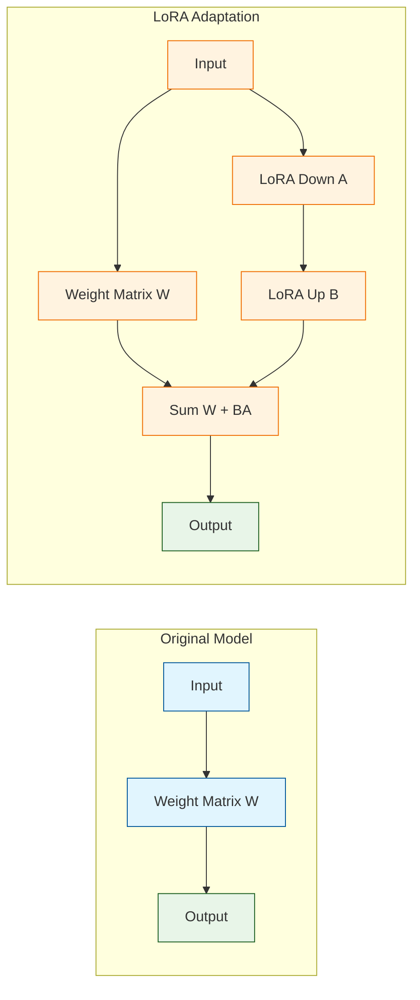
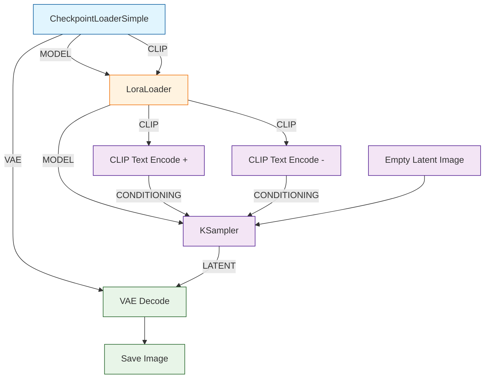
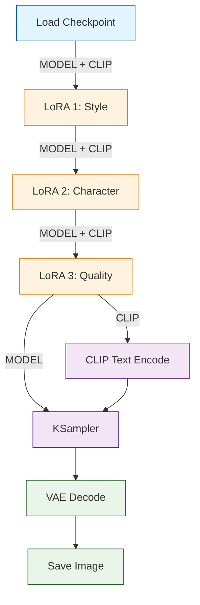
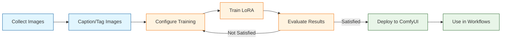

# Chapter 6: LoRA & Model Customization

Welcome to **Chapter 6: LoRA & Model Customization**. In this part of **ComfyUI Tutorial: Mastering AI Image Generation Workflows**, you will build an intuitive mental model first, then move into concrete implementation details and practical production tradeoffs.


LoRA (Low-Rank Adaptation) is one of the most powerful techniques for customizing Stable Diffusion models without the enormous cost of full fine-tuning. A LoRA is a small adapter -- typically 10-200 MB compared to a multi-gigabyte base model -- that modifies the behavior of the diffusion model to produce images in a specific style, depict a particular character, or render a learned concept. ComfyUI's node-based architecture makes it exceptionally easy to load, combine, and tune LoRA models within your generation workflows. In this chapter, you will learn how LoRA works, how to integrate LoRA adapters in ComfyUI, how to train your own LoRAs, and how to stack multiple adapters for sophisticated creative control.

## How LoRA Works

LoRA modifies a pre-trained model by injecting small, trainable rank-decomposition matrices into the attention layers of the U-Net (and optionally the text encoder). Instead of updating the full weight matrix **W** during fine-tuning, LoRA learns two smaller matrices **A** and **B** such that the adapted weight becomes **W + BA**. This dramatically reduces the number of trainable parameters while preserving the model's general capabilities.



### Key LoRA Concepts

| Concept | Description |
|---------|-------------|
| **Rank** | The dimensionality of the LoRA matrices (4, 8, 16, 32, 64, 128). Higher rank = more capacity but larger file |
| **Alpha** | A scaling factor applied to the LoRA output. Common convention is alpha = rank |
| **Strength (Model)** | How strongly the LoRA affects the U-Net diffusion model (0.0 to 2.0) |
| **Strength (CLIP)** | How strongly the LoRA affects text encoding (0.0 to 2.0) |
| **Network Dimension** | Synonym for rank in many training scripts |
| **Trigger Word** | A special token that activates the LoRA's learned concept in a prompt |

## Loading LoRAs in ComfyUI

### Basic LoRA Workflow

The `LoraLoader` node takes a base model and CLIP encoder as input, applies the LoRA adaptation, and outputs the modified model and CLIP.



### LoRA Loader Configuration

```python
# Basic LoRA loading in ComfyUI workflow JSON
lora_workflow = {
    "1": {
        "class_type": "CheckpointLoaderSimple",
        "inputs": {
            "ckpt_name": "sd_xl_base_1.0.safetensors"
        }
    },
    "2": {
        "class_type": "LoraLoader",
        "inputs": {
            "model": ["1", 0],
            "clip": ["1", 1],
            "lora_name": "pixel_art_style.safetensors",
            "strength_model": 0.8,    # How much the LoRA affects image generation
            "strength_clip": 0.8      # How much the LoRA affects text understanding
        }
    },
    "3": {
        "class_type": "CLIPTextEncode",
        "inputs": {
            "text": "pixel art style, a medieval castle on a hilltop, sunset, vibrant colors",
            "clip": ["2", 1]         # Use LoRA-modified CLIP
        }
    },
    "4": {
        "class_type": "CLIPTextEncode",
        "inputs": {
            "text": "blurry, realistic, photo, 3d render",
            "clip": ["2", 1]
        }
    },
    "5": {
        "class_type": "EmptyLatentImage",
        "inputs": {
            "width": 1024,
            "height": 1024,
            "batch_size": 1
        }
    },
    "6": {
        "class_type": "KSampler",
        "inputs": {
            "model": ["2", 0],       # Use LoRA-modified model
            "positive": ["3", 0],
            "negative": ["4", 0],
            "latent_image": ["5", 0],
            "seed": 42,
            "steps": 25,
            "cfg": 7.0,
            "sampler_name": "euler_ancestral",
            "scheduler": "karras",
            "denoise": 1.0
        }
    },
    "7": {
        "class_type": "VAEDecode",
        "inputs": {
            "samples": ["6", 0],
            "vae": ["1", 2]
        }
    },
    "8": {
        "class_type": "SaveImage",
        "inputs": {
            "images": ["7", 0],
            "filename_prefix": "lora_output"
        }
    }
}
```

## Stacking Multiple LoRAs

One of ComfyUI's greatest strengths is the ability to chain multiple LoRA loaders in sequence, blending different styles, characters, and quality enhancements in a single generation.



```python
# Stacking three LoRAs sequentially
multi_lora_config = {
    "lora_1_style": {
        "class_type": "LoraLoader",
        "inputs": {
            "model": ["checkpoint", 0],
            "clip": ["checkpoint", 1],
            "lora_name": "watercolor_style.safetensors",
            "strength_model": 0.7,
            "strength_clip": 0.7
        }
    },
    "lora_2_character": {
        "class_type": "LoraLoader",
        "inputs": {
            "model": ["lora_1_style", 0],    # Chain from LoRA 1
            "clip": ["lora_1_style", 1],
            "lora_name": "fantasy_elf_character.safetensors",
            "strength_model": 0.85,
            "strength_clip": 0.85
        }
    },
    "lora_3_quality": {
        "class_type": "LoraLoader",
        "inputs": {
            "model": ["lora_2_character", 0], # Chain from LoRA 2
            "clip": ["lora_2_character", 1],
            "lora_name": "add_detail_enhancement.safetensors",
            "strength_model": 0.5,
            "strength_clip": 0.3
        }
    }
}
```

### LoRA Stacking Best Practices

| Guideline | Recommendation |
|-----------|---------------|
| **Maximum LoRAs** | Stack no more than 3-4 LoRAs to avoid quality degradation |
| **Total strength** | Keep combined model strengths below 2.0 total |
| **Order matters** | Load style LoRAs first, then subject, then quality enhancers |
| **CLIP vs. Model strength** | Reduce CLIP strength for detail/quality LoRAs; keep it matched for style LoRAs |
| **Conflicting LoRAs** | Avoid stacking LoRAs that target the same concept (e.g., two competing style LoRAs) |
| **Test incrementally** | Add one LoRA at a time, evaluate, then add the next |

### Strength Tuning Guide

```python
# Recommended strength ranges by LoRA type
strength_guide = {
    "style_lora": {
        "strength_model": (0.5, 0.9),    # Range: moderate to strong
        "strength_clip": (0.5, 0.9),
        "notes": "Match model and CLIP for consistent style"
    },
    "character_lora": {
        "strength_model": (0.7, 1.0),    # Needs strong model presence
        "strength_clip": (0.7, 1.0),
        "notes": "Use trigger word in prompt for best activation"
    },
    "concept_lora": {
        "strength_model": (0.6, 0.9),
        "strength_clip": (0.6, 0.9),
        "notes": "Adjust based on how recognizable the concept needs to be"
    },
    "quality_lora": {
        "strength_model": (0.3, 0.6),    # Subtle enhancement only
        "strength_clip": (0.1, 0.4),
        "notes": "Lower CLIP strength to avoid overriding prompt interpretation"
    },
    "pose_lora": {
        "strength_model": (0.5, 0.8),
        "strength_clip": (0.3, 0.6),
        "notes": "Combine with ControlNet for best pose results"
    }
}
```

## LoRA Model Management

### Directory Structure

```bash
ComfyUI/
  models/
    loras/
      styles/
        watercolor_style.safetensors
        anime_flat_color.safetensors
        oil_painting.safetensors
      characters/
        fantasy_elf.safetensors
        cyberpunk_girl.safetensors
      quality/
        add_detail.safetensors
        sharp_focus.safetensors
      concepts/
        glowing_effects.safetensors
        particle_fx.safetensors
```

### Finding and Evaluating LoRAs

| Source | URL | Notes |
|--------|-----|-------|
| **Civitai** | civitai.com | Largest community library, ratings, example images |
| **Hugging Face** | huggingface.co | Research-grade LoRAs, model cards with training details |
| **GitHub** | github.com | Open-source LoRA training repos and pre-trained weights |

When evaluating a LoRA before downloading, check:

1. **Training images** -- Do they match your desired output?
2. **Trigger words** -- Note any special tokens required in your prompt.
3. **Base model** -- Ensure the LoRA was trained on a compatible base (SD 1.5, SDXL, etc.).
4. **Recommended strength** -- Many authors specify optimal strength values.
5. **File format** -- Prefer `.safetensors` over `.ckpt` for security.

## Training Your Own LoRA

Training a custom LoRA lets you teach the model new concepts, characters, or styles from your own images. While ComfyUI itself does not include training functionality, several companion tools integrate seamlessly.

### Training Pipeline Overview



### Step 1: Prepare Training Data

```python
# Dataset preparation requirements
dataset_requirements = {
    "image_count": "10-50 images for characters, 50-200 for styles",
    "resolution": "At least 512x512, ideally matching target resolution",
    "diversity": "Vary angles, lighting, backgrounds for character LoRAs",
    "quality": "High quality, no watermarks, consistent subject",
    "format": "PNG or high-quality JPEG"
}

# Directory structure for training data
# training_data/
#   img/
#     001.png
#     002.png
#     ...
#   captions/          (optional if using auto-captioning)
#     001.txt
#     002.txt
#     ...
```

### Step 2: Caption Your Images

Accurate captions are critical for high-quality LoRA training. Each image needs a text file describing its content.

```python
# Auto-captioning with BLIP or WD14 tagger
# Using the kohya_ss training GUI:

captioning_config = {
    "method": "BLIP",             # or "WD14" for anime/illustration
    "prefix": "ohwx person",     # Trigger word prefix
    "caption_extension": ".txt",
    "batch_size": 8,
    "max_length": 75,            # Token limit
    "min_length": 10
}

# Example caption file (001.txt):
# "ohwx person, a woman with red hair, standing in a garden,
#  wearing a blue dress, sunny day, professional photo"

# Tips for effective captions:
# - Always include your trigger word at the beginning
# - Describe what varies between images (pose, clothing, setting)
# - Do NOT describe what stays constant (the subject's identity)
# - Be specific about art style, lighting, and composition
```

### Step 3: Configure Training

```python
# kohya_ss LoRA training configuration
training_config = {
    # Model settings
    "pretrained_model_name_or_path": "stabilityai/stable-diffusion-xl-base-1.0",
    "v2": False,
    "v_parameterization": False,

    # Dataset settings
    "train_data_dir": "/path/to/training_data",
    "resolution": "1024,1024",
    "enable_bucket": True,           # Allow mixed aspect ratios
    "min_bucket_reso": 256,
    "max_bucket_reso": 2048,
    "bucket_reso_steps": 64,

    # Training hyperparameters
    "learning_rate": 1e-4,           # 1e-4 for SDXL, 5e-5 for SD 1.5
    "lr_scheduler": "cosine",
    "lr_warmup_steps": 100,
    "train_batch_size": 2,
    "max_train_epochs": 20,
    "save_every_n_epochs": 5,

    # LoRA-specific settings
    "network_module": "networks.lora",
    "network_dim": 32,               # Rank (8, 16, 32, 64, 128)
    "network_alpha": 16,             # Alpha (typically rank/2 or rank)
    "network_train_unet_only": False, # Also train text encoder

    # Optimization
    "optimizer_type": "AdamW8bit",   # Memory-efficient optimizer
    "mixed_precision": "fp16",
    "gradient_checkpointing": True,
    "xformers": True,

    # Regularization
    "noise_offset": 0.1,
    "prior_loss_weight": 1.0,

    # Output
    "output_dir": "/path/to/output",
    "output_name": "my_custom_lora",
    "save_model_as": "safetensors"
}
```

### Step 4: Run Training

```bash
# Using kohya_ss scripts
accelerate launch \
  --num_cpu_threads_per_process 1 \
  train_network.py \
  --pretrained_model_name_or_path="stabilityai/stable-diffusion-xl-base-1.0" \
  --train_data_dir="/path/to/training_data" \
  --output_dir="/path/to/output" \
  --output_name="my_custom_lora" \
  --save_model_as=safetensors \
  --network_module=networks.lora \
  --network_dim=32 \
  --network_alpha=16 \
  --learning_rate=1e-4 \
  --lr_scheduler=cosine \
  --lr_warmup_steps=100 \
  --train_batch_size=2 \
  --max_train_epochs=20 \
  --mixed_precision=fp16 \
  --optimizer_type=AdamW8bit \
  --xformers \
  --gradient_checkpointing \
  --noise_offset=0.1 \
  --save_every_n_epochs=5 \
  --resolution=1024 \
  --enable_bucket
```

### Step 5: Evaluate and Iterate

```python
# Evaluation checklist for trained LoRA
evaluation = {
    "trigger_word_test": "Generate with and without trigger word to verify activation",
    "strength_sweep": "Test at 0.3, 0.5, 0.7, 0.9, 1.0 to find optimal range",
    "style_transfer": "Try various subjects to ensure style generalizes",
    "overfitting_check": "Verify model still responds to diverse prompts",
    "compatibility": "Test with different base models and other LoRAs"
}
```

### Training Hyperparameter Reference

| Parameter | SD 1.5 | SDXL | Effect |
|-----------|--------|------|--------|
| **Learning Rate** | 5e-5 to 1e-4 | 1e-4 to 5e-4 | Higher = faster learning, risk of overfitting |
| **Network Dim (Rank)** | 8-32 | 16-64 | Higher = more capacity, larger file |
| **Network Alpha** | rank/2 to rank | rank/2 to rank | Scales LoRA output; lower = more subtle |
| **Epochs** | 10-30 | 10-20 | More = stronger learning, risk of overfitting |
| **Batch Size** | 2-4 | 1-2 | Higher = more stable but more VRAM |
| **Resolution** | 512 | 1024 | Must match base model training resolution |
| **Noise Offset** | 0.05-0.1 | 0.05-0.1 | Improves contrast and dynamic range |

## Advanced LoRA Techniques

### LoRA + ControlNet Combination

Combine LoRA style adaptation with ControlNet structural control for precise, stylized outputs.

```python
# LoRA + ControlNet workflow
lora_controlnet_workflow = {
    "checkpoint": {
        "class_type": "CheckpointLoaderSimple",
        "inputs": {"ckpt_name": "dreamshaper_8.safetensors"}
    },
    "lora": {
        "class_type": "LoraLoader",
        "inputs": {
            "model": ["checkpoint", 0],
            "clip": ["checkpoint", 1],
            "lora_name": "watercolor_style.safetensors",
            "strength_model": 0.75,
            "strength_clip": 0.75
        }
    },
    "controlnet_model": {
        "class_type": "ControlNetLoader",
        "inputs": {"control_net_name": "control_v11p_sd15_canny.safetensors"}
    },
    "positive_prompt": {
        "class_type": "CLIPTextEncode",
        "inputs": {
            "text": "watercolor painting of a Japanese garden, cherry blossoms, koi pond",
            "clip": ["lora", 1]  # LoRA-modified CLIP
        }
    },
    "apply_controlnet": {
        "class_type": "ControlNetApply",
        "inputs": {
            "conditioning": ["positive_prompt", 0],
            "control_net": ["controlnet_model", 0],
            "image": ["canny_preprocessed", 0],
            "strength": 0.7
        }
    },
    "sampler": {
        "class_type": "KSampler",
        "inputs": {
            "model": ["lora", 0],  # LoRA-modified model
            "positive": ["apply_controlnet", 0],
            "negative": ["negative_prompt", 0],
            "latent_image": ["empty_latent", 0],
            "steps": 30,
            "cfg": 7.5,
            "sampler_name": "euler_ancestral",
            "scheduler": "karras",
            "denoise": 1.0
        }
    }
}
```

### Dynamic LoRA Strength with Prompt Scheduling

Use the `LoraLoaderModelOnly` node or custom scheduling to vary LoRA influence across the generation process.

```python
# Varying LoRA strength across steps using ModelMergeBlocks
# This technique applies different LoRA strengths to different U-Net blocks

block_weights = {
    "input_blocks": [0.5, 0.5, 0.5, 0.6, 0.7, 0.8, 0.9, 0.9, 1.0, 1.0, 1.0, 1.0],
    "middle_block": [1.0],
    "output_blocks": [1.0, 1.0, 1.0, 1.0, 0.9, 0.9, 0.8, 0.7, 0.6, 0.5, 0.5, 0.5],
    "effect": "Strong LoRA in middle layers (composition), weak in outer layers (detail)"
}
```

### Converting and Merging LoRAs

```python
# Merge multiple LoRAs into a single file for faster loading
# Using the merge script from kohya_ss

merge_config = {
    "models": [
        {"path": "style_lora.safetensors", "ratio": 0.6},
        {"path": "quality_lora.safetensors", "ratio": 0.4}
    ],
    "output": "merged_style_quality.safetensors",
    "precision": "fp16",
    "save_as": "safetensors"
}

# Benefits of merging:
# - Single file to load instead of chaining multiple LoRA nodes
# - Faster workflow execution
# - Locked-in ratio (no accidental strength changes)

# Drawbacks:
# - Cannot adjust individual ratios after merging
# - Merged file is permanently combined
```

## Troubleshooting LoRA Issues

| Problem | Cause | Solution |
|---------|-------|----------|
| LoRA has no visible effect | Strength too low or wrong trigger word | Increase strength to 0.8+; add trigger word to prompt |
| Image quality degrades | Strength too high or incompatible base model | Lower strength; verify LoRA was trained on the same base |
| Colors look washed out | CLIP strength too high | Reduce CLIP strength to 0.5-0.7 |
| Overfitting artifacts | LoRA overtrained | Use earlier checkpoint; reduce strength |
| Multiple LoRAs conflict | Overlapping learned concepts | Reduce strengths; change stacking order; test individually |
| LoRA file not appearing | Wrong directory or format | Place in `models/loras/`; use `.safetensors` format |
| Out of memory | Too many LoRAs loaded | Reduce count; merge LoRAs; enable model offloading |

## Summary

LoRA adapters are the most efficient way to customize Stable Diffusion models in ComfyUI. By learning small rank-decomposition matrices, LoRAs can encode entirely new styles, characters, and concepts in files that are a fraction of the base model's size. ComfyUI's chaining architecture makes it trivial to stack multiple LoRAs, combine them with ControlNet, and fine-tune their influence through model and CLIP strength parameters. Training your own LoRAs with tools like kohya_ss opens the door to truly personalized AI art pipelines.

## Key Takeaways

1. **LoRA is parameter-efficient fine-tuning** -- small adapter files (10-200 MB) that modify model behavior without changing the base weights.
2. **Two strength parameters** control LoRA influence: `strength_model` (U-Net/generation) and `strength_clip` (text understanding).
3. **Stacking LoRAs** lets you layer style, character, and quality adapters, but keep total combined strength under 2.0.
4. **Order matters** when chaining LoRA loaders -- load style first, then subject, then quality enhancers.
5. **Training requires 10-50 images** for characters, 50-200 for styles, with accurate captions and a trigger word.
6. **Rank (network_dim) determines capacity** -- rank 32 is a good default; higher ranks suit complex concepts but increase file size.
7. **Always test LoRA compatibility** with your base model before committing to a workflow.

## Next Steps

With LoRA mastery under your belt, you can now customize every aspect of your model's output. In the next chapter, we will build advanced multi-stage workflows that combine ControlNet, LoRA, and conditional logic into automated generation pipelines capable of producing professional results at scale.

**Continue to [Chapter 7: Advanced Workflows & Automation](07-advanced-workflows.md)**

---

*Built with insights from the [ComfyUI](https://github.com/comfyanonymous/ComfyUI) project.*

## What Problem Does This Solve?

Most teams struggle here because the hard part is not writing more code, but deciding clear boundaries for `LoRA`, `safetensors`, `class_type` so behavior stays predictable as complexity grows.

In practical terms, this chapter helps you avoid three common failures:

- coupling core logic too tightly to one implementation path
- missing the handoff boundaries between setup, execution, and validation
- shipping changes without clear rollback or observability strategy

After working through this chapter, you should be able to reason about `Chapter 6: LoRA & Model Customization` as an operating subsystem inside **ComfyUI Tutorial: Mastering AI Image Generation Workflows**, with explicit contracts for inputs, state transitions, and outputs.

Use the implementation notes around `inputs`, `classDef`, `fill` as your checklist when adapting these patterns to your own repository.

## How it Works Under the Hood

Under the hood, `Chapter 6: LoRA & Model Customization` usually follows a repeatable control path:

1. **Context bootstrap**: initialize runtime config and prerequisites for `LoRA`.
2. **Input normalization**: shape incoming data so `safetensors` receives stable contracts.
3. **Core execution**: run the main logic branch and propagate intermediate state through `class_type`.
4. **Policy and safety checks**: enforce limits, auth scopes, and failure boundaries.
5. **Output composition**: return canonical result payloads for downstream consumers.
6. **Operational telemetry**: emit logs/metrics needed for debugging and performance tuning.

When debugging, walk this sequence in order and confirm each stage has explicit success/failure conditions.

## Source Walkthrough

Use the following upstream sources to verify implementation details while reading this chapter:

- [View Repo](https://github.com/comfyanonymous/ComfyUI)
  Why it matters: authoritative reference on `View Repo` (github.com).

Suggested trace strategy:
- search upstream code for `LoRA` and `safetensors` to map concrete implementation paths
- compare docs claims against actual runtime/config code before reusing patterns in production

## Chapter Connections

- [Tutorial Index](index.md)
- [Previous Chapter: Chapter 5: ControlNet & Pose Control](05-controlnet-integration.md)
- [Next Chapter: Chapter 7: Advanced Workflows & Automation](07-advanced-workflows.md)
- [Main Catalog](../../README.md#-tutorial-catalog)
- [A-Z Tutorial Directory](../../discoverability/tutorial-directory.md)
