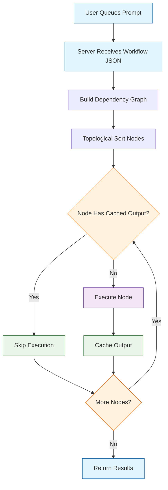
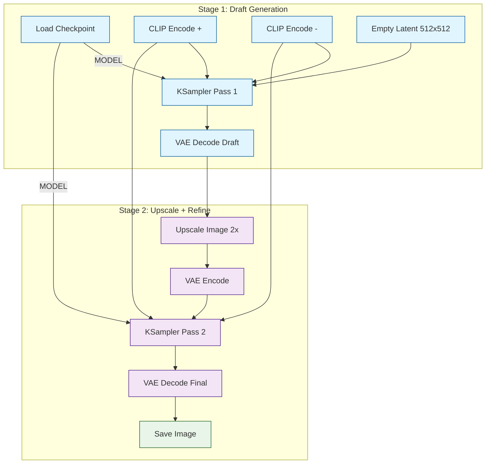
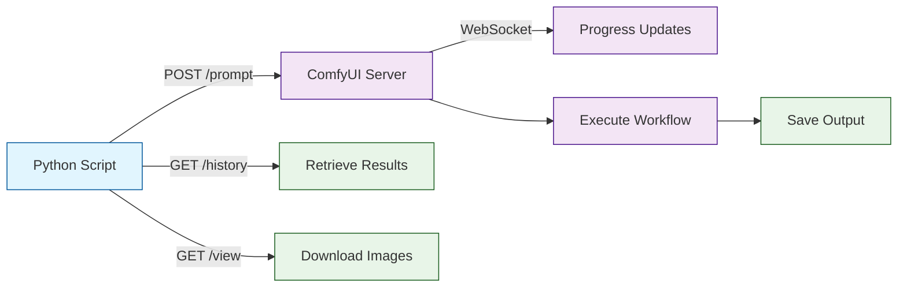
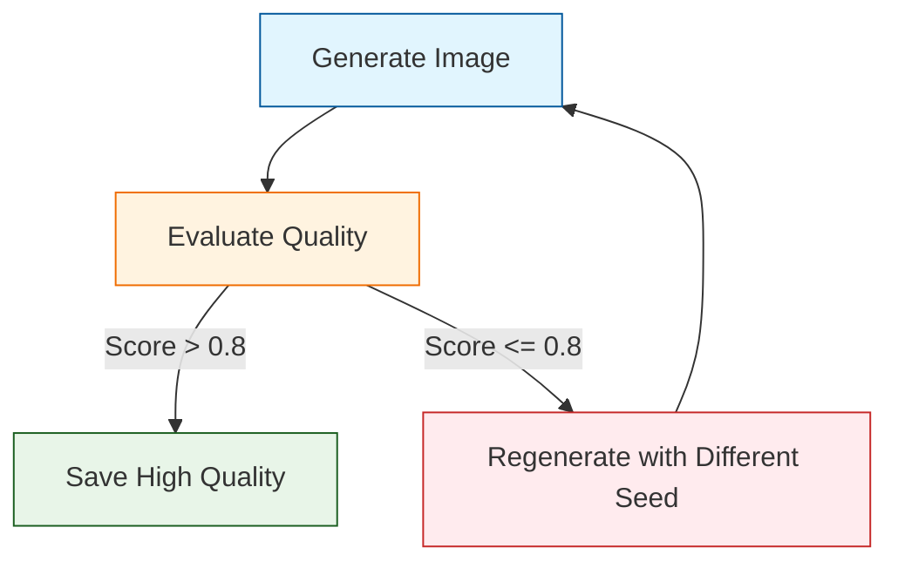

# Chapter 7: Advanced Workflows & Automation

Welcome to **Chapter 7: Advanced Workflows & Automation**. In this part of **ComfyUI Tutorial: Mastering AI Image Generation Workflows**, you will build an intuitive mental model first, then move into concrete implementation details and practical production tradeoffs.


ComfyUI's true power emerges when you move beyond single-pass generation into multi-stage pipelines, conditional branching, batch automation, and workflow composition. Every workflow in ComfyUI is a directed acyclic graph (DAG) -- the execution engine resolves node dependencies automatically, caches intermediate results, and re-executes only what has changed. This architecture makes it possible to build sophisticated generation pipelines that rival custom Python scripts while remaining entirely visual and shareable as JSON. In this chapter, you will learn to design iterative refinement pipelines, automate batch generation through the API, implement conditional logic, and orchestrate complex multi-model workflows.

## ComfyUI Execution Model

Understanding how ComfyUI executes workflows is essential for building efficient advanced pipelines.



### Execution Properties

| Property | Description |
|----------|-------------|
| **Lazy Evaluation** | Nodes only execute when their outputs are needed by downstream nodes |
| **Intelligent Caching** | Unchanged nodes reuse cached results; only modified branches re-execute |
| **Deterministic Order** | Topological sorting guarantees consistent execution order |
| **Error Isolation** | A failure in one branch does not affect independent branches |
| **Queue System** | Multiple workflows can be queued and processed sequentially |

## Multi-Stage Refinement Pipelines

The most common advanced workflow pattern is multi-stage refinement: generate a draft at lower resolution, then upscale and refine with a second sampling pass. This produces higher quality results than a single high-resolution pass.

### Two-Pass Hi-Res Fix Workflow



```python
# Two-pass hi-res fix workflow
hires_fix_workflow = {
    "1": {
        "class_type": "CheckpointLoaderSimple",
        "inputs": {"ckpt_name": "dreamshaper_8.safetensors"}
    },
    "2": {
        "class_type": "CLIPTextEncode",
        "inputs": {
            "text": "masterpiece, best quality, fantasy landscape, crystal caves, glowing minerals, volumetric lighting",
            "clip": ["1", 1]
        }
    },
    "3": {
        "class_type": "CLIPTextEncode",
        "inputs": {
            "text": "blurry, low quality, ugly, deformed",
            "clip": ["1", 1]
        }
    },
    "4": {
        "class_type": "EmptyLatentImage",
        "inputs": {"width": 512, "height": 512, "batch_size": 1}
    },
    "5_pass1": {
        "class_type": "KSampler",
        "inputs": {
            "model": ["1", 0],
            "positive": ["2", 0],
            "negative": ["3", 0],
            "latent_image": ["4", 0],
            "seed": 42,
            "steps": 20,
            "cfg": 7.0,
            "sampler_name": "euler_ancestral",
            "scheduler": "karras",
            "denoise": 1.0
        }
    },
    "6_decode_draft": {
        "class_type": "VAEDecode",
        "inputs": {"samples": ["5_pass1", 0], "vae": ["1", 2]}
    },
    "7_upscale": {
        "class_type": "ImageUpscaleWithModel",
        "inputs": {
            "upscale_model": ["upscale_loader", 0],
            "image": ["6_decode_draft", 0]
        }
    },
    "8_resize": {
        "class_type": "ImageScale",
        "inputs": {
            "image": ["7_upscale", 0],
            "width": 1024,
            "height": 1024,
            "upscale_method": "lanczos",
            "crop": "center"
        }
    },
    "9_encode_upscaled": {
        "class_type": "VAEEncode",
        "inputs": {"pixels": ["8_resize", 0], "vae": ["1", 2]}
    },
    "10_pass2": {
        "class_type": "KSampler",
        "inputs": {
            "model": ["1", 0],
            "positive": ["2", 0],
            "negative": ["3", 0],
            "latent_image": ["9_encode_upscaled", 0],
            "seed": 42,
            "steps": 15,
            "cfg": 7.0,
            "sampler_name": "euler",
            "scheduler": "karras",
            "denoise": 0.45    # Lower denoise preserves draft composition
        }
    },
    "11_decode_final": {
        "class_type": "VAEDecode",
        "inputs": {"samples": ["10_pass2", 0], "vae": ["1", 2]}
    },
    "12_save": {
        "class_type": "SaveImage",
        "inputs": {"images": ["11_decode_final", 0], "filename_prefix": "hires_fix"}
    }
}
```

### Denoise Strength Guide for Second Pass

| Denoise | Behavior | Use Case |
|---------|----------|----------|
| 0.2-0.3 | Minimal change, sharpens details only | Clean upscaling with no composition shift |
| 0.4-0.5 | Moderate refinement, adds new fine details | Standard hi-res fix |
| 0.6-0.7 | Significant rework, may alter composition | Creative enhancement |
| 0.8-1.0 | Near-complete regeneration at higher resolution | When draft is only a rough guide |

## Automating ComfyUI with the API

ComfyUI exposes a WebSocket and HTTP API that lets you queue workflows programmatically. This is the foundation for batch processing, integration with external tools, and building production systems.

### API Architecture



### API Client Implementation

```python
import json
import urllib.request
import urllib.parse
import uuid
import websocket  # pip install websocket-client

COMFYUI_URL = "http://127.0.0.1:8188"
CLIENT_ID = str(uuid.uuid4())


def queue_prompt(workflow: dict) -> str:
    """Submit a workflow to the ComfyUI queue and return the prompt ID."""
    payload = {
        "prompt": workflow,
        "client_id": CLIENT_ID
    }
    data = json.dumps(payload).encode("utf-8")
    req = urllib.request.Request(
        f"{COMFYUI_URL}/prompt",
        data=data,
        headers={"Content-Type": "application/json"}
    )
    response = json.loads(urllib.request.urlopen(req).read())
    return response["prompt_id"]


def get_history(prompt_id: str) -> dict:
    """Retrieve the execution history for a given prompt."""
    url = f"{COMFYUI_URL}/history/{prompt_id}"
    response = json.loads(urllib.request.urlopen(url).read())
    return response


def get_image(filename: str, subfolder: str = "", folder_type: str = "output") -> bytes:
    """Download a generated image from the server."""
    params = urllib.parse.urlencode({
        "filename": filename,
        "subfolder": subfolder,
        "type": folder_type
    })
    url = f"{COMFYUI_URL}/view?{params}"
    return urllib.request.urlopen(url).read()


def wait_for_completion(prompt_id: str) -> dict:
    """Connect via WebSocket and wait for the workflow to finish."""
    ws = websocket.WebSocket()
    ws.connect(f"ws://127.0.0.1:8188/ws?clientId={CLIENT_ID}")

    while True:
        message = json.loads(ws.recv())
        if message["type"] == "executing":
            data = message["data"]
            if data["node"] is None and data["prompt_id"] == prompt_id:
                break  # Execution complete
        elif message["type"] == "progress":
            data = message["data"]
            print(f"Progress: {data['value']}/{data['max']}")

    ws.close()
    return get_history(prompt_id)
```

### Batch Generation Script

```python
import copy

def batch_generate(base_workflow: dict, prompts: list, seeds: list = None):
    """
    Generate images for multiple prompts using a base workflow.

    Args:
        base_workflow: The base ComfyUI workflow dict
        prompts: List of prompt strings
        seeds: Optional list of seeds (random if not provided)
    """
    results = []

    for i, prompt_text in enumerate(prompts):
        workflow = copy.deepcopy(base_workflow)

        # Update the positive prompt (assumes node "3" is CLIPTextEncode)
        workflow["3"]["inputs"]["text"] = prompt_text

        # Set seed if provided
        if seeds and i < len(seeds):
            workflow["6"]["inputs"]["seed"] = seeds[i]
        else:
            workflow["6"]["inputs"]["seed"] = i * 1000  # Deterministic fallback

        # Queue and wait
        prompt_id = queue_prompt(workflow)
        print(f"[{i+1}/{len(prompts)}] Queued: {prompt_text[:50]}...")
        history = wait_for_completion(prompt_id)
        results.append(history)
        print(f"[{i+1}/{len(prompts)}] Complete.")

    return results


# Example usage
prompts = [
    "a serene mountain lake at sunrise, photorealistic, 8k",
    "a cyberpunk street market at night, neon lights, rain",
    "an ancient library with floating books, magical lighting",
    "a cozy cabin in winter, snow falling, warm fireplace glow",
    "an underwater coral reef city, bioluminescent, alien world"
]

batch_generate(base_workflow, prompts)
```

### Seed Variation Generator

```python
def generate_variations(base_workflow: dict, num_variations: int = 10, base_seed: int = 42):
    """Generate multiple variations of the same prompt with different seeds."""
    seeds = [base_seed + i for i in range(num_variations)]
    results = []

    for seed in seeds:
        workflow = copy.deepcopy(base_workflow)
        workflow["6"]["inputs"]["seed"] = seed

        prompt_id = queue_prompt(workflow)
        history = wait_for_completion(prompt_id)
        results.append({"seed": seed, "history": history})
        print(f"Seed {seed}: Complete")

    return results
```

## Conditional and Branching Workflows

ComfyUI supports conditional logic through custom nodes and workflow design patterns. While the base node set does not include explicit "if/else" nodes, several community packages add this capability.

### Pattern: Quality Gate with Switch Node



```python
# Conditional workflow using the ComfyUI-Logic custom nodes
# Install: cd custom_nodes && git clone https://github.com/theUpsider/ComfyUI-Logic.git

conditional_workflow = {
    "generate": {
        "class_type": "KSampler",
        "inputs": {
            "model": ["checkpoint", 0],
            "positive": ["positive_prompt", 0],
            "negative": ["negative_prompt", 0],
            "latent_image": ["empty_latent", 0],
            "steps": 25,
            "cfg": 7.0,
            "sampler_name": "euler_ancestral",
            "scheduler": "karras",
            "denoise": 1.0
        }
    },
    "decode": {
        "class_type": "VAEDecode",
        "inputs": {"samples": ["generate", 0], "vae": ["checkpoint", 2]}
    },
    "compare": {
        "class_type": "Compare",
        "inputs": {
            "a": ["quality_score", 0],
            "b": 0.8,
            "comparison": "greater_than"
        }
    },
    "switch": {
        "class_type": "Switch",
        "inputs": {
            "condition": ["compare", 0],
            "on_true": ["decode", 0],        # High quality -> save
            "on_false": ["fallback_decode", 0] # Low quality -> alternative
        }
    }
}
```

### Pattern: Model Selection by Subject

```python
# Select different models based on content type
# Uses workflow branching with Switch nodes

model_selection = {
    "detector": {
        "class_type": "ContentClassifier",  # Custom node
        "inputs": {"prompt": ["user_prompt", 0]}
    },
    "switch_model": {
        "class_type": "Switch",
        "inputs": {
            "condition": ["detector", 0],
            "on_true": ["anime_model", 0],    # Anime content
            "on_false": ["realistic_model", 0] # Realistic content
        }
    }
}
```

## SDXL Two-Stage Pipeline

SDXL is designed for a two-stage pipeline: the base model generates the initial image, then the refiner model enhances details.

```python
# Complete SDXL Base + Refiner workflow
sdxl_pipeline = {
    "1_base_checkpoint": {
        "class_type": "CheckpointLoaderSimple",
        "inputs": {"ckpt_name": "sd_xl_base_1.0.safetensors"}
    },
    "2_refiner_checkpoint": {
        "class_type": "CheckpointLoaderSimple",
        "inputs": {"ckpt_name": "sd_xl_refiner_1.0.safetensors"}
    },
    "3_positive_base": {
        "class_type": "CLIPTextEncode",
        "inputs": {
            "text": "cinematic photo of a dragon perched on a mountain peak, storm clouds, lightning, epic fantasy, 8k uhd",
            "clip": ["1_base_checkpoint", 1]
        }
    },
    "4_negative_base": {
        "class_type": "CLIPTextEncode",
        "inputs": {
            "text": "cartoon, anime, low quality, blurry, watermark",
            "clip": ["1_base_checkpoint", 1]
        }
    },
    "5_positive_refiner": {
        "class_type": "CLIPTextEncode",
        "inputs": {
            "text": "cinematic photo of a dragon perched on a mountain peak, storm clouds, lightning, epic fantasy, 8k uhd",
            "clip": ["2_refiner_checkpoint", 1]
        }
    },
    "6_negative_refiner": {
        "class_type": "CLIPTextEncode",
        "inputs": {
            "text": "cartoon, anime, low quality, blurry, watermark",
            "clip": ["2_refiner_checkpoint", 1]
        }
    },
    "7_latent": {
        "class_type": "EmptyLatentImage",
        "inputs": {"width": 1024, "height": 1024, "batch_size": 1}
    },
    "8_base_sampler": {
        "class_type": "KSamplerAdvanced",
        "inputs": {
            "model": ["1_base_checkpoint", 0],
            "positive": ["3_positive_base", 0],
            "negative": ["4_negative_base", 0],
            "latent_image": ["7_latent", 0],
            "add_noise": "enable",
            "noise_seed": 42,
            "steps": 25,
            "cfg": 7.5,
            "sampler_name": "euler",
            "scheduler": "karras",
            "start_at_step": 0,
            "end_at_step": 20,       # Base handles 80% of steps
            "return_with_leftover_noise": "enable"
        }
    },
    "9_refiner_sampler": {
        "class_type": "KSamplerAdvanced",
        "inputs": {
            "model": ["2_refiner_checkpoint", 0],
            "positive": ["5_positive_refiner", 0],
            "negative": ["6_negative_refiner", 0],
            "latent_image": ["8_base_sampler", 0],
            "add_noise": "disable",   # Continue from base noise
            "noise_seed": 42,
            "steps": 25,
            "cfg": 7.5,
            "sampler_name": "euler",
            "scheduler": "karras",
            "start_at_step": 20,     # Refiner handles last 20%
            "end_at_step": 25,
            "return_with_leftover_noise": "disable"
        }
    },
    "10_decode": {
        "class_type": "VAEDecode",
        "inputs": {"samples": ["9_refiner_sampler", 0], "vae": ["1_base_checkpoint", 2]}
    },
    "11_save": {
        "class_type": "SaveImage",
        "inputs": {"images": ["10_decode", 0], "filename_prefix": "sdxl_refined"}
    }
}
```

### Base/Refiner Step Split Guide

| Base Steps | Refiner Steps | Total | Result |
|------------|--------------|-------|--------|
| 80% | 20% | 25 | Standard quality (recommended) |
| 70% | 30% | 30 | More refiner influence, smoother skin/textures |
| 90% | 10% | 25 | Minimal refiner, preserves base composition |
| 60% | 40% | 40 | Heavy refinement, may alter details significantly |

## Workflow Composition and Reuse

### Saving Workflow Templates

```python
import json

def save_workflow_template(workflow: dict, name: str, description: str):
    """Save a workflow as a reusable template."""
    template = {
        "name": name,
        "description": description,
        "version": "1.0",
        "workflow": workflow,
        "parameters": extract_configurable_params(workflow)
    }
    with open(f"templates/{name}.json", "w") as f:
        json.dump(template, f, indent=2)


def extract_configurable_params(workflow: dict) -> list:
    """Identify commonly adjusted parameters for template users."""
    params = []
    for node_id, node in workflow.items():
        inputs = node.get("inputs", {})
        if node["class_type"] == "CLIPTextEncode" and "text" in inputs:
            params.append({
                "node": node_id,
                "param": "text",
                "type": "string",
                "label": f"Prompt ({node_id})"
            })
        if node["class_type"] == "KSampler":
            for key in ["seed", "steps", "cfg", "denoise"]:
                if key in inputs:
                    params.append({
                        "node": node_id,
                        "param": key,
                        "type": "number",
                        "label": f"Sampler {key} ({node_id})"
                    })
    return params


def load_and_customize(template_path: str, overrides: dict) -> dict:
    """Load a template and apply parameter overrides."""
    with open(template_path, "r") as f:
        template = json.load(f)

    workflow = template["workflow"]
    for node_id, params in overrides.items():
        if node_id in workflow:
            workflow[node_id]["inputs"].update(params)

    return workflow


# Example: Load a template and customize it
workflow = load_and_customize("templates/hires_fix.json", {
    "3": {"text": "a futuristic space station orbiting Jupiter, sci-fi concept art"},
    "6": {"seed": 12345, "steps": 30, "cfg": 8.0}
})
```

### Workflow Groups and Sub-Workflows

ComfyUI supports grouping nodes visually. Use groups to organize complex workflows.

```python
# Workflow organization pattern
workflow_groups = {
    "Model Loading": {
        "nodes": ["checkpoint_loader", "lora_loader_1", "lora_loader_2"],
        "color": "#4a148c",
        "description": "Load and configure models"
    },
    "Prompt Engineering": {
        "nodes": ["positive_clip", "negative_clip", "prompt_scheduler"],
        "color": "#01579b",
        "description": "Text encoding and conditioning"
    },
    "Generation": {
        "nodes": ["empty_latent", "ksampler_pass1", "ksampler_pass2"],
        "color": "#ef6c00",
        "description": "Diffusion sampling stages"
    },
    "Post-Processing": {
        "nodes": ["vae_decode", "upscale", "face_restore", "save_image"],
        "color": "#1b5e20",
        "description": "Decode, enhance, and export"
    }
}
```

## Face Enhancement Pipeline

A common advanced workflow adds face restoration after initial generation.

```python
# Generation + Face Enhancement pipeline
face_pipeline = {
    # ... (standard generation nodes omitted for brevity)
    "face_detect": {
        "class_type": "FaceDetectorDETR",  # From Impact Pack
        "inputs": {"image": ["vae_decode", 0], "threshold": 0.5}
    },
    "face_crop": {
        "class_type": "FaceDetailer",
        "inputs": {
            "image": ["vae_decode", 0],
            "model": ["checkpoint", 0],
            "clip": ["checkpoint", 1],
            "vae": ["checkpoint", 2],
            "positive": ["positive_prompt", 0],
            "negative": ["negative_prompt", 0],
            "bbox_detector": ["face_detect", 0],
            "denoise": 0.4,
            "steps": 15,
            "cfg": 7.0,
            "sampler_name": "euler",
            "scheduler": "karras",
            "guide_size": 384,
            "feather": 5
        }
    },
    "save_enhanced": {
        "class_type": "SaveImage",
        "inputs": {
            "images": ["face_crop", 0],
            "filename_prefix": "face_enhanced"
        }
    }
}
```

## Workflow Debugging

### Common Debug Techniques

| Technique | How | When to Use |
|-----------|-----|-------------|
| **Preview nodes** | Add PreviewImage after any VAEDecode | See intermediate results at any stage |
| **Mute nodes** | Right-click a node and select "Mute" | Disable a branch without deleting it |
| **Bypass nodes** | Right-click and select "Bypass" | Skip a node, passing input directly to output |
| **Console logs** | Monitor the terminal running ComfyUI | Track execution order, errors, and timing |
| **Save intermediates** | Add SaveImage nodes at each stage | Persist intermediate outputs for comparison |
| **Fixed seeds** | Set explicit seed values | Ensure reproducible results during debugging |

### Identifying Bottlenecks

```python
# Use the ComfyUI execution time display (bottom bar)
# or monitor via the API

def profile_workflow(prompt_id: str) -> dict:
    """Extract per-node execution times from history."""
    history = get_history(prompt_id)
    prompt_data = history[prompt_id]

    node_times = {}
    if "execution_time" in prompt_data:
        node_times = prompt_data["execution_time"]

    # Sort by execution time (descending)
    sorted_times = sorted(node_times.items(), key=lambda x: x[1], reverse=True)
    for node_id, time_ms in sorted_times:
        print(f"Node {node_id}: {time_ms:.1f} ms")

    return dict(sorted_times)
```

## Summary

Advanced ComfyUI workflows unlock the full potential of the node-based architecture. Multi-stage refinement pipelines produce higher quality than single-pass generation. The API enables programmatic batch generation and integration with external tools. Conditional logic lets workflows adapt to content type or quality thresholds. Workflow templates and composition patterns make complex pipelines reusable and shareable. Combined with ControlNet and LoRA from previous chapters, these techniques form the foundation for professional-grade AI image generation systems.

## Key Takeaways

1. **Multi-stage pipelines** (draft -> upscale -> refine) produce superior results compared to single-pass high-resolution generation.
2. **The ComfyUI API** (HTTP + WebSocket) enables full programmatic control for batch processing, integration, and automation.
3. **Denoise strength in second passes** controls the balance between preserving composition (low denoise) and adding new detail (high denoise).
4. **SDXL Base + Refiner** is a built-in two-stage pipeline where the base handles composition (80% of steps) and the refiner enhances detail (20%).
5. **Workflow templates** stored as JSON allow teams to share and customize complex pipelines with parameter overrides.
6. **Face enhancement** with FaceDetailer re-generates face regions at higher detail while preserving the rest of the image.
7. **Debug with Preview, Mute, and Bypass** -- these three tools let you inspect, disable, and skip any node without restructuring your workflow.

## Next Steps

You now have the tools to build sophisticated, automated generation pipelines. In the final chapter, we will cover production deployment -- optimizing ComfyUI for maximum throughput, managing GPU resources, deploying as a service, monitoring performance, and scaling to handle enterprise workloads.

**Continue to [Chapter 8: Production & Optimization](08-production-optimization.md)**

---

*Built with insights from the [ComfyUI](https://github.com/comfyanonymous/ComfyUI) project.*

## What Problem Does This Solve?

Most teams struggle here because the hard part is not writing more code, but deciding clear boundaries for `inputs`, `class_type`, `workflow` so behavior stays predictable as complexity grows.

In practical terms, this chapter helps you avoid three common failures:

- coupling core logic too tightly to one implementation path
- missing the handoff boundaries between setup, execution, and validation
- shipping changes without clear rollback or observability strategy

After working through this chapter, you should be able to reason about `Chapter 7: Advanced Workflows & Automation` as an operating subsystem inside **ComfyUI Tutorial: Mastering AI Image Generation Workflows**, with explicit contracts for inputs, state transitions, and outputs.

Use the implementation notes around `classDef`, `fill`, `stroke` as your checklist when adapting these patterns to your own repository.

## How it Works Under the Hood

Under the hood, `Chapter 7: Advanced Workflows & Automation` usually follows a repeatable control path:

1. **Context bootstrap**: initialize runtime config and prerequisites for `inputs`.
2. **Input normalization**: shape incoming data so `class_type` receives stable contracts.
3. **Core execution**: run the main logic branch and propagate intermediate state through `workflow`.
4. **Policy and safety checks**: enforce limits, auth scopes, and failure boundaries.
5. **Output composition**: return canonical result payloads for downstream consumers.
6. **Operational telemetry**: emit logs/metrics needed for debugging and performance tuning.

When debugging, walk this sequence in order and confirm each stage has explicit success/failure conditions.

## Source Walkthrough

Use the following upstream sources to verify implementation details while reading this chapter:

- [View Repo](https://github.com/comfyanonymous/ComfyUI)
  Why it matters: authoritative reference on `View Repo` (github.com).

Suggested trace strategy:
- search upstream code for `inputs` and `class_type` to map concrete implementation paths
- compare docs claims against actual runtime/config code before reusing patterns in production

## Chapter Connections

- [Tutorial Index](index.md)
- [Previous Chapter: Chapter 6: LoRA & Model Customization](06-lora-customization.md)
- [Next Chapter: Chapter 8: Production & Optimization](08-production-optimization.md)
- [Main Catalog](../../README.md#-tutorial-catalog)
- [A-Z Tutorial Directory](../../discoverability/tutorial-directory.md)
