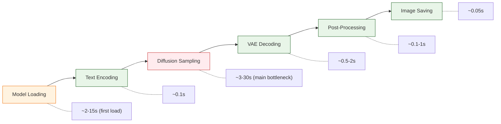
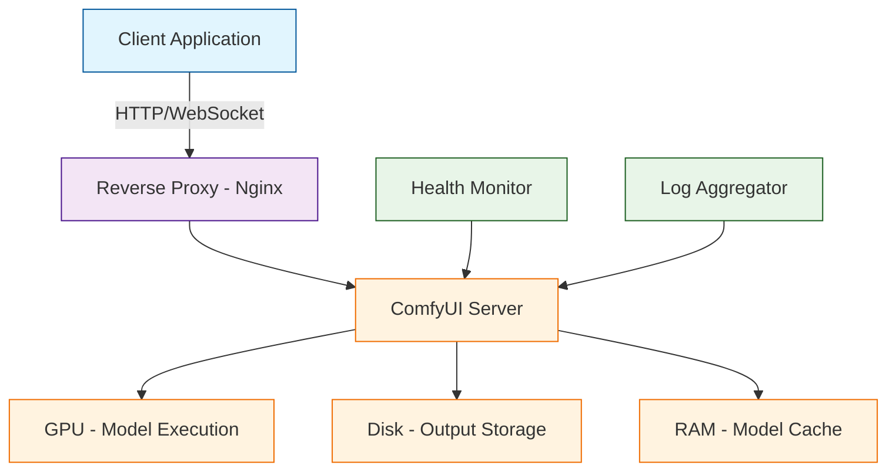
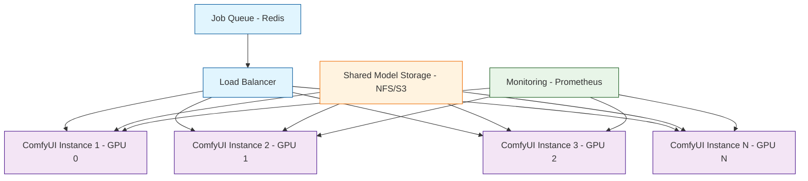

# Chapter 8: Production & Optimization

Welcome to **Chapter 8: Production & Optimization**. In this part of **ComfyUI Tutorial: Mastering AI Image Generation Workflows**, you will build an intuitive mental model first, then move into concrete implementation details and practical production tradeoffs.


Taking ComfyUI from a creative tool on your desktop to a production-grade image generation service requires careful attention to performance optimization, resource management, deployment architecture, and operational monitoring. ComfyUI's efficient execution engine, intelligent caching, and API-first design make it well-suited for production workloads -- but unlocking its full throughput requires understanding GPU memory management, model loading strategies, and scaling patterns. In this final chapter, you will learn to optimize ComfyUI for maximum performance, deploy it as a headless service, build monitoring infrastructure, and scale to handle enterprise-level generation workloads.

## Performance Optimization Fundamentals

### Understanding the Generation Pipeline Bottlenecks



The diffusion sampling step (KSampler) dominates total generation time. Optimizations should prioritize this step first, then address model loading latency for cold-start scenarios.

### GPU Memory Architecture

| VRAM Budget | Recommended Configuration | Typical Use Case |
|-------------|--------------------------|------------------|
| **4 GB** | SD 1.5, fp16, 512x512, attention slicing | Basic generation, single images |
| **6 GB** | SD 1.5, fp16, 768x768, xformers | Standard quality, moderate resolution |
| **8 GB** | SDXL, fp16, 1024x1024, xformers | High quality, single SDXL model |
| **12 GB** | SDXL + ControlNet, fp16, 1024x1024 | Professional workflows with control |
| **16 GB** | SDXL + LoRA + ControlNet, multi-stage | Full production pipeline |
| **24 GB+** | Multiple models loaded, large batches | Enterprise, concurrent users |

## Launch Flags and Runtime Configuration

ComfyUI provides command-line flags that significantly affect performance and memory usage.

```bash
# Production-optimized launch command
python main.py \
  --listen 0.0.0.0 \
  --port 8188 \
  --highvram \
  --preview-method auto \
  --output-directory /data/outputs \
  --temp-directory /data/temp \
  --dont-print-server
```

### Launch Flag Reference

| Flag | Effect | When to Use |
|------|--------|-------------|
| `--listen 0.0.0.0` | Accept connections from any IP | Server/container deployments |
| `--port 8188` | Set the HTTP/WebSocket port | When default port conflicts |
| `--highvram` | Keep models in VRAM permanently | 24+ GB VRAM, maximum throughput |
| `--normalvram` | Default behavior, load/unload as needed | 8-16 GB VRAM |
| `--lowvram` | Aggressive model offloading to RAM | 4-6 GB VRAM |
| `--novram` | Run entirely on CPU + RAM | No GPU available |
| `--cpu` | Force CPU-only execution | Testing, no GPU |
| `--fp16-vae` | Use half-precision for VAE | Reduce VRAM by ~1 GB |
| `--bf16-vae` | Use bfloat16 for VAE | Ampere+ GPUs (RTX 3000+) |
| `--fp16-unet` | Force half-precision U-Net | Reduce VRAM usage |
| `--dont-upcast-attention` | Skip attention upcasting | Save VRAM on older GPUs |
| `--use-pytorch-cross-attention` | Use PyTorch native attention | When xformers unavailable |
| `--disable-smart-memory` | Disable automatic memory management | Debugging memory issues |
| `--preview-method auto` | Enable generation previews | Development/monitoring |
| `--preview-method none` | Disable previews | Maximum speed in production |

### Memory Optimization Strategies

```python
# ComfyUI memory management configuration
# These settings are controlled via launch flags and environment variables

memory_strategies = {
    "high_vram_mode": {
        "description": "Keep all models in VRAM for fastest generation",
        "flag": "--highvram",
        "min_vram": "24 GB",
        "model_behavior": "Models stay loaded in VRAM between generations",
        "best_for": "Dedicated GPU servers with single-model workflows"
    },
    "normal_mode": {
        "description": "Default balancing of speed and memory",
        "flag": "(default, no flag)",
        "min_vram": "8 GB",
        "model_behavior": "Models loaded on demand, unloaded when VRAM needed",
        "best_for": "Most production deployments"
    },
    "low_vram_mode": {
        "description": "Aggressive offloading for constrained GPUs",
        "flag": "--lowvram",
        "min_vram": "4 GB",
        "model_behavior": "Model layers loaded/unloaded per operation",
        "best_for": "Consumer GPUs, shared environments"
    }
}
```

## Inference Speed Optimization

### Attention Mechanism Selection

The attention mechanism is the single largest factor in sampling speed after step count.

```bash
# Install xformers for fastest attention (NVIDIA GPUs)
pip install xformers

# Verify xformers is available
python -c "import xformers; print(xformers.__version__)"
```

| Attention Backend | Speed | Memory | Compatibility |
|-------------------|-------|--------|---------------|
| **xformers** | Fastest | Lowest | NVIDIA (CUDA) |
| **PyTorch SDP** | Fast | Low | PyTorch 2.0+, all GPUs |
| **PyTorch Cross-Attention** | Baseline | Baseline | Universal fallback |
| **FlashAttention 2** | Fastest | Lowest | Ampere+ GPUs (manual install) |

### Sampler and Step Optimization

Not all samplers need the same number of steps to converge. Choosing the right sampler/step combination can halve generation time without visible quality loss.

```python
# Sampler efficiency comparison
sampler_benchmarks = {
    "euler": {
        "min_good_steps": 20,
        "sweet_spot": 25,
        "speed": "fast",
        "quality_at_20": "good",
        "notes": "Best general-purpose speed/quality"
    },
    "euler_ancestral": {
        "min_good_steps": 20,
        "sweet_spot": 25,
        "speed": "fast",
        "quality_at_20": "good (more varied)",
        "notes": "Creative variation, non-convergent"
    },
    "dpm_2_ancestral": {
        "min_good_steps": 15,
        "sweet_spot": 20,
        "speed": "medium",
        "quality_at_20": "very good",
        "notes": "High quality with fewer steps"
    },
    "dpmpp_2m": {
        "min_good_steps": 15,
        "sweet_spot": 20,
        "speed": "fast",
        "quality_at_20": "very good",
        "notes": "Excellent with karras scheduler"
    },
    "dpmpp_sde": {
        "min_good_steps": 10,
        "sweet_spot": 15,
        "speed": "medium",
        "quality_at_20": "excellent",
        "notes": "Best quality at low step counts"
    },
    "lcm": {
        "min_good_steps": 4,
        "sweet_spot": 6,
        "speed": "very fast",
        "quality_at_20": "good",
        "notes": "Requires LCM LoRA; 4-8 steps only"
    }
}
```

### Scheduler Impact

| Scheduler | Behavior | Best Pairing |
|-----------|----------|--------------|
| **normal** | Linear noise schedule | euler, heun |
| **karras** | Non-linear, more detail in early steps | dpmpp_2m, euler_ancestral |
| **exponential** | Aggressive early denoising | dpmpp_sde |
| **sgm_uniform** | Uniform step spacing | SDXL models |

### Resolution Optimization

```python
# Resolution vs. VRAM and speed tradeoffs
resolution_guide = {
    "512x512": {
        "vram": "~3 GB",
        "speed_relative": 1.0,
        "quality": "SD 1.5 native, good",
        "notes": "Fastest, baseline"
    },
    "768x768": {
        "vram": "~5 GB",
        "speed_relative": 2.2,
        "quality": "SD 1.5 upscaled, very good",
        "notes": "Good balance for SD 1.5"
    },
    "1024x1024": {
        "vram": "~7 GB",
        "speed_relative": 4.0,
        "quality": "SDXL native, excellent",
        "notes": "SDXL baseline"
    },
    "1536x1536": {
        "vram": "~14 GB",
        "speed_relative": 9.0,
        "quality": "Very high resolution",
        "notes": "Requires hi-res fix or tiled VAE"
    },
    "2048x2048": {
        "vram": "~22 GB",
        "speed_relative": 16.0,
        "quality": "Ultra high resolution",
        "notes": "Tiled VAE required; multi-pass recommended"
    }
}
```

### VAE Tiling for Large Images

```python
# Enable tiled VAE decoding for images larger than native resolution
# This processes the image in tiles to avoid VRAM overflow

tiled_vae_config = {
    "class_type": "VAEDecodeTiled",
    "inputs": {
        "samples": ["ksampler", 0],
        "vae": ["checkpoint", 2],
        "tile_size": 512    # Process in 512x512 tiles
    }
}

# Tiled VAE is essential for:
# - Resolutions above 1536x1536
# - GPUs with less than 12 GB VRAM
# - Batch sizes > 1 at high resolutions
```

## Production Deployment

### Headless Server Deployment



### Docker Deployment

```dockerfile
# Production Dockerfile for ComfyUI
FROM nvidia/cuda:12.1.0-runtime-ubuntu22.04

# Install Python and dependencies
RUN apt-get update && apt-get install -y \
    python3.10 python3-pip git wget \
    && rm -rf /var/lib/apt/lists/*

# Clone ComfyUI
RUN git clone https://github.com/comfyanonymous/ComfyUI.git /app
WORKDIR /app

# Install Python dependencies
RUN pip3 install --no-cache-dir -r requirements.txt
RUN pip3 install --no-cache-dir xformers

# Create directories
RUN mkdir -p /data/models /data/outputs /data/temp

# Symlink model directories
RUN ln -sf /data/models/checkpoints models/checkpoints && \
    ln -sf /data/models/loras models/loras && \
    ln -sf /data/models/controlnet models/controlnet && \
    ln -sf /data/models/vae models/vae

EXPOSE 8188

# Health check
HEALTHCHECK --interval=30s --timeout=10s --retries=3 \
    CMD curl -f http://localhost:8188/system_stats || exit 1

# Launch with production settings
CMD ["python3", "main.py", \
     "--listen", "0.0.0.0", \
     "--port", "8188", \
     "--preview-method", "none", \
     "--output-directory", "/data/outputs", \
     "--temp-directory", "/data/temp", \
     "--dont-print-server"]
```

```yaml
# docker-compose.yml for ComfyUI production
version: "3.8"
services:
  comfyui:
    build: .
    ports:
      - "8188:8188"
    volumes:
      - ./models:/data/models
      - ./outputs:/data/outputs
      - ./custom_nodes:/app/custom_nodes
    deploy:
      resources:
        reservations:
          devices:
            - driver: nvidia
              count: 1
              capabilities: [gpu]
    restart: unless-stopped
    environment:
      - NVIDIA_VISIBLE_DEVICES=all

  nginx:
    image: nginx:alpine
    ports:
      - "80:80"
      - "443:443"
    volumes:
      - ./nginx.conf:/etc/nginx/nginx.conf
      - ./certs:/etc/nginx/certs
    depends_on:
      - comfyui
    restart: unless-stopped
```

### Nginx Reverse Proxy Configuration

```nginx
# nginx.conf for ComfyUI production
upstream comfyui {
    server comfyui:8188;
}

server {
    listen 80;
    server_name your-domain.com;

    # Redirect HTTP to HTTPS
    return 301 https://$server_name$request_uri;
}

server {
    listen 443 ssl;
    server_name your-domain.com;

    ssl_certificate /etc/nginx/certs/fullchain.pem;
    ssl_certificate_key /etc/nginx/certs/privkey.pem;

    # API endpoints
    location / {
        proxy_pass http://comfyui;
        proxy_set_header Host $host;
        proxy_set_header X-Real-IP $remote_addr;
        proxy_set_header X-Forwarded-For $proxy_add_x_forwarded_for;
        proxy_set_header X-Forwarded-Proto $scheme;

        # WebSocket support
        proxy_http_version 1.1;
        proxy_set_header Upgrade $http_upgrade;
        proxy_set_header Connection "upgrade";

        # Timeouts for long-running generation
        proxy_read_timeout 300s;
        proxy_send_timeout 300s;
    }

    # Serve generated images directly
    location /view {
        proxy_pass http://comfyui;
        proxy_cache_valid 200 1h;
        add_header Cache-Control "public, max-age=3600";
    }

    # Rate limiting
    limit_req_zone $binary_remote_addr zone=api:10m rate=10r/s;
    location /prompt {
        limit_req zone=api burst=5 nodelay;
        proxy_pass http://comfyui;
    }

    client_max_body_size 50M;  # For image uploads
}
```

## API Integration Patterns

### RESTful Wrapper Service

```python
from fastapi import FastAPI, HTTPException, BackgroundTasks
from pydantic import BaseModel
import json
import copy
import urllib.request
import uuid

app = FastAPI(title="ComfyUI Production API")
COMFYUI_URL = "http://localhost:8188"

# Load workflow templates at startup
TEMPLATES = {}
for name in ["text2img", "img2img", "hires_fix", "controlnet"]:
    with open(f"templates/{name}.json") as f:
        TEMPLATES[name] = json.load(f)


class GenerateRequest(BaseModel):
    template: str = "text2img"
    prompt: str
    negative_prompt: str = "blurry, low quality, deformed"
    width: int = 1024
    height: int = 1024
    steps: int = 25
    cfg: float = 7.0
    seed: int = -1  # -1 for random


class GenerateResponse(BaseModel):
    job_id: str
    status: str
    message: str


@app.post("/api/generate", response_model=GenerateResponse)
async def generate_image(request: GenerateRequest):
    if request.template not in TEMPLATES:
        raise HTTPException(status_code=400, detail=f"Unknown template: {request.template}")

    workflow = copy.deepcopy(TEMPLATES[request.template])

    # Apply user parameters to the workflow
    for node_id, node in workflow.items():
        if node["class_type"] == "CLIPTextEncode":
            if "positive" in node_id:
                node["inputs"]["text"] = request.prompt
            elif "negative" in node_id:
                node["inputs"]["text"] = request.negative_prompt
        elif node["class_type"] == "EmptyLatentImage":
            node["inputs"]["width"] = request.width
            node["inputs"]["height"] = request.height
        elif node["class_type"] == "KSampler":
            node["inputs"]["steps"] = request.steps
            node["inputs"]["cfg"] = request.cfg
            if request.seed >= 0:
                node["inputs"]["seed"] = request.seed

    # Submit to ComfyUI
    client_id = str(uuid.uuid4())
    payload = json.dumps({"prompt": workflow, "client_id": client_id}).encode()
    req = urllib.request.Request(
        f"{COMFYUI_URL}/prompt",
        data=payload,
        headers={"Content-Type": "application/json"}
    )
    response = json.loads(urllib.request.urlopen(req).read())

    return GenerateResponse(
        job_id=response["prompt_id"],
        status="queued",
        message="Generation queued successfully"
    )


@app.get("/api/status/{job_id}")
async def get_status(job_id: str):
    url = f"{COMFYUI_URL}/history/{job_id}"
    try:
        response = json.loads(urllib.request.urlopen(url).read())
        if job_id in response:
            outputs = response[job_id].get("outputs", {})
            images = []
            for node_id, output in outputs.items():
                if "images" in output:
                    for img in output["images"]:
                        images.append({
                            "filename": img["filename"],
                            "subfolder": img.get("subfolder", ""),
                            "url": f"/api/image/{img['filename']}"
                        })
            return {"status": "completed", "images": images}
        return {"status": "processing"}
    except Exception:
        return {"status": "not_found"}


@app.get("/api/health")
async def health_check():
    try:
        url = f"{COMFYUI_URL}/system_stats"
        response = json.loads(urllib.request.urlopen(url).read())
        return {
            "status": "healthy",
            "gpu": response.get("devices", []),
            "queue": response.get("queue_remaining", 0)
        }
    except Exception as e:
        raise HTTPException(status_code=503, detail=str(e))
```

## Scaling Strategies

### Horizontal Scaling with Multiple GPUs



```python
# Multi-GPU deployment configuration
scaling_config = {
    "instances": [
        {
            "id": "comfyui-0",
            "gpu": "cuda:0",
            "port": 8188,
            "launch_args": "--listen 0.0.0.0 --port 8188 --highvram",
            "env": {"CUDA_VISIBLE_DEVICES": "0"}
        },
        {
            "id": "comfyui-1",
            "gpu": "cuda:1",
            "port": 8189,
            "launch_args": "--listen 0.0.0.0 --port 8189 --highvram",
            "env": {"CUDA_VISIBLE_DEVICES": "1"}
        },
        {
            "id": "comfyui-2",
            "gpu": "cuda:2",
            "port": 8190,
            "launch_args": "--listen 0.0.0.0 --port 8190 --highvram",
            "env": {"CUDA_VISIBLE_DEVICES": "2"}
        }
    ],
    "load_balancer": {
        "strategy": "least_connections",
        "health_check_interval": 10,
        "health_check_path": "/system_stats"
    },
    "shared_storage": {
        "models_path": "/shared/nfs/models",
        "outputs_path": "/shared/nfs/outputs"
    }
}
```

### Queue-Based Architecture

```python
import redis
import json
import time

# Redis-based job queue for distributed ComfyUI
r = redis.Redis(host="localhost", port=6379, db=0)

QUEUE_NAME = "comfyui:jobs"
RESULTS_PREFIX = "comfyui:result:"


def submit_job(workflow: dict, priority: int = 0) -> str:
    """Submit a generation job to the queue."""
    job_id = str(uuid.uuid4())
    job = {
        "id": job_id,
        "workflow": workflow,
        "priority": priority,
        "submitted_at": time.time(),
        "status": "queued"
    }
    r.zadd(QUEUE_NAME, {json.dumps(job): priority})
    return job_id


def worker_loop(comfyui_url: str):
    """Worker process that consumes jobs from the queue."""
    while True:
        # Pop highest priority job
        result = r.zpopmax(QUEUE_NAME, count=1)
        if not result:
            time.sleep(1)
            continue

        job_data, priority = result[0]
        job = json.loads(job_data)
        job_id = job["id"]

        print(f"Processing job {job_id} (priority {priority})")

        try:
            # Submit to ComfyUI
            prompt_id = queue_prompt_to_comfyui(comfyui_url, job["workflow"])
            history = wait_for_completion(comfyui_url, prompt_id)

            # Store result
            r.set(
                f"{RESULTS_PREFIX}{job_id}",
                json.dumps({"status": "completed", "history": history}),
                ex=3600  # Expire after 1 hour
            )

        except Exception as e:
            r.set(
                f"{RESULTS_PREFIX}{job_id}",
                json.dumps({"status": "failed", "error": str(e)}),
                ex=3600
            )


def get_job_result(job_id: str) -> dict:
    """Check the result of a submitted job."""
    result = r.get(f"{RESULTS_PREFIX}{job_id}")
    if result:
        return json.loads(result)
    return {"status": "processing"}
```

## Monitoring and Observability

### System Stats Endpoint

ComfyUI exposes a `/system_stats` endpoint that provides real-time GPU and queue information.

```python
import urllib.request
import json
import time

def collect_metrics(comfyui_url: str = "http://localhost:8188") -> dict:
    """Collect system metrics from ComfyUI."""
    url = f"{comfyui_url}/system_stats"
    response = json.loads(urllib.request.urlopen(url).read())

    metrics = {
        "timestamp": time.time(),
        "devices": [],
        "queue_remaining": 0
    }

    for device in response.get("devices", []):
        metrics["devices"].append({
            "name": device.get("name", "unknown"),
            "type": device.get("type", "unknown"),
            "vram_total_mb": device.get("vram_total", 0) / (1024 * 1024),
            "vram_free_mb": device.get("vram_free", 0) / (1024 * 1024),
            "vram_used_pct": (
                (device.get("vram_total", 1) - device.get("vram_free", 0))
                / device.get("vram_total", 1) * 100
            ),
            "torch_vram_total_mb": device.get("torch_vram_total", 0) / (1024 * 1024),
            "torch_vram_free_mb": device.get("torch_vram_free", 0) / (1024 * 1024)
        })

    return metrics
```

### Prometheus Metrics Exporter

```python
from prometheus_client import Gauge, Counter, Histogram, start_http_server
import threading
import time

# Define metrics
gpu_vram_used = Gauge("comfyui_gpu_vram_used_bytes", "GPU VRAM used", ["device"])
gpu_vram_total = Gauge("comfyui_gpu_vram_total_bytes", "GPU VRAM total", ["device"])
queue_size = Gauge("comfyui_queue_size", "Number of items in queue")
generation_duration = Histogram(
    "comfyui_generation_duration_seconds",
    "Time spent generating images",
    buckets=[1, 2, 5, 10, 15, 20, 30, 45, 60, 90, 120]
)
generation_count = Counter("comfyui_generation_total", "Total generations", ["status"])


def metrics_collector(comfyui_url: str, interval: int = 15):
    """Background thread that collects metrics periodically."""
    while True:
        try:
            metrics = collect_metrics(comfyui_url)

            for device in metrics["devices"]:
                device_name = device["name"]
                gpu_vram_used.labels(device=device_name).set(
                    device["vram_used_pct"] / 100 * device["vram_total_mb"] * 1024 * 1024
                )
                gpu_vram_total.labels(device=device_name).set(
                    device["vram_total_mb"] * 1024 * 1024
                )

            queue_size.set(metrics.get("queue_remaining", 0))

        except Exception as e:
            print(f"Metrics collection error: {e}")

        time.sleep(interval)


# Start metrics server on port 9090
start_http_server(9090)
threading.Thread(target=metrics_collector, args=("http://localhost:8188",), daemon=True).start()
```

### Key Metrics to Monitor

| Metric | Alert Threshold | Action |
|--------|----------------|--------|
| **GPU VRAM Usage** | > 95% | Scale down resolution or batch size |
| **Queue Depth** | > 50 items | Add GPU instances or reject new jobs |
| **Generation Latency (p99)** | > 60s | Check for bottleneck nodes; reduce steps |
| **Error Rate** | > 5% | Check logs for OOM or model loading errors |
| **GPU Temperature** | > 85 C | Improve cooling; reduce sustained load |
| **GPU Utilization** | < 50% sustained | Increase batch size or queue throughput |
| **Disk Space (outputs)** | < 10 GB free | Implement output rotation/cleanup |

## Model Management in Production

### Model Preloading

```python
# Warm up models on server start to avoid cold-start latency
warmup_workflow = {
    "1": {
        "class_type": "CheckpointLoaderSimple",
        "inputs": {"ckpt_name": "sd_xl_base_1.0.safetensors"}
    },
    "2": {
        "class_type": "EmptyLatentImage",
        "inputs": {"width": 64, "height": 64, "batch_size": 1}
    },
    "3": {
        "class_type": "CLIPTextEncode",
        "inputs": {"text": "warmup", "clip": ["1", 1]}
    },
    "4": {
        "class_type": "KSampler",
        "inputs": {
            "model": ["1", 0],
            "positive": ["3", 0],
            "negative": ["3", 0],
            "latent_image": ["2", 0],
            "seed": 0,
            "steps": 1,       # Minimal steps, just to load model
            "cfg": 1.0,
            "sampler_name": "euler",
            "scheduler": "normal",
            "denoise": 1.0
        }
    }
}

# Run warmup on startup
# queue_prompt(warmup_workflow)
```

### Output Management

```python
import os
import time
import shutil

def cleanup_outputs(output_dir: str, max_age_hours: int = 24, max_size_gb: int = 50):
    """Remove old output images to manage disk space."""
    cutoff = time.time() - (max_age_hours * 3600)
    total_size = 0
    files_by_age = []

    for root, dirs, files in os.walk(output_dir):
        for filename in files:
            filepath = os.path.join(root, filename)
            stat = os.stat(filepath)
            total_size += stat.st_size
            files_by_age.append((filepath, stat.st_mtime, stat.st_size))

    # Sort oldest first
    files_by_age.sort(key=lambda x: x[1])

    removed = 0
    for filepath, mtime, size in files_by_age:
        # Remove if older than max_age OR if total exceeds max_size
        if mtime < cutoff or total_size > max_size_gb * 1e9:
            os.remove(filepath)
            total_size -= size
            removed += 1

    print(f"Cleaned up {removed} files. Remaining disk usage: {total_size / 1e9:.1f} GB")
```

## Security Considerations

| Concern | Mitigation |
|---------|-----------|
| **Unauthorized access** | Use Nginx reverse proxy with authentication; never expose ComfyUI port directly |
| **Malicious custom nodes** | Audit all custom nodes before installing; use ComfyUI's security restrictions |
| **Prompt injection** | Sanitize user inputs in API wrapper; validate against allowed patterns |
| **Resource exhaustion** | Set rate limits; cap resolution and step count in API; monitor queue depth |
| **Model theft** | Restrict `/view` and file serving endpoints; use auth tokens |
| **Disk filling** | Implement output rotation; set disk space alerts |

## Summary

Production deployment of ComfyUI requires attention to four pillars: **performance optimization** (attention backends, sampler selection, resolution tuning), **deployment architecture** (Docker containers, reverse proxy, health checks), **scaling** (multi-GPU instances, queue-based distribution, load balancing), and **observability** (GPU metrics, generation latency, error rates). ComfyUI's efficient execution engine and intelligent caching provide an excellent foundation, but production-grade reliability demands the operational infrastructure covered in this chapter.

## Key Takeaways

1. **Diffusion sampling is the primary bottleneck** -- optimize it first through sampler choice, step count reduction, and attention backend selection (xformers or FlashAttention).
2. **Launch flags control memory behavior** -- use `--highvram` for dedicated servers with 24+ GB VRAM, `--lowvram` for constrained GPUs.
3. **Deploy with Docker and Nginx** for isolation, reproducibility, SSL termination, rate limiting, and WebSocket proxying.
4. **Scale horizontally** with one ComfyUI instance per GPU, a shared model storage volume, and a load balancer distributing requests.
5. **Monitor GPU VRAM, queue depth, and generation latency** -- these three metrics predict most production issues before they become outages.
6. **Warm up models on startup** with a minimal 1-step generation to eliminate cold-start latency for the first real request.
7. **Implement output cleanup** to prevent disk exhaustion; 24-hour retention with a 50 GB cap covers most production needs.
8. **Secure your deployment** with reverse proxy authentication, rate limiting, input validation, and restricted file serving.

## What You Have Accomplished

Across all eight chapters of this tutorial, you have built a comprehensive understanding of ComfyUI:

1. **Installation and Setup** -- Running ComfyUI locally, via Docker, or as a desktop application
2. **Node Architecture** -- Understanding the graph-based execution model and node types
3. **Text-to-Image** -- Crafting prompts, choosing samplers, and tuning CFG for optimal results
4. **Image-to-Image** -- Modifying existing images with inpainting and img2img techniques
5. **ControlNet** -- Precise structural control with edge, depth, and pose guidance
6. **LoRA Customization** -- Loading, stacking, and training custom model adapters
7. **Advanced Workflows** -- Multi-stage pipelines, API automation, batch processing, and conditional logic
8. **Production Deployment** -- Performance optimization, Docker deployment, scaling, and monitoring

You are now equipped to build, optimize, and deploy professional-grade AI image generation systems with ComfyUI.

## Next Steps

Your ComfyUI journey continues beyond this tutorial:

- **Explore the custom node ecosystem** -- ComfyUI Manager lists hundreds of community extensions
- **Join the ComfyUI community** -- Discord, GitHub Discussions, and Reddit for workflow sharing
- **Contribute back** -- Build and share your own custom nodes and workflow templates
- **Stay current** -- Follow ComfyUI releases for new model support, performance improvements, and features

---

*Built with insights from the [ComfyUI](https://github.com/comfyanonymous/ComfyUI) project.*

## What Problem Does This Solve?

Most teams struggle here because the hard part is not writing more code, but deciding clear boundaries for `request`, `device`, `ComfyUI` so behavior stays predictable as complexity grows.

In practical terms, this chapter helps you avoid three common failures:

- coupling core logic too tightly to one implementation path
- missing the handoff boundaries between setup, execution, and validation
- shipping changes without clear rollback or observability strategy

After working through this chapter, you should be able to reason about `Chapter 8: Production & Optimization` as an operating subsystem inside **ComfyUI Tutorial: Mastering AI Image Generation Workflows**, with explicit contracts for inputs, state transitions, and outputs.

Use the implementation notes around `json`, `job_id`, `models` as your checklist when adapting these patterns to your own repository.

## How it Works Under the Hood

Under the hood, `Chapter 8: Production & Optimization` usually follows a repeatable control path:

1. **Context bootstrap**: initialize runtime config and prerequisites for `request`.
2. **Input normalization**: shape incoming data so `device` receives stable contracts.
3. **Core execution**: run the main logic branch and propagate intermediate state through `ComfyUI`.
4. **Policy and safety checks**: enforce limits, auth scopes, and failure boundaries.
5. **Output composition**: return canonical result payloads for downstream consumers.
6. **Operational telemetry**: emit logs/metrics needed for debugging and performance tuning.

When debugging, walk this sequence in order and confirm each stage has explicit success/failure conditions.

## Source Walkthrough

Use the following upstream sources to verify implementation details while reading this chapter:

- [View Repo](https://github.com/comfyanonymous/ComfyUI)
  Why it matters: authoritative reference on `View Repo` (github.com).

Suggested trace strategy:
- search upstream code for `request` and `device` to map concrete implementation paths
- compare docs claims against actual runtime/config code before reusing patterns in production

## Chapter Connections

- [Tutorial Index](index.md)
- [Previous Chapter: Chapter 7: Advanced Workflows & Automation](07-advanced-workflows.md)
- [Main Catalog](../../README.md#-tutorial-catalog)
- [A-Z Tutorial Directory](../../discoverability/tutorial-directory.md)
