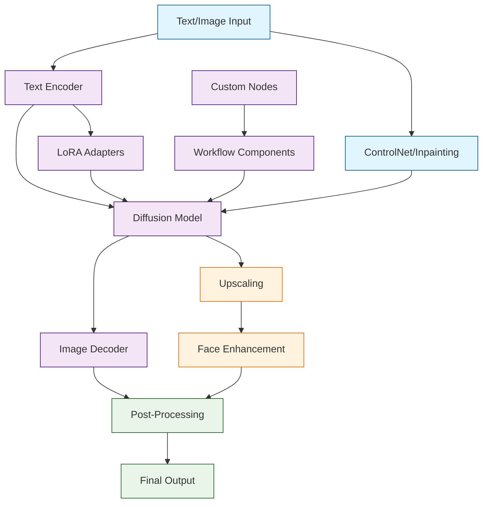

# ComfyUI Tutorial: Mastering AI Image Generation Workflows

> A deep technical walkthrough of ComfyUI covering Mastering AI Image Generation Workflows.

ComfyUI[View Repo](https://github.com/comfyanonymous/ComfyUI) is a powerful and modular Stable Diffusion GUI with a graph/nodes interface that allows users to create complex AI image generation workflows with unprecedented control and flexibility. It provides a node-based interface where users can connect different components to create sophisticated image generation pipelines.

ComfyUI represents a paradigm shift in AI image generation, offering unparalleled customization and control compared to traditional interfaces, making it the tool of choice for professional artists, researchers, and advanced users.

## Tutorial Chapters

Welcome to your journey through advanced AI image generation! This tutorial explores how to master ComfyUI's node-based interface for creating professional-grade image generation workflows.

1. **[Chapter 1: Getting Started with ComfyUI](01-getting-started.md)** - Installation, setup, and your first image generation
2. **[Chapter 2: Understanding Nodes & Workflows](02-nodes-workflows.md)** - Core concepts and basic workflow creation
3. **[Chapter 3: Text-to-Image Generation](03-text-to-image.md)** - Creating images from text prompts with advanced controls
4. **[Chapter 4: Image-to-Image & Inpainting](04-image-to-image.md)** - Modifying existing images and targeted editing
5. **[Chapter 5: ControlNet & Pose Control](05-controlnet-integration.md)** - Precise control over image composition and poses
6. **[Chapter 6: LoRA & Model Customization](06-lora-customization.md)** - Fine-tuning and custom model integration
7. **[Chapter 7: Advanced Workflows & Automation](07-advanced-workflows.md)** - Complex multi-step generation pipelines
8. **[Chapter 8: Production & Optimization](08-production-optimization.md)** - Performance tuning and batch processing

## What You'll Learn

By the end of this tutorial, you'll be able to:

- **Master ComfyUI's node-based interface** for creating complex generation workflows
- **Create professional-grade images** with precise control over every aspect
- **Implement advanced techniques** like ControlNet, LoRA, and inpainting
- **Build reusable workflows** for consistent results across projects
- **Optimize performance** for faster generation and better quality
- **Integrate custom models** and extensions into your workflows
- **Automate complex pipelines** for batch processing and variations
- **Troubleshoot and debug** complex node configurations

## Prerequisites

- Python 3.8+ (for local installation) or ComfyUI Desktop
- Basic understanding of AI image generation concepts
- Familiarity with Stable Diffusion (helpful but not required)
- GPU with at least 4GB VRAM (recommended for local models)
- Basic understanding of computer graphics concepts

## What's New in ComfyUI (2024-2025)

> **Major Platform Evolution**: Desktop app, AI copilot, cloud service, and enhanced security mark ComfyUI's transformation into a professional-grade platform.

**🚀 ComfyUI Desktop (March 2025):**
- 🖥️ **Official Desktop App**: Lightweight 200MB client for Windows/Mac
- 🔒 **Code-Signed & Secure**: Removes "unidentified developer" warnings
- 📁 **Smart Model Access**: Directly uses existing model paths without re-downloads
- 🎯 **No Command Line**: Streamlined installation without complex setup

**🤖 ComfyUI Copilot (March 2025) - Alibaba:**
- 🎓 **AI Learning Assistant**: Step-by-step tutorials for new users
- ⚡ **Workflow Generation**: Creates workflows from natural language descriptions
- 💡 **Real-Time Optimization**: Intelligent suggestions for workflow improvement
- 📈 **Accelerated Proficiency**: Helps users master ComfyUI faster

**🔐 Security Overhaul (January 2025):**
- 🛡️ **Vulnerability Prevention**: Restrictions on `eval/exec` and risky code patterns
- 🔍 **AI Threat Detection**: Automated scanning for security threats
- 📢 **Community Alerts**: Discord notifications for verified security issues
- ✅ **Safe Ecosystem**: Enhanced protection for custom nodes

**🎨 Model Support (2024-2025):**
- 🆕 **Stable Diffusion 3.5**: Latest SD model with improved quality and prompt adherence
- ☁️ **ComfyUI Cloud Beta**: Run complex pipelines in the cloud (November 2025)
- 🤝 **Collaboration Features**: Workflow synchronization across devices
- 🔧 **Custom Node Integration**: Seamless cloud support for extensions

## Learning Path

### 🟢 Beginner Track
Perfect for users new to AI image generation:
1. Chapters 1-2: Installation and basic node understanding
2. Focus on learning ComfyUI's interface and basic workflows

### 🟡 Intermediate Track
For users familiar with AI image generation:
1. Chapters 3-5: Advanced generation techniques and control methods
2. Learn to create sophisticated, professional results

### 🔴 Advanced Track
For professional artists and researchers:
1. Chapters 6-8: Custom models, complex workflows, and optimization
2. Master production-ready AI image generation pipelines

---

**Ready to unlock the full potential of AI image generation? Let's begin with [Chapter 1: Getting Started](01-getting-started.md)!**

## Navigation & Backlinks

- [Start Here: Chapter 1: Getting Started with ComfyUI](01-getting-started.md)
- [Back to Main Catalog](../../README.md#-tutorial-catalog)
- [Browse A-Z Tutorial Directory](../../discoverability/tutorial-directory.md)
- [Search by Intent](../../discoverability/query-hub.md)
- [Explore Category Hubs](../../README.md#category-hubs)

*Generated by [AI Codebase Knowledge Builder](https://github.com/The-Pocket/Tutorial-Codebase-Knowledge)*

## Full Chapter Map

1. [Chapter 1: Getting Started with ComfyUI](01-getting-started.md)
2. [Chapter 2: Understanding Nodes & Workflows](02-nodes-workflows.md)
3. [Chapter 3: Text-to-Image Generation](03-text-to-image.md)
4. [Chapter 4: Image-to-Image & Inpainting](04-image-to-image.md)
5. [Chapter 5: ControlNet & Pose Control](05-controlnet-integration.md)
6. [Chapter 6: LoRA & Model Customization](06-lora-customization.md)
7. [Chapter 7: Advanced Workflows & Automation](07-advanced-workflows.md)
8. [Chapter 8: Production & Optimization](08-production-optimization.md)

## Source References

- [View Repo](https://github.com/comfyanonymous/ComfyUI)

