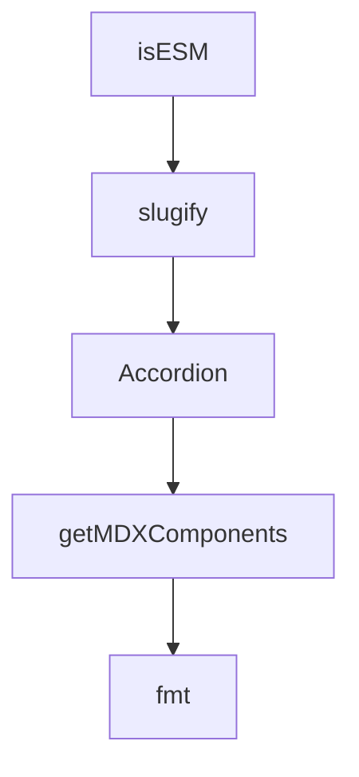

# Chapter 1: Getting Started

Welcome to **Chapter 1: Getting Started**. In this part of **Composio Tutorial: Production Tool and Authentication Infrastructure for AI Agents**, you will build an intuitive mental model first, then move into concrete implementation details and practical production tradeoffs.


This chapter establishes a fast path to running a first Composio-backed agent with real toolkit actions.

## Learning Goals

- launch a first end-to-end session with authenticated tool use
- select an initial provider path without over-optimizing
- validate user scoping and session behavior early
- capture a minimal production-oriented baseline

## Fast Start Loop

1. follow the [Quickstart](https://github.com/ComposioHQ/composio/blob/next/docs/content/docs/quickstart.mdx)
2. create one test `user_id` and session
3. run a bounded task using a single toolkit (for example GitHub or Gmail)
4. complete authentication via Connect Link when prompted
5. verify response quality, tool-call behavior, and traceability

## Baseline Checklist

| Check | Expected Outcome |
|:------|:-----------------|
| session creation | stable session object with tool access |
| auth prompt | connect flow appears when required |
| tool execution | returns structured response and useful metadata |
| repeatability | same task behaves consistently across runs |

## Source References

- [Quickstart](https://github.com/ComposioHQ/composio/blob/next/docs/content/docs/quickstart.mdx)
- [README](https://github.com/ComposioHQ/composio/blob/next/README.md)

## Summary

You now have a practical starting baseline for iterative Composio adoption.

Next: [Chapter 2: Sessions, Meta Tools, and User Scoping](02-sessions-meta-tools-and-user-scoping.md)

## Source Code Walkthrough

### `tsdown.config.base.ts`

The `isESM` function in [`tsdown.config.base.ts`](https://github.com/ComposioHQ/composio/blob/HEAD/tsdown.config.base.ts) handles a key part of this chapter's functionality:

```ts
  outDir: 'dist',
  outExtensions: (ctx) => ({
    js: isESM(ctx)
      ? '.mjs'
      : '.cjs',
    dts: isESM(ctx)
      ? '.d.mts'
      : '.d.cts',
  }),

  /**
   * Configures the output formats for the build.
   * - 'esm' generates ESM (ECMAScript Module) output
   * - 'cjs' generates lecayse CommonJS output
   */
  format: ['esm', 'cjs' /* legacy */],

  /**
   * Generates TypeScript declaration files (.d.mts, .d.ts)
   */
  dts: true,

  /**
   * Clean `outDir` before each build.
   */
  clean: true,

  /**
   * Compress code to reduce bundle size.
   */
  minify: false,

```

This function is important because it defines how Composio Tutorial: Production Tool and Authentication Infrastructure for AI Agents implements the patterns covered in this chapter.

### `docs/mdx-components.tsx`

The `slugify` function in [`docs/mdx-components.tsx`](https://github.com/ComposioHQ/composio/blob/HEAD/docs/mdx-components.tsx) handles a key part of this chapter's functionality:

```tsx
} from 'lucide-react';

function slugify(text: string): string {
  return text.toLowerCase().replace(/[^a-z0-9]+/g, '-').replace(/(^-|-$)/g, '');
}

export function Accordion({ id, title, ...props }: ComponentProps<typeof BaseAccordion>) {
  return <BaseAccordion id={id ?? (typeof title === 'string' ? slugify(title) : undefined)} title={title} {...props} />;
}

export { Accordions };

export function getMDXComponents(components?: MDXComponents): MDXComponents {
  return {
    ...defaultMdxComponents,
    h2: (props) => <Heading as="h2" {...props} />,
    h3: (props) => <Heading as="h3" {...props} />,
    h4: (props) => <Heading as="h4" {...props} />,
    img: (props) => <ImageZoom {...(props as any)} />,
    YouTube,
    Tabs,
    Tab,
    TabsList,
    TabsTrigger,
    TabsContent,
    Accordion,
    Accordions,
    Callout,
    Step,
    Steps,
    Card,
    Cards,
```

This function is important because it defines how Composio Tutorial: Production Tool and Authentication Infrastructure for AI Agents implements the patterns covered in this chapter.

### `docs/mdx-components.tsx`

The `Accordion` function in [`docs/mdx-components.tsx`](https://github.com/ComposioHQ/composio/blob/HEAD/docs/mdx-components.tsx) handles a key part of this chapter's functionality:

```tsx
import type { MDXComponents } from 'mdx/types';
import type { ComponentProps } from 'react';
import { Accordion as BaseAccordion, Accordions } from 'fumadocs-ui/components/accordion';
import { Tabs, Tab, TabsList, TabsTrigger, TabsContent } from 'fumadocs-ui/components/tabs';
import { Callout } from 'fumadocs-ui/components/callout';
import { Step, Steps } from 'fumadocs-ui/components/steps';
import { Card, Cards } from 'fumadocs-ui/components/card';
import { ImageZoom } from 'fumadocs-ui/components/image-zoom';
import { Heading } from '@/components/heading';
import { YouTube } from '@/components/youtube';
import { ProviderCard, ProviderGrid } from '@/components/provider-card';
import { FrameworkSelector, QuickstartFlow, FrameworkOption, PromptBanner } from '@/components/quickstart';
import { IntegrationTabs, IntegrationContent } from '@/components/quickstart/integration-tabs';
import { ToolTypeFlow, ToolTypeOption } from '@/components/tool-type-selector';
import { ConnectFlow, ConnectClientOption } from '@/components/connect-flow';
import { Figure } from '@/components/figure';
import { StepTitle } from '@/components/step-title';
import { Video } from '@/components/video';
import { CapabilityCard, CapabilityList } from '@/components/capability-card';
import { TemplateCard, TemplateGrid } from '@/components/template-card';
import { ToolkitsLanding } from '@/components/toolkits/toolkits-landing';
import { ManagedAuthList } from '@/components/toolkits/managed-auth-list';
import { Mermaid } from '@/components/mermaid';
import { AIToolsBanner } from '@/components/ai-tools-banner';
import { Glossary, GlossaryTerm } from '@/components/glossary';
import {
  ShieldCheck,
  Route as RouteIcon,
  Key,
  Wrench,
  Database,
  Zap,
```

This function is important because it defines how Composio Tutorial: Production Tool and Authentication Infrastructure for AI Agents implements the patterns covered in this chapter.

### `docs/mdx-components.tsx`

The `getMDXComponents` function in [`docs/mdx-components.tsx`](https://github.com/ComposioHQ/composio/blob/HEAD/docs/mdx-components.tsx) handles a key part of this chapter's functionality:

```tsx
export { Accordions };

export function getMDXComponents(components?: MDXComponents): MDXComponents {
  return {
    ...defaultMdxComponents,
    h2: (props) => <Heading as="h2" {...props} />,
    h3: (props) => <Heading as="h3" {...props} />,
    h4: (props) => <Heading as="h4" {...props} />,
    img: (props) => <ImageZoom {...(props as any)} />,
    YouTube,
    Tabs,
    Tab,
    TabsList,
    TabsTrigger,
    TabsContent,
    Accordion,
    Accordions,
    Callout,
    Step,
    Steps,
    Card,
    Cards,
    ProviderCard,
    ProviderGrid,
    FrameworkSelector,
    QuickstartFlow,
    FrameworkOption,
    IntegrationTabs,
    IntegrationContent,
    PromptBanner,
    ToolTypeFlow,
    ToolTypeOption,
```

This function is important because it defines how Composio Tutorial: Production Tool and Authentication Infrastructure for AI Agents implements the patterns covered in this chapter.


## How These Components Connect


