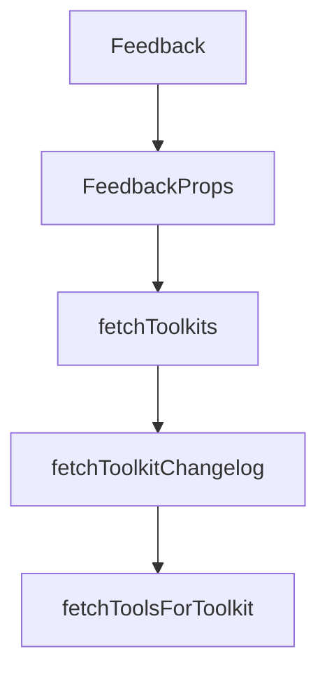

# Chapter 2: Sessions, Meta Tools, and User Scoping

Welcome to **Chapter 2: Sessions, Meta Tools, and User Scoping**. In this part of **Composio Tutorial: Production Tool and Authentication Infrastructure for AI Agents**, you will build an intuitive mental model first, then move into concrete implementation details and practical production tradeoffs.


This chapter explains the core operational model: user-scoped sessions with meta tools that discover and execute capabilities dynamically.

## Learning Goals

- understand why Composio uses session-scoped meta tools
- map user IDs to connected accounts and execution context
- control discoverability boundaries for safer tool use
- avoid context overload from indiscriminate tool loading

## Core Model

Composio sessions expose meta tools such as `COMPOSIO_SEARCH_TOOLS`, `COMPOSIO_MANAGE_CONNECTIONS`, and execution/workbench helpers. Instead of preloading hundreds of raw tools, agents discover and call what they need at runtime.

This model improves scalability and reduces prompt/tool context bloat while preserving user-specific auth and permissions.

## Design Guardrails

| Design Choice | Recommendation |
|:--------------|:---------------|
| User identity | use stable app-level user IDs, not transient request IDs |
| Session scope | restrict discoverable toolkits for narrower workloads |
| Connection handling | keep connected account lifecycle auditable |
| Catalog browsing | inspect tool schemas before enabling broad access |

## Source References

- [Tools and Toolkits](https://github.com/ComposioHQ/composio/blob/next/docs/content/docs/tools-and-toolkits.mdx)
- [Fetching Tools and Toolkits](https://github.com/ComposioHQ/composio/blob/next/docs/content/docs/toolkits/fetching-tools-and-toolkits.mdx)
- [Users and Sessions](https://github.com/ComposioHQ/composio/blob/next/docs/content/docs/users-and-sessions.mdx)

## Summary

You now understand the session-centric model that underpins scalable Composio deployments.

Next: [Chapter 3: Provider Integrations and Framework Mapping](03-provider-integrations-and-framework-mapping.md)

## Depth Expansion Playbook

## Source Code Walkthrough

### `docs/components/feedback.tsx`

The `Feedback` function in [`docs/components/feedback.tsx`](https://github.com/ComposioHQ/composio/blob/HEAD/docs/components/feedback.tsx) handles a key part of this chapter's functionality:

```tsx
type Sentiment = 'positive' | 'neutral' | 'negative' | null;

interface FeedbackProps {
  page: string;
}

export function Feedback({ page }: FeedbackProps) {
  const [isOpen, setIsOpen] = useState(false);
  const [sentiment, setSentiment] = useState<Sentiment>(null);
  const [message, setMessage] = useState('');
  const [email, setEmail] = useState('');
  const [state, setState] = useState<'idle' | 'loading' | 'success' | 'error'>('idle');
  const closeTimeoutRef = useRef<ReturnType<typeof setTimeout> | null>(null);

  useEffect(() => {
    return () => {
      if (closeTimeoutRef.current) {
        clearTimeout(closeTimeoutRef.current);
      }
    };
  }, []);

  const handleSubmit = async (e: React.FormEvent) => {
    e.preventDefault();
    if (!message.trim()) return;

    setState('loading');

    try {
      const response = await fetch('/api/feedback', {
        method: 'POST',
        headers: { 'Content-Type': 'application/json' },
```

This function is important because it defines how Composio Tutorial: Production Tool and Authentication Infrastructure for AI Agents implements the patterns covered in this chapter.

### `docs/components/feedback.tsx`

The `FeedbackProps` interface in [`docs/components/feedback.tsx`](https://github.com/ComposioHQ/composio/blob/HEAD/docs/components/feedback.tsx) handles a key part of this chapter's functionality:

```tsx
type Sentiment = 'positive' | 'neutral' | 'negative' | null;

interface FeedbackProps {
  page: string;
}

export function Feedback({ page }: FeedbackProps) {
  const [isOpen, setIsOpen] = useState(false);
  const [sentiment, setSentiment] = useState<Sentiment>(null);
  const [message, setMessage] = useState('');
  const [email, setEmail] = useState('');
  const [state, setState] = useState<'idle' | 'loading' | 'success' | 'error'>('idle');
  const closeTimeoutRef = useRef<ReturnType<typeof setTimeout> | null>(null);

  useEffect(() => {
    return () => {
      if (closeTimeoutRef.current) {
        clearTimeout(closeTimeoutRef.current);
      }
    };
  }, []);

  const handleSubmit = async (e: React.FormEvent) => {
    e.preventDefault();
    if (!message.trim()) return;

    setState('loading');

    try {
      const response = await fetch('/api/feedback', {
        method: 'POST',
        headers: { 'Content-Type': 'application/json' },
```

This interface is important because it defines how Composio Tutorial: Production Tool and Authentication Infrastructure for AI Agents implements the patterns covered in this chapter.

### `docs/scripts/generate-toolkits.ts`

The `fetchToolkits` function in [`docs/scripts/generate-toolkits.ts`](https://github.com/ComposioHQ/composio/blob/HEAD/docs/scripts/generate-toolkits.ts) handles a key part of this chapter's functionality:

```ts
}

async function fetchToolkits(): Promise<any[]> {
  console.log('Fetching toolkits from API...');

  const response = await fetch(`${API_BASE}/toolkits`, {
    headers: {
      'Content-Type': 'application/json',
      'x-api-key': API_KEY!,
    },
  });

  if (!response.ok) {
    throw new Error(`Failed to fetch toolkits: ${response.status} ${response.statusText}`);
  }

  const data = await response.json();
  return data.items || data;
}

async function fetchToolkitChangelog(): Promise<Map<string, string>> {
  console.log('Fetching toolkit changelog...');

  const response = await fetch(`${API_BASE}/toolkits/changelog`, {
    headers: {
      'Content-Type': 'application/json',
      'x-api-key': API_KEY!,
    },
  });

  if (!response.ok) {
    console.warn(`Failed to fetch changelog: ${response.status}`);
```

This function is important because it defines how Composio Tutorial: Production Tool and Authentication Infrastructure for AI Agents implements the patterns covered in this chapter.

### `docs/scripts/generate-toolkits.ts`

The `fetchToolkitChangelog` function in [`docs/scripts/generate-toolkits.ts`](https://github.com/ComposioHQ/composio/blob/HEAD/docs/scripts/generate-toolkits.ts) handles a key part of this chapter's functionality:

```ts
}

async function fetchToolkitChangelog(): Promise<Map<string, string>> {
  console.log('Fetching toolkit changelog...');

  const response = await fetch(`${API_BASE}/toolkits/changelog`, {
    headers: {
      'Content-Type': 'application/json',
      'x-api-key': API_KEY!,
    },
  });

  if (!response.ok) {
    console.warn(`Failed to fetch changelog: ${response.status}`);
    return new Map();
  }

  const data = await response.json();
  const versionMap = new Map<string, string>();

  // Response format: { items: [{ slug, name, display_name, versions: [{ version, changelog }] }] }
  const items = data.items || [];
  for (const entry of items) {
    const slug = entry.slug?.toLowerCase();
    const latestVersion = entry.versions?.[0]?.version;
    if (slug && latestVersion) {
      versionMap.set(slug, latestVersion);
    }
  }

  console.log(`Found versions for ${versionMap.size} toolkits`);
  return versionMap;
```

This function is important because it defines how Composio Tutorial: Production Tool and Authentication Infrastructure for AI Agents implements the patterns covered in this chapter.


## How These Components Connect


