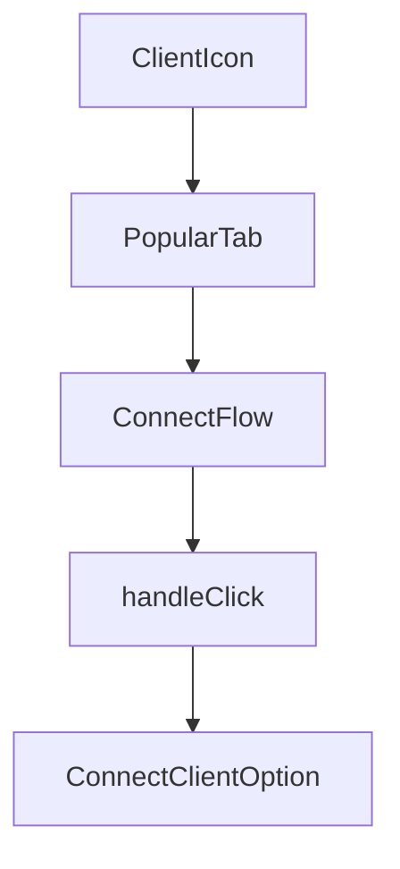

# Chapter 2: Sessions, Meta Tools, and User Scoping

Welcome to **Chapter 2: Sessions, Meta Tools, and User Scoping**. In this part of **Composio Tutorial: Production Tool and Authentication Infrastructure for AI Agents**, you will build an intuitive mental model first, then move into concrete implementation details and practical production tradeoffs.


This chapter explains the core operational model: user-scoped sessions with meta tools that discover and execute capabilities dynamically.

## Learning Goals

- understand why Composio uses session-scoped meta tools
- map user IDs to connected accounts and execution context
- control discoverability boundaries for safer tool use
- avoid context overload from indiscriminate tool loading

## Core Model

Composio sessions expose meta tools such as `COMPOSIO_SEARCH_TOOLS`, `COMPOSIO_MANAGE_CONNECTIONS`, and execution/workbench helpers. Instead of preloading hundreds of raw tools, agents discover and call what they need at runtime.

This model improves scalability and reduces prompt/tool context bloat while preserving user-specific auth and permissions.

## Design Guardrails

| Design Choice | Recommendation |
|:--------------|:---------------|
| User identity | use stable app-level user IDs, not transient request IDs |
| Session scope | restrict discoverable toolkits for narrower workloads |
| Connection handling | keep connected account lifecycle auditable |
| Catalog browsing | inspect tool schemas before enabling broad access |

## Source References

- [Tools and Toolkits](https://github.com/ComposioHQ/composio/blob/next/docs/content/docs/tools-and-toolkits.mdx)
- [Fetching Tools and Toolkits](https://github.com/ComposioHQ/composio/blob/next/docs/content/docs/toolkits/fetching-tools-and-toolkits.mdx)
- [Users and Sessions](https://github.com/ComposioHQ/composio/blob/next/docs/content/docs/users-and-sessions.mdx)

## Summary

You now understand the session-centric model that underpins scalable Composio deployments.

Next: [Chapter 3: Provider Integrations and Framework Mapping](03-provider-integrations-and-framework-mapping.md)

## Source Code Walkthrough

### `docs/components/connect-flow.tsx`

The `ClientIcon` function in [`docs/components/connect-flow.tsx`](https://github.com/ComposioHQ/composio/blob/HEAD/docs/components/connect-flow.tsx) handles a key part of this chapter's functionality:

```tsx
const ConnectContext = createContext<ConnectContextValue | null>(null);

function ClientIcon({ icon, iconDark, name, size = 16 }: { icon?: string; iconDark?: string; name: string; size?: number }) {
  if (!icon) return null;

  if (iconDark) {
    return (
      <>
        <Image src={icon} alt={`${name} logo`} width={size} height={size} className="h-4 w-4 shrink-0 dark:hidden" />
        <Image src={iconDark} alt={`${name} logo`} width={size} height={size} className="h-4 w-4 shrink-0 hidden dark:block" />
      </>
    );
  }

  return <Image src={icon} alt={`${name} logo`} width={size} height={size} className="h-4 w-4 shrink-0" />;
}

function PopularTab({
  client,
  selected,
  onSelect,
}: {
  client: ClientData;
  selected: boolean;
  onSelect: () => void;
}) {
  return (
    <button
      type="button"
      onClick={onSelect}
      className={`
        flex items-center gap-2 rounded-md px-3 py-1.5 text-sm font-medium transition-all whitespace-nowrap
```

This function is important because it defines how Composio Tutorial: Production Tool and Authentication Infrastructure for AI Agents implements the patterns covered in this chapter.

### `docs/components/connect-flow.tsx`

The `PopularTab` function in [`docs/components/connect-flow.tsx`](https://github.com/ComposioHQ/composio/blob/HEAD/docs/components/connect-flow.tsx) handles a key part of this chapter's functionality:

```tsx
}

function PopularTab({
  client,
  selected,
  onSelect,
}: {
  client: ClientData;
  selected: boolean;
  onSelect: () => void;
}) {
  return (
    <button
      type="button"
      onClick={onSelect}
      className={`
        flex items-center gap-2 rounded-md px-3 py-1.5 text-sm font-medium transition-all whitespace-nowrap
        focus-visible:outline-none focus-visible:ring-2 focus-visible:ring-orange-500
        ${selected
          ? 'bg-fd-background text-fd-foreground shadow-sm dark:bg-fd-accent/60 dark:shadow-none'
          : 'text-fd-muted-foreground hover:text-fd-foreground'
        }
      `}
    >
      <ClientIcon icon={client.icon} iconDark={client.iconDark} name={client.name} />
      {client.name}
    </button>
  );
}

interface ConnectFlowProps {
  children: ReactNode;
```

This function is important because it defines how Composio Tutorial: Production Tool and Authentication Infrastructure for AI Agents implements the patterns covered in this chapter.

### `docs/components/connect-flow.tsx`

The `ConnectFlow` function in [`docs/components/connect-flow.tsx`](https://github.com/ComposioHQ/composio/blob/HEAD/docs/components/connect-flow.tsx) handles a key part of this chapter's functionality:

```tsx
}

interface ConnectFlowProps {
  children: ReactNode;
}

export function ConnectFlow({ children }: ConnectFlowProps) {
  const [clients, setClients] = useState<ClientData[]>([]);
  const [selectedId, setSelectedId] = useState<string>('');
  const registeredIds = useRef<Set<string>>(new Set());
  const [dropdownOpen, setDropdownOpen] = useState(false);
  const dropdownRef = useRef<HTMLDivElement>(null);

  const registerClient = (data: ClientData) => {
    if (!registeredIds.current.has(data.id)) {
      registeredIds.current.add(data.id);
      setClients((prev) => {
        if (prev.some((c) => c.id === data.id)) return prev;
        return [...prev, data];
      });
    }
  };

  useEffect(() => {
    if (clients.length > 0 && !selectedId) {
      setSelectedId(clients[0].id);
    }
  }, [clients, selectedId]);

  // Close dropdown on outside click
  useEffect(() => {
    function handleClick(e: MouseEvent) {
```

This function is important because it defines how Composio Tutorial: Production Tool and Authentication Infrastructure for AI Agents implements the patterns covered in this chapter.

### `docs/components/connect-flow.tsx`

The `handleClick` function in [`docs/components/connect-flow.tsx`](https://github.com/ComposioHQ/composio/blob/HEAD/docs/components/connect-flow.tsx) handles a key part of this chapter's functionality:

```tsx
  // Close dropdown on outside click
  useEffect(() => {
    function handleClick(e: MouseEvent) {
      if (dropdownRef.current && !dropdownRef.current.contains(e.target as Node)) {
        setDropdownOpen(false);
      }
    }
    if (dropdownOpen) {
      document.addEventListener('mousedown', handleClick);
      return () => document.removeEventListener('mousedown', handleClick);
    }
  }, [dropdownOpen]);

  const contextValue: ConnectContextValue = {
    selectedId,
    setSelectedId,
    registerClient,
    clients,
  };

  const popular = clients.filter((c) => c.category === 'popular');
  const others = clients.filter((c) => c.category !== 'popular');
  const selectedIsOther = others.some((c) => c.id === selectedId);
  const selectedOtherClient = others.find((c) => c.id === selectedId);

  return (
    <ConnectContext.Provider value={contextValue}>
      {clients.length > 0 && (
        <div className="not-prose mb-8 rounded-xl border border-fd-border bg-fd-card/50">
          <div className="flex items-center justify-between gap-3 p-3">
            {/* Popular tabs */}
            <div className={`flex items-center gap-1 overflow-x-auto rounded-lg p-1 transition-all ${selectedIsOther ? 'bg-fd-muted/30 opacity-40' : 'bg-fd-muted/50 dark:bg-fd-muted/30'}`}>
```

This function is important because it defines how Composio Tutorial: Production Tool and Authentication Infrastructure for AI Agents implements the patterns covered in this chapter.


## How These Components Connect


