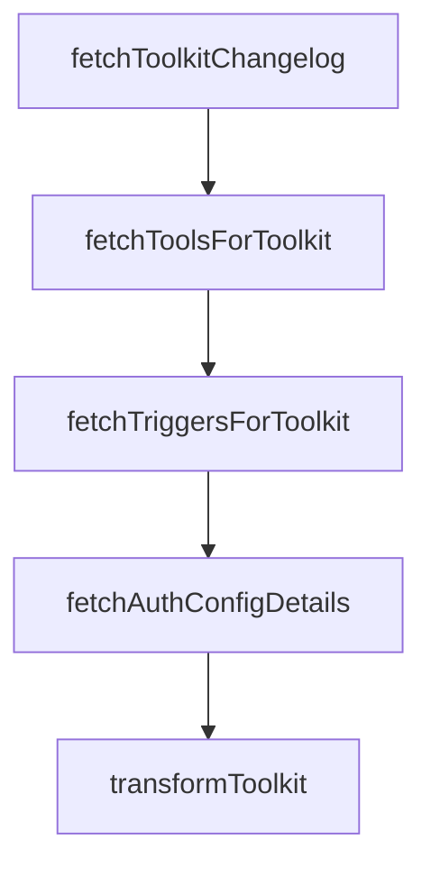

# Chapter 3: Provider Integrations and Framework Mapping

Welcome to **Chapter 3: Provider Integrations and Framework Mapping**. In this part of **Composio Tutorial: Production Tool and Authentication Infrastructure for AI Agents**, you will build an intuitive mental model first, then move into concrete implementation details and practical production tradeoffs.


This chapter maps Composio provider options to concrete runtime and framework choices.

## Learning Goals

- choose a provider path aligned to your existing agent stack
- compare native-tool and MCP-backed integration flows
- design migration-friendly provider boundaries
- avoid lock-in to one framework-specific abstraction

## Integration Decision Table

| Scenario | Recommended Path |
|:---------|:-----------------|
| OpenAI Agents SDK runtime | OpenAI Agents provider with session tools |
| LangChain/LangGraph orchestration | LangChain provider for framework-native tools |
| Vercel AI SDK product stack | Vercel provider or MCP client path |
| mixed or evolving stack | keep Composio usage centered on sessions + explicit provider adapters |

## Practical Pattern

- prototype with one provider and one toolkit family
- document provider-specific tool object behavior
- keep execution contracts abstracted in your app service layer
- expand only after latency/reliability checks and auth validation

## Source References

- [OpenAI Agents Provider](https://github.com/ComposioHQ/composio/blob/next/docs/content/docs/providers/openai-agents.mdx)
- [LangChain Provider](https://github.com/ComposioHQ/composio/blob/next/docs/content/docs/providers/langchain.mdx)
- [Vercel AI SDK Provider](https://github.com/ComposioHQ/composio/blob/next/docs/content/docs/providers/vercel.mdx)

## Summary

You now have a framework-aware way to choose Composio provider integrations.

Next: [Chapter 4: Authentication and Connected Accounts](04-authentication-and-connected-accounts.md)

## Source Code Walkthrough

### `docs/scripts/generate-toolkits.ts`

The `fetchToolkitChangelog` function in [`docs/scripts/generate-toolkits.ts`](https://github.com/ComposioHQ/composio/blob/HEAD/docs/scripts/generate-toolkits.ts) handles a key part of this chapter's functionality:

```ts
}

async function fetchToolkitChangelog(): Promise<Map<string, string>> {
  console.log('Fetching toolkit changelog...');

  const response = await fetch(`${API_BASE}/toolkits/changelog`, {
    headers: {
      'Content-Type': 'application/json',
      'x-api-key': API_KEY!,
    },
  });

  if (!response.ok) {
    console.warn(`Failed to fetch changelog: ${response.status}`);
    return new Map();
  }

  const data = await response.json();
  const versionMap = new Map<string, string>();

  // Response format: { items: [{ slug, name, display_name, versions: [{ version, changelog }] }] }
  const items = data.items || [];
  for (const entry of items) {
    const slug = entry.slug?.toLowerCase();
    const latestVersion = entry.versions?.[0]?.version;
    if (slug && latestVersion) {
      versionMap.set(slug, latestVersion);
    }
  }

  console.log(`Found versions for ${versionMap.size} toolkits`);
  return versionMap;
```

This function is important because it defines how Composio Tutorial: Production Tool and Authentication Infrastructure for AI Agents implements the patterns covered in this chapter.

### `docs/scripts/generate-toolkits.ts`

The `fetchToolsForToolkit` function in [`docs/scripts/generate-toolkits.ts`](https://github.com/ComposioHQ/composio/blob/HEAD/docs/scripts/generate-toolkits.ts) handles a key part of this chapter's functionality:

```ts
}

async function fetchToolsForToolkit(slug: string): Promise<Tool[]> {
  const response = await fetch(`${API_BASE}/tools?toolkit_slug=${slug}&toolkit_versions=latest&limit=1000`, {
    headers: {
      'Content-Type': 'application/json',
      'x-api-key': API_KEY!,
    },
  });

  if (!response.ok) return [];

  const data = await response.json();
  const rawItems = data.items || data;
  const items = Array.isArray(rawItems) ? rawItems : [];

  return items.filter((raw: any) => raw && typeof raw === 'object').map((raw: any) => ({
    slug: raw.slug || '',
    name: raw.name || raw.display_name || raw.slug || '',
    description: raw.description || '',
  }));
}

async function fetchTriggersForToolkit(slug: string): Promise<Trigger[]> {
  const response = await fetch(`${API_BASE}/triggers_types?toolkit_slugs=${slug}&toolkit_versions=latest`, {
    headers: {
      'Content-Type': 'application/json',
      'x-api-key': API_KEY!,
    },
  });

  if (!response.ok) return [];
```

This function is important because it defines how Composio Tutorial: Production Tool and Authentication Infrastructure for AI Agents implements the patterns covered in this chapter.

### `docs/scripts/generate-toolkits.ts`

The `fetchTriggersForToolkit` function in [`docs/scripts/generate-toolkits.ts`](https://github.com/ComposioHQ/composio/blob/HEAD/docs/scripts/generate-toolkits.ts) handles a key part of this chapter's functionality:

```ts
}

async function fetchTriggersForToolkit(slug: string): Promise<Trigger[]> {
  const response = await fetch(`${API_BASE}/triggers_types?toolkit_slugs=${slug}&toolkit_versions=latest`, {
    headers: {
      'Content-Type': 'application/json',
      'x-api-key': API_KEY!,
    },
  });

  if (!response.ok) return [];

  const data = await response.json();
  const rawItems = data.items || data;
  const items = Array.isArray(rawItems) ? rawItems : [];

  return items.filter((raw: any) => raw && typeof raw === 'object').map((raw: any) => ({
    slug: raw.slug || '',
    name: raw.name || raw.display_name || raw.slug || '',
    description: raw.description || '',
  }));
}

async function fetchAuthConfigDetails(slug: string): Promise<AuthConfigDetail[]> {
  const response = await fetch(`${API_BASE}/toolkits/${slug}`, {
    headers: {
      'Content-Type': 'application/json',
      'x-api-key': API_KEY!,
    },
  });

  if (!response.ok) return [];
```

This function is important because it defines how Composio Tutorial: Production Tool and Authentication Infrastructure for AI Agents implements the patterns covered in this chapter.

### `docs/scripts/generate-toolkits.ts`

The `fetchAuthConfigDetails` function in [`docs/scripts/generate-toolkits.ts`](https://github.com/ComposioHQ/composio/blob/HEAD/docs/scripts/generate-toolkits.ts) handles a key part of this chapter's functionality:

```ts
}

async function fetchAuthConfigDetails(slug: string): Promise<AuthConfigDetail[]> {
  const response = await fetch(`${API_BASE}/toolkits/${slug}`, {
    headers: {
      'Content-Type': 'application/json',
      'x-api-key': API_KEY!,
    },
  });

  if (!response.ok) return [];

  const data = await response.json();
  const authConfigDetails = data.auth_config_details || [];

  return authConfigDetails.map((raw: any) => ({
    mode: raw.mode || '',
    name: raw.name || raw.mode || '',
    fields: {
      auth_config_creation: {
        required: (raw.fields?.auth_config_creation?.required || []).map((f: any) => ({
          name: f.name || '',
          displayName: f.displayName || f.name || '',
          type: f.type || 'string',
          description: f.description || '',
          required: f.required ?? true,
          default: f.default ?? null,
        })),
        optional: (raw.fields?.auth_config_creation?.optional || []).map((f: any) => ({
          name: f.name || '',
          displayName: f.displayName || f.name || '',
          type: f.type || 'string',
```

This function is important because it defines how Composio Tutorial: Production Tool and Authentication Infrastructure for AI Agents implements the patterns covered in this chapter.


## How These Components Connect


