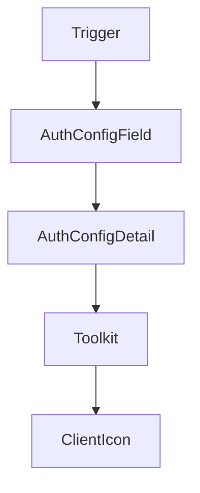

# Chapter 3: Provider Integrations and Framework Mapping

Welcome to **Chapter 3: Provider Integrations and Framework Mapping**. In this part of **Composio Tutorial: Production Tool and Authentication Infrastructure for AI Agents**, you will build an intuitive mental model first, then move into concrete implementation details and practical production tradeoffs.


This chapter maps Composio provider options to concrete runtime and framework choices.

## Learning Goals

- choose a provider path aligned to your existing agent stack
- compare native-tool and MCP-backed integration flows
- design migration-friendly provider boundaries
- avoid lock-in to one framework-specific abstraction

## Integration Decision Table

| Scenario | Recommended Path |
|:---------|:-----------------|
| OpenAI Agents SDK runtime | OpenAI Agents provider with session tools |
| LangChain/LangGraph orchestration | LangChain provider for framework-native tools |
| Vercel AI SDK product stack | Vercel provider or MCP client path |
| mixed or evolving stack | keep Composio usage centered on sessions + explicit provider adapters |

## Practical Pattern

- prototype with one provider and one toolkit family
- document provider-specific tool object behavior
- keep execution contracts abstracted in your app service layer
- expand only after latency/reliability checks and auth validation

## Source References

- [OpenAI Agents Provider](https://github.com/ComposioHQ/composio/blob/next/docs/content/docs/providers/openai-agents.mdx)
- [LangChain Provider](https://github.com/ComposioHQ/composio/blob/next/docs/content/docs/providers/langchain.mdx)
- [Vercel AI SDK Provider](https://github.com/ComposioHQ/composio/blob/next/docs/content/docs/providers/vercel.mdx)

## Summary

You now have a framework-aware way to choose Composio provider integrations.

Next: [Chapter 4: Authentication and Connected Accounts](04-authentication-and-connected-accounts.md)

## Depth Expansion Playbook

## Source Code Walkthrough

### `docs/scripts/generate-toolkits.ts`

The `Trigger` interface in [`docs/scripts/generate-toolkits.ts`](https://github.com/ComposioHQ/composio/blob/HEAD/docs/scripts/generate-toolkits.ts) handles a key part of this chapter's functionality:

```ts
}

interface Trigger {
  slug: string;
  name: string;
  description: string;
}

interface AuthConfigField {
  name: string;
  displayName: string;
  type: string;
  description: string;
  required: boolean;
  default?: string | null;
}

interface AuthConfigDetail {
  mode: string;
  name: string;
  fields: {
    auth_config_creation: {
      required: AuthConfigField[];
      optional: AuthConfigField[];
    };
    connected_account_initiation: {
      required: AuthConfigField[];
      optional: AuthConfigField[];
    };
  };
}

```

This interface is important because it defines how Composio Tutorial: Production Tool and Authentication Infrastructure for AI Agents implements the patterns covered in this chapter.

### `docs/scripts/generate-toolkits.ts`

The `AuthConfigField` interface in [`docs/scripts/generate-toolkits.ts`](https://github.com/ComposioHQ/composio/blob/HEAD/docs/scripts/generate-toolkits.ts) handles a key part of this chapter's functionality:

```ts
}

interface AuthConfigField {
  name: string;
  displayName: string;
  type: string;
  description: string;
  required: boolean;
  default?: string | null;
}

interface AuthConfigDetail {
  mode: string;
  name: string;
  fields: {
    auth_config_creation: {
      required: AuthConfigField[];
      optional: AuthConfigField[];
    };
    connected_account_initiation: {
      required: AuthConfigField[];
      optional: AuthConfigField[];
    };
  };
}

interface Toolkit {
  slug: string;
  name: string;
  logo: string | null;
  description: string;
  category: string | null;
```

This interface is important because it defines how Composio Tutorial: Production Tool and Authentication Infrastructure for AI Agents implements the patterns covered in this chapter.

### `docs/scripts/generate-toolkits.ts`

The `AuthConfigDetail` interface in [`docs/scripts/generate-toolkits.ts`](https://github.com/ComposioHQ/composio/blob/HEAD/docs/scripts/generate-toolkits.ts) handles a key part of this chapter's functionality:

```ts
}

interface AuthConfigDetail {
  mode: string;
  name: string;
  fields: {
    auth_config_creation: {
      required: AuthConfigField[];
      optional: AuthConfigField[];
    };
    connected_account_initiation: {
      required: AuthConfigField[];
      optional: AuthConfigField[];
    };
  };
}

interface Toolkit {
  slug: string;
  name: string;
  logo: string | null;
  description: string;
  category: string | null;
  authSchemes: string[];
  composioManagedAuthSchemes?: string[];
  toolCount: number;
  triggerCount: number;
  version: string | null;
  tools: Tool[];
  triggers: Trigger[];
  authConfigDetails?: AuthConfigDetail[];
}
```

This interface is important because it defines how Composio Tutorial: Production Tool and Authentication Infrastructure for AI Agents implements the patterns covered in this chapter.

### `docs/scripts/generate-toolkits.ts`

The `Toolkit` interface in [`docs/scripts/generate-toolkits.ts`](https://github.com/ComposioHQ/composio/blob/HEAD/docs/scripts/generate-toolkits.ts) handles a key part of this chapter's functionality:

```ts
/**
 * Toolkit Generator Script
 *
 * Fetches all toolkits from Composio API and generates:
 * - /public/data/toolkits.json (full data with tools & triggers - for detail pages)
 * - /public/data/toolkits-list.json (light version without tools/triggers - for landing page)
 *
 * Run: bun run generate:toolkits
 */

import { mkdir, writeFile } from 'fs/promises';
import { join } from 'path';

const API_BASE = process.env.COMPOSIO_API_BASE || 'https://backend.composio.dev/api/v3';
const API_KEY = process.env.COMPOSIO_API_KEY;

if (!API_KEY) {
  console.error('Error: COMPOSIO_API_KEY environment variable is required');
  process.exit(1);
}

const OUTPUT_DIR = join(process.cwd(), 'public/data');

interface Tool {
  slug: string;
  name: string;
  description: string;
}

interface Trigger {
  slug: string;
```

This interface is important because it defines how Composio Tutorial: Production Tool and Authentication Infrastructure for AI Agents implements the patterns covered in this chapter.


## How These Components Connect


