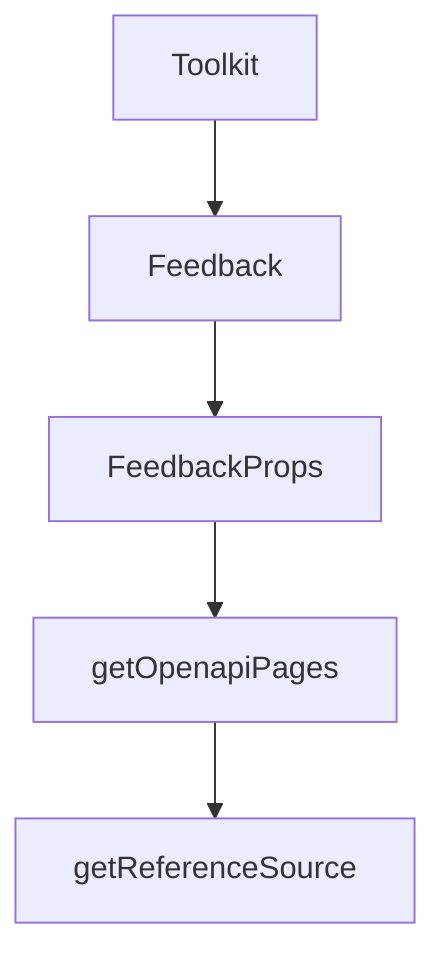

# Chapter 4: Authentication and Connected Accounts

Welcome to **Chapter 4: Authentication and Connected Accounts**. In this part of **Composio Tutorial: Production Tool and Authentication Infrastructure for AI Agents**, you will build an intuitive mental model first, then move into concrete implementation details and practical production tradeoffs.


This chapter covers authentication architecture and connected-account lifecycle management.

## Learning Goals

- distinguish auth configs from connected accounts clearly
- choose between in-chat and manual authentication flows
- model token lifecycle and account state transitions safely
- enforce least-privilege scope and account governance practices

## Authentication Model

Composio uses Connect Links and auth configs to standardize OAuth/API key setup across users. Connected accounts bind user-specific credentials to toolkit access.

For product UX, two common approaches exist:

- in-chat auth prompts for conversational agents
- manual onboarding flows for app-managed account linking

## Governance Checklist

| Control | Baseline |
|:--------|:---------|
| scope control | request only required toolkit permissions |
| account visibility | expose connected-account status in admin/debug views |
| lifecycle events | handle disabled/revoked/expired states explicitly |
| multi-account support | support work/personal account separation where needed |

## Source References

- [Authentication](https://github.com/ComposioHQ/composio/blob/next/docs/content/docs/authentication.mdx)
- [Manual Authentication](https://github.com/ComposioHQ/composio/blob/next/docs/content/docs/authenticating-users/manually-authenticating.mdx)
- [Connected Accounts](https://github.com/ComposioHQ/composio/blob/next/docs/content/docs/auth-configuration/connected-accounts.mdx)

## Summary

You now have a safer authentication foundation for multi-user production systems.

Next: [Chapter 5: Tool Execution Modes and Modifiers](05-tool-execution-modes-and-modifiers.md)

## Source Code Walkthrough

### `docs/scripts/generate-toolkits.ts`

The `Toolkit` interface in [`docs/scripts/generate-toolkits.ts`](https://github.com/ComposioHQ/composio/blob/HEAD/docs/scripts/generate-toolkits.ts) handles a key part of this chapter's functionality:

```ts
/**
 * Toolkit Generator Script
 *
 * Fetches all toolkits from Composio API and generates:
 * - /public/data/toolkits.json (full data with tools & triggers - for detail pages)
 * - /public/data/toolkits-list.json (light version without tools/triggers - for landing page)
 *
 * Run: bun run generate:toolkits
 */

import { mkdir, writeFile } from 'fs/promises';
import { join } from 'path';

const API_BASE = process.env.COMPOSIO_API_BASE || 'https://backend.composio.dev/api/v3';
const API_KEY = process.env.COMPOSIO_API_KEY;

if (!API_KEY) {
  console.error('Error: COMPOSIO_API_KEY environment variable is required');
  process.exit(1);
}

const OUTPUT_DIR = join(process.cwd(), 'public/data');

interface Tool {
  slug: string;
  name: string;
  description: string;
}

interface Trigger {
  slug: string;
```

This interface is important because it defines how Composio Tutorial: Production Tool and Authentication Infrastructure for AI Agents implements the patterns covered in this chapter.

### `docs/components/feedback.tsx`

The `Feedback` function in [`docs/components/feedback.tsx`](https://github.com/ComposioHQ/composio/blob/HEAD/docs/components/feedback.tsx) handles a key part of this chapter's functionality:

```tsx
type Sentiment = 'positive' | 'neutral' | 'negative' | null;

interface FeedbackProps {
  page: string;
}

export function Feedback({ page }: FeedbackProps) {
  const [isOpen, setIsOpen] = useState(false);
  const [sentiment, setSentiment] = useState<Sentiment>(null);
  const [message, setMessage] = useState('');
  const [email, setEmail] = useState('');
  const [state, setState] = useState<'idle' | 'loading' | 'success' | 'error'>('idle');
  const closeTimeoutRef = useRef<ReturnType<typeof setTimeout> | null>(null);

  useEffect(() => {
    return () => {
      if (closeTimeoutRef.current) {
        clearTimeout(closeTimeoutRef.current);
      }
    };
  }, []);

  const handleSubmit = async (e: React.FormEvent) => {
    e.preventDefault();
    if (!message.trim()) return;

    setState('loading');

    try {
      const response = await fetch('/api/feedback', {
        method: 'POST',
        headers: { 'Content-Type': 'application/json' },
```

This function is important because it defines how Composio Tutorial: Production Tool and Authentication Infrastructure for AI Agents implements the patterns covered in this chapter.

### `docs/components/feedback.tsx`

The `FeedbackProps` interface in [`docs/components/feedback.tsx`](https://github.com/ComposioHQ/composio/blob/HEAD/docs/components/feedback.tsx) handles a key part of this chapter's functionality:

```tsx
type Sentiment = 'positive' | 'neutral' | 'negative' | null;

interface FeedbackProps {
  page: string;
}

export function Feedback({ page }: FeedbackProps) {
  const [isOpen, setIsOpen] = useState(false);
  const [sentiment, setSentiment] = useState<Sentiment>(null);
  const [message, setMessage] = useState('');
  const [email, setEmail] = useState('');
  const [state, setState] = useState<'idle' | 'loading' | 'success' | 'error'>('idle');
  const closeTimeoutRef = useRef<ReturnType<typeof setTimeout> | null>(null);

  useEffect(() => {
    return () => {
      if (closeTimeoutRef.current) {
        clearTimeout(closeTimeoutRef.current);
      }
    };
  }, []);

  const handleSubmit = async (e: React.FormEvent) => {
    e.preventDefault();
    if (!message.trim()) return;

    setState('loading');

    try {
      const response = await fetch('/api/feedback', {
        method: 'POST',
        headers: { 'Content-Type': 'application/json' },
```

This interface is important because it defines how Composio Tutorial: Production Tool and Authentication Infrastructure for AI Agents implements the patterns covered in this chapter.

### `docs/lib/source.ts`

The `getOpenapiPages` function in [`docs/lib/source.ts`](https://github.com/ComposioHQ/composio/blob/HEAD/docs/lib/source.ts) handles a key part of this chapter's functionality:

```ts
let _openapiPagesPromise: Promise<any> | null = null;

async function getOpenapiPages() {
  if (!_openapiPagesPromise) {
    _openapiPagesPromise = openapiSource(openapi, {
      groupBy: 'tag',
      baseDir: 'api-reference',
    });
  }
  return _openapiPagesPromise;
}

export async function getReferenceSource() {
  if (!_referenceSource) {
    const openapiPages = await getOpenapiPages();
    _referenceSource = loader({
      baseUrl: '/reference',
      source: multiple({
        mdx: reference.toFumadocsSource(),
        openapi: openapiPages,
      }),
      plugins: [lucideIconsPlugin(), openapiPlugin()],
      pageTree: {
        // eslint-disable-next-line @typescript-eslint/no-explicit-any
        transformers: [defaultOpenTransformer as any],
      },
    });
  }
  return _referenceSource;
}

// Synchronous reference source for cases where OpenAPI isn't needed
```

This function is important because it defines how Composio Tutorial: Production Tool and Authentication Infrastructure for AI Agents implements the patterns covered in this chapter.


## How These Components Connect


