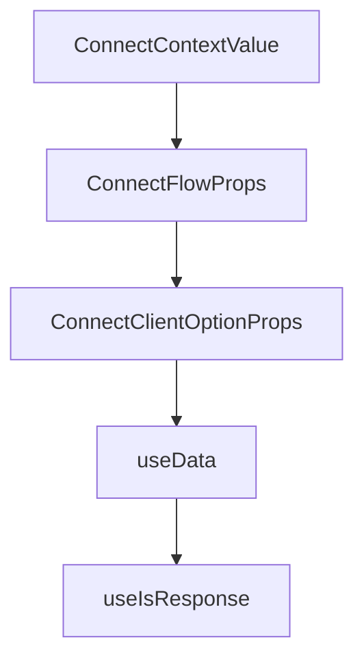

# Chapter 4: Authentication and Connected Accounts

Welcome to **Chapter 4: Authentication and Connected Accounts**. In this part of **Composio Tutorial: Production Tool and Authentication Infrastructure for AI Agents**, you will build an intuitive mental model first, then move into concrete implementation details and practical production tradeoffs.


This chapter covers authentication architecture and connected-account lifecycle management.

## Learning Goals

- distinguish auth configs from connected accounts clearly
- choose between in-chat and manual authentication flows
- model token lifecycle and account state transitions safely
- enforce least-privilege scope and account governance practices

## Authentication Model

Composio uses Connect Links and auth configs to standardize OAuth/API key setup across users. Connected accounts bind user-specific credentials to toolkit access.

For product UX, two common approaches exist:

- in-chat auth prompts for conversational agents
- manual onboarding flows for app-managed account linking

## Governance Checklist

| Control | Baseline |
|:--------|:---------|
| scope control | request only required toolkit permissions |
| account visibility | expose connected-account status in admin/debug views |
| lifecycle events | handle disabled/revoked/expired states explicitly |
| multi-account support | support work/personal account separation where needed |

## Source References

- [Authentication](https://github.com/ComposioHQ/composio/blob/next/docs/content/docs/authentication.mdx)
- [Manual Authentication](https://github.com/ComposioHQ/composio/blob/next/docs/content/docs/authenticating-users/manually-authenticating.mdx)
- [Connected Accounts](https://github.com/ComposioHQ/composio/blob/next/docs/content/docs/auth-configuration/connected-accounts.mdx)

## Summary

You now have a safer authentication foundation for multi-user production systems.

Next: [Chapter 5: Tool Execution Modes and Modifiers](05-tool-execution-modes-and-modifiers.md)

## Depth Expansion Playbook

## Source Code Walkthrough

### `docs/components/connect-flow.tsx`

The `ConnectContextValue` interface in [`docs/components/connect-flow.tsx`](https://github.com/ComposioHQ/composio/blob/HEAD/docs/components/connect-flow.tsx) handles a key part of this chapter's functionality:

```tsx
}

interface ConnectContextValue {
  selectedId: string;
  setSelectedId: (id: string) => void;
  registerClient: (data: ClientData) => void;
  clients: ClientData[];
}

const ConnectContext = createContext<ConnectContextValue | null>(null);

function ClientIcon({ icon, iconDark, name, size = 16 }: { icon?: string; iconDark?: string; name: string; size?: number }) {
  if (!icon) return null;

  if (iconDark) {
    return (
      <>
        <Image src={icon} alt={`${name} logo`} width={size} height={size} className="h-4 w-4 shrink-0 dark:hidden" />
        <Image src={iconDark} alt={`${name} logo`} width={size} height={size} className="h-4 w-4 shrink-0 hidden dark:block" />
      </>
    );
  }

  return <Image src={icon} alt={`${name} logo`} width={size} height={size} className="h-4 w-4 shrink-0" />;
}

function PopularTab({
  client,
  selected,
  onSelect,
}: {
  client: ClientData;
```

This interface is important because it defines how Composio Tutorial: Production Tool and Authentication Infrastructure for AI Agents implements the patterns covered in this chapter.

### `docs/components/connect-flow.tsx`

The `ConnectFlowProps` interface in [`docs/components/connect-flow.tsx`](https://github.com/ComposioHQ/composio/blob/HEAD/docs/components/connect-flow.tsx) handles a key part of this chapter's functionality:

```tsx
}

interface ConnectFlowProps {
  children: ReactNode;
}

export function ConnectFlow({ children }: ConnectFlowProps) {
  const [clients, setClients] = useState<ClientData[]>([]);
  const [selectedId, setSelectedId] = useState<string>('');
  const registeredIds = useRef<Set<string>>(new Set());
  const [dropdownOpen, setDropdownOpen] = useState(false);
  const dropdownRef = useRef<HTMLDivElement>(null);

  const registerClient = (data: ClientData) => {
    if (!registeredIds.current.has(data.id)) {
      registeredIds.current.add(data.id);
      setClients((prev) => {
        if (prev.some((c) => c.id === data.id)) return prev;
        return [...prev, data];
      });
    }
  };

  useEffect(() => {
    if (clients.length > 0 && !selectedId) {
      setSelectedId(clients[0].id);
    }
  }, [clients, selectedId]);

  // Close dropdown on outside click
  useEffect(() => {
    function handleClick(e: MouseEvent) {
```

This interface is important because it defines how Composio Tutorial: Production Tool and Authentication Infrastructure for AI Agents implements the patterns covered in this chapter.

### `docs/components/connect-flow.tsx`

The `ConnectClientOptionProps` interface in [`docs/components/connect-flow.tsx`](https://github.com/ComposioHQ/composio/blob/HEAD/docs/components/connect-flow.tsx) handles a key part of this chapter's functionality:

```tsx
}

interface ConnectClientOptionProps {
  id: string;
  name: string;
  description: string;
  icon?: string;
  iconDark?: string;
  category?: 'popular' | 'ide' | 'other';
  children: ReactNode;
}

export function ConnectClientOption({
  id,
  name,
  description,
  icon,
  iconDark,
  category = 'other',
  children,
}: ConnectClientOptionProps) {
  const context = useContext(ConnectContext);
  const hasRegistered = useRef(false);

  useEffect(() => {
    if (context && !hasRegistered.current) {
      context.registerClient({ id, name, description, icon, iconDark, category });
      hasRegistered.current = true;
    }
  }, [context, id, name, description, icon, iconDark, category]);

  if (!context || context.selectedId !== id) {
```

This interface is important because it defines how Composio Tutorial: Production Tool and Authentication Infrastructure for AI Agents implements the patterns covered in this chapter.

### `docs/components/custom-schema-ui.tsx`

The `useData` function in [`docs/components/custom-schema-ui.tsx`](https://github.com/ComposioHQ/composio/blob/HEAD/docs/components/custom-schema-ui.tsx) handles a key part of this chapter's functionality:

```tsx
const ResponseContext = createContext(false);

function useData() {
  const ctx = use(DataContext);
  if (!ctx) throw new Error('Missing DataContext');
  return ctx;
}

function useIsResponse() {
  return use(ResponseContext);
}

export function CustomSchemaUI({
  name,
  required = false,
  as = 'property',
  generated,
  isResponse = false,
}: SchemaUIProps) {
  const schema = generated.refs[generated.$root];
  const isProperty = as === 'property' || !isExpandable(schema, generated.refs);

  return (
    <DataContext value={generated}>
      <ResponseContext value={isResponse}>
        {isProperty ? (
          <SchemaProperty
            name={name}
            $type={generated.$root}
            required={required}
            isRoot
          />
```

This function is important because it defines how Composio Tutorial: Production Tool and Authentication Infrastructure for AI Agents implements the patterns covered in this chapter.


## How These Components Connect


