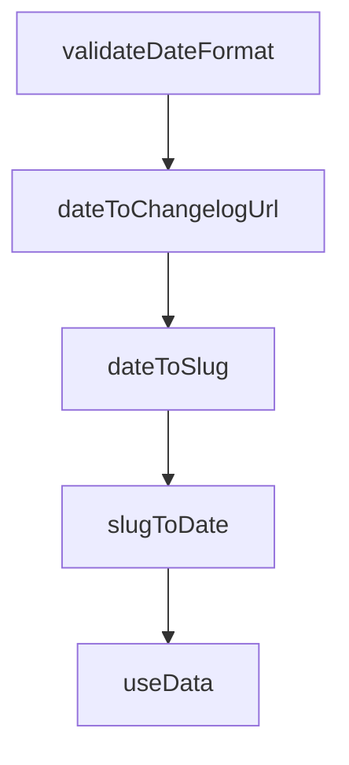

# Chapter 5: Tool Execution Modes and Modifiers

Welcome to **Chapter 5: Tool Execution Modes and Modifiers**. In this part of **Composio Tutorial: Production Tool and Authentication Infrastructure for AI Agents**, you will build an intuitive mental model first, then move into concrete implementation details and practical production tradeoffs.


This chapter explains how to choose execution mode and when to apply schema/before/after modifiers.

## Learning Goals

- compare chat-completion, agentic-framework, and direct execution paths
- understand where tool-call loops are owned in each path
- use modifiers to enforce safer inputs and cleaner outputs
- decide when proxy execution or custom tools are appropriate

## Execution Modes

| Mode | Best For |
|:-----|:---------|
| chat completion providers | explicit control over tool loop and response handling |
| agentic frameworks | framework-managed plan/act loops with Composio tool objects |
| direct execution | deterministic backend jobs and non-LLM automation |
| proxy execution | calling supported toolkit endpoints not exposed as predefined tools |

## Modifier Strategy

- schema modifiers: simplify tool inputs before the model sees schemas
- before modifiers: enforce runtime argument defaults/guards
- after modifiers: normalize outputs for downstream systems

## Source References

- [Executing Tools](https://github.com/ComposioHQ/composio/blob/next/docs/content/docs/tools-direct/executing-tools.mdx)
- [Schema Modifiers](https://github.com/ComposioHQ/composio/blob/next/docs/content/docs/tools-direct/modify-tool-behavior/schema-modifiers.mdx)
- [Before Execution Modifiers](https://github.com/ComposioHQ/composio/blob/next/docs/content/docs/tools-direct/modify-tool-behavior/before-execution-modifiers.mdx)
- [After Execution Modifiers](https://github.com/ComposioHQ/composio/blob/next/docs/content/docs/tools-direct/modify-tool-behavior/after-execution-modifiers.mdx)

## Summary

You now have an execution and modifier model that can be adapted to both agentic and deterministic workloads.

Next: [Chapter 6: MCP Server Patterns and Toolkit Control](06-mcp-server-patterns-and-toolkit-control.md)

## Source Code Walkthrough

### `docs/lib/source.ts`

The `validateDateFormat` function in [`docs/lib/source.ts`](https://github.com/ComposioHQ/composio/blob/HEAD/docs/lib/source.ts) handles a key part of this chapter's functionality:

```ts
const DATE_REGEX = /^\d{4}-\d{2}-\d{2}$/;

function validateDateFormat(dateStr: string): void {
  if (!DATE_REGEX.test(dateStr)) {
    throw new Error(
      `Invalid date format: "${dateStr}". Expected YYYY-MM-DD (e.g., "2025-12-29")`
    );
  }
}

export function dateToChangelogUrl(dateStr: string): string {
  // Convert "2025-12-29" to "/docs/changelog/2025/12/29"
  validateDateFormat(dateStr);
  const [year, month, day] = dateStr.split('-');
  return `/docs/changelog/${year}/${month}/${day}`;
}

export function dateToSlug(dateStr: string): string[] {
  // Convert "2025-12-29" to ["2025", "12", "29"]
  validateDateFormat(dateStr);
  const [year, month, day] = dateStr.split('-');
  return [year, month, day];
}

export function slugToDate(slug: string[]): string | null {
  // Convert ["2025", "12", "29"] to "2025-12-29"
  if (slug.length !== 3) return null;
  const [year, month, day] = slug;
  return `${year}-${month}-${day}`;
}

```

This function is important because it defines how Composio Tutorial: Production Tool and Authentication Infrastructure for AI Agents implements the patterns covered in this chapter.

### `docs/lib/source.ts`

The `dateToChangelogUrl` function in [`docs/lib/source.ts`](https://github.com/ComposioHQ/composio/blob/HEAD/docs/lib/source.ts) handles a key part of this chapter's functionality:

```ts
}

export function dateToChangelogUrl(dateStr: string): string {
  // Convert "2025-12-29" to "/docs/changelog/2025/12/29"
  validateDateFormat(dateStr);
  const [year, month, day] = dateStr.split('-');
  return `/docs/changelog/${year}/${month}/${day}`;
}

export function dateToSlug(dateStr: string): string[] {
  // Convert "2025-12-29" to ["2025", "12", "29"]
  validateDateFormat(dateStr);
  const [year, month, day] = dateStr.split('-');
  return [year, month, day];
}

export function slugToDate(slug: string[]): string | null {
  // Convert ["2025", "12", "29"] to "2025-12-29"
  if (slug.length !== 3) return null;
  const [year, month, day] = slug;
  return `${year}-${month}-${day}`;
}

```

This function is important because it defines how Composio Tutorial: Production Tool and Authentication Infrastructure for AI Agents implements the patterns covered in this chapter.

### `docs/lib/source.ts`

The `dateToSlug` function in [`docs/lib/source.ts`](https://github.com/ComposioHQ/composio/blob/HEAD/docs/lib/source.ts) handles a key part of this chapter's functionality:

```ts
}

export function dateToSlug(dateStr: string): string[] {
  // Convert "2025-12-29" to ["2025", "12", "29"]
  validateDateFormat(dateStr);
  const [year, month, day] = dateStr.split('-');
  return [year, month, day];
}

export function slugToDate(slug: string[]): string | null {
  // Convert ["2025", "12", "29"] to "2025-12-29"
  if (slug.length !== 3) return null;
  const [year, month, day] = slug;
  return `${year}-${month}-${day}`;
}

```

This function is important because it defines how Composio Tutorial: Production Tool and Authentication Infrastructure for AI Agents implements the patterns covered in this chapter.

### `docs/lib/source.ts`

The `slugToDate` function in [`docs/lib/source.ts`](https://github.com/ComposioHQ/composio/blob/HEAD/docs/lib/source.ts) handles a key part of this chapter's functionality:

```ts
}

export function slugToDate(slug: string[]): string | null {
  // Convert ["2025", "12", "29"] to "2025-12-29"
  if (slug.length !== 3) return null;
  const [year, month, day] = slug;
  return `${year}-${month}-${day}`;
}

```

This function is important because it defines how Composio Tutorial: Production Tool and Authentication Infrastructure for AI Agents implements the patterns covered in this chapter.


## How These Components Connect


