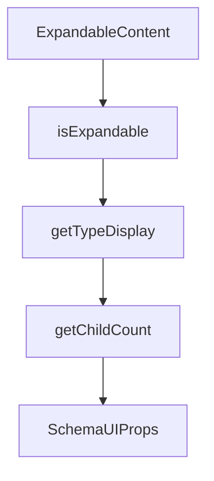

# Chapter 6: MCP Server Patterns and Toolkit Control

Welcome to **Chapter 6: MCP Server Patterns and Toolkit Control**. In this part of **Composio Tutorial: Production Tool and Authentication Infrastructure for AI Agents**, you will build an intuitive mental model first, then move into concrete implementation details and practical production tradeoffs.


This chapter focuses on MCP integration design, including when to use dynamic session MCP versus fixed single-toolkit MCP configurations.

## Learning Goals

- choose the right MCP pattern for your product and governance constraints
- avoid over-scoped server exposure in MCP clients
- map single-toolkit MCP limitations to operational requirements
- define secure rollout and lifecycle management for MCP endpoints

## MCP Pattern Comparison

| Pattern | Strength | Tradeoff |
|:--------|:---------|:---------|
| session-backed dynamic MCP | broad flexible capability with context-aware discovery | needs stronger runtime governance |
| single-toolkit MCP configs | tighter scope and easier compliance review | less flexibility and can increase config overhead |

## Practical Controls

- gate allowed toolkits/tools by workload profile
- isolate high-risk toolkits behind separate MCP configurations
- track MCP endpoint ownership and rotation policy
- maintain fallback paths when upstream toolkits degrade

## Source References

- [Quickstart MCP Flow](https://github.com/ComposioHQ/composio/blob/next/docs/content/docs/quickstart.mdx)
- [Single Toolkit MCP](https://github.com/ComposioHQ/composio/blob/next/docs/content/docs/single-toolkit-mcp.mdx)
- [MCP Troubleshooting](https://github.com/ComposioHQ/composio/blob/next/docs/content/docs/troubleshooting/mcp.mdx)

## Summary

You now have a decision framework for MCP architecture choices in Composio deployments.

Next: [Chapter 7: Triggers, Webhooks, and Event Automation](07-triggers-webhooks-and-event-automation.md)

## Source Code Walkthrough

### `docs/components/custom-schema-ui.tsx`

The `ExpandableContent` function in [`docs/components/custom-schema-ui.tsx`](https://github.com/ComposioHQ/composio/blob/HEAD/docs/components/custom-schema-ui.tsx) handles a key part of this chapter's functionality:

```tsx
            <span className="text-sm font-medium">{item.name}</span>
            {isExpandable(refs[item.$type], refs) && (
              <ExpandableContent $type={item.$type} parentPath={parentPath} />
            )}
          </div>
        ))}
      </div>
    );
  }

  return null;
}

function SchemaProperty({
  name,
  $type,
  required,
  parentPath = '',
  isRoot = false,
}: {
  name: string;
  $type: string;
  required: boolean;
  parentPath?: string;
  isRoot?: boolean;
}) {
  const { refs } = useData();
  const isResponse = useIsResponse();
  const schema = refs[$type];
  const fullPath = parentPath ? `${parentPath}.${name}` : name;

  const hasChildren = isExpandable(schema, refs);
```

This function is important because it defines how Composio Tutorial: Production Tool and Authentication Infrastructure for AI Agents implements the patterns covered in this chapter.

### `docs/components/custom-schema-ui.tsx`

The `isExpandable` function in [`docs/components/custom-schema-ui.tsx`](https://github.com/ComposioHQ/composio/blob/HEAD/docs/components/custom-schema-ui.tsx) handles a key part of this chapter's functionality:

```tsx
}: SchemaUIProps) {
  const schema = generated.refs[generated.$root];
  const isProperty = as === 'property' || !isExpandable(schema, generated.refs);

  return (
    <DataContext value={generated}>
      <ResponseContext value={isResponse}>
        {isProperty ? (
          <SchemaProperty
            name={name}
            $type={generated.$root}
            required={required}
            isRoot
          />
        ) : (
          <SchemaContent $type={generated.$root} />
        )}
      </ResponseContext>
    </DataContext>
  );
}

function SchemaContent({
  $type,
  parentPath = '',
}: {
  $type: string;
  parentPath?: string;
}) {
  const { refs } = useData();
  const schema = refs[$type];

```

This function is important because it defines how Composio Tutorial: Production Tool and Authentication Infrastructure for AI Agents implements the patterns covered in this chapter.

### `docs/components/custom-schema-ui.tsx`

The `getTypeDisplay` function in [`docs/components/custom-schema-ui.tsx`](https://github.com/ComposioHQ/composio/blob/HEAD/docs/components/custom-schema-ui.tsx) handles a key part of this chapter's functionality:

```tsx

  const hasChildren = isExpandable(schema, refs);
  const typeDisplay = getTypeDisplay(schema);

  return (
    <div className={cn('py-4', !isRoot && 'first:pt-0')}>
      {/* Property header */}
      <div className="flex flex-wrap items-center gap-2">
        <span className="font-medium font-mono text-fd-foreground">
          {name}
        </span>
        <span className="text-sm font-mono text-fd-muted-foreground">
          {typeDisplay}
        </span>
        {required && !isResponse && (
          <span className="text-xs text-red-400 font-medium">Required</span>
        )}
        {schema.deprecated && (
          <span className="text-xs bg-yellow-500/10 text-yellow-600 dark:text-yellow-400 px-1.5 py-0.5 rounded">
            Deprecated
          </span>
        )}
      </div>

      {/* Description */}
      {schema.description && (
        <div className="mt-2 text-sm text-fd-muted-foreground prose-no-margin">
          {schema.description}
        </div>
      )}

      {/* Info tags */}
```

This function is important because it defines how Composio Tutorial: Production Tool and Authentication Infrastructure for AI Agents implements the patterns covered in this chapter.

### `docs/components/custom-schema-ui.tsx`

The `getChildCount` function in [`docs/components/custom-schema-ui.tsx`](https://github.com/ComposioHQ/composio/blob/HEAD/docs/components/custom-schema-ui.tsx) handles a key part of this chapter's functionality:

```tsx
  const schema = refs[$type];

  const childCount = getChildCount(schema);
  const label = schema.type === 'array' ? 'item properties' : 'child attributes';

  return (
    <Collapsible open={isOpen} onOpenChange={setIsOpen} className="mt-3">
      <CollapsibleTrigger className="group flex items-center gap-1 px-2 py-1 text-xs text-fd-muted-foreground hover:text-fd-foreground font-medium rounded border border-fd-border hover:bg-fd-accent/30 transition-colors">
        {isOpen ? (
          <>
            <X className="h-3 w-3" />
            Hide {label}
          </>
        ) : (
          <>
            <Plus className="h-3 w-3" />
            Show {childCount > 0 ? `${childCount} ` : ''}{label}
          </>
        )}
      </CollapsibleTrigger>
      <CollapsibleContent>
        <div className="mt-2 pl-3 border-l border-fd-border">
          <SchemaContent $type={$type} parentPath={parentPath} />
        </div>
      </CollapsibleContent>
    </Collapsible>
  );
}

function isExpandable(
  schema: SchemaData,
  refs?: Record<string, SchemaData>,
```

This function is important because it defines how Composio Tutorial: Production Tool and Authentication Infrastructure for AI Agents implements the patterns covered in this chapter.


## How These Components Connect


