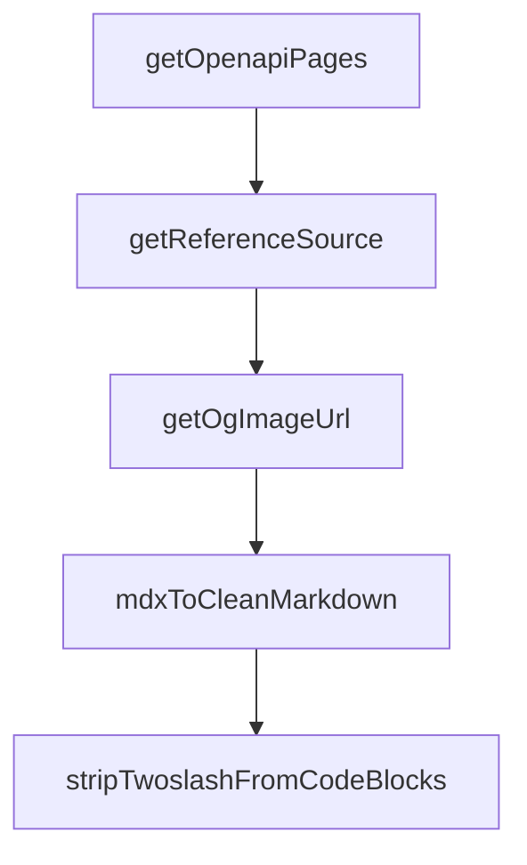

# Chapter 7: Triggers, Webhooks, and Event Automation

Welcome to **Chapter 7: Triggers, Webhooks, and Event Automation**. In this part of **Composio Tutorial: Production Tool and Authentication Infrastructure for AI Agents**, you will build an intuitive mental model first, then move into concrete implementation details and practical production tradeoffs.


This chapter explains how to move from request-response tool usage to event-driven automation with triggers.

## Learning Goals

- distinguish webhook and polling trigger behavior
- design idempotent event handlers for reliable automation
- manage trigger lifecycle per user and connected account
- implement basic verification and observability controls

## Trigger Flow

1. configure webhook destination and verification behavior
2. discover trigger types for target toolkits
3. create active triggers scoped to user/account context
4. process incoming events with idempotent handlers
5. monitor and manage trigger instances over time

## Reliability Guardrails

| Risk | Guardrail |
|:-----|:----------|
| duplicate deliveries | idempotency keys + dedupe storage |
| invalid payloads | strict schema validation |
| silent failures | alerting on webhook delivery errors |
| stale subscriptions | periodic trigger reconciliation jobs |

## Source References

- [Triggers Overview](https://github.com/ComposioHQ/composio/blob/next/docs/content/docs/triggers.mdx)
- [Creating Triggers](https://github.com/ComposioHQ/composio/blob/next/docs/content/docs/setting-up-triggers/creating-triggers.mdx)
- [Managing Triggers](https://github.com/ComposioHQ/composio/blob/next/docs/content/docs/setting-up-triggers/managing-triggers.mdx)
- [Webhook Verification](https://github.com/ComposioHQ/composio/blob/next/docs/content/docs/webhook-verification.mdx)

## Summary

You now have a practical event-automation blueprint for production-grade Composio trigger usage.

Next: [Chapter 8: Migration, Troubleshooting, and Production Ops](08-migration-troubleshooting-and-production-ops.md)

## Depth Expansion Playbook

## Source Code Walkthrough

### `docs/lib/source.ts`

The `getOpenapiPages` function in [`docs/lib/source.ts`](https://github.com/ComposioHQ/composio/blob/HEAD/docs/lib/source.ts) handles a key part of this chapter's functionality:

```ts
let _openapiPagesPromise: Promise<any> | null = null;

async function getOpenapiPages() {
  if (!_openapiPagesPromise) {
    _openapiPagesPromise = openapiSource(openapi, {
      groupBy: 'tag',
      baseDir: 'api-reference',
    });
  }
  return _openapiPagesPromise;
}

export async function getReferenceSource() {
  if (!_referenceSource) {
    const openapiPages = await getOpenapiPages();
    _referenceSource = loader({
      baseUrl: '/reference',
      source: multiple({
        mdx: reference.toFumadocsSource(),
        openapi: openapiPages,
      }),
      plugins: [lucideIconsPlugin(), openapiPlugin()],
      pageTree: {
        // eslint-disable-next-line @typescript-eslint/no-explicit-any
        transformers: [defaultOpenTransformer as any],
      },
    });
  }
  return _referenceSource;
}

// Synchronous reference source for cases where OpenAPI isn't needed
```

This function is important because it defines how Composio Tutorial: Production Tool and Authentication Infrastructure for AI Agents implements the patterns covered in this chapter.

### `docs/lib/source.ts`

The `getReferenceSource` function in [`docs/lib/source.ts`](https://github.com/ComposioHQ/composio/blob/HEAD/docs/lib/source.ts) handles a key part of this chapter's functionality:

```ts
}

export async function getReferenceSource() {
  if (!_referenceSource) {
    const openapiPages = await getOpenapiPages();
    _referenceSource = loader({
      baseUrl: '/reference',
      source: multiple({
        mdx: reference.toFumadocsSource(),
        openapi: openapiPages,
      }),
      plugins: [lucideIconsPlugin(), openapiPlugin()],
      pageTree: {
        // eslint-disable-next-line @typescript-eslint/no-explicit-any
        transformers: [defaultOpenTransformer as any],
      },
    });
  }
  return _referenceSource;
}

// Synchronous reference source for cases where OpenAPI isn't needed
export const referenceSource = loader({
  baseUrl: '/reference',
  source: reference.toFumadocsSource(),
  plugins: [lucideIconsPlugin()],
});

export const cookbooksSource = loader({
  baseUrl: '/cookbooks',
  source: cookbooks.toFumadocsSource(),
  plugins: [lucideIconsPlugin()],
```

This function is important because it defines how Composio Tutorial: Production Tool and Authentication Infrastructure for AI Agents implements the patterns covered in this chapter.

### `docs/lib/source.ts`

The `getOgImageUrl` function in [`docs/lib/source.ts`](https://github.com/ComposioHQ/composio/blob/HEAD/docs/lib/source.ts) handles a key part of this chapter's functionality:

```ts
 * Generate OG image URL for any page section
 */
export function getOgImageUrl(_section: string, _slugs: string[], title?: string, _description?: string): string {
  const encodedTitle = encodeURIComponent(title ?? 'Composio Docs');
  return `https://og.composio.dev/api/og?title=${encodedTitle}`;
}

/**
 * Converts MDX content to clean markdown for AI agents.
 * Strips JSX components and converts them to plain text equivalents.
 */
export function mdxToCleanMarkdown(content: string): string {
  let result = content;

  // Remove frontmatter
  result = result.replace(/^---[\s\S]*?---\n*/m, '');

  // Convert YouTube to link
  result = result.replace(
    /<YouTube\s+id="([^"]+)"\s+title="([^"]+)"\s*\/>/g,
    '[Video: $2](https://youtube.com/watch?v=$1)'
  );

  // Convert Callout to blockquote - trim content to avoid empty lines
  result = result.replace(
    /<Callout[^>]*title="([^"]*)"[^>]*>([\s\S]*?)<\/Callout>/g,
    (_, title, content) => `> **${title}**: ${content.trim()}`
  );
  result = result.replace(
    /<Callout[^>]*>([\s\S]*?)<\/Callout>/g,
    (_, content) => `> ${content.trim()}`
  );
```

This function is important because it defines how Composio Tutorial: Production Tool and Authentication Infrastructure for AI Agents implements the patterns covered in this chapter.

### `docs/lib/source.ts`

The `mdxToCleanMarkdown` function in [`docs/lib/source.ts`](https://github.com/ComposioHQ/composio/blob/HEAD/docs/lib/source.ts) handles a key part of this chapter's functionality:

```ts
 * Strips JSX components and converts them to plain text equivalents.
 */
export function mdxToCleanMarkdown(content: string): string {
  let result = content;

  // Remove frontmatter
  result = result.replace(/^---[\s\S]*?---\n*/m, '');

  // Convert YouTube to link
  result = result.replace(
    /<YouTube\s+id="([^"]+)"\s+title="([^"]+)"\s*\/>/g,
    '[Video: $2](https://youtube.com/watch?v=$1)'
  );

  // Convert Callout to blockquote - trim content to avoid empty lines
  result = result.replace(
    /<Callout[^>]*title="([^"]*)"[^>]*>([\s\S]*?)<\/Callout>/g,
    (_, title, content) => `> **${title}**: ${content.trim()}`
  );
  result = result.replace(
    /<Callout[^>]*>([\s\S]*?)<\/Callout>/g,
    (_, content) => `> ${content.trim()}`
  );

  // Remove Cards wrapper before processing individual Card tags
  // (prevents <Cards> from being matched by <Card regex since <Cards starts with <Card)
  result = result.replace(/<\/?Cards\b[^>]*>/g, '');

  // Convert Card - handle multiline and various attribute orders
  // Self-closing Cards with description attribute
  result = result.replace(
    /<Card\b[\s\S]*?title="([^"]*)"[\s\S]*?href="([^"]*)"[\s\S]*?description="([^"]*)"[\s\S]*?\/>/g,
```

This function is important because it defines how Composio Tutorial: Production Tool and Authentication Infrastructure for AI Agents implements the patterns covered in this chapter.


## How These Components Connect


