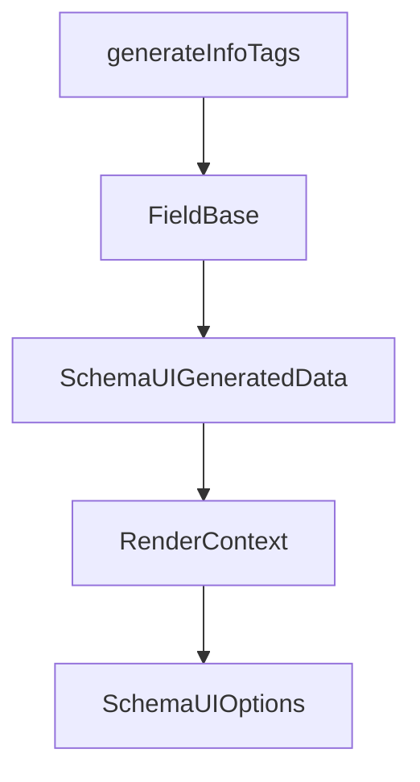

# Chapter 7: Triggers, Webhooks, and Event Automation

Welcome to **Chapter 7: Triggers, Webhooks, and Event Automation**. In this part of **Composio Tutorial: Production Tool and Authentication Infrastructure for AI Agents**, you will build an intuitive mental model first, then move into concrete implementation details and practical production tradeoffs.


This chapter explains how to move from request-response tool usage to event-driven automation with triggers.

## Learning Goals

- distinguish webhook and polling trigger behavior
- design idempotent event handlers for reliable automation
- manage trigger lifecycle per user and connected account
- implement basic verification and observability controls

## Trigger Flow

1. configure webhook destination and verification behavior
2. discover trigger types for target toolkits
3. create active triggers scoped to user/account context
4. process incoming events with idempotent handlers
5. monitor and manage trigger instances over time

## Reliability Guardrails

| Risk | Guardrail |
|:-----|:----------|
| duplicate deliveries | idempotency keys + dedupe storage |
| invalid payloads | strict schema validation |
| silent failures | alerting on webhook delivery errors |
| stale subscriptions | periodic trigger reconciliation jobs |

## Source References

- [Triggers Overview](https://github.com/ComposioHQ/composio/blob/next/docs/content/docs/triggers.mdx)
- [Creating Triggers](https://github.com/ComposioHQ/composio/blob/next/docs/content/docs/setting-up-triggers/creating-triggers.mdx)
- [Managing Triggers](https://github.com/ComposioHQ/composio/blob/next/docs/content/docs/setting-up-triggers/managing-triggers.mdx)
- [Webhook Verification](https://github.com/ComposioHQ/composio/blob/next/docs/content/docs/webhook-verification.mdx)

## Summary

You now have a practical event-automation blueprint for production-grade Composio trigger usage.

Next: [Chapter 8: Migration, Troubleshooting, and Production Ops](08-migration-troubleshooting-and-production-ops.md)

## Source Code Walkthrough

### `docs/components/schema-generator.tsx`

The `generateInfoTags` function in [`docs/components/schema-generator.tsx`](https://github.com/ComposioHQ/composio/blob/HEAD/docs/components/schema-generator.tsx) handles a key part of this chapter's functionality:

```tsx
        ? ctx.renderMarkdown(schema.description)
        : undefined,
      infoTags: generateInfoTags(schema),
      typeName: getTypeName(schema),
      aliasName,
      deprecated: schema.deprecated,
      enumValues: schema.enum
        ? schema.enum.map((v: unknown) => String(v))
        : undefined,
    };

    // Handle oneOf/anyOf
    if (schema.oneOf || schema.anyOf) {
      const variants = schema.oneOf || schema.anyOf || [];
      refs[id] = {
        ...base,
        type: 'or',
        items: variants.map((variant: SimpleSchema) => ({
          name: getTypeName(variant),
          $type: processSchema(variant),
        })),
      };
      return id;
    }

    // Handle allOf - merge into single object
    if (schema.allOf) {
      // Merge all schemas together
      const merged: SimpleSchema = { type: 'object', properties: {}, required: [] };
      for (const subSchema of schema.allOf) {
        if (subSchema.properties) {
          Object.assign(merged.properties, subSchema.properties);
```

This function is important because it defines how Composio Tutorial: Production Tool and Authentication Infrastructure for AI Agents implements the patterns covered in this chapter.

### `docs/components/schema-generator.tsx`

The `FieldBase` interface in [`docs/components/schema-generator.tsx`](https://github.com/ComposioHQ/composio/blob/HEAD/docs/components/schema-generator.tsx) handles a key part of this chapter's functionality:

```tsx

// Types matching fumadocs-openapi internal structure
interface FieldBase {
  description?: ReactNode;
  infoTags?: ReactNode[];
  typeName: string;
  aliasName: string;
  deprecated?: boolean;
  enumValues?: string[];
}

export type SchemaData = FieldBase &
  (
    | { type: 'primitive' }
    | {
        type: 'object';
        props: { name: string; $type: string; required: boolean }[];
      }
    | { type: 'array'; item: { $type: string } }
    | { type: 'or'; items: { name: string; $type: string }[] }
    | { type: 'and'; items: { name: string; $type: string }[] }
  );

export interface SchemaUIGeneratedData {
  $root: string;
  refs: Record<string, SchemaData>;
}

// Simplified schema type (subset of OpenAPI schema)
// eslint-disable-next-line @typescript-eslint/no-explicit-any
type SimpleSchema = any;

```

This interface is important because it defines how Composio Tutorial: Production Tool and Authentication Infrastructure for AI Agents implements the patterns covered in this chapter.

### `docs/components/schema-generator.tsx`

The `SchemaUIGeneratedData` interface in [`docs/components/schema-generator.tsx`](https://github.com/ComposioHQ/composio/blob/HEAD/docs/components/schema-generator.tsx) handles a key part of this chapter's functionality:

```tsx
  );

export interface SchemaUIGeneratedData {
  $root: string;
  refs: Record<string, SchemaData>;
}

// Simplified schema type (subset of OpenAPI schema)
// eslint-disable-next-line @typescript-eslint/no-explicit-any
type SimpleSchema = any;

interface RenderContext {
  renderMarkdown: (text: string) => ReactNode;
  schema: {
    getRawRef: (obj: object) => string | undefined;
  };
}

interface SchemaUIOptions {
  root: SimpleSchema;
  readOnly?: boolean;
  writeOnly?: boolean;
}

export function generateSchemaData(
  options: SchemaUIOptions,
  ctx: RenderContext
): SchemaUIGeneratedData {
  const refs: Record<string, SchemaData> = {};
  let counter = 0;
  const autoIds = new WeakMap<object, string>();

```

This interface is important because it defines how Composio Tutorial: Production Tool and Authentication Infrastructure for AI Agents implements the patterns covered in this chapter.

### `docs/components/schema-generator.tsx`

The `RenderContext` interface in [`docs/components/schema-generator.tsx`](https://github.com/ComposioHQ/composio/blob/HEAD/docs/components/schema-generator.tsx) handles a key part of this chapter's functionality:

```tsx
type SimpleSchema = any;

interface RenderContext {
  renderMarkdown: (text: string) => ReactNode;
  schema: {
    getRawRef: (obj: object) => string | undefined;
  };
}

interface SchemaUIOptions {
  root: SimpleSchema;
  readOnly?: boolean;
  writeOnly?: boolean;
}

export function generateSchemaData(
  options: SchemaUIOptions,
  ctx: RenderContext
): SchemaUIGeneratedData {
  const refs: Record<string, SchemaData> = {};
  let counter = 0;
  const autoIds = new WeakMap<object, string>();

  function getSchemaId(schema: SimpleSchema): string {
    if (typeof schema === 'boolean') return String(schema);
    if (typeof schema !== 'object' || schema === null) return `__${counter++}`;
    const raw = ctx.schema.getRawRef(schema);
    if (raw) return raw;
    const prev = autoIds.get(schema);
    if (prev) return prev;
    const generated = `__${counter++}`;
    autoIds.set(schema, generated);
```

This interface is important because it defines how Composio Tutorial: Production Tool and Authentication Infrastructure for AI Agents implements the patterns covered in this chapter.


## How These Components Connect


