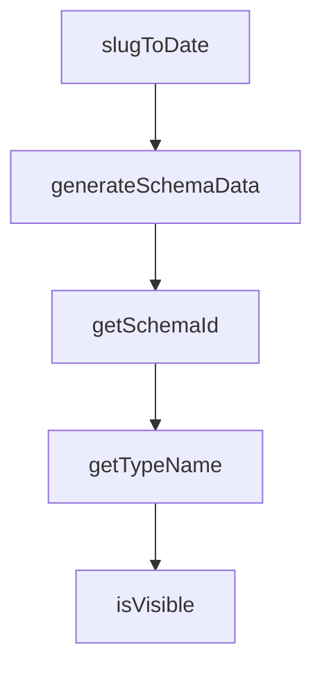

# Chapter 8: Migration, Troubleshooting, and Production Ops

Welcome to **Chapter 8: Migration, Troubleshooting, and Production Ops**. In this part of **Composio Tutorial: Production Tool and Authentication Infrastructure for AI Agents**, you will build an intuitive mental model first, then move into concrete implementation details and practical production tradeoffs.


This chapter packages migration strategy, support workflows, and day-2 operations into one operating model.

## Learning Goals

- migrate from older SDK conventions without production regressions
- use Composio troubleshooting surfaces effectively
- formalize release and dependency hygiene for team operations
- sustain long-term reliability as toolkit and provider behavior changes

## Migration Focus Areas

The migration guide highlights key conceptual shifts (for example: ToolSets -> Providers, explicit `user_id` scoping, and updated naming conventions). Treat migration as an architecture upgrade, not only a package version bump.

## Operations Checklist

| Area | Baseline Practice |
|:-----|:------------------|
| versioning | pin SDK versions and test before rollout |
| troubleshooting | route incidents through structured error/runbook paths |
| contribution hygiene | follow repository standards for docs/tests/changesets |
| release readiness | validate auth, tool execution, and trigger flows in staging |

## Source References

- [Migration Guide: New SDK](https://github.com/ComposioHQ/composio/blob/next/docs/content/docs/migration-guide/new-sdk.mdx)
- [Troubleshooting](https://github.com/ComposioHQ/composio/blob/next/docs/content/docs/troubleshooting/index.mdx)
- [CLI Guide](https://github.com/ComposioHQ/composio/blob/next/docs/content/docs/cli.mdx)
- [Contributing Guide](https://github.com/ComposioHQ/composio/blob/next/CONTRIBUTING.md)

## Summary

You now have a full lifecycle playbook for building, operating, and evolving Composio-backed agent integrations.

## Depth Expansion Playbook

## Source Code Walkthrough

### `docs/lib/source.ts`

The `slugToDate` function in [`docs/lib/source.ts`](https://github.com/ComposioHQ/composio/blob/HEAD/docs/lib/source.ts) handles a key part of this chapter's functionality:

```ts
}

export function slugToDate(slug: string[]): string | null {
  // Convert ["2025", "12", "29"] to "2025-12-29"
  if (slug.length !== 3) return null;
  const [year, month, day] = slug;
  return `${year}-${month}-${day}`;
}

```

This function is important because it defines how Composio Tutorial: Production Tool and Authentication Infrastructure for AI Agents implements the patterns covered in this chapter.

### `docs/components/schema-generator.tsx`

The `generateSchemaData` function in [`docs/components/schema-generator.tsx`](https://github.com/ComposioHQ/composio/blob/HEAD/docs/components/schema-generator.tsx) handles a key part of this chapter's functionality:

```tsx
}

export function generateSchemaData(
  options: SchemaUIOptions,
  ctx: RenderContext
): SchemaUIGeneratedData {
  const refs: Record<string, SchemaData> = {};
  let counter = 0;
  const autoIds = new WeakMap<object, string>();

  function getSchemaId(schema: SimpleSchema): string {
    if (typeof schema === 'boolean') return String(schema);
    if (typeof schema !== 'object' || schema === null) return `__${counter++}`;
    const raw = ctx.schema.getRawRef(schema);
    if (raw) return raw;
    const prev = autoIds.get(schema);
    if (prev) return prev;
    const generated = `__${counter++}`;
    autoIds.set(schema, generated);
    return generated;
  }

  function getTypeName(schema: SimpleSchema): string {
    if (!schema || typeof schema !== 'object') return 'any';
    if (schema.$ref) {
      const refName = schema.$ref.split('/').pop() || 'object';
      return refName;
    }
    if (schema.type === 'array' && schema.items) {
      return `${getTypeName(schema.items)}[]`;
    }
    if (schema.oneOf || schema.anyOf) {
```

This function is important because it defines how Composio Tutorial: Production Tool and Authentication Infrastructure for AI Agents implements the patterns covered in this chapter.

### `docs/components/schema-generator.tsx`

The `getSchemaId` function in [`docs/components/schema-generator.tsx`](https://github.com/ComposioHQ/composio/blob/HEAD/docs/components/schema-generator.tsx) handles a key part of this chapter's functionality:

```tsx
  const autoIds = new WeakMap<object, string>();

  function getSchemaId(schema: SimpleSchema): string {
    if (typeof schema === 'boolean') return String(schema);
    if (typeof schema !== 'object' || schema === null) return `__${counter++}`;
    const raw = ctx.schema.getRawRef(schema);
    if (raw) return raw;
    const prev = autoIds.get(schema);
    if (prev) return prev;
    const generated = `__${counter++}`;
    autoIds.set(schema, generated);
    return generated;
  }

  function getTypeName(schema: SimpleSchema): string {
    if (!schema || typeof schema !== 'object') return 'any';
    if (schema.$ref) {
      const refName = schema.$ref.split('/').pop() || 'object';
      return refName;
    }
    if (schema.type === 'array' && schema.items) {
      return `${getTypeName(schema.items)}[]`;
    }
    if (schema.oneOf || schema.anyOf) {
      const variants = schema.oneOf || schema.anyOf || [];
      return variants.map((v: SimpleSchema) => getTypeName(v)).join(' | ');
    }
    if (schema.enum) {
      return 'enum';
    }
    if (Array.isArray(schema.type)) {
      const isNullable = schema.type.includes('null');
```

This function is important because it defines how Composio Tutorial: Production Tool and Authentication Infrastructure for AI Agents implements the patterns covered in this chapter.

### `docs/components/schema-generator.tsx`

The `getTypeName` function in [`docs/components/schema-generator.tsx`](https://github.com/ComposioHQ/composio/blob/HEAD/docs/components/schema-generator.tsx) handles a key part of this chapter's functionality:

```tsx
  }

  function getTypeName(schema: SimpleSchema): string {
    if (!schema || typeof schema !== 'object') return 'any';
    if (schema.$ref) {
      const refName = schema.$ref.split('/').pop() || 'object';
      return refName;
    }
    if (schema.type === 'array' && schema.items) {
      return `${getTypeName(schema.items)}[]`;
    }
    if (schema.oneOf || schema.anyOf) {
      const variants = schema.oneOf || schema.anyOf || [];
      return variants.map((v: SimpleSchema) => getTypeName(v)).join(' | ');
    }
    if (schema.enum) {
      return 'enum';
    }
    if (Array.isArray(schema.type)) {
      const isNullable = schema.type.includes('null');
      const types = schema.type.filter((t: string) => t !== 'null');
      const typeName = types.join(' | ') || 'any';
      return isNullable ? `nullable ${typeName}` : typeName;
    }
    return schema.type || 'any';
  }

  function isVisible(schema: SimpleSchema): boolean {
    if (!schema || typeof schema !== 'object') return true;
    if (schema.writeOnly) return options.writeOnly ?? false;
    if (schema.readOnly) return options.readOnly ?? false;
    return true;
```

This function is important because it defines how Composio Tutorial: Production Tool and Authentication Infrastructure for AI Agents implements the patterns covered in this chapter.


## How These Components Connect


