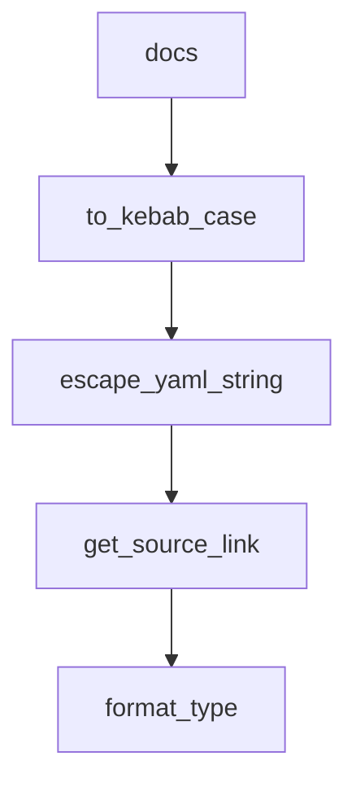

# Chapter 8: Migration, Troubleshooting, and Production Ops

Welcome to **Chapter 8: Migration, Troubleshooting, and Production Ops**. In this part of **Composio Tutorial: Production Tool and Authentication Infrastructure for AI Agents**, you will build an intuitive mental model first, then move into concrete implementation details and practical production tradeoffs.


This chapter packages migration strategy, support workflows, and day-2 operations into one operating model.

## Learning Goals

- migrate from older SDK conventions without production regressions
- use Composio troubleshooting surfaces effectively
- formalize release and dependency hygiene for team operations
- sustain long-term reliability as toolkit and provider behavior changes

## Migration Focus Areas

The migration guide highlights key conceptual shifts (for example: ToolSets -> Providers, explicit `user_id` scoping, and updated naming conventions). Treat migration as an architecture upgrade, not only a package version bump.

## Operations Checklist

| Area | Baseline Practice |
|:-----|:------------------|
| versioning | pin SDK versions and test before rollout |
| troubleshooting | route incidents through structured error/runbook paths |
| contribution hygiene | follow repository standards for docs/tests/changesets |
| release readiness | validate auth, tool execution, and trigger flows in staging |

## Source References

- [Migration Guide: New SDK](https://github.com/ComposioHQ/composio/blob/next/docs/content/docs/migration-guide/new-sdk.mdx)
- [Troubleshooting](https://github.com/ComposioHQ/composio/blob/next/docs/content/docs/troubleshooting/index.mdx)
- [CLI Guide](https://github.com/ComposioHQ/composio/blob/next/docs/content/docs/cli.mdx)
- [Contributing Guide](https://github.com/ComposioHQ/composio/blob/next/CONTRIBUTING.md)

## Summary

You now have a full lifecycle playbook for building, operating, and evolving Composio-backed agent integrations.

## Source Code Walkthrough

### `python/scripts/generate-docs.py`

The `docs` class in [`python/scripts/generate-docs.py`](https://github.com/ComposioHQ/composio/blob/HEAD/python/scripts/generate-docs.py) handles a key part of this chapter's functionality:

```py

Generates MDX documentation from Python source code using griffe.
Output is written to the docs content directory.

Run: cd python && uv run --with griffe python scripts/generate-docs.py
"""

from __future__ import annotations

import json
import re
import shutil
from pathlib import Path
from typing import Any

try:
    import griffe
except ImportError:
    print("Error: griffe not installed. Run: pip install griffe")
    raise SystemExit(1)

# Paths
SCRIPT_DIR = Path(__file__).parent
PACKAGE_DIR = SCRIPT_DIR.parent
OUTPUT_DIR = (
    PACKAGE_DIR.parent / "docs" / "content" / "reference" / "sdk-reference" / "python"
)

# GitHub base URL for source links
GITHUB_BASE = "https://github.com/composiohq/composio/blob/next/python"

# Decorators to document
```

This class is important because it defines how Composio Tutorial: Production Tool and Authentication Infrastructure for AI Agents implements the patterns covered in this chapter.

### `python/scripts/generate-docs.py`

The `to_kebab_case` function in [`python/scripts/generate-docs.py`](https://github.com/ComposioHQ/composio/blob/HEAD/python/scripts/generate-docs.py) handles a key part of this chapter's functionality:

```py


def to_kebab_case(name: str) -> str:
    """Convert PascalCase to kebab-case."""
    s1 = re.sub("(.)([A-Z][a-z]+)", r"\1-\2", name)
    return re.sub("([a-z0-9])([A-Z])", r"\1-\2", s1).lower()


def escape_yaml_string(s: str) -> str:
    """Escape a string for YAML frontmatter."""
    if any(c in s for c in [":", '"', "'", "\n", "#", "{", "}"]):
        return f'"{s.replace(chr(34), chr(92) + chr(34))}"'
    return s


def get_source_link(obj: griffe.Object) -> str | None:
    """Get GitHub source link for an object."""
    if not hasattr(obj, "filepath") or not obj.filepath:
        return None
    try:
        raw_filepath = obj.filepath
        # Handle case where filepath might be a list (griffe edge case)
        if isinstance(raw_filepath, list):
            resolved_path: Path | None = raw_filepath[0] if raw_filepath else None
        else:
            resolved_path = raw_filepath
        if not resolved_path:
            return None
        rel_path = resolved_path.relative_to(PACKAGE_DIR)
    except ValueError:
        return None
    line = obj.lineno if hasattr(obj, "lineno") and obj.lineno else 1
```

This function is important because it defines how Composio Tutorial: Production Tool and Authentication Infrastructure for AI Agents implements the patterns covered in this chapter.

### `python/scripts/generate-docs.py`

The `escape_yaml_string` function in [`python/scripts/generate-docs.py`](https://github.com/ComposioHQ/composio/blob/HEAD/python/scripts/generate-docs.py) handles a key part of this chapter's functionality:

```py


def escape_yaml_string(s: str) -> str:
    """Escape a string for YAML frontmatter."""
    if any(c in s for c in [":", '"', "'", "\n", "#", "{", "}"]):
        return f'"{s.replace(chr(34), chr(92) + chr(34))}"'
    return s


def get_source_link(obj: griffe.Object) -> str | None:
    """Get GitHub source link for an object."""
    if not hasattr(obj, "filepath") or not obj.filepath:
        return None
    try:
        raw_filepath = obj.filepath
        # Handle case where filepath might be a list (griffe edge case)
        if isinstance(raw_filepath, list):
            resolved_path: Path | None = raw_filepath[0] if raw_filepath else None
        else:
            resolved_path = raw_filepath
        if not resolved_path:
            return None
        rel_path = resolved_path.relative_to(PACKAGE_DIR)
    except ValueError:
        return None
    line = obj.lineno if hasattr(obj, "lineno") and obj.lineno else 1
    return f"{GITHUB_BASE}/{rel_path}#L{line}"


def format_type(annotation: Any) -> str:
    """Format a type annotation to readable string."""
    if annotation is None:
```

This function is important because it defines how Composio Tutorial: Production Tool and Authentication Infrastructure for AI Agents implements the patterns covered in this chapter.

### `python/scripts/generate-docs.py`

The `get_source_link` function in [`python/scripts/generate-docs.py`](https://github.com/ComposioHQ/composio/blob/HEAD/python/scripts/generate-docs.py) handles a key part of this chapter's functionality:

```py


def get_source_link(obj: griffe.Object) -> str | None:
    """Get GitHub source link for an object."""
    if not hasattr(obj, "filepath") or not obj.filepath:
        return None
    try:
        raw_filepath = obj.filepath
        # Handle case where filepath might be a list (griffe edge case)
        if isinstance(raw_filepath, list):
            resolved_path: Path | None = raw_filepath[0] if raw_filepath else None
        else:
            resolved_path = raw_filepath
        if not resolved_path:
            return None
        rel_path = resolved_path.relative_to(PACKAGE_DIR)
    except ValueError:
        return None
    line = obj.lineno if hasattr(obj, "lineno") and obj.lineno else 1
    return f"{GITHUB_BASE}/{rel_path}#L{line}"


def format_type(annotation: Any) -> str:
    """Format a type annotation to readable string."""
    if annotation is None:
        return "Any"

    type_str = str(annotation)
    # Clean up common prefixes
    type_str = type_str.replace("typing.", "").replace("typing_extensions.", "")
    type_str = type_str.replace("composio.client.types.", "")
    type_str = re.sub(r"\bt\.", "", type_str)
```

This function is important because it defines how Composio Tutorial: Production Tool and Authentication Infrastructure for AI Agents implements the patterns covered in this chapter.


## How These Components Connect


