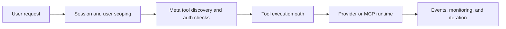

# Composio Tutorial: Production Tool and Authentication Infrastructure for AI Agents

> Learn how to use `ComposioHQ/composio` to connect agents to 800+ toolkits with session-aware discovery, robust authentication flows, provider integrations, MCP support, and event-trigger automation.

## Why This Track Matters

Composio is increasingly used as the integration substrate behind production AI agents because it combines tool discovery, user-scoped auth, and execution pathways across chat-completion, agent frameworks, and MCP clients.

This track focuses on:

- designing user-scoped sessions and tool discovery workflows
- selecting provider integration paths (OpenAI Agents, LangChain, Vercel AI SDK, and MCP)
- managing authentication and connected accounts safely
- operationalizing triggers, migration workflows, and troubleshooting practices

## Current Snapshot (Verified February 12, 2026)

- repository: [`ComposioHQ/composio`](https://github.com/ComposioHQ/composio)
- stars: about **26.5k**
- latest release: [`v0.11.1`](https://github.com/ComposioHQ/composio/releases/tag/v0.11.1) (**February 10, 2026**)
- default branch: `next`
- recent activity: updates on **February 12, 2026**
- project positioning: unified SDK/control layer for tool-enabled agent workflows

## Mental Model

## Chapter Guide

| Chapter | Key Question | Outcome |
|:--------|:-------------|:--------|
| [01 - Getting Started](01-getting-started.md) | How do I ship a first useful Composio-backed agent quickly? | Working baseline |
| [02 - Sessions, Meta Tools, and User Scoping](02-sessions-meta-tools-and-user-scoping.md) | How does Composio structure tool discovery and context? | Better system understanding |
| [03 - Provider Integrations and Framework Mapping](03-provider-integrations-and-framework-mapping.md) | Which provider path should I use for my stack? | Cleaner architecture choices |
| [04 - Authentication and Connected Accounts](04-authentication-and-connected-accounts.md) | How do I manage auth safely across users and toolkits? | Safer auth model |
| [05 - Tool Execution Modes and Modifiers](05-tool-execution-modes-and-modifiers.md) | How should direct, agentic, and provider-driven execution differ? | Better execution strategy |
| [06 - MCP Server Patterns and Toolkit Control](06-mcp-server-patterns-and-toolkit-control.md) | How should MCP be used with Composio in production? | Stronger MCP integration decisions |
| [07 - Triggers, Webhooks, and Event Automation](07-triggers-webhooks-and-event-automation.md) | How do I build reliable event-driven automation? | Event pipeline readiness |
| [08 - Migration, Troubleshooting, and Production Ops](08-migration-troubleshooting-and-production-ops.md) | How do I keep systems stable as SDKs and toolkits evolve? | Long-term operations playbook |

## What You Will Learn

- how to model user-scoped sessions for durable tool-enabled agent workflows
- how to choose among provider-native, agentic, and MCP execution paths
- how to design safer authentication and connected-account lifecycle controls
- how to operationalize triggers, migrations, and troubleshooting loops

## Source References

- [Composio Repository](https://github.com/ComposioHQ/composio)
- [README](https://github.com/ComposioHQ/composio/blob/next/README.md)
- [Quickstart](https://github.com/ComposioHQ/composio/blob/next/docs/content/docs/quickstart.mdx)
- [Tools and Toolkits](https://github.com/ComposioHQ/composio/blob/next/docs/content/docs/tools-and-toolkits.mdx)
- [Executing Tools](https://github.com/ComposioHQ/composio/blob/next/docs/content/docs/tools-direct/executing-tools.mdx)
- [Authentication](https://github.com/ComposioHQ/composio/blob/next/docs/content/docs/authentication.mdx)
- [OpenAI Agents Provider](https://github.com/ComposioHQ/composio/blob/next/docs/content/docs/providers/openai-agents.mdx)
- [Triggers](https://github.com/ComposioHQ/composio/blob/next/docs/content/docs/triggers.mdx)
- [Migration Guide: New SDK](https://github.com/ComposioHQ/composio/blob/next/docs/content/docs/migration-guide/new-sdk.mdx)

## Related Tutorials

- [Awesome Claude Skills Tutorial](../awesome-claude-skills-tutorial/)
- [MCP Python SDK Tutorial](../mcp-python-sdk-tutorial/)
- [GitHub MCP Server Tutorial](../github-mcp-server-tutorial/)
- [Vercel AI Tutorial](../vercel-ai-tutorial/)

---

Start with [Chapter 1: Getting Started](01-getting-started.md).
