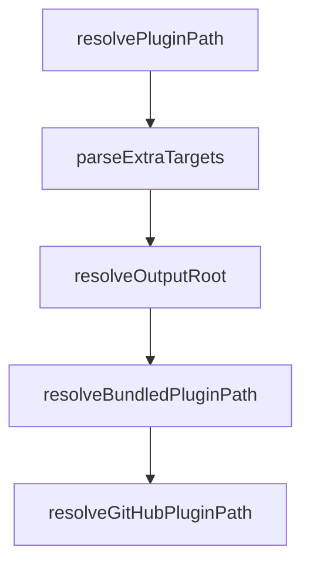

# Chapter 1: Getting Started

Welcome to **Chapter 1: Getting Started**. In this part of **Compound Engineering Plugin Tutorial: Compounding Agent Workflows Across Toolchains**, you will build an intuitive mental model first, then move into concrete implementation details and practical production tradeoffs.


This chapter gets the compound-engineering plugin installed and running in Claude Code.

## Learning Goals

- add the marketplace and install `compound-engineering`
- run the core workflow commands at least once
- verify generated behaviors align to documented flow
- understand initial setup requirements for team rollout

## Install Commands

```bash
/plugin marketplace add https://github.com/EveryInc/compound-engineering-plugin
/plugin install compound-engineering
```

## First-Run Validation

- run `/workflows:plan` on a small feature request
- run `/workflows:work` for scoped implementation
- run `/workflows:review` and inspect findings
- run `/workflows:compound` to capture reusable learnings

## Source References

- [Repository README Install](https://github.com/EveryInc/compound-engineering-plugin/blob/main/README.md#claude-code-install)
- [Workflow Overview](https://github.com/EveryInc/compound-engineering-plugin/blob/main/README.md#workflow)
- [Compound Plugin README](https://github.com/EveryInc/compound-engineering-plugin/blob/main/plugins/compound-engineering/README.md)

## Summary

You now have a working compound-engineering baseline in Claude Code.

Next: [Chapter 2: Compound Engineering Philosophy and Workflow Loop](02-compound-engineering-philosophy-and-workflow-loop.md)

## Source Code Walkthrough

### `src/commands/install.ts`

The `resolvePluginPath` function in [`src/commands/install.ts`](https://github.com/EveryInc/compound-engineering-plugin/blob/HEAD/src/commands/install.ts) handles a key part of this chapter's functionality:

```ts

    const branch = args.branch ? String(args.branch) : undefined
    const resolvedPlugin = await resolvePluginPath(String(args.plugin), branch)

    try {
      const plugin = await loadClaudePlugin(resolvedPlugin.path)
      const outputRoot = resolveOutputRoot(args.output)
      const codexHome = resolveTargetHome(args.codexHome, path.join(os.homedir(), ".codex"))
      const piHome = resolveTargetHome(args.piHome, path.join(os.homedir(), ".pi", "agent"))
      const hasExplicitOutput = Boolean(args.output && String(args.output).trim())
      const openclawHome = resolveTargetHome(args.openclawHome, path.join(os.homedir(), ".openclaw", "extensions"))
      const qwenHome = resolveTargetHome(args.qwenHome, path.join(os.homedir(), ".qwen", "extensions"))

      const options = {
        agentMode: String(args.agentMode) === "primary" ? "primary" : "subagent",
        inferTemperature: Boolean(args.inferTemperature),
        permissions: permissions as PermissionMode,
      }

      if (targetName === "all") {
        const detected = await detectInstalledTools()
        const activeTargets = detected.filter((t) => t.detected)

        if (activeTargets.length === 0) {
          console.log("No AI coding tools detected. Install at least one tool first.")
          return
        }

        console.log(`Detected ${activeTargets.length} tool(s):`)
        for (const tool of detected) {
          console.log(`  ${tool.detected ? "✓" : "✗"} ${tool.name} — ${tool.reason}`)
        }
```

This function is important because it defines how Compound Engineering Plugin Tutorial: Compounding Agent Workflows Across Toolchains implements the patterns covered in this chapter.

### `src/commands/install.ts`

The `parseExtraTargets` function in [`src/commands/install.ts`](https://github.com/EveryInc/compound-engineering-plugin/blob/HEAD/src/commands/install.ts) handles a key part of this chapter's functionality:

```ts
      console.log(`Installed ${plugin.manifest.name} to ${primaryOutputRoot}`)

      const extraTargets = parseExtraTargets(args.also)
      const allTargets = [targetName, ...extraTargets]
      for (const extra of extraTargets) {
        const handler = targets[extra]
        if (!handler) {
          console.warn(`Skipping unknown target: ${extra}`)
          continue
        }
        if (!handler.implemented) {
          console.warn(`Skipping ${extra}: not implemented yet.`)
          continue
        }
        const extraBundle = handler.convert(plugin, options)
        if (!extraBundle) {
          console.warn(`Skipping ${extra}: no output returned.`)
          continue
        }
        const extraRoot = resolveTargetOutputRoot({
          targetName: extra,
          outputRoot: path.join(outputRoot, extra),
          codexHome,
          piHome,
          openclawHome,
          qwenHome,
          pluginName: plugin.manifest.name,
          hasExplicitOutput,
          scope: handler.defaultScope,
        })
        await handler.write(extraRoot, extraBundle, handler.defaultScope)
        console.log(`Installed ${plugin.manifest.name} to ${extraRoot}`)
```

This function is important because it defines how Compound Engineering Plugin Tutorial: Compounding Agent Workflows Across Toolchains implements the patterns covered in this chapter.

### `src/commands/install.ts`

The `resolveOutputRoot` function in [`src/commands/install.ts`](https://github.com/EveryInc/compound-engineering-plugin/blob/HEAD/src/commands/install.ts) handles a key part of this chapter's functionality:

```ts
    try {
      const plugin = await loadClaudePlugin(resolvedPlugin.path)
      const outputRoot = resolveOutputRoot(args.output)
      const codexHome = resolveTargetHome(args.codexHome, path.join(os.homedir(), ".codex"))
      const piHome = resolveTargetHome(args.piHome, path.join(os.homedir(), ".pi", "agent"))
      const hasExplicitOutput = Boolean(args.output && String(args.output).trim())
      const openclawHome = resolveTargetHome(args.openclawHome, path.join(os.homedir(), ".openclaw", "extensions"))
      const qwenHome = resolveTargetHome(args.qwenHome, path.join(os.homedir(), ".qwen", "extensions"))

      const options = {
        agentMode: String(args.agentMode) === "primary" ? "primary" : "subagent",
        inferTemperature: Boolean(args.inferTemperature),
        permissions: permissions as PermissionMode,
      }

      if (targetName === "all") {
        const detected = await detectInstalledTools()
        const activeTargets = detected.filter((t) => t.detected)

        if (activeTargets.length === 0) {
          console.log("No AI coding tools detected. Install at least one tool first.")
          return
        }

        console.log(`Detected ${activeTargets.length} tool(s):`)
        for (const tool of detected) {
          console.log(`  ${tool.detected ? "✓" : "✗"} ${tool.name} — ${tool.reason}`)
        }

        for (const tool of activeTargets) {
          const handler = targets[tool.name]
          if (!handler || !handler.implemented) {
```

This function is important because it defines how Compound Engineering Plugin Tutorial: Compounding Agent Workflows Across Toolchains implements the patterns covered in this chapter.

### `src/commands/install.ts`

The `resolveBundledPluginPath` function in [`src/commands/install.ts`](https://github.com/EveryInc/compound-engineering-plugin/blob/HEAD/src/commands/install.ts) handles a key part of this chapter's functionality:

```ts
  // Skip bundled plugins when a branch is specified — the user wants a specific remote version
  if (!branch) {
    const bundledPluginPath = await resolveBundledPluginPath(input)
    if (bundledPluginPath) {
      return { path: bundledPluginPath }
    }
  }

  // Otherwise, fetch from GitHub (optionally from a specific branch)
  return await resolveGitHubPluginPath(input, branch)
}

function parseExtraTargets(value: unknown): string[] {
  if (!value) return []
  return String(value)
    .split(",")
    .map((entry) => entry.trim())
    .filter(Boolean)
}

function resolveOutputRoot(value: unknown): string {
  if (value && String(value).trim()) {
    const expanded = expandHome(String(value).trim())
    return path.resolve(expanded)
  }
  // OpenCode global config lives at ~/.config/opencode per XDG spec
  // See: https://opencode.ai/docs/config/
  return path.join(os.homedir(), ".config", "opencode")
}

async function resolveBundledPluginPath(pluginName: string): Promise<string | null> {
  const bundledRoot = fileURLToPath(new URL("../../plugins/", import.meta.url))
```

This function is important because it defines how Compound Engineering Plugin Tutorial: Compounding Agent Workflows Across Toolchains implements the patterns covered in this chapter.


## How These Components Connect


