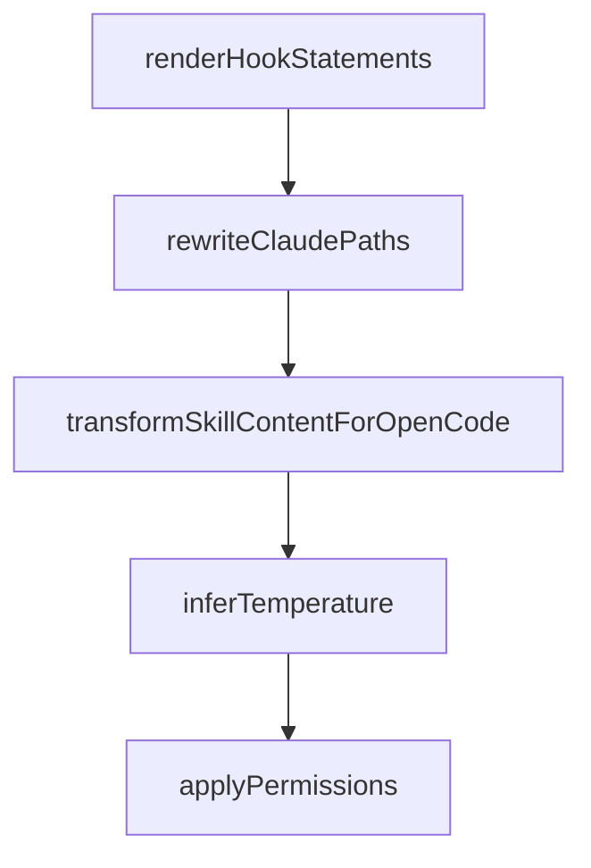

# Chapter 2: Compound Engineering Philosophy and Workflow Loop

Welcome to **Chapter 2: Compound Engineering Philosophy and Workflow Loop**. In this part of **Compound Engineering Plugin Tutorial: Compounding Agent Workflows Across Toolchains**, you will build an intuitive mental model first, then move into concrete implementation details and practical production tradeoffs.


This chapter explains the project's core premise: each work cycle should improve future cycles.

## Learning Goals

- understand the plan-work-review-compound loop deeply
- map philosophy to daily engineering decisions
- separate workflow discipline from tool-specific implementation details
- avoid anti-patterns that erase compounding benefits

## Workflow Core

```text
Plan -> Work -> Review -> Compound -> Repeat
```

## Compounding Principles

- invest heavily in planning and review quality
- capture reusable patterns and pitfalls after each cycle
- feed learnings back into future planning and execution

## Common Anti-Patterns

- skipping review phase under schedule pressure
- treating compound step as optional documentation overhead
- scaling scope before baseline workflow reliability is proven

## Source References

- [Repository Philosophy](https://github.com/EveryInc/compound-engineering-plugin/blob/main/README.md#philosophy)
- [Workflow Commands](https://github.com/EveryInc/compound-engineering-plugin/blob/main/README.md#workflow)
- [Compound Engineering Article](https://every.to/chain-of-thought/compound-engineering-how-every-codes-with-agents)

## Summary

You now understand how the workflow loop creates durable engineering leverage.

Next: [Chapter 3: Architecture of Agents, Commands, and Skills](03-architecture-of-agents-commands-and-skills.md)

## Source Code Walkthrough

### `src/converters/claude-to-opencode.ts`

The `renderHookStatements` function in [`src/converters/claude-to-opencode.ts`](https://github.com/EveryInc/compound-engineering-plugin/blob/HEAD/src/converters/claude-to-opencode.ts) handles a key part of this chapter's functionality:

```ts
  const statements: string[] = []
  for (const matcher of matchers) {
    statements.push(...renderHookStatements(matcher, options.useToolMatcher))
  }
  const rendered = statements.map((line) => `    ${line}`).join("\n")
  const wrapped = options.requireError
    ? `    if (input?.error) {\n${statements.map((line) => `      ${line}`).join("\n")}\n    }`
    : rendered

  // Wrap tool.execute.before handlers in try-catch to prevent a failing hook
  // from crashing parallel tool call batches (causes API 400 errors).
  // See: https://github.com/EveryInc/compound-engineering-plugin/issues/85
  const isPreToolUse = event === "tool.execute.before"
  const note = options.note ? `    // ${options.note}\n` : ""
  if (isPreToolUse) {
    return `    "${event}": async (input) => {\n${note}    try {\n  ${wrapped}\n    } catch (err) {\n      console.error("[hook] ${event} error (non-fatal):", err)\n    }\n    }`
  }
  return `    "${event}": async (input) => {\n${note}${wrapped}\n    }`
}

function renderHookStatements(
  matcher: ClaudeHooks["hooks"][string][number],
  useToolMatcher: boolean,
): string[] {
  if (!matcher.hooks || matcher.hooks.length === 0) return []
  const tools = matcher.matcher
    ? matcher.matcher
        .split("|")
        .map((tool) => tool.trim().toLowerCase())
        .filter(Boolean)
    : []

```

This function is important because it defines how Compound Engineering Plugin Tutorial: Compounding Agent Workflows Across Toolchains implements the patterns covered in this chapter.

### `src/converters/claude-to-opencode.ts`

The `rewriteClaudePaths` function in [`src/converters/claude-to-opencode.ts`](https://github.com/EveryInc/compound-engineering-plugin/blob/HEAD/src/converters/claude-to-opencode.ts) handles a key part of this chapter's functionality:

```ts
  }

  const content = formatFrontmatter(frontmatter, rewriteClaudePaths(agent.body))

  return {
    name: agent.name,
    content,
  }
}

// Commands are written as individual .md files rather than entries in opencode.json.
// Chosen over JSON map because opencode resolves commands by filename at runtime (ADR-001).
function convertCommands(commands: ClaudeCommand[]): OpenCodeCommandFile[] {
  const files: OpenCodeCommandFile[] = []
  for (const command of commands) {
    if (command.disableModelInvocation) continue
    const frontmatter: Record<string, unknown> = {
      description: command.description,
    }
    if (command.model && command.model !== "inherit") {
      frontmatter.model = normalizeModelWithProvider(command.model)
    }
    const content = formatFrontmatter(frontmatter, rewriteClaudePaths(command.body))
    files.push({ name: command.name, content })
  }
  return files
}

function convertMcp(servers: Record<string, ClaudeMcpServer>): Record<string, OpenCodeMcpServer> {
  const result: Record<string, OpenCodeMcpServer> = {}
  for (const [name, server] of Object.entries(servers)) {
    if (server.command) {
```

This function is important because it defines how Compound Engineering Plugin Tutorial: Compounding Agent Workflows Across Toolchains implements the patterns covered in this chapter.

### `src/converters/claude-to-opencode.ts`

The `transformSkillContentForOpenCode` function in [`src/converters/claude-to-opencode.ts`](https://github.com/EveryInc/compound-engineering-plugin/blob/HEAD/src/converters/claude-to-opencode.ts) handles a key part of this chapter's functionality:

```ts
 * See #477.
 */
export function transformSkillContentForOpenCode(body: string): string {
  let result = rewriteClaudePaths(body)
  // Rewrite 3-segment FQ agent refs: plugin:category:agent-name -> agent-name.
  // Boundary assertions prevent partial matching on 4+ segment names
  // (e.g. `a:b:c:d` would otherwise produce `c:d` or `a:d`).
  // The `/` in the lookbehind prevents rewriting slash commands like
  // `/team:ops:deploy` — agent names are never preceded by `/`.
  result = result.replace(
    /(?<![a-z0-9:/-])[a-z][a-z0-9-]*:[a-z][a-z0-9-]*:([a-z][a-z0-9-]*)(?![a-z0-9:-])/g,
    "$1",
  )
  return result
}

function inferTemperature(agent: ClaudeAgent): number | undefined {
  const sample = `${agent.name} ${agent.description ?? ""}`.toLowerCase()
  if (/(review|audit|security|sentinel|oracle|lint|verification|guardian)/.test(sample)) {
    return 0.1
  }
  if (/(plan|planning|architecture|strategist|analysis|research)/.test(sample)) {
    return 0.2
  }
  if (/(doc|readme|changelog|editor|writer)/.test(sample)) {
    return 0.3
  }
  if (/(brainstorm|creative|ideate|design|concept)/.test(sample)) {
    return 0.6
  }
  return 0.3
}
```

This function is important because it defines how Compound Engineering Plugin Tutorial: Compounding Agent Workflows Across Toolchains implements the patterns covered in this chapter.

### `src/converters/claude-to-opencode.ts`

The `inferTemperature` function in [`src/converters/claude-to-opencode.ts`](https://github.com/EveryInc/compound-engineering-plugin/blob/HEAD/src/converters/claude-to-opencode.ts) handles a key part of this chapter's functionality:

```ts
export type ClaudeToOpenCodeOptions = {
  agentMode: "primary" | "subagent"
  inferTemperature: boolean
  permissions: PermissionMode
}

const TOOL_MAP: Record<string, string> = {
  bash: "bash",
  read: "read",
  write: "write",
  edit: "edit",
  grep: "grep",
  glob: "glob",
  list: "list",
  webfetch: "webfetch",
  skill: "skill",
  patch: "patch",
  task: "task",
  question: "question",
  todowrite: "todowrite",
  todoread: "todoread",
}

type HookEventMapping = {
  events: string[]
  type: "tool" | "session" | "permission" | "message"
  requireError?: boolean
  note?: string
}

const HOOK_EVENT_MAP: Record<string, HookEventMapping> = {
  PreToolUse: { events: ["tool.execute.before"], type: "tool" },
```

This function is important because it defines how Compound Engineering Plugin Tutorial: Compounding Agent Workflows Across Toolchains implements the patterns covered in this chapter.


## How These Components Connect


