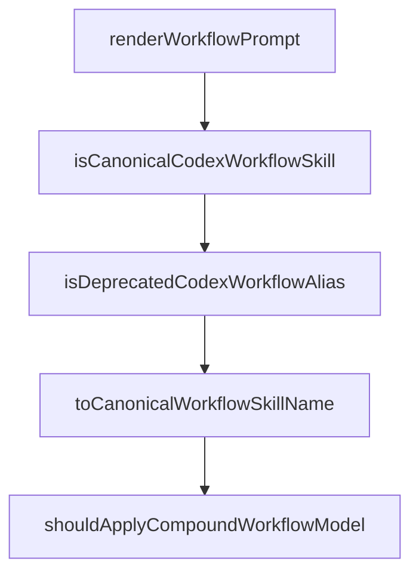

# Chapter 3: Architecture of Agents, Commands, and Skills

Welcome to **Chapter 3: Architecture of Agents, Commands, and Skills**. In this part of **Compound Engineering Plugin Tutorial: Compounding Agent Workflows Across Toolchains**, you will build an intuitive mental model first, then move into concrete implementation details and practical production tradeoffs.


This chapter maps the plugin's capability graph across agents, commands, and skills.

## Learning Goals

- understand capability categories and their purposes
- map commands to underlying specialist agents and skills
- design workflow routing decisions with less trial-and-error
- identify where to add customizations safely

## Capability Topology

The plugin organizes assets into:

- review agents
- research agents
- design agents
- workflow agents
- command suites
- skill packs across architecture, tooling, orchestration, and automation

## Practical Mapping Pattern

- use workflow commands for default orchestration
- invoke targeted commands for specialized tasks
- rely on skills for repeatable domain strategy injection

## Source References

- [Compound Plugin Components](https://github.com/EveryInc/compound-engineering-plugin/blob/main/plugins/compound-engineering/README.md#components)
- [Agents Catalog](https://github.com/EveryInc/compound-engineering-plugin/tree/main/plugins/compound-engineering/agents)
- [Commands Catalog](https://github.com/EveryInc/compound-engineering-plugin/tree/main/plugins/compound-engineering/commands)
- [Skills Catalog](https://github.com/EveryInc/compound-engineering-plugin/tree/main/plugins/compound-engineering/skills)

## Summary

You now have a clear architecture map for plugin capability selection.

Next: [Chapter 4: Multi-Provider Conversion and Config Sync](04-multi-provider-conversion-and-config-sync.md)

## Source Code Walkthrough

### `src/converters/claude-to-codex.ts`

The `renderWorkflowPrompt` function in [`src/converters/claude-to-codex.ts`](https://github.com/EveryInc/compound-engineering-plugin/blob/HEAD/src/converters/claude-to-codex.ts) handles a key part of this chapter's functionality:

```ts
  const workflowPrompts = canonicalWorkflowSkills.map((skill) => ({
    name: workflowPromptNames.get(skill.name)!,
    content: renderWorkflowPrompt(skill),
  }))

  const agentSkills = plugin.agents.map((agent) =>
    convertAgent(agent, usedSkillNames, invocationTargets),
  )
  const generatedSkills = [...commandSkills, ...agentSkills]

  return {
    prompts: [...prompts, ...workflowPrompts],
    skillDirs,
    generatedSkills,
    invocationTargets,
    mcpServers: plugin.mcpServers,
  }
}

function convertAgent(
  agent: ClaudeAgent,
  usedNames: Set<string>,
  invocationTargets: CodexInvocationTargets,
): CodexGeneratedSkill {
  const name = uniqueName(normalizeCodexName(agent.name), usedNames)
  const description = sanitizeDescription(
    agent.description ?? `Converted from Claude agent ${agent.name}`,
  )
  const frontmatter: Record<string, unknown> = { name, description }

  let body = transformContentForCodex(agent.body.trim(), invocationTargets)
  if (agent.capabilities && agent.capabilities.length > 0) {
```

This function is important because it defines how Compound Engineering Plugin Tutorial: Compounding Agent Workflows Across Toolchains implements the patterns covered in this chapter.

### `src/converters/claude-to-codex.ts`

The `isCanonicalCodexWorkflowSkill` function in [`src/converters/claude-to-codex.ts`](https://github.com/EveryInc/compound-engineering-plugin/blob/HEAD/src/converters/claude-to-codex.ts) handles a key part of this chapter's functionality:

```ts
  const applyCompoundWorkflowModel = shouldApplyCompoundWorkflowModel(plugin)
  const canonicalWorkflowSkills = applyCompoundWorkflowModel
    ? plugin.skills.filter((skill) => isCanonicalCodexWorkflowSkill(skill.name))
    : []
  const deprecatedWorkflowAliases = applyCompoundWorkflowModel
    ? plugin.skills.filter((skill) => isDeprecatedCodexWorkflowAlias(skill.name))
    : []
  const copiedSkills = applyCompoundWorkflowModel
    ? plugin.skills.filter((skill) => !isDeprecatedCodexWorkflowAlias(skill.name))
    : plugin.skills
  const skillDirs = copiedSkills.map((skill) => ({
    name: skill.name,
    sourceDir: skill.sourceDir,
  }))
  const promptNames = new Set<string>()
  const usedSkillNames = new Set<string>(skillDirs.map((skill) => normalizeCodexName(skill.name)))

  const commandPromptNames = new Map<string, string>()
  for (const command of invocableCommands) {
    commandPromptNames.set(
      command.name,
      uniqueName(normalizeCodexName(command.name), promptNames),
    )
  }

  const workflowPromptNames = new Map<string, string>()
  for (const skill of canonicalWorkflowSkills) {
    workflowPromptNames.set(
      skill.name,
      uniqueName(normalizeCodexName(skill.name), promptNames),
    )
  }
```

This function is important because it defines how Compound Engineering Plugin Tutorial: Compounding Agent Workflows Across Toolchains implements the patterns covered in this chapter.

### `src/converters/claude-to-codex.ts`

The `isDeprecatedCodexWorkflowAlias` function in [`src/converters/claude-to-codex.ts`](https://github.com/EveryInc/compound-engineering-plugin/blob/HEAD/src/converters/claude-to-codex.ts) handles a key part of this chapter's functionality:

```ts
    : []
  const deprecatedWorkflowAliases = applyCompoundWorkflowModel
    ? plugin.skills.filter((skill) => isDeprecatedCodexWorkflowAlias(skill.name))
    : []
  const copiedSkills = applyCompoundWorkflowModel
    ? plugin.skills.filter((skill) => !isDeprecatedCodexWorkflowAlias(skill.name))
    : plugin.skills
  const skillDirs = copiedSkills.map((skill) => ({
    name: skill.name,
    sourceDir: skill.sourceDir,
  }))
  const promptNames = new Set<string>()
  const usedSkillNames = new Set<string>(skillDirs.map((skill) => normalizeCodexName(skill.name)))

  const commandPromptNames = new Map<string, string>()
  for (const command of invocableCommands) {
    commandPromptNames.set(
      command.name,
      uniqueName(normalizeCodexName(command.name), promptNames),
    )
  }

  const workflowPromptNames = new Map<string, string>()
  for (const skill of canonicalWorkflowSkills) {
    workflowPromptNames.set(
      skill.name,
      uniqueName(normalizeCodexName(skill.name), promptNames),
    )
  }

  const promptTargets: Record<string, string> = {}
  for (const [commandName, promptName] of commandPromptNames) {
```

This function is important because it defines how Compound Engineering Plugin Tutorial: Compounding Agent Workflows Across Toolchains implements the patterns covered in this chapter.

### `src/converters/claude-to-codex.ts`

The `toCanonicalWorkflowSkillName` function in [`src/converters/claude-to-codex.ts`](https://github.com/EveryInc/compound-engineering-plugin/blob/HEAD/src/converters/claude-to-codex.ts) handles a key part of this chapter's functionality:

```ts
  }
  for (const alias of deprecatedWorkflowAliases) {
    const canonicalName = toCanonicalWorkflowSkillName(alias.name)
    const promptName = canonicalName ? workflowPromptNames.get(canonicalName) : undefined
    if (promptName) {
      promptTargets[normalizeCodexName(alias.name)] = promptName
    }
  }

  const skillTargets: Record<string, string> = {}
  for (const skill of copiedSkills) {
    if (applyCompoundWorkflowModel && isCanonicalCodexWorkflowSkill(skill.name)) continue
    skillTargets[normalizeCodexName(skill.name)] = skill.name
  }

  const invocationTargets: CodexInvocationTargets = { promptTargets, skillTargets }

  const commandSkills: CodexGeneratedSkill[] = []
  const prompts = invocableCommands.map((command) => {
    const promptName = commandPromptNames.get(command.name)!
    const commandSkill = convertCommandSkill(command, usedSkillNames, invocationTargets)
    commandSkills.push(commandSkill)
    const content = renderPrompt(command, commandSkill.name, invocationTargets)
    return { name: promptName, content }
  })
  const workflowPrompts = canonicalWorkflowSkills.map((skill) => ({
    name: workflowPromptNames.get(skill.name)!,
    content: renderWorkflowPrompt(skill),
  }))

  const agentSkills = plugin.agents.map((agent) =>
    convertAgent(agent, usedSkillNames, invocationTargets),
```

This function is important because it defines how Compound Engineering Plugin Tutorial: Compounding Agent Workflows Across Toolchains implements the patterns covered in this chapter.


## How These Components Connect


