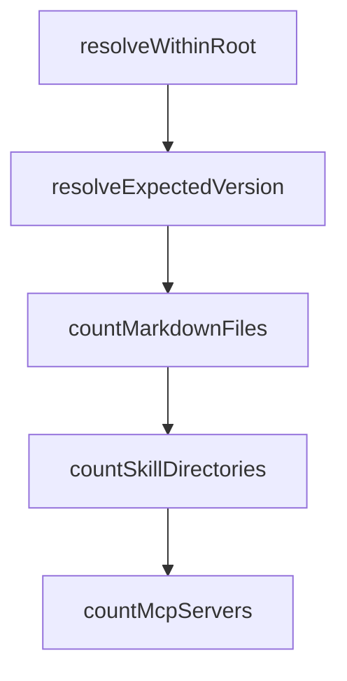

# Chapter 4: Multi-Provider Conversion and Config Sync

Welcome to **Chapter 4: Multi-Provider Conversion and Config Sync**. In this part of **Compound Engineering Plugin Tutorial: Compounding Agent Workflows Across Toolchains**, you will build an intuitive mental model first, then move into concrete implementation details and practical production tradeoffs.


This chapter covers cross-platform conversion features for teams using multiple coding-agent runtimes.

## Learning Goals

- convert compound plugin assets to OpenCode, Codex, and Droid targets
- sync personal Claude config into alternate runtimes
- understand output paths and provider-specific constraints
- avoid format-loss pitfalls in cross-provider migration

## Conversion Commands

```bash
bunx @every-env/compound-plugin install compound-engineering --to opencode
bunx @every-env/compound-plugin install compound-engineering --to codex
bunx @every-env/compound-plugin install compound-engineering --to droid
```

## Sync Commands

```bash
bunx @every-env/compound-plugin sync --target opencode
bunx @every-env/compound-plugin sync --target codex
```

## Portability Considerations

- command/skill semantics differ by runtime
- some provider limits require description truncation or schema adaptation
- output directories and file contracts differ per target

## Source References

- [README Multi-Target Install](https://github.com/EveryInc/compound-engineering-plugin/blob/main/README.md#opencode-codex--droid-experimental-install)
- [README Sync Personal Config](https://github.com/EveryInc/compound-engineering-plugin/blob/main/README.md#sync-personal-config)
- [Codex Spec Notes](https://github.com/EveryInc/compound-engineering-plugin/blob/main/docs/specs/codex.md)
- [OpenCode Spec Notes](https://github.com/EveryInc/compound-engineering-plugin/blob/main/docs/specs/opencode.md)

## Summary

You now understand how to move compound workflows across different coding-agent stacks.

Next: [Chapter 5: MCP Integrations and Browser Automation](05-mcp-integrations-and-browser-automation.md)

## Source Code Walkthrough

### `src/parsers/claude.ts`

The `resolveWithinRoot` function in [`src/parsers/claude.ts`](https://github.com/EveryInc/compound-engineering-plugin/blob/HEAD/src/parsers/claude.ts) handles a key part of this chapter's functionality:

```ts
      const hookPaths = toPathList(hooksField)
      for (const hookPath of hookPaths) {
        const resolved = resolveWithinRoot(root, hookPath, "hooks path")
        if (await pathExists(resolved)) {
          hookConfigs.push(await readJson<ClaudeHooks>(resolved))
        }
      }
    } else {
      hookConfigs.push(hooksField)
    }
  }

  if (hookConfigs.length === 0) return undefined
  return mergeHooks(hookConfigs)
}

async function loadMcpServers(
  root: string,
  manifest: ClaudeManifest,
): Promise<Record<string, ClaudeMcpServer> | undefined> {
  const field = manifest.mcpServers
  if (field) {
    if (typeof field === "string" || Array.isArray(field)) {
      return mergeMcpConfigs(await loadMcpPaths(root, field))
    }
    return field as Record<string, ClaudeMcpServer>
  }

  const mcpPath = path.join(root, ".mcp.json")
  if (await pathExists(mcpPath)) {
    const raw = await readJson<Record<string, unknown>>(mcpPath)
    return unwrapMcpServers(raw)
```

This function is important because it defines how Compound Engineering Plugin Tutorial: Compounding Agent Workflows Across Toolchains implements the patterns covered in this chapter.

### `src/release/metadata.ts`

The `resolveExpectedVersion` function in [`src/release/metadata.ts`](https://github.com/EveryInc/compound-engineering-plugin/blob/HEAD/src/release/metadata.ts) handles a key part of this chapter's functionality:

```ts
  "AI-powered development tools that get smarter with every use. Make each unit of engineering work easier than the last."

function resolveExpectedVersion(
  explicitVersion: string | undefined,
  fallbackVersion: string,
): string {
  return explicitVersion ?? fallbackVersion
}

export async function countMarkdownFiles(root: string): Promise<number> {
  const entries = await fs.readdir(root, { withFileTypes: true })
  let total = 0

  for (const entry of entries) {
    const fullPath = path.join(root, entry.name)
    if (entry.isDirectory()) {
      total += await countMarkdownFiles(fullPath)
      continue
    }
    if (entry.isFile() && entry.name.endsWith(".md")) {
      total += 1
    }
  }

  return total
}

export async function countSkillDirectories(root: string): Promise<number> {
  const entries = await fs.readdir(root, { withFileTypes: true })
  let total = 0

  for (const entry of entries) {
```

This function is important because it defines how Compound Engineering Plugin Tutorial: Compounding Agent Workflows Across Toolchains implements the patterns covered in this chapter.

### `src/release/metadata.ts`

The `countMarkdownFiles` function in [`src/release/metadata.ts`](https://github.com/EveryInc/compound-engineering-plugin/blob/HEAD/src/release/metadata.ts) handles a key part of this chapter's functionality:

```ts
}

export async function countMarkdownFiles(root: string): Promise<number> {
  const entries = await fs.readdir(root, { withFileTypes: true })
  let total = 0

  for (const entry of entries) {
    const fullPath = path.join(root, entry.name)
    if (entry.isDirectory()) {
      total += await countMarkdownFiles(fullPath)
      continue
    }
    if (entry.isFile() && entry.name.endsWith(".md")) {
      total += 1
    }
  }

  return total
}

export async function countSkillDirectories(root: string): Promise<number> {
  const entries = await fs.readdir(root, { withFileTypes: true })
  let total = 0

  for (const entry of entries) {
    if (!entry.isDirectory()) continue
    const skillPath = path.join(root, entry.name, "SKILL.md")
    try {
      await fs.access(skillPath)
      total += 1
    } catch {
      // Ignore non-skill directories.
```

This function is important because it defines how Compound Engineering Plugin Tutorial: Compounding Agent Workflows Across Toolchains implements the patterns covered in this chapter.

### `src/release/metadata.ts`

The `countSkillDirectories` function in [`src/release/metadata.ts`](https://github.com/EveryInc/compound-engineering-plugin/blob/HEAD/src/release/metadata.ts) handles a key part of this chapter's functionality:

```ts
}

export async function countSkillDirectories(root: string): Promise<number> {
  const entries = await fs.readdir(root, { withFileTypes: true })
  let total = 0

  for (const entry of entries) {
    if (!entry.isDirectory()) continue
    const skillPath = path.join(root, entry.name, "SKILL.md")
    try {
      await fs.access(skillPath)
      total += 1
    } catch {
      // Ignore non-skill directories.
    }
  }

  return total
}

export async function countMcpServers(pluginRoot: string): Promise<number> {
  const mcpPath = path.join(pluginRoot, ".mcp.json")
  try {
    const manifest = await readJson<{ mcpServers?: Record<string, unknown> }>(mcpPath)
    return Object.keys(manifest.mcpServers ?? {}).length
  } catch (err: unknown) {
    if ((err as NodeJS.ErrnoException).code === "ENOENT") return 0
    throw err
  }
}

export async function getCompoundEngineeringCounts(root: string): Promise<CompoundEngineeringCounts> {
```

This function is important because it defines how Compound Engineering Plugin Tutorial: Compounding Agent Workflows Across Toolchains implements the patterns covered in this chapter.


## How These Components Connect


