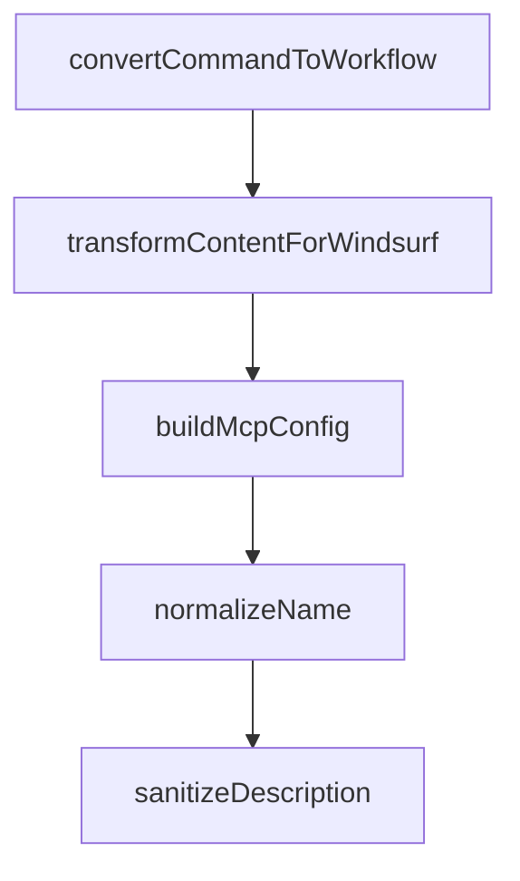

# Chapter 5: MCP Integrations and Browser Automation

Welcome to **Chapter 5: MCP Integrations and Browser Automation**. In this part of **Compound Engineering Plugin Tutorial: Compounding Agent Workflows Across Toolchains**, you will build an intuitive mental model first, then move into concrete implementation details and practical production tradeoffs.


This chapter explains how MCP-backed capabilities and browser automation expand workflow reach.

## Learning Goals

- integrate and validate MCP servers used by compound workflows
- understand how Context7 and Playwright support common tasks
- apply browser automation with safe operational defaults
- diagnose MCP connectivity issues quickly

## Integration Model

The plugin ecosystem supports MCP tools for:

- documentation and context retrieval
- browser-driven validation and testing
- external service integration in workflow commands

## Safety Guidelines

- validate MCP server credentials and permissions before execution
- run browser automation in non-critical targets first
- keep explicit logs for automation actions in team workflows

## Source References

- [Compound Plugin MCP Section](https://github.com/EveryInc/compound-engineering-plugin/blob/main/plugins/compound-engineering/README.md#mcp-servers)
- [Browser Automation Section](https://github.com/EveryInc/compound-engineering-plugin/blob/main/plugins/compound-engineering/README.md#browser-automation)
- [MCP Servers Docs Page](https://github.com/EveryInc/compound-engineering-plugin/blob/main/docs/pages/mcp-servers.html)

## Summary

You now know how MCP and browser capabilities fit into compound engineering workflows.

Next: [Chapter 6: Daily Operations and Quality Gates](06-daily-operations-and-quality-gates.md)

## Depth Expansion Playbook

## Source Code Walkthrough

### `src/converters/claude-to-windsurf.ts`

The `convertCommandToWorkflow` function in [`src/converters/claude-to-windsurf.ts`](https://github.com/EveryInc/compound-engineering-plugin/blob/HEAD/src/converters/claude-to-windsurf.ts) handles a key part of this chapter's functionality:

```ts
  const usedCommandNames = new Set<string>()
  const commandWorkflows = plugin.commands.map((command) =>
    convertCommandToWorkflow(command, knownAgentNames, usedCommandNames),
  )

  // Build MCP config
  const mcpConfig = buildMcpConfig(plugin.mcpServers)

  // Warn about hooks
  if (plugin.hooks && Object.keys(plugin.hooks.hooks).length > 0) {
    console.warn(
      "Warning: Windsurf has no hooks equivalent. Hooks were skipped during conversion.",
    )
  }

  return { agentSkills, commandWorkflows, skillDirs, mcpConfig }
}

function convertAgentToSkill(
  agent: ClaudeAgent,
  knownAgentNames: string[],
  usedNames: Set<string>,
): WindsurfGeneratedSkill {
  const name = uniqueName(normalizeName(agent.name), usedNames)
  const description = sanitizeDescription(
    agent.description ?? `Converted from Claude agent ${agent.name}`,
  )

  let body = transformContentForWindsurf(agent.body.trim(), knownAgentNames)
  if (agent.capabilities && agent.capabilities.length > 0) {
    const capabilities = agent.capabilities.map((c) => `- ${c}`).join("\n")
    body = `## Capabilities\n${capabilities}\n\n${body}`.trim()
```

This function is important because it defines how Compound Engineering Plugin Tutorial: Compounding Agent Workflows Across Toolchains implements the patterns covered in this chapter.

### `src/converters/claude-to-windsurf.ts`

The `transformContentForWindsurf` function in [`src/converters/claude-to-windsurf.ts`](https://github.com/EveryInc/compound-engineering-plugin/blob/HEAD/src/converters/claude-to-windsurf.ts) handles a key part of this chapter's functionality:

```ts
  )

  let body = transformContentForWindsurf(agent.body.trim(), knownAgentNames)
  if (agent.capabilities && agent.capabilities.length > 0) {
    const capabilities = agent.capabilities.map((c) => `- ${c}`).join("\n")
    body = `## Capabilities\n${capabilities}\n\n${body}`.trim()
  }
  if (body.length === 0) {
    body = `Instructions converted from the ${agent.name} agent.`
  }

  const content = formatFrontmatter({ name, description }, `# ${name}\n\n${body}`) + "\n"
  return { name, content }
}

function convertCommandToWorkflow(
  command: ClaudeCommand,
  knownAgentNames: string[],
  usedNames: Set<string>,
): WindsurfWorkflow {
  const name = uniqueName(normalizeName(command.name), usedNames)
  const description = sanitizeDescription(
    command.description ?? `Converted from Claude command ${command.name}`,
  )

  let body = transformContentForWindsurf(command.body.trim(), knownAgentNames)
  if (command.argumentHint) {
    body = `> Arguments: ${command.argumentHint}\n\n${body}`
  }
  if (body.length === 0) {
    body = `Instructions converted from the ${command.name} command.`
  }
```

This function is important because it defines how Compound Engineering Plugin Tutorial: Compounding Agent Workflows Across Toolchains implements the patterns covered in this chapter.

### `src/converters/claude-to-windsurf.ts`

The `buildMcpConfig` function in [`src/converters/claude-to-windsurf.ts`](https://github.com/EveryInc/compound-engineering-plugin/blob/HEAD/src/converters/claude-to-windsurf.ts) handles a key part of this chapter's functionality:

```ts

  // Build MCP config
  const mcpConfig = buildMcpConfig(plugin.mcpServers)

  // Warn about hooks
  if (plugin.hooks && Object.keys(plugin.hooks.hooks).length > 0) {
    console.warn(
      "Warning: Windsurf has no hooks equivalent. Hooks were skipped during conversion.",
    )
  }

  return { agentSkills, commandWorkflows, skillDirs, mcpConfig }
}

function convertAgentToSkill(
  agent: ClaudeAgent,
  knownAgentNames: string[],
  usedNames: Set<string>,
): WindsurfGeneratedSkill {
  const name = uniqueName(normalizeName(agent.name), usedNames)
  const description = sanitizeDescription(
    agent.description ?? `Converted from Claude agent ${agent.name}`,
  )

  let body = transformContentForWindsurf(agent.body.trim(), knownAgentNames)
  if (agent.capabilities && agent.capabilities.length > 0) {
    const capabilities = agent.capabilities.map((c) => `- ${c}`).join("\n")
    body = `## Capabilities\n${capabilities}\n\n${body}`.trim()
  }
  if (body.length === 0) {
    body = `Instructions converted from the ${agent.name} agent.`
  }
```

This function is important because it defines how Compound Engineering Plugin Tutorial: Compounding Agent Workflows Across Toolchains implements the patterns covered in this chapter.

### `src/converters/claude-to-windsurf.ts`

The `normalizeName` function in [`src/converters/claude-to-windsurf.ts`](https://github.com/EveryInc/compound-engineering-plugin/blob/HEAD/src/converters/claude-to-windsurf.ts) handles a key part of this chapter's functionality:

```ts
  _options: ClaudeToWindsurfOptions,
): WindsurfBundle {
  const knownAgentNames = plugin.agents.map((a) => normalizeName(a.name))

  // Pass-through skills (collected first so agent skill names can deduplicate against them)
  const skillDirs = plugin.skills.map((skill) => ({
    name: skill.name,
    sourceDir: skill.sourceDir,
  }))

  // Convert agents to skills (seed usedNames with pass-through skill names)
  const usedSkillNames = new Set<string>(skillDirs.map((s) => s.name))
  const agentSkills = plugin.agents.map((agent) =>
    convertAgentToSkill(agent, knownAgentNames, usedSkillNames),
  )

  // Convert commands to workflows
  const usedCommandNames = new Set<string>()
  const commandWorkflows = plugin.commands.map((command) =>
    convertCommandToWorkflow(command, knownAgentNames, usedCommandNames),
  )

  // Build MCP config
  const mcpConfig = buildMcpConfig(plugin.mcpServers)

  // Warn about hooks
  if (plugin.hooks && Object.keys(plugin.hooks.hooks).length > 0) {
    console.warn(
      "Warning: Windsurf has no hooks equivalent. Hooks were skipped during conversion.",
    )
  }

```

This function is important because it defines how Compound Engineering Plugin Tutorial: Compounding Agent Workflows Across Toolchains implements the patterns covered in this chapter.


## How These Components Connect


