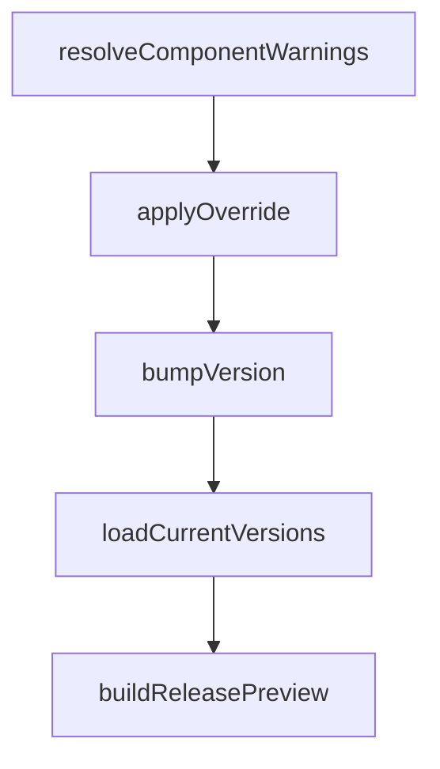

# Chapter 5: MCP Integrations and Browser Automation

Welcome to **Chapter 5: MCP Integrations and Browser Automation**. In this part of **Compound Engineering Plugin Tutorial: Compounding Agent Workflows Across Toolchains**, you will build an intuitive mental model first, then move into concrete implementation details and practical production tradeoffs.


This chapter explains how MCP-backed capabilities and browser automation expand workflow reach.

## Learning Goals

- integrate and validate MCP servers used by compound workflows
- understand how Context7 and Playwright support common tasks
- apply browser automation with safe operational defaults
- diagnose MCP connectivity issues quickly

## Integration Model

The plugin ecosystem supports MCP tools for:

- documentation and context retrieval
- browser-driven validation and testing
- external service integration in workflow commands

## Safety Guidelines

- validate MCP server credentials and permissions before execution
- run browser automation in non-critical targets first
- keep explicit logs for automation actions in team workflows

## Source References

- [Compound Plugin MCP Section](https://github.com/EveryInc/compound-engineering-plugin/blob/main/plugins/compound-engineering/README.md#mcp-servers)
- [Browser Automation Section](https://github.com/EveryInc/compound-engineering-plugin/blob/main/plugins/compound-engineering/README.md#browser-automation)
- [MCP Servers Docs Page](https://github.com/EveryInc/compound-engineering-plugin/blob/main/docs/pages/mcp-servers.html)

## Summary

You now know how MCP and browser capabilities fit into compound engineering workflows.

Next: [Chapter 6: Daily Operations and Quality Gates](06-daily-operations-and-quality-gates.md)

## Source Code Walkthrough

### `src/release/components.ts`

The `resolveComponentWarnings` function in [`src/release/components.ts`](https://github.com/EveryInc/compound-engineering-plugin/blob/HEAD/src/release/components.ts) handles a key part of this chapter's functionality:

```ts
}

export function resolveComponentWarnings(
  intent: ParsedReleaseIntent,
  detectedComponents: ReleaseComponent[],
): string[] {
  const warnings: string[] = []

  if (!intent.type) {
    warnings.push("Title does not match the expected conventional format: <type>(optional-scope): description")
    return warnings
  }

  if (intent.scope) {
    const normalized = intent.scope.trim().toLowerCase()
    const expected = SCOPES_TO_COMPONENTS[normalized]
    if (expected && detectedComponents.length > 0 && !detectedComponents.includes(expected)) {
      warnings.push(
        `Optional scope "${intent.scope}" does not match the detected component set: ${detectedComponents.join(", ")}`,
      )
    }
  }

  if (detectedComponents.length === 0 && inferBumpFromIntent(intent) !== null) {
    warnings.push("No releasable component files were detected for this change")
  }

  return warnings
}

export function applyOverride(
  inferred: BumpLevel | null,
```

This function is important because it defines how Compound Engineering Plugin Tutorial: Compounding Agent Workflows Across Toolchains implements the patterns covered in this chapter.

### `src/release/components.ts`

The `applyOverride` function in [`src/release/components.ts`](https://github.com/EveryInc/compound-engineering-plugin/blob/HEAD/src/release/components.ts) handles a key part of this chapter's functionality:

```ts
}

export function applyOverride(
  inferred: BumpLevel | null,
  override: BumpOverride,
): BumpLevel | null {
  if (override === "auto") return inferred
  return override
}

export function bumpVersion(version: string, bump: BumpLevel | null): string | null {
  if (!bump) return null

  const match = /^(\d+)\.(\d+)\.(\d+)$/.exec(version)
  if (!match) {
    throw new Error(`Unsupported version format: ${version}`)
  }

  const major = Number(match[1])
  const minor = Number(match[2])
  const patch = Number(match[3])

  switch (bump) {
    case "major":
      return `${major + 1}.0.0`
    case "minor":
      return `${major}.${minor + 1}.0`
    case "patch":
      return `${major}.${minor}.${patch + 1}`
  }
}

```

This function is important because it defines how Compound Engineering Plugin Tutorial: Compounding Agent Workflows Across Toolchains implements the patterns covered in this chapter.

### `src/release/components.ts`

The `bumpVersion` function in [`src/release/components.ts`](https://github.com/EveryInc/compound-engineering-plugin/blob/HEAD/src/release/components.ts) handles a key part of this chapter's functionality:

```ts
}

export function bumpVersion(version: string, bump: BumpLevel | null): string | null {
  if (!bump) return null

  const match = /^(\d+)\.(\d+)\.(\d+)$/.exec(version)
  if (!match) {
    throw new Error(`Unsupported version format: ${version}`)
  }

  const major = Number(match[1])
  const minor = Number(match[2])
  const patch = Number(match[3])

  switch (bump) {
    case "major":
      return `${major + 1}.0.0`
    case "minor":
      return `${major}.${minor + 1}.0`
    case "patch":
      return `${major}.${minor}.${patch + 1}`
  }
}

export async function loadCurrentVersions(cwd = process.cwd()): Promise<VersionSources> {
  const root = await readJson<RootPackageJson>(`${cwd}/package.json`)
  const ce = await readJson<PluginManifest>(`${cwd}/plugins/compound-engineering/.claude-plugin/plugin.json`)
  const codingTutor = await readJson<PluginManifest>(`${cwd}/plugins/coding-tutor/.claude-plugin/plugin.json`)
  const marketplace = await readJson<MarketplaceManifest>(`${cwd}/.claude-plugin/marketplace.json`)
  const cursorMarketplace = await readJson<MarketplaceManifest>(`${cwd}/.cursor-plugin/marketplace.json`)

  return {
```

This function is important because it defines how Compound Engineering Plugin Tutorial: Compounding Agent Workflows Across Toolchains implements the patterns covered in this chapter.

### `src/release/components.ts`

The `loadCurrentVersions` function in [`src/release/components.ts`](https://github.com/EveryInc/compound-engineering-plugin/blob/HEAD/src/release/components.ts) handles a key part of this chapter's functionality:

```ts
}

export async function loadCurrentVersions(cwd = process.cwd()): Promise<VersionSources> {
  const root = await readJson<RootPackageJson>(`${cwd}/package.json`)
  const ce = await readJson<PluginManifest>(`${cwd}/plugins/compound-engineering/.claude-plugin/plugin.json`)
  const codingTutor = await readJson<PluginManifest>(`${cwd}/plugins/coding-tutor/.claude-plugin/plugin.json`)
  const marketplace = await readJson<MarketplaceManifest>(`${cwd}/.claude-plugin/marketplace.json`)
  const cursorMarketplace = await readJson<MarketplaceManifest>(`${cwd}/.cursor-plugin/marketplace.json`)

  return {
    cli: root.version,
    "compound-engineering": ce.version,
    "coding-tutor": codingTutor.version,
    marketplace: marketplace.metadata.version,
    "cursor-marketplace": cursorMarketplace.metadata.version,
  }
}

export async function buildReleasePreview(options: {
  title: string
  files: string[]
  overrides?: Partial<Record<ReleaseComponent, BumpOverride>>
  cwd?: string
}): Promise<ReleasePreview> {
  const intent = parseReleaseIntent(options.title)
  const inferredBump = inferBumpFromIntent(intent)
  const componentFilesMap = detectComponentsFromFiles(options.files)
  const currentVersions = await loadCurrentVersions(options.cwd)

  const detectedComponents = RELEASE_COMPONENTS.filter(
    (component) => (componentFilesMap.get(component) ?? []).length > 0,
  )
```

This function is important because it defines how Compound Engineering Plugin Tutorial: Compounding Agent Workflows Across Toolchains implements the patterns covered in this chapter.


## How These Components Connect


