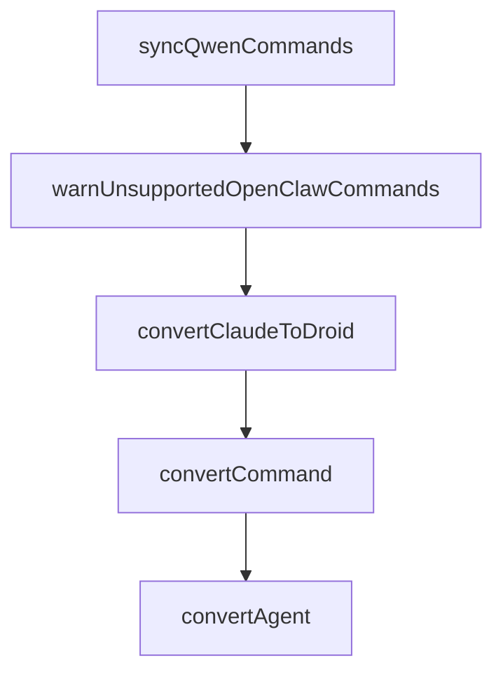

# Chapter 6: Daily Operations and Quality Gates

Welcome to **Chapter 6: Daily Operations and Quality Gates**. In this part of **Compound Engineering Plugin Tutorial: Compounding Agent Workflows Across Toolchains**, you will build an intuitive mental model first, then move into concrete implementation details and practical production tradeoffs.


This chapter covers daily workflow discipline for teams using compound engineering loops.

## Learning Goals

- run standardized daily workflows with low drift
- apply quality gates at plan, work, and review stages
- capture learnings that improve future cycles
- avoid workflow shortcuts that create long-term regressions

## Daily Runbook

- start with scoped `/workflows:plan`
- execute via `/workflows:work` with explicit task boundaries
- run `/workflows:review` before merge decisions
- close with `/workflows:compound` to retain learnings

## Quality Gate Anchors

- architectural clarity before implementation
- test/behavior confidence before review close
- documented patterns and anti-patterns after each cycle

## Source References

- [Workflow Commands](https://github.com/EveryInc/compound-engineering-plugin/blob/main/README.md#workflow)
- [Compound Plugin Commands](https://github.com/EveryInc/compound-engineering-plugin/tree/main/plugins/compound-engineering/commands)
- [Compounding Plugin README](https://github.com/EveryInc/compound-engineering-plugin/blob/main/plugins/compound-engineering/README.md)

## Summary

You now have a repeatable operations loop with built-in quality controls.

Next: [Chapter 7: Troubleshooting and Runtime Maintenance](07-troubleshooting-and-runtime-maintenance.md)

## Source Code Walkthrough

### `src/sync/commands.ts`

The `syncQwenCommands` function in [`src/sync/commands.ts`](https://github.com/EveryInc/compound-engineering-plugin/blob/HEAD/src/sync/commands.ts) handles a key part of this chapter's functionality:

```ts
}

export async function syncQwenCommands(
  config: ClaudeHomeConfig,
  outputRoot: string,
): Promise<void> {
  if (!hasCommands(config)) return

  const plugin = buildClaudeHomePlugin(config)
  const bundle = convertClaudeToQwen(plugin, DEFAULT_QWEN_SYNC_OPTIONS)

  for (const commandFile of bundle.commandFiles) {
    const parts = commandFile.name.split(":")
    if (parts.length > 1) {
      const nestedDir = path.join(outputRoot, "commands", ...parts.slice(0, -1))
      await writeText(path.join(nestedDir, `${parts[parts.length - 1]}.md`), commandFile.content + "\n")
      continue
    }

    await writeText(path.join(outputRoot, "commands", `${commandFile.name}.md`), commandFile.content + "\n")
  }
}

export function warnUnsupportedOpenClawCommands(config: ClaudeHomeConfig): void {
  if (!hasCommands(config)) return

  console.warn(
    "Warning: OpenClaw personal command sync is skipped because this sync target currently has no documented user-level command surface.",
  )
}

```

This function is important because it defines how Compound Engineering Plugin Tutorial: Compounding Agent Workflows Across Toolchains implements the patterns covered in this chapter.

### `src/sync/commands.ts`

The `warnUnsupportedOpenClawCommands` function in [`src/sync/commands.ts`](https://github.com/EveryInc/compound-engineering-plugin/blob/HEAD/src/sync/commands.ts) handles a key part of this chapter's functionality:

```ts
}

export function warnUnsupportedOpenClawCommands(config: ClaudeHomeConfig): void {
  if (!hasCommands(config)) return

  console.warn(
    "Warning: OpenClaw personal command sync is skipped because this sync target currently has no documented user-level command surface.",
  )
}

```

This function is important because it defines how Compound Engineering Plugin Tutorial: Compounding Agent Workflows Across Toolchains implements the patterns covered in this chapter.

### `src/converters/claude-to-droid.ts`

The `convertClaudeToDroid` function in [`src/converters/claude-to-droid.ts`](https://github.com/EveryInc/compound-engineering-plugin/blob/HEAD/src/converters/claude-to-droid.ts) handles a key part of this chapter's functionality:

```ts
])

export function convertClaudeToDroid(
  plugin: ClaudePlugin,
  _options: ClaudeToDroidOptions,
): DroidBundle {
  const commands = plugin.commands.map((command) => convertCommand(command))
  const droids = plugin.agents.map((agent) => convertAgent(agent))
  const skillDirs = plugin.skills.map((skill) => ({
    name: skill.name,
    sourceDir: skill.sourceDir,
  }))

  return { commands, droids, skillDirs }
}

function convertCommand(command: ClaudeCommand): DroidCommandFile {
  const name = flattenCommandName(command.name)
  const frontmatter: Record<string, unknown> = {
    description: command.description,
  }
  if (command.argumentHint) {
    frontmatter["argument-hint"] = command.argumentHint
  }
  if (command.disableModelInvocation) {
    frontmatter["disable-model-invocation"] = true
  }

  const body = transformContentForDroid(command.body.trim())
  const content = formatFrontmatter(frontmatter, body)
  return { name, content }
}
```

This function is important because it defines how Compound Engineering Plugin Tutorial: Compounding Agent Workflows Across Toolchains implements the patterns covered in this chapter.

### `src/converters/claude-to-droid.ts`

The `convertCommand` function in [`src/converters/claude-to-droid.ts`](https://github.com/EveryInc/compound-engineering-plugin/blob/HEAD/src/converters/claude-to-droid.ts) handles a key part of this chapter's functionality:

```ts
  _options: ClaudeToDroidOptions,
): DroidBundle {
  const commands = plugin.commands.map((command) => convertCommand(command))
  const droids = plugin.agents.map((agent) => convertAgent(agent))
  const skillDirs = plugin.skills.map((skill) => ({
    name: skill.name,
    sourceDir: skill.sourceDir,
  }))

  return { commands, droids, skillDirs }
}

function convertCommand(command: ClaudeCommand): DroidCommandFile {
  const name = flattenCommandName(command.name)
  const frontmatter: Record<string, unknown> = {
    description: command.description,
  }
  if (command.argumentHint) {
    frontmatter["argument-hint"] = command.argumentHint
  }
  if (command.disableModelInvocation) {
    frontmatter["disable-model-invocation"] = true
  }

  const body = transformContentForDroid(command.body.trim())
  const content = formatFrontmatter(frontmatter, body)
  return { name, content }
}

function convertAgent(agent: ClaudeAgent): DroidAgentFile {
  const name = normalizeName(agent.name)
  const frontmatter: Record<string, unknown> = {
```

This function is important because it defines how Compound Engineering Plugin Tutorial: Compounding Agent Workflows Across Toolchains implements the patterns covered in this chapter.


## How These Components Connect


