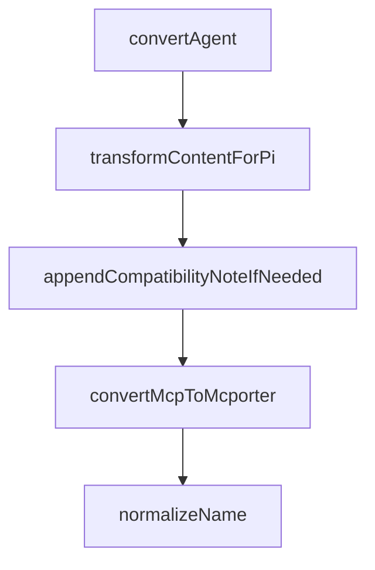

# Chapter 6: Daily Operations and Quality Gates

Welcome to **Chapter 6: Daily Operations and Quality Gates**. In this part of **Compound Engineering Plugin Tutorial: Compounding Agent Workflows Across Toolchains**, you will build an intuitive mental model first, then move into concrete implementation details and practical production tradeoffs.


This chapter covers daily workflow discipline for teams using compound engineering loops.

## Learning Goals

- run standardized daily workflows with low drift
- apply quality gates at plan, work, and review stages
- capture learnings that improve future cycles
- avoid workflow shortcuts that create long-term regressions

## Daily Runbook

- start with scoped `/workflows:plan`
- execute via `/workflows:work` with explicit task boundaries
- run `/workflows:review` before merge decisions
- close with `/workflows:compound` to retain learnings

## Quality Gate Anchors

- architectural clarity before implementation
- test/behavior confidence before review close
- documented patterns and anti-patterns after each cycle

## Source References

- [Workflow Commands](https://github.com/EveryInc/compound-engineering-plugin/blob/main/README.md#workflow)
- [Compound Plugin Commands](https://github.com/EveryInc/compound-engineering-plugin/tree/main/plugins/compound-engineering/commands)
- [Compounding Plugin README](https://github.com/EveryInc/compound-engineering-plugin/blob/main/plugins/compound-engineering/README.md)

## Summary

You now have a repeatable operations loop with built-in quality controls.

Next: [Chapter 7: Troubleshooting and Runtime Maintenance](07-troubleshooting-and-runtime-maintenance.md)

## Depth Expansion Playbook

## Source Code Walkthrough

### `src/converters/claude-to-pi.ts`

The `convertAgent` function in [`src/converters/claude-to-pi.ts`](https://github.com/EveryInc/compound-engineering-plugin/blob/HEAD/src/converters/claude-to-pi.ts) handles a key part of this chapter's functionality:

```ts
    .map((command) => convertPrompt(command, promptNames))

  const generatedSkills = plugin.agents.map((agent) => convertAgent(agent, usedSkillNames))

  const extensions = [
    {
      name: "compound-engineering-compat.ts",
      content: PI_COMPAT_EXTENSION_SOURCE,
    },
  ]

  return {
    prompts,
    skillDirs: plugin.skills.map((skill) => ({
      name: skill.name,
      sourceDir: skill.sourceDir,
    })),
    generatedSkills,
    extensions,
    mcporterConfig: plugin.mcpServers ? convertMcpToMcporter(plugin.mcpServers) : undefined,
  }
}

function convertPrompt(command: ClaudeCommand, usedNames: Set<string>) {
  const name = uniqueName(normalizeName(command.name), usedNames)
  const frontmatter: Record<string, unknown> = {
    description: command.description,
    "argument-hint": command.argumentHint,
  }

  let body = transformContentForPi(command.body)
  body = appendCompatibilityNoteIfNeeded(body)
```

This function is important because it defines how Compound Engineering Plugin Tutorial: Compounding Agent Workflows Across Toolchains implements the patterns covered in this chapter.

### `src/converters/claude-to-pi.ts`

The `transformContentForPi` function in [`src/converters/claude-to-pi.ts`](https://github.com/EveryInc/compound-engineering-plugin/blob/HEAD/src/converters/claude-to-pi.ts) handles a key part of this chapter's functionality:

```ts
  }

  let body = transformContentForPi(command.body)
  body = appendCompatibilityNoteIfNeeded(body)

  return {
    name,
    content: formatFrontmatter(frontmatter, body.trim()),
  }
}

function convertAgent(agent: ClaudeAgent, usedNames: Set<string>): PiGeneratedSkill {
  const name = uniqueName(normalizeName(agent.name), usedNames)
  const description = sanitizeDescription(
    agent.description ?? `Converted from Claude agent ${agent.name}`,
  )

  const frontmatter: Record<string, unknown> = {
    name,
    description,
  }

  const sections: string[] = []
  if (agent.capabilities && agent.capabilities.length > 0) {
    sections.push(`## Capabilities\n${agent.capabilities.map((capability) => `- ${capability}`).join("\n")}`)
  }

  const body = [
    ...sections,
    agent.body.trim().length > 0
      ? agent.body.trim()
      : `Instructions converted from the ${agent.name} agent.`,
```

This function is important because it defines how Compound Engineering Plugin Tutorial: Compounding Agent Workflows Across Toolchains implements the patterns covered in this chapter.

### `src/converters/claude-to-pi.ts`

The `appendCompatibilityNoteIfNeeded` function in [`src/converters/claude-to-pi.ts`](https://github.com/EveryInc/compound-engineering-plugin/blob/HEAD/src/converters/claude-to-pi.ts) handles a key part of this chapter's functionality:

```ts

  let body = transformContentForPi(command.body)
  body = appendCompatibilityNoteIfNeeded(body)

  return {
    name,
    content: formatFrontmatter(frontmatter, body.trim()),
  }
}

function convertAgent(agent: ClaudeAgent, usedNames: Set<string>): PiGeneratedSkill {
  const name = uniqueName(normalizeName(agent.name), usedNames)
  const description = sanitizeDescription(
    agent.description ?? `Converted from Claude agent ${agent.name}`,
  )

  const frontmatter: Record<string, unknown> = {
    name,
    description,
  }

  const sections: string[] = []
  if (agent.capabilities && agent.capabilities.length > 0) {
    sections.push(`## Capabilities\n${agent.capabilities.map((capability) => `- ${capability}`).join("\n")}`)
  }

  const body = [
    ...sections,
    agent.body.trim().length > 0
      ? agent.body.trim()
      : `Instructions converted from the ${agent.name} agent.`,
  ].join("\n\n")
```

This function is important because it defines how Compound Engineering Plugin Tutorial: Compounding Agent Workflows Across Toolchains implements the patterns covered in this chapter.

### `src/converters/claude-to-pi.ts`

The `convertMcpToMcporter` function in [`src/converters/claude-to-pi.ts`](https://github.com/EveryInc/compound-engineering-plugin/blob/HEAD/src/converters/claude-to-pi.ts) handles a key part of this chapter's functionality:

```ts
    generatedSkills,
    extensions,
    mcporterConfig: plugin.mcpServers ? convertMcpToMcporter(plugin.mcpServers) : undefined,
  }
}

function convertPrompt(command: ClaudeCommand, usedNames: Set<string>) {
  const name = uniqueName(normalizeName(command.name), usedNames)
  const frontmatter: Record<string, unknown> = {
    description: command.description,
    "argument-hint": command.argumentHint,
  }

  let body = transformContentForPi(command.body)
  body = appendCompatibilityNoteIfNeeded(body)

  return {
    name,
    content: formatFrontmatter(frontmatter, body.trim()),
  }
}

function convertAgent(agent: ClaudeAgent, usedNames: Set<string>): PiGeneratedSkill {
  const name = uniqueName(normalizeName(agent.name), usedNames)
  const description = sanitizeDescription(
    agent.description ?? `Converted from Claude agent ${agent.name}`,
  )

  const frontmatter: Record<string, unknown> = {
    name,
    description,
  }
```

This function is important because it defines how Compound Engineering Plugin Tutorial: Compounding Agent Workflows Across Toolchains implements the patterns covered in this chapter.


## How These Components Connect


