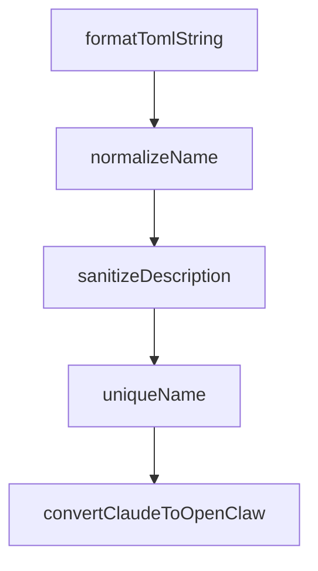

# Chapter 7: Troubleshooting and Runtime Maintenance

Welcome to **Chapter 7: Troubleshooting and Runtime Maintenance**. In this part of **Compound Engineering Plugin Tutorial: Compounding Agent Workflows Across Toolchains**, you will build an intuitive mental model first, then move into concrete implementation details and practical production tradeoffs.


This chapter provides practical recovery patterns for common runtime and integration failures.

## Learning Goals

- diagnose plugin install and command resolution issues
- recover from MCP server auto-load failures
- debug cross-provider conversion/sync problems
- maintain runtime consistency during rapid iteration

## High-Frequency Issues

- marketplace install mismatch or stale plugin cache
- MCP config not loading automatically
- provider-target conversion output mismatches
- dependency/runtime version drift in Bun/Node environments

## Recovery Loop

1. verify install and plugin metadata
2. inspect command availability and namespace
3. verify MCP configuration and permissions
4. re-run narrow-scope conversion tests

## Source References

- [Known Issues](https://github.com/EveryInc/compound-engineering-plugin/blob/main/plugins/compound-engineering/README.md#known-issues)
- [Getting Started Docs Page](https://github.com/EveryInc/compound-engineering-plugin/blob/main/docs/pages/getting-started.html)
- [Plugin Versioning Requirements](https://github.com/EveryInc/compound-engineering-plugin/blob/main/docs/solutions/plugin-versioning-requirements.md)

## Summary

You now have a troubleshooting and maintenance playbook for compound workflows.

Next: [Chapter 8: Contribution Workflow and Versioning Discipline](08-contribution-workflow-and-versioning-discipline.md)

## Depth Expansion Playbook

## Source Code Walkthrough

### `src/converters/claude-to-gemini.ts`

The `formatTomlString` function in [`src/converters/claude-to-gemini.ts`](https://github.com/EveryInc/compound-engineering-plugin/blob/HEAD/src/converters/claude-to-gemini.ts) handles a key part of this chapter's functionality:

```ts
export function toToml(description: string, prompt: string): string {
  const lines: string[] = []
  lines.push(`description = ${formatTomlString(description)}`)

  // Use multi-line string for prompt
  const escapedPrompt = prompt.replace(/\\/g, "\\\\").replace(/"""/g, '\\"\\"\\"')
  lines.push(`prompt = """`)
  lines.push(escapedPrompt)
  lines.push(`"""`)

  return lines.join("\n")
}

function formatTomlString(value: string): string {
  return JSON.stringify(value)
}

function normalizeName(value: string): string {
  const trimmed = value.trim()
  if (!trimmed) return "item"
  const normalized = trimmed
    .toLowerCase()
    .replace(/[\\/]+/g, "-")
    .replace(/[:\s]+/g, "-")
    .replace(/[^a-z0-9_-]+/g, "-")
    .replace(/-+/g, "-")
    .replace(/^-+|-+$/g, "")
  return normalized || "item"
}

function sanitizeDescription(value: string, maxLength = GEMINI_DESCRIPTION_MAX_LENGTH): string {
  const normalized = value.replace(/\s+/g, " ").trim()
```

This function is important because it defines how Compound Engineering Plugin Tutorial: Compounding Agent Workflows Across Toolchains implements the patterns covered in this chapter.

### `src/converters/claude-to-gemini.ts`

The `normalizeName` function in [`src/converters/claude-to-gemini.ts`](https://github.com/EveryInc/compound-engineering-plugin/blob/HEAD/src/converters/claude-to-gemini.ts) handles a key part of this chapter's functionality:

```ts
  // Reserve skill names from pass-through skills
  for (const skill of skillDirs) {
    usedSkillNames.add(normalizeName(skill.name))
  }

  const generatedSkills = plugin.agents.map((agent) => convertAgentToSkill(agent, usedSkillNames))

  const commands = plugin.commands.map((command) => convertCommand(command, usedCommandNames))

  const mcpServers = convertMcpServers(plugin.mcpServers)

  if (plugin.hooks && Object.keys(plugin.hooks.hooks).length > 0) {
    console.warn("Warning: Gemini CLI hooks use a different format (BeforeTool/AfterTool with matchers). Hooks were skipped during conversion.")
  }

  return { generatedSkills, skillDirs, commands, mcpServers }
}

function convertAgentToSkill(agent: ClaudeAgent, usedNames: Set<string>): GeminiSkill {
  const name = uniqueName(normalizeName(agent.name), usedNames)
  const description = sanitizeDescription(
    agent.description ?? `Use this skill for ${agent.name} tasks`,
  )

  const frontmatter: Record<string, unknown> = { name, description }

  let body = transformContentForGemini(agent.body.trim())
  if (agent.capabilities && agent.capabilities.length > 0) {
    const capabilities = agent.capabilities.map((c) => `- ${c}`).join("\n")
    body = `## Capabilities\n${capabilities}\n\n${body}`.trim()
  }
  if (body.length === 0) {
```

This function is important because it defines how Compound Engineering Plugin Tutorial: Compounding Agent Workflows Across Toolchains implements the patterns covered in this chapter.

### `src/converters/claude-to-gemini.ts`

The `sanitizeDescription` function in [`src/converters/claude-to-gemini.ts`](https://github.com/EveryInc/compound-engineering-plugin/blob/HEAD/src/converters/claude-to-gemini.ts) handles a key part of this chapter's functionality:

```ts
function convertAgentToSkill(agent: ClaudeAgent, usedNames: Set<string>): GeminiSkill {
  const name = uniqueName(normalizeName(agent.name), usedNames)
  const description = sanitizeDescription(
    agent.description ?? `Use this skill for ${agent.name} tasks`,
  )

  const frontmatter: Record<string, unknown> = { name, description }

  let body = transformContentForGemini(agent.body.trim())
  if (agent.capabilities && agent.capabilities.length > 0) {
    const capabilities = agent.capabilities.map((c) => `- ${c}`).join("\n")
    body = `## Capabilities\n${capabilities}\n\n${body}`.trim()
  }
  if (body.length === 0) {
    body = `Instructions converted from the ${agent.name} agent.`
  }

  const content = formatFrontmatter(frontmatter, body)
  return { name, content }
}

function convertCommand(command: ClaudeCommand, usedNames: Set<string>): GeminiCommand {
  // Preserve namespace structure: workflows:plan -> workflows/plan
  const commandPath = resolveCommandPath(command.name)
  const pathKey = commandPath.join("/")
  uniqueName(pathKey, usedNames) // Track for dedup

  const description = command.description ?? `Converted from Claude command ${command.name}`
  const transformedBody = transformContentForGemini(command.body.trim())

  let prompt = transformedBody
  if (command.argumentHint) {
```

This function is important because it defines how Compound Engineering Plugin Tutorial: Compounding Agent Workflows Across Toolchains implements the patterns covered in this chapter.

### `src/converters/claude-to-gemini.ts`

The `uniqueName` function in [`src/converters/claude-to-gemini.ts`](https://github.com/EveryInc/compound-engineering-plugin/blob/HEAD/src/converters/claude-to-gemini.ts) handles a key part of this chapter's functionality:

```ts

function convertAgentToSkill(agent: ClaudeAgent, usedNames: Set<string>): GeminiSkill {
  const name = uniqueName(normalizeName(agent.name), usedNames)
  const description = sanitizeDescription(
    agent.description ?? `Use this skill for ${agent.name} tasks`,
  )

  const frontmatter: Record<string, unknown> = { name, description }

  let body = transformContentForGemini(agent.body.trim())
  if (agent.capabilities && agent.capabilities.length > 0) {
    const capabilities = agent.capabilities.map((c) => `- ${c}`).join("\n")
    body = `## Capabilities\n${capabilities}\n\n${body}`.trim()
  }
  if (body.length === 0) {
    body = `Instructions converted from the ${agent.name} agent.`
  }

  const content = formatFrontmatter(frontmatter, body)
  return { name, content }
}

function convertCommand(command: ClaudeCommand, usedNames: Set<string>): GeminiCommand {
  // Preserve namespace structure: workflows:plan -> workflows/plan
  const commandPath = resolveCommandPath(command.name)
  const pathKey = commandPath.join("/")
  uniqueName(pathKey, usedNames) // Track for dedup

  const description = command.description ?? `Converted from Claude command ${command.name}`
  const transformedBody = transformContentForGemini(command.body.trim())

  let prompt = transformedBody
```

This function is important because it defines how Compound Engineering Plugin Tutorial: Compounding Agent Workflows Across Toolchains implements the patterns covered in this chapter.


## How These Components Connect


