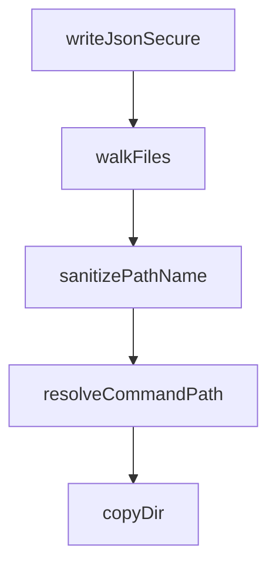

# Chapter 7: Troubleshooting and Runtime Maintenance

Welcome to **Chapter 7: Troubleshooting and Runtime Maintenance**. In this part of **Compound Engineering Plugin Tutorial: Compounding Agent Workflows Across Toolchains**, you will build an intuitive mental model first, then move into concrete implementation details and practical production tradeoffs.


This chapter provides practical recovery patterns for common runtime and integration failures.

## Learning Goals

- diagnose plugin install and command resolution issues
- recover from MCP server auto-load failures
- debug cross-provider conversion/sync problems
- maintain runtime consistency during rapid iteration

## High-Frequency Issues

- marketplace install mismatch or stale plugin cache
- MCP config not loading automatically
- provider-target conversion output mismatches
- dependency/runtime version drift in Bun/Node environments

## Recovery Loop

1. verify install and plugin metadata
2. inspect command availability and namespace
3. verify MCP configuration and permissions
4. re-run narrow-scope conversion tests

## Source References

- [Known Issues](https://github.com/EveryInc/compound-engineering-plugin/blob/main/plugins/compound-engineering/README.md#known-issues)
- [Getting Started Docs Page](https://github.com/EveryInc/compound-engineering-plugin/blob/main/docs/pages/getting-started.html)
- [Plugin Versioning Requirements](https://github.com/EveryInc/compound-engineering-plugin/blob/main/docs/solutions/plugin-versioning-requirements.md)

## Summary

You now have a troubleshooting and maintenance playbook for compound workflows.

Next: [Chapter 8: Contribution Workflow and Versioning Discipline](08-contribution-workflow-and-versioning-discipline.md)

## Source Code Walkthrough

### `src/utils/files.ts`

The `writeJsonSecure` function in [`src/utils/files.ts`](https://github.com/EveryInc/compound-engineering-plugin/blob/HEAD/src/utils/files.ts) handles a key part of this chapter's functionality:

```ts

/** Write JSON with restrictive permissions (0o600) for files containing secrets */
export async function writeJsonSecure(filePath: string, data: unknown): Promise<void> {
  const content = JSON.stringify(data, null, 2)
  await ensureDir(path.dirname(filePath))
  await fs.writeFile(filePath, content + "\n", { encoding: "utf8", mode: 0o600 })
  await fs.chmod(filePath, 0o600)
}

export async function walkFiles(root: string): Promise<string[]> {
  const entries = await fs.readdir(root, { withFileTypes: true })
  const results: string[] = []
  for (const entry of entries) {
    const fullPath = path.join(root, entry.name)
    if (entry.isDirectory()) {
      const nested = await walkFiles(fullPath)
      results.push(...nested)
    } else if (entry.isFile()) {
      results.push(fullPath)
    }
  }
  return results
}

/**
 * Sanitize a name for use as a filesystem path component.
 * Replaces colons with hyphens so colon-namespaced names
 * (e.g. "ce:brainstorm") become flat directory names ("ce-brainstorm")
 * instead of failing on Windows where colons are illegal in filenames.
 */
export function sanitizePathName(name: string): string {
  return name.replace(/:/g, "-")
```

This function is important because it defines how Compound Engineering Plugin Tutorial: Compounding Agent Workflows Across Toolchains implements the patterns covered in this chapter.

### `src/utils/files.ts`

The `walkFiles` function in [`src/utils/files.ts`](https://github.com/EveryInc/compound-engineering-plugin/blob/HEAD/src/utils/files.ts) handles a key part of this chapter's functionality:

```ts
}

export async function walkFiles(root: string): Promise<string[]> {
  const entries = await fs.readdir(root, { withFileTypes: true })
  const results: string[] = []
  for (const entry of entries) {
    const fullPath = path.join(root, entry.name)
    if (entry.isDirectory()) {
      const nested = await walkFiles(fullPath)
      results.push(...nested)
    } else if (entry.isFile()) {
      results.push(fullPath)
    }
  }
  return results
}

/**
 * Sanitize a name for use as a filesystem path component.
 * Replaces colons with hyphens so colon-namespaced names
 * (e.g. "ce:brainstorm") become flat directory names ("ce-brainstorm")
 * instead of failing on Windows where colons are illegal in filenames.
 */
export function sanitizePathName(name: string): string {
  return name.replace(/:/g, "-")
}

/**
 * Resolve a colon-separated command name into a filesystem path.
 * e.g. resolveCommandPath("/commands", "ce:plan", ".md") -> "/commands/ce/plan.md"
 * Creates intermediate directories as needed.
 */
```

This function is important because it defines how Compound Engineering Plugin Tutorial: Compounding Agent Workflows Across Toolchains implements the patterns covered in this chapter.

### `src/utils/files.ts`

The `sanitizePathName` function in [`src/utils/files.ts`](https://github.com/EveryInc/compound-engineering-plugin/blob/HEAD/src/utils/files.ts) handles a key part of this chapter's functionality:

```ts
 * instead of failing on Windows where colons are illegal in filenames.
 */
export function sanitizePathName(name: string): string {
  return name.replace(/:/g, "-")
}

/**
 * Resolve a colon-separated command name into a filesystem path.
 * e.g. resolveCommandPath("/commands", "ce:plan", ".md") -> "/commands/ce/plan.md"
 * Creates intermediate directories as needed.
 */
export async function resolveCommandPath(dir: string, name: string, ext: string): Promise<string> {
  const parts = name.split(":")
  if (parts.length > 1) {
    const nestedDir = path.join(dir, ...parts.slice(0, -1))
    await ensureDir(nestedDir)
    return path.join(nestedDir, `${parts[parts.length - 1]}${ext}`)
  }
  return path.join(dir, `${name}${ext}`)
}

export async function copyDir(sourceDir: string, targetDir: string): Promise<void> {
  await ensureDir(targetDir)
  const entries = await fs.readdir(sourceDir, { withFileTypes: true })
  for (const entry of entries) {
    const sourcePath = path.join(sourceDir, entry.name)
    const targetPath = path.join(targetDir, entry.name)
    if (entry.isDirectory()) {
      await copyDir(sourcePath, targetPath)
    } else if (entry.isFile()) {
      await ensureDir(path.dirname(targetPath))
      await fs.copyFile(sourcePath, targetPath)
```

This function is important because it defines how Compound Engineering Plugin Tutorial: Compounding Agent Workflows Across Toolchains implements the patterns covered in this chapter.

### `src/utils/files.ts`

The `resolveCommandPath` function in [`src/utils/files.ts`](https://github.com/EveryInc/compound-engineering-plugin/blob/HEAD/src/utils/files.ts) handles a key part of this chapter's functionality:

```ts
/**
 * Resolve a colon-separated command name into a filesystem path.
 * e.g. resolveCommandPath("/commands", "ce:plan", ".md") -> "/commands/ce/plan.md"
 * Creates intermediate directories as needed.
 */
export async function resolveCommandPath(dir: string, name: string, ext: string): Promise<string> {
  const parts = name.split(":")
  if (parts.length > 1) {
    const nestedDir = path.join(dir, ...parts.slice(0, -1))
    await ensureDir(nestedDir)
    return path.join(nestedDir, `${parts[parts.length - 1]}${ext}`)
  }
  return path.join(dir, `${name}${ext}`)
}

export async function copyDir(sourceDir: string, targetDir: string): Promise<void> {
  await ensureDir(targetDir)
  const entries = await fs.readdir(sourceDir, { withFileTypes: true })
  for (const entry of entries) {
    const sourcePath = path.join(sourceDir, entry.name)
    const targetPath = path.join(targetDir, entry.name)
    if (entry.isDirectory()) {
      await copyDir(sourcePath, targetPath)
    } else if (entry.isFile()) {
      await ensureDir(path.dirname(targetPath))
      await fs.copyFile(sourcePath, targetPath)
    }
  }
}

/**
 * Copy a skill directory, optionally transforming markdown content.
```

This function is important because it defines how Compound Engineering Plugin Tutorial: Compounding Agent Workflows Across Toolchains implements the patterns covered in this chapter.


## How These Components Connect


