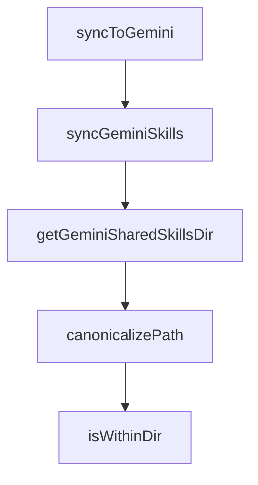

# Chapter 8: Contribution Workflow and Versioning Discipline

Welcome to **Chapter 8: Contribution Workflow and Versioning Discipline**. In this part of **Compound Engineering Plugin Tutorial: Compounding Agent Workflows Across Toolchains**, you will build an intuitive mental model first, then move into concrete implementation details and practical production tradeoffs.


This chapter explains how contributors evolve the marketplace and compound plugin without destabilizing users.

## Learning Goals

- apply repository versioning and release-discipline rules
- contribute commands/agents/skills with consistent structure
- preserve compatibility across supported provider targets
- document behavior changes for maintainers and users

## Contribution Pattern

1. isolate change scope and affected plugin assets
2. update implementation + docs + examples together
3. run validation checks and integration smoke tests
4. bump versions according to repository rules
5. submit PR with explicit compatibility notes

## Versioning Discipline

- every plugin change should be versioned explicitly
- version changes must be reflected in metadata and changelogs
- cross-provider conversion impacts require extra validation

## Source References

- [Compound Plugin Development Notes](https://github.com/EveryInc/compound-engineering-plugin/blob/main/plugins/compound-engineering/CLAUDE.md)
- [Plugin Versioning Requirements](https://github.com/EveryInc/compound-engineering-plugin/blob/main/docs/solutions/plugin-versioning-requirements.md)
- [Compound Plugin Changelog](https://github.com/EveryInc/compound-engineering-plugin/blob/main/plugins/compound-engineering/CHANGELOG.md)

## Summary

You now have an end-to-end approach for contributing to compound engineering plugin systems.

Next steps:

- codify your team's workflow command defaults
- publish compatibility test matrix across target runtimes
- ship one focused contribution with changelog and docs updates

## Depth Expansion Playbook

## Source Code Walkthrough

### `src/sync/gemini.ts`

The `syncToGemini` function in [`src/sync/gemini.ts`](https://github.com/EveryInc/compound-engineering-plugin/blob/HEAD/src/sync/gemini.ts) handles a key part of this chapter's functionality:

```ts
}

export async function syncToGemini(
  config: ClaudeHomeConfig,
  outputRoot: string,
): Promise<void> {
  await syncGeminiSkills(config.skills, outputRoot)
  await syncGeminiCommands(config, outputRoot)

  if (Object.keys(config.mcpServers).length > 0) {
    const settingsPath = path.join(outputRoot, "settings.json")
    const converted = convertMcpForGemini(config.mcpServers)
    await mergeJsonConfigAtKey({
      configPath: settingsPath,
      key: "mcpServers",
      incoming: converted,
    })
  }
}

async function syncGeminiSkills(
  skills: ClaudeHomeConfig["skills"],
  outputRoot: string,
): Promise<void> {
  const skillsDir = path.join(outputRoot, "skills")
  const sharedSkillsDir = getGeminiSharedSkillsDir(outputRoot)

  if (!sharedSkillsDir) {
    await syncSkills(skills, skillsDir)
    return
  }

```

This function is important because it defines how Compound Engineering Plugin Tutorial: Compounding Agent Workflows Across Toolchains implements the patterns covered in this chapter.

### `src/sync/gemini.ts`

The `syncGeminiSkills` function in [`src/sync/gemini.ts`](https://github.com/EveryInc/compound-engineering-plugin/blob/HEAD/src/sync/gemini.ts) handles a key part of this chapter's functionality:

```ts
  outputRoot: string,
): Promise<void> {
  await syncGeminiSkills(config.skills, outputRoot)
  await syncGeminiCommands(config, outputRoot)

  if (Object.keys(config.mcpServers).length > 0) {
    const settingsPath = path.join(outputRoot, "settings.json")
    const converted = convertMcpForGemini(config.mcpServers)
    await mergeJsonConfigAtKey({
      configPath: settingsPath,
      key: "mcpServers",
      incoming: converted,
    })
  }
}

async function syncGeminiSkills(
  skills: ClaudeHomeConfig["skills"],
  outputRoot: string,
): Promise<void> {
  const skillsDir = path.join(outputRoot, "skills")
  const sharedSkillsDir = getGeminiSharedSkillsDir(outputRoot)

  if (!sharedSkillsDir) {
    await syncSkills(skills, skillsDir)
    return
  }

  const canonicalSharedSkillsDir = await canonicalizePath(sharedSkillsDir)
  const mirroredSkills: ClaudeHomeConfig["skills"] = []
  const directSkills: ClaudeHomeConfig["skills"] = []

```

This function is important because it defines how Compound Engineering Plugin Tutorial: Compounding Agent Workflows Across Toolchains implements the patterns covered in this chapter.

### `src/sync/gemini.ts`

The `getGeminiSharedSkillsDir` function in [`src/sync/gemini.ts`](https://github.com/EveryInc/compound-engineering-plugin/blob/HEAD/src/sync/gemini.ts) handles a key part of this chapter's functionality:

```ts
): Promise<void> {
  const skillsDir = path.join(outputRoot, "skills")
  const sharedSkillsDir = getGeminiSharedSkillsDir(outputRoot)

  if (!sharedSkillsDir) {
    await syncSkills(skills, skillsDir)
    return
  }

  const canonicalSharedSkillsDir = await canonicalizePath(sharedSkillsDir)
  const mirroredSkills: ClaudeHomeConfig["skills"] = []
  const directSkills: ClaudeHomeConfig["skills"] = []

  for (const skill of skills) {
    if (await isWithinDir(skill.sourceDir, canonicalSharedSkillsDir)) {
      mirroredSkills.push(skill)
    } else {
      directSkills.push(skill)
    }
  }

  await removeGeminiMirrorConflicts(mirroredSkills, skillsDir, canonicalSharedSkillsDir)
  await syncSkills(directSkills, skillsDir)
}

function getGeminiSharedSkillsDir(outputRoot: string): string | null {
  if (path.basename(outputRoot) !== ".gemini") return null
  return path.join(path.dirname(outputRoot), ".agents", "skills")
}

async function canonicalizePath(targetPath: string): Promise<string> {
  try {
```

This function is important because it defines how Compound Engineering Plugin Tutorial: Compounding Agent Workflows Across Toolchains implements the patterns covered in this chapter.

### `src/sync/gemini.ts`

The `canonicalizePath` function in [`src/sync/gemini.ts`](https://github.com/EveryInc/compound-engineering-plugin/blob/HEAD/src/sync/gemini.ts) handles a key part of this chapter's functionality:

```ts
  }

  const canonicalSharedSkillsDir = await canonicalizePath(sharedSkillsDir)
  const mirroredSkills: ClaudeHomeConfig["skills"] = []
  const directSkills: ClaudeHomeConfig["skills"] = []

  for (const skill of skills) {
    if (await isWithinDir(skill.sourceDir, canonicalSharedSkillsDir)) {
      mirroredSkills.push(skill)
    } else {
      directSkills.push(skill)
    }
  }

  await removeGeminiMirrorConflicts(mirroredSkills, skillsDir, canonicalSharedSkillsDir)
  await syncSkills(directSkills, skillsDir)
}

function getGeminiSharedSkillsDir(outputRoot: string): string | null {
  if (path.basename(outputRoot) !== ".gemini") return null
  return path.join(path.dirname(outputRoot), ".agents", "skills")
}

async function canonicalizePath(targetPath: string): Promise<string> {
  try {
    return await fs.realpath(targetPath)
  } catch {
    return path.resolve(targetPath)
  }
}

async function isWithinDir(candidate: string, canonicalParentDir: string): Promise<boolean> {
```

This function is important because it defines how Compound Engineering Plugin Tutorial: Compounding Agent Workflows Across Toolchains implements the patterns covered in this chapter.


## How These Components Connect


