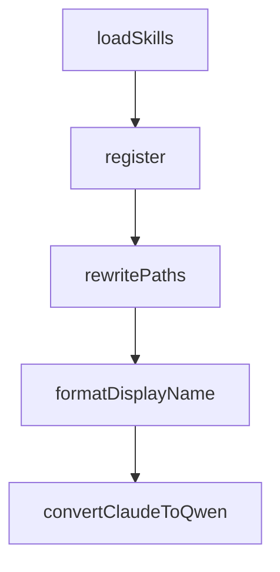

# Chapter 8: Contribution Workflow and Versioning Discipline

Welcome to **Chapter 8: Contribution Workflow and Versioning Discipline**. In this part of **Compound Engineering Plugin Tutorial: Compounding Agent Workflows Across Toolchains**, you will build an intuitive mental model first, then move into concrete implementation details and practical production tradeoffs.


This chapter explains how contributors evolve the marketplace and compound plugin without destabilizing users.

## Learning Goals

- apply repository versioning and release-discipline rules
- contribute commands/agents/skills with consistent structure
- preserve compatibility across supported provider targets
- document behavior changes for maintainers and users

## Contribution Pattern

1. isolate change scope and affected plugin assets
2. update implementation + docs + examples together
3. run validation checks and integration smoke tests
4. bump versions according to repository rules
5. submit PR with explicit compatibility notes

## Versioning Discipline

- every plugin change should be versioned explicitly
- version changes must be reflected in metadata and changelogs
- cross-provider conversion impacts require extra validation

## Source References

- [Compound Plugin Development Notes](https://github.com/EveryInc/compound-engineering-plugin/blob/main/plugins/compound-engineering/CLAUDE.md)
- [Plugin Versioning Requirements](https://github.com/EveryInc/compound-engineering-plugin/blob/main/docs/solutions/plugin-versioning-requirements.md)
- [Compound Plugin Changelog](https://github.com/EveryInc/compound-engineering-plugin/blob/main/plugins/compound-engineering/CHANGELOG.md)

## Summary

You now have an end-to-end approach for contributing to compound engineering plugin systems.

Next steps:

- codify your team's workflow command defaults
- publish compatibility test matrix across target runtimes
- ship one focused contribution with changelog and docs updates

## Source Code Walkthrough

### `src/converters/claude-to-openclaw.ts`

The `loadSkills` function in [`src/converters/claude-to-openclaw.ts`](https://github.com/EveryInc/compound-engineering-plugin/blob/HEAD/src/converters/claude-to-openclaw.ts) handles a key part of this chapter's functionality:

```ts
const skills: Record<string, string> = {};

async function loadSkills() {
  const skillsDir = path.join(__dirname, "skills");
  try {
    const entries = await fs.readdir(skillsDir, { withFileTypes: true });
    for (const entry of entries) {
      if (!entry.isDirectory()) continue;
      const skillPath = path.join(skillsDir, entry.name, "SKILL.md");
      try {
        const content = await fs.readFile(skillPath, "utf8");
        // Strip frontmatter
        const body = content.replace(/^---[\\s\\S]*?---\\n*/, "");
        skills[entry.name.replace(/^cmd-/, "")] = body.trim();
      } catch {
        // Skill file not found, skip
      }
    }
  } catch {
    // Skills directory not found
  }
}

export default async function register(api) {
  await loadSkills();

${commandRegistrations}
}
`
}

function rewritePaths(body: string): string {
```

This function is important because it defines how Compound Engineering Plugin Tutorial: Compounding Agent Workflows Across Toolchains implements the patterns covered in this chapter.

### `src/converters/claude-to-openclaw.ts`

The `register` function in [`src/converters/claude-to-openclaw.ts`](https://github.com/EveryInc/compound-engineering-plugin/blob/HEAD/src/converters/claude-to-openclaw.ts) handles a key part of this chapter's functionality:

```ts
      const safeDesc = JSON.stringify(cmd.description ?? "")
      const safeNotFound = JSON.stringify(`Command ${cmd.name} not found. Check skills directory.`)
      return `  api.registerCommand({
    name: ${safeName},
    description: ${safeDesc},
    acceptsArgs: ${cmd.acceptsArgs},
    requireAuth: false,
    handler: (ctx) => ({
      text: skills[${safeName}] ?? ${safeNotFound},
    }),
  });`
    })
    .join("\n\n")

  return `// Auto-generated OpenClaw plugin entry point
// Converted from Claude Code plugin format by compound-plugin CLI
import { promises as fs } from "fs";
import path from "path";
import { fileURLToPath } from "url";

const __dirname = path.dirname(fileURLToPath(import.meta.url));

// Pre-load skill bodies for command responses
const skills: Record<string, string> = {};

async function loadSkills() {
  const skillsDir = path.join(__dirname, "skills");
  try {
    const entries = await fs.readdir(skillsDir, { withFileTypes: true });
    for (const entry of entries) {
      if (!entry.isDirectory()) continue;
      const skillPath = path.join(skillsDir, entry.name, "SKILL.md");
```

This function is important because it defines how Compound Engineering Plugin Tutorial: Compounding Agent Workflows Across Toolchains implements the patterns covered in this chapter.

### `src/converters/claude-to-openclaw.ts`

The `rewritePaths` function in [`src/converters/claude-to-openclaw.ts`](https://github.com/EveryInc/compound-engineering-plugin/blob/HEAD/src/converters/claude-to-openclaw.ts) handles a key part of this chapter's functionality:

```ts
  }

  const body = rewritePaths(agent.body)
  const content = formatFrontmatter(frontmatter, body)

  return {
    name: agent.name,
    content,
    dir: `agent-${agent.name}`,
  }
}

function convertCommandToSkill(command: ClaudeCommand): OpenClawSkillFile {
  const frontmatter: Record<string, unknown> = {
    name: `cmd-${command.name}`,
    description: command.description,
  }

  if (command.model && command.model !== "inherit") {
    frontmatter.model = normalizeModelWithProvider(command.model)
  }

  const body = rewritePaths(command.body)
  const content = formatFrontmatter(frontmatter, body)

  return {
    name: command.name,
    content,
    dir: `cmd-${command.name}`,
  }
}

```

This function is important because it defines how Compound Engineering Plugin Tutorial: Compounding Agent Workflows Across Toolchains implements the patterns covered in this chapter.

### `src/converters/claude-to-openclaw.ts`

The `formatDisplayName` function in [`src/converters/claude-to-openclaw.ts`](https://github.com/EveryInc/compound-engineering-plugin/blob/HEAD/src/converters/claude-to-openclaw.ts) handles a key part of this chapter's functionality:

```ts
  return {
    id: plugin.manifest.name,
    name: formatDisplayName(plugin.manifest.name),
    kind: "tool",
    configSchema: {
      type: "object",
      properties: {},
    },
    skills: skillDirs.map((dir) => `skills/${dir}`),
  }
}

function buildPackageJson(plugin: ClaudePlugin): Record<string, unknown> {
  return {
    name: `openclaw-${plugin.manifest.name}`,
    version: plugin.manifest.version,
    type: "module",
    private: true,
    description: plugin.manifest.description,
    main: "index.ts",
    openclaw: {
      extensions: [
        {
          id: plugin.manifest.name,
          entry: "./index.ts",
        },
      ],
    },
    keywords: [
      "openclaw",
      "openclaw-plugin",
      ...(plugin.manifest.keywords ?? []),
```

This function is important because it defines how Compound Engineering Plugin Tutorial: Compounding Agent Workflows Across Toolchains implements the patterns covered in this chapter.


## How These Components Connect


