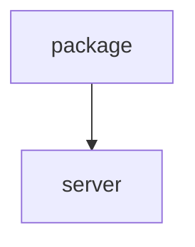

# Chapter 1: Getting Started

Welcome to **Chapter 1: Getting Started**. In this part of **Context7 Tutorial: Live Documentation Context for Coding Agents**, you will build an intuitive mental model first, then move into concrete implementation details and practical production tradeoffs.


This chapter gets Context7 connected to your coding agent so documentation lookups work immediately.

## Learning Goals

- choose local or remote Context7 MCP deployment
- connect Context7 in your primary coding client
- verify tool connectivity and first query
- avoid common first-install mistakes

## Fast Install Patterns

| Pattern | Example |
|:--------|:--------|
| Claude Code local | `claude mcp add context7 -- npx -y @upstash/context7-mcp --api-key YOUR_API_KEY` |
| Claude Code remote | `claude mcp add --header "CONTEXT7_API_KEY: YOUR_API_KEY" --transport http context7 https://mcp.context7.com/mcp` |
| Cursor remote config | MCP URL `https://mcp.context7.com/mcp` + optional API key header |

## First-Use Checklist

1. add Context7 MCP server in your client
2. run client MCP status command or panel
3. ask a targeted library question with `use context7`
4. confirm the response cites current docs patterns

## Source References

- [Context7 README: Installation](https://github.com/upstash/context7/blob/master/README.md#installation)
- [Claude Code client guide](https://context7.com/docs/clients/claude-code)
- [Cursor client guide](https://context7.com/docs/clients/cursor)

## Summary

You now have Context7 running and reachable from your coding client.

Next: [Chapter 2: Architecture and Tooling Model](02-architecture-and-tooling-model.md)

## Source Code Walkthrough

### `package.json`

The `package` module in [`package.json`](https://github.com/upstash/context7/blob/HEAD/package.json) handles a key part of this chapter's functionality:

```json
{
  "name": "@upstash/context7",
  "private": true,
  "version": "1.0.0",
  "description": "Context7 monorepo - Documentation tools and SDKs",
  "workspaces": [
    "packages/*"
  ],
  "scripts": {
    "build": "pnpm -r run build",
    "build:sdk": "pnpm --filter @upstash/context7-sdk build",
    "build:mcp": "pnpm --filter @upstash/context7-mcp build",
    "build:ai-sdk": "pnpm --filter @upstash/context7-tools-ai-sdk build",
    "typecheck": "pnpm -r run typecheck",
    "test": "pnpm -r run test",
    "test:sdk": "pnpm --filter @upstash/context7-sdk test",
    "test:tools-ai-sdk": "pnpm --filter @upstash/context7-tools-ai-sdk test",
    "clean": "pnpm -r run clean && rm -rf node_modules",
    "lint": "pnpm -r run lint",
    "lint:check": "pnpm -r run lint:check",
    "format": "pnpm -r run format",
    "format:check": "pnpm -r run format:check",
    "release": "pnpm build && changeset publish",
    "release:snapshot": "changeset version --snapshot canary && pnpm build && changeset publish --tag canary --no-git-tag"
  },
  "repository": {
    "type": "git",
    "url": "git+https://github.com/upstash/context7.git"
  },
  "keywords": [
    "modelcontextprotocol",
    "mcp",
    "context7",
    "vibe-coding",
    "developer tools",
```

This module is important because it defines how Context7 Tutorial: Live Documentation Context for Coding Agents implements the patterns covered in this chapter.

### `server.json`

The `server` module in [`server.json`](https://github.com/upstash/context7/blob/HEAD/server.json) handles a key part of this chapter's functionality:

```json
{
  "$schema": "https://static.modelcontextprotocol.io/schemas/2025-12-11/server.schema.json",
  "name": "io.github.upstash/context7",
  "title": "Context7",
  "description": "Up-to-date code docs for any prompt",
  "repository": {
    "url": "https://github.com/upstash/context7",
    "source": "github"
  },
  "websiteUrl": "https://context7.com",
  "icons": [
    {
      "src": "https://raw.githubusercontent.com/upstash/context7/master/public/icon.png",
      "mimeType": "image/png"
    }
  ],
  "version": "2.0.0",
  "packages": [
    {
      "registryType": "npm",
      "identifier": "@upstash/context7-mcp",
      "version": "2.0.2",
      "transport": {
        "type": "stdio"
      },
      "environmentVariables": [
        {
          "name": "CONTEXT7_API_KEY",
          "description": "API key for authentication",
          "isRequired": false,
          "isSecret": true
        }
      ]
    },
    {
```

This module is important because it defines how Context7 Tutorial: Live Documentation Context for Coding Agents implements the patterns covered in this chapter.


## How These Components Connect


