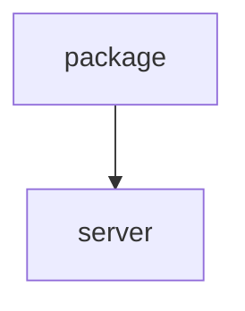

# Chapter 2: Architecture and Tooling Model

Welcome to **Chapter 2: Architecture and Tooling Model**. In this part of **Context7 Tutorial: Live Documentation Context for Coding Agents**, you will build an intuitive mental model first, then move into concrete implementation details and practical production tradeoffs.


This chapter explains Context7's internal role in coding-agent workflows.

## Learning Goals

- understand Context7 MCP tool primitives
- map library resolution -> docs retrieval flow
- identify where hallucination reduction comes from
- align architecture with prompt and client strategy

## Core Tools

| Tool | Purpose |
|:-----|:--------|
| `resolve-library-id` | map a library name/query to a Context7 canonical ID |
| `query-docs` | fetch relevant documentation snippets for task query |

## Operational Flow

1. query arrives with library context need
2. Context7 resolves canonical library ID
3. Context7 returns targeted snippets for query and version context
4. LLM uses snippets to produce grounded implementation

## Source References

- [Context7 README: Available Tools](https://github.com/upstash/context7/blob/master/README.md#available-tools)
- [Context7 overview docs](https://context7.com/docs/overview)

## Summary

You now understand the mechanism that makes Context7 valuable in code generation loops.

Next: [Chapter 3: Client Integrations and Setup Patterns](03-client-integrations-and-setup-patterns.md)

## Source Code Walkthrough

### `package.json`

The `package` module in [`package.json`](https://github.com/upstash/context7/blob/HEAD/package.json) handles a key part of this chapter's functionality:

```json
{
  "name": "@upstash/context7",
  "private": true,
  "version": "1.0.0",
  "description": "Context7 monorepo - Documentation tools and SDKs",
  "workspaces": [
    "packages/*"
  ],
  "scripts": {
    "build": "pnpm -r run build",
    "build:sdk": "pnpm --filter @upstash/context7-sdk build",
    "build:mcp": "pnpm --filter @upstash/context7-mcp build",
    "build:ai-sdk": "pnpm --filter @upstash/context7-tools-ai-sdk build",
    "typecheck": "pnpm -r run typecheck",
    "test": "pnpm -r run test",
    "test:sdk": "pnpm --filter @upstash/context7-sdk test",
    "test:tools-ai-sdk": "pnpm --filter @upstash/context7-tools-ai-sdk test",
    "clean": "pnpm -r run clean && rm -rf node_modules",
    "lint": "pnpm -r run lint",
    "lint:check": "pnpm -r run lint:check",
    "format": "pnpm -r run format",
    "format:check": "pnpm -r run format:check",
    "release": "pnpm build && changeset publish",
    "release:snapshot": "changeset version --snapshot canary && pnpm build && changeset publish --tag canary --no-git-tag"
  },
  "repository": {
    "type": "git",
    "url": "git+https://github.com/upstash/context7.git"
  },
  "keywords": [
    "modelcontextprotocol",
    "mcp",
    "context7",
    "vibe-coding",
    "developer tools",
```

This module is important because it defines how Context7 Tutorial: Live Documentation Context for Coding Agents implements the patterns covered in this chapter.

### `server.json`

The `server` module in [`server.json`](https://github.com/upstash/context7/blob/HEAD/server.json) handles a key part of this chapter's functionality:

```json
{
  "$schema": "https://static.modelcontextprotocol.io/schemas/2025-12-11/server.schema.json",
  "name": "io.github.upstash/context7",
  "title": "Context7",
  "description": "Up-to-date code docs for any prompt",
  "repository": {
    "url": "https://github.com/upstash/context7",
    "source": "github"
  },
  "websiteUrl": "https://context7.com",
  "icons": [
    {
      "src": "https://raw.githubusercontent.com/upstash/context7/master/public/icon.png",
      "mimeType": "image/png"
    }
  ],
  "version": "2.0.0",
  "packages": [
    {
      "registryType": "npm",
      "identifier": "@upstash/context7-mcp",
      "version": "2.0.2",
      "transport": {
        "type": "stdio"
      },
      "environmentVariables": [
        {
          "name": "CONTEXT7_API_KEY",
          "description": "API key for authentication",
          "isRequired": false,
          "isSecret": true
        }
      ]
    },
    {
```

This module is important because it defines how Context7 Tutorial: Live Documentation Context for Coding Agents implements the patterns covered in this chapter.


## How These Components Connect


