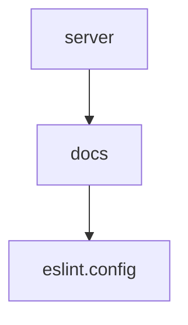

# Chapter 3: Client Integrations and Setup Patterns

Welcome to **Chapter 3: Client Integrations and Setup Patterns**. In this part of **Context7 Tutorial: Live Documentation Context for Coding Agents**, you will build an intuitive mental model first, then move into concrete implementation details and practical production tradeoffs.


This chapter covers repeatable integration patterns across different MCP clients.

## Learning Goals

- compare local vs remote deployment tradeoffs
- use API key and OAuth modes correctly
- standardize configuration templates for teams
- prevent client-specific drift

## Integration Modes

| Mode | Benefits | Tradeoffs |
|:-----|:---------|:----------|
| remote HTTP MCP | no local runtime dependency | network dependency |
| local stdio MCP | local execution control | Node/runtime setup overhead |
| OAuth (remote) | token-managed authentication | client OAuth support required |

## Team Template Strategy

- maintain one known-good MCP config per client
- include fallback local config for restricted networks
- keep key/header handling out of committed plaintext configs

## Source References

- [All clients docs](https://context7.com/docs/resources/all-clients)
- [OAuth setup](https://context7.com/docs/howto/oauth)
- [Context7 README client snippets](https://github.com/upstash/context7/blob/master/README.md)

## Summary

You now can deploy Context7 consistently across heterogeneous coding-agent clients.

Next: [Chapter 4: Prompting Strategies and Rules](04-prompting-strategies-and-rules.md)

## Depth Expansion Playbook

## Source Code Walkthrough

### `server.json`

The `server` module in [`server.json`](https://github.com/upstash/context7/blob/HEAD/server.json) handles a key part of this chapter's functionality:

```json
{
  "$schema": "https://static.modelcontextprotocol.io/schemas/2025-12-11/server.schema.json",
  "name": "io.github.upstash/context7",
  "title": "Context7",
  "description": "Up-to-date code docs for any prompt",
  "repository": {
    "url": "https://github.com/upstash/context7",
    "source": "github"
  },
  "websiteUrl": "https://context7.com",
  "icons": [
    {
      "src": "https://raw.githubusercontent.com/upstash/context7/master/public/icon.png",
      "mimeType": "image/png"
    }
  ],
  "version": "2.0.0",
  "packages": [
    {
      "registryType": "npm",
      "identifier": "@upstash/context7-mcp",
      "version": "2.0.2",
      "transport": {
        "type": "stdio"
      },
      "environmentVariables": [
        {
          "name": "CONTEXT7_API_KEY",
          "description": "API key for authentication",
          "isRequired": false,
          "isSecret": true
        }
      ]
    },
    {
```

This module is important because it defines how Context7 Tutorial: Live Documentation Context for Coding Agents implements the patterns covered in this chapter.

### `docs/docs.json`

The `docs` module in [`docs/docs.json`](https://github.com/upstash/context7/blob/HEAD/docs/docs.json) handles a key part of this chapter's functionality:

```json
{
  "$schema": "https://mintlify.com/docs.json",
  "theme": "mint",
  "name": "Context7 MCP",
  "description": "Up-to-date code docs for any prompt.",
  "colors": {
    "primary": "#10B981",
    "light": "#ECFDF5",
    "dark": "#064E3B"
  },
  "contextual": {
    "options": [
      "copy",
      "view",
      "chatgpt",
      "claude"
    ]
  },
  "navigation": {
    "groups": [
      {
        "group": "Overview",
        "pages": [
          "overview",
          "installation",
          "plans-pricing",
          "clients/cli",
          "adding-libraries",
          "api-guide",
          "skills",
          "tips"
        ]
      },
      {
        "group": "How To",
```

This module is important because it defines how Context7 Tutorial: Live Documentation Context for Coding Agents implements the patterns covered in this chapter.

### `eslint.config.js`

The `eslint.config` module in [`eslint.config.js`](https://github.com/upstash/context7/blob/HEAD/eslint.config.js) handles a key part of this chapter's functionality:

```js
import tseslint from "typescript-eslint";
import eslintPluginPrettier from "eslint-plugin-prettier";

export default tseslint.config({
  // Base ESLint configuration
  ignores: ["node_modules/**", "build/**", "dist/**", ".git/**", ".github/**"],
  languageOptions: {
    ecmaVersion: 2020,
    sourceType: "module",
    parser: tseslint.parser,
    parserOptions: {},
    globals: {
      // Add Node.js globals
      process: "readonly",
      require: "readonly",
      module: "writable",
      console: "readonly",
    },
  },
  // Settings for all files
  linterOptions: {
    reportUnusedDisableDirectives: true,
  },
  // Apply ESLint recommended rules
  extends: [tseslint.configs.recommended],
  plugins: {
    prettier: eslintPluginPrettier,
  },
  rules: {
    // TypeScript rules
    "@typescript-eslint/explicit-module-boundary-types": "off",
    "@typescript-eslint/no-unused-vars": ["error", { argsIgnorePattern: "^_" }],
    "@typescript-eslint/no-explicit-any": "warn",
    // Prettier integration
    "prettier/prettier": "error",
```

This module is important because it defines how Context7 Tutorial: Live Documentation Context for Coding Agents implements the patterns covered in this chapter.


## How These Components Connect


