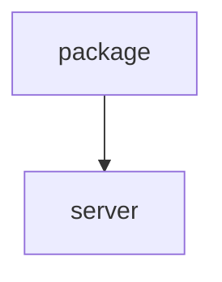

# Chapter 4: Prompting Strategies and Rules

Welcome to **Chapter 4: Prompting Strategies and Rules**. In this part of **Context7 Tutorial: Live Documentation Context for Coding Agents**, you will build an intuitive mental model first, then move into concrete implementation details and practical production tradeoffs.


This chapter focuses on prompt discipline so Context7 is reliably invoked with high signal.

## Learning Goals

- trigger Context7 intentionally for API-sensitive tasks
- use library IDs when available to improve retrieval precision
- set reusable client rules for auto invocation
- reduce generic/noisy documentation fetches

## Prompt Patterns

| Pattern | Example |
|:--------|:--------|
| explicit invoke | "Set up Next.js middleware. use context7" |
| direct library ID | "Use library `/vercel/next.js` for app router auth docs" |
| version hint | "How do I configure Next.js 14 middleware? use context7" |

## Rules Automation

Add client rule text to auto trigger docs lookup for library/API questions so users do not have to remember the invoke phrase each time.

## Source References

- [Context7 README: Add a Rule](https://github.com/upstash/context7/blob/master/README.md#add-a-rule)
- [Context7 README: Use Library Id](https://github.com/upstash/context7/blob/master/README.md#use-library-id)

## Summary

You now know how to structure prompts and rules so Context7 activates predictably.

Next: [Chapter 5: API Workflows and SDK Patterns](05-api-workflows-and-sdk-patterns.md)

## Source Code Walkthrough

### `package.json`

The `package` module in [`package.json`](https://github.com/upstash/context7/blob/HEAD/package.json) handles a key part of this chapter's functionality:

```json
{
  "name": "@upstash/context7",
  "private": true,
  "version": "1.0.0",
  "description": "Context7 monorepo - Documentation tools and SDKs",
  "workspaces": [
    "packages/*"
  ],
  "scripts": {
    "build": "pnpm -r run build",
    "build:sdk": "pnpm --filter @upstash/context7-sdk build",
    "build:mcp": "pnpm --filter @upstash/context7-mcp build",
    "build:ai-sdk": "pnpm --filter @upstash/context7-tools-ai-sdk build",
    "typecheck": "pnpm -r run typecheck",
    "test": "pnpm -r run test",
    "test:sdk": "pnpm --filter @upstash/context7-sdk test",
    "test:tools-ai-sdk": "pnpm --filter @upstash/context7-tools-ai-sdk test",
    "clean": "pnpm -r run clean && rm -rf node_modules",
    "lint": "pnpm -r run lint",
    "lint:check": "pnpm -r run lint:check",
    "format": "pnpm -r run format",
    "format:check": "pnpm -r run format:check",
    "release": "pnpm build && changeset publish",
    "release:snapshot": "changeset version --snapshot canary && pnpm build && changeset publish --tag canary --no-git-tag"
  },
  "repository": {
    "type": "git",
    "url": "git+https://github.com/upstash/context7.git"
  },
  "keywords": [
    "modelcontextprotocol",
    "mcp",
    "context7",
    "vibe-coding",
    "developer tools",
```

This module is important because it defines how Context7 Tutorial: Live Documentation Context for Coding Agents implements the patterns covered in this chapter.

### `server.json`

The `server` module in [`server.json`](https://github.com/upstash/context7/blob/HEAD/server.json) handles a key part of this chapter's functionality:

```json
{
  "$schema": "https://static.modelcontextprotocol.io/schemas/2025-12-11/server.schema.json",
  "name": "io.github.upstash/context7",
  "title": "Context7",
  "description": "Up-to-date code docs for any prompt",
  "repository": {
    "url": "https://github.com/upstash/context7",
    "source": "github"
  },
  "websiteUrl": "https://context7.com",
  "icons": [
    {
      "src": "https://raw.githubusercontent.com/upstash/context7/master/public/icon.png",
      "mimeType": "image/png"
    }
  ],
  "version": "2.0.0",
  "packages": [
    {
      "registryType": "npm",
      "identifier": "@upstash/context7-mcp",
      "version": "2.0.2",
      "transport": {
        "type": "stdio"
      },
      "environmentVariables": [
        {
          "name": "CONTEXT7_API_KEY",
          "description": "API key for authentication",
          "isRequired": false,
          "isSecret": true
        }
      ]
    },
    {
```

This module is important because it defines how Context7 Tutorial: Live Documentation Context for Coding Agents implements the patterns covered in this chapter.


## How These Components Connect


