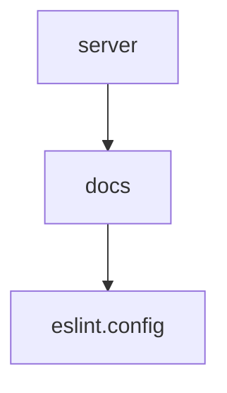

# Chapter 7: Troubleshooting and Local Development

Welcome to **Chapter 7: Troubleshooting and Local Development**. In this part of **Context7 Tutorial: Live Documentation Context for Coding Agents**, you will build an intuitive mental model first, then move into concrete implementation details and practical production tradeoffs.


This chapter provides operational guidance for debugging and local Context7 development.

## Learning Goals

- resolve common runtime and client connection issues
- use alternate runtime commands when `npx` fails
- run Context7 MCP server from source
- validate integration with MCP Inspector

## Common Fixes

- upgrade to latest package release
- verify Node.js v18+
- test MCP endpoint reachability
- use `bunx`/`deno` alternatives where needed
- prefer remote HTTP mode to avoid local Node issues when possible

## Local Dev Quick Path

```bash
git clone https://github.com/upstash/context7.git
cd context7
pnpm i
pnpm run build
node packages/mcp/dist/index.js
```

## Source References

- [Troubleshooting](https://context7.com/docs/resources/troubleshooting)
- [Developer Guide](https://context7.com/docs/resources/developer)

## Summary

You now can operate and debug Context7 reliably across local and hosted setups.

Next: [Chapter 8: Production Operations and Governance](08-production-operations-and-governance.md)

## Depth Expansion Playbook

## Source Code Walkthrough

### `server.json`

The `server` module in [`server.json`](https://github.com/upstash/context7/blob/HEAD/server.json) handles a key part of this chapter's functionality:

```json
{
  "$schema": "https://static.modelcontextprotocol.io/schemas/2025-12-11/server.schema.json",
  "name": "io.github.upstash/context7",
  "title": "Context7",
  "description": "Up-to-date code docs for any prompt",
  "repository": {
    "url": "https://github.com/upstash/context7",
    "source": "github"
  },
  "websiteUrl": "https://context7.com",
  "icons": [
    {
      "src": "https://raw.githubusercontent.com/upstash/context7/master/public/icon.png",
      "mimeType": "image/png"
    }
  ],
  "version": "2.0.0",
  "packages": [
    {
      "registryType": "npm",
      "identifier": "@upstash/context7-mcp",
      "version": "2.0.2",
      "transport": {
        "type": "stdio"
      },
      "environmentVariables": [
        {
          "name": "CONTEXT7_API_KEY",
          "description": "API key for authentication",
          "isRequired": false,
          "isSecret": true
        }
      ]
    },
    {
```

This module is important because it defines how Context7 Tutorial: Live Documentation Context for Coding Agents implements the patterns covered in this chapter.

### `docs/docs.json`

The `docs` module in [`docs/docs.json`](https://github.com/upstash/context7/blob/HEAD/docs/docs.json) handles a key part of this chapter's functionality:

```json
{
  "$schema": "https://mintlify.com/docs.json",
  "theme": "mint",
  "name": "Context7 MCP",
  "description": "Up-to-date code docs for any prompt.",
  "colors": {
    "primary": "#10B981",
    "light": "#ECFDF5",
    "dark": "#064E3B"
  },
  "contextual": {
    "options": [
      "copy",
      "view",
      "chatgpt",
      "claude"
    ]
  },
  "navigation": {
    "groups": [
      {
        "group": "Overview",
        "pages": [
          "overview",
          "installation",
          "plans-pricing",
          "clients/cli",
          "adding-libraries",
          "api-guide",
          "skills",
          "tips"
        ]
      },
      {
        "group": "How To",
```

This module is important because it defines how Context7 Tutorial: Live Documentation Context for Coding Agents implements the patterns covered in this chapter.

### `eslint.config.js`

The `eslint.config` module in [`eslint.config.js`](https://github.com/upstash/context7/blob/HEAD/eslint.config.js) handles a key part of this chapter's functionality:

```js
import tseslint from "typescript-eslint";
import eslintPluginPrettier from "eslint-plugin-prettier";

export default tseslint.config({
  // Base ESLint configuration
  ignores: ["node_modules/**", "build/**", "dist/**", ".git/**", ".github/**"],
  languageOptions: {
    ecmaVersion: 2020,
    sourceType: "module",
    parser: tseslint.parser,
    parserOptions: {},
    globals: {
      // Add Node.js globals
      process: "readonly",
      require: "readonly",
      module: "writable",
      console: "readonly",
    },
  },
  // Settings for all files
  linterOptions: {
    reportUnusedDisableDirectives: true,
  },
  // Apply ESLint recommended rules
  extends: [tseslint.configs.recommended],
  plugins: {
    prettier: eslintPluginPrettier,
  },
  rules: {
    // TypeScript rules
    "@typescript-eslint/explicit-module-boundary-types": "off",
    "@typescript-eslint/no-unused-vars": ["error", { argsIgnorePattern: "^_" }],
    "@typescript-eslint/no-explicit-any": "warn",
    // Prettier integration
    "prettier/prettier": "error",
```

This module is important because it defines how Context7 Tutorial: Live Documentation Context for Coding Agents implements the patterns covered in this chapter.


## How These Components Connect


