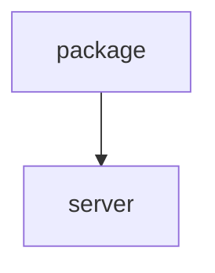

# Chapter 8: Production Operations and Governance

Welcome to **Chapter 8: Production Operations and Governance**. In this part of **Context7 Tutorial: Live Documentation Context for Coding Agents**, you will build an intuitive mental model first, then move into concrete implementation details and practical production tradeoffs.


This chapter defines a governance framework for deploying Context7 in team coding environments.

## Learning Goals

- standardize Context7 configs across teams
- manage authentication and rate-limit strategy centrally
- align Context7 usage with internal security controls
- monitor and iterate on quality impact

## Governance Baseline

| Area | Recommended Baseline |
|:-----|:---------------------|
| config templates | version controlled per client type |
| auth handling | secure API key/OAuth management, no hardcoded secrets |
| invocation policy | default rules for API/library tasks |
| quality checks | periodic audit of generated code against docs sources |

## Source References

- [Context7 Dashboard](https://context7.com/dashboard)
- [Context7 API guide](https://context7.com/docs/api-guide)
- [Context7 troubleshooting](https://context7.com/docs/resources/troubleshooting)

## Summary

You now have a complete production rollout model for documentation-grounded coding-agent workflows with Context7.

Continue with the [Cherry Studio Tutorial](../cherry-studio-tutorial/).

## Source Code Walkthrough

### `package.json`

The `package` module in [`package.json`](https://github.com/upstash/context7/blob/HEAD/package.json) handles a key part of this chapter's functionality:

```json
{
  "name": "@upstash/context7",
  "private": true,
  "version": "1.0.0",
  "description": "Context7 monorepo - Documentation tools and SDKs",
  "workspaces": [
    "packages/*"
  ],
  "scripts": {
    "build": "pnpm -r run build",
    "build:sdk": "pnpm --filter @upstash/context7-sdk build",
    "build:mcp": "pnpm --filter @upstash/context7-mcp build",
    "build:ai-sdk": "pnpm --filter @upstash/context7-tools-ai-sdk build",
    "typecheck": "pnpm -r run typecheck",
    "test": "pnpm -r run test",
    "test:sdk": "pnpm --filter @upstash/context7-sdk test",
    "test:tools-ai-sdk": "pnpm --filter @upstash/context7-tools-ai-sdk test",
    "clean": "pnpm -r run clean && rm -rf node_modules",
    "lint": "pnpm -r run lint",
    "lint:check": "pnpm -r run lint:check",
    "format": "pnpm -r run format",
    "format:check": "pnpm -r run format:check",
    "release": "pnpm build && changeset publish",
    "release:snapshot": "changeset version --snapshot canary && pnpm build && changeset publish --tag canary --no-git-tag"
  },
  "repository": {
    "type": "git",
    "url": "git+https://github.com/upstash/context7.git"
  },
  "keywords": [
    "modelcontextprotocol",
    "mcp",
    "context7",
    "vibe-coding",
    "developer tools",
```

This module is important because it defines how Context7 Tutorial: Live Documentation Context for Coding Agents implements the patterns covered in this chapter.

### `server.json`

The `server` module in [`server.json`](https://github.com/upstash/context7/blob/HEAD/server.json) handles a key part of this chapter's functionality:

```json
{
  "$schema": "https://static.modelcontextprotocol.io/schemas/2025-12-11/server.schema.json",
  "name": "io.github.upstash/context7",
  "title": "Context7",
  "description": "Up-to-date code docs for any prompt",
  "repository": {
    "url": "https://github.com/upstash/context7",
    "source": "github"
  },
  "websiteUrl": "https://context7.com",
  "icons": [
    {
      "src": "https://raw.githubusercontent.com/upstash/context7/master/public/icon.png",
      "mimeType": "image/png"
    }
  ],
  "version": "2.0.0",
  "packages": [
    {
      "registryType": "npm",
      "identifier": "@upstash/context7-mcp",
      "version": "2.0.2",
      "transport": {
        "type": "stdio"
      },
      "environmentVariables": [
        {
          "name": "CONTEXT7_API_KEY",
          "description": "API key for authentication",
          "isRequired": false,
          "isSecret": true
        }
      ]
    },
    {
```

This module is important because it defines how Context7 Tutorial: Live Documentation Context for Coding Agents implements the patterns covered in this chapter.


## How These Components Connect


